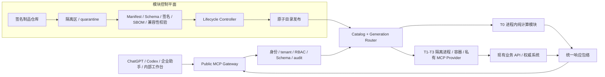
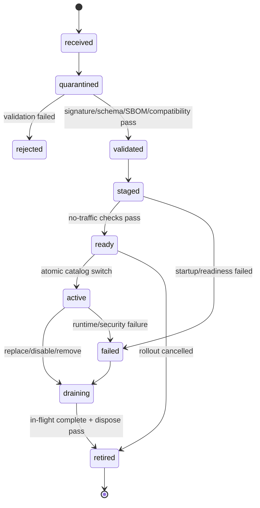

# 业务模块开发与 MCP 热插拔集成规范（先读）

> 任何团队在新增业务模块、修改模块平台、接入 MCP Gateway 或执行发布前，必须先读完本文件。未完成架构门禁和契约评审，不得直接把业务代码注册进 MCP Server。

## 0. 文档地位与事实边界

本文是跨境物流 MCP 的 **Module Contract v1 架构基线**，用于统一公司各业务团队的开发方式、交付物、集成门禁和热插拔语义。

本文使用以下规范词：

- **必须**：不满足就不能合并、接入或发布。
- **应该**：原则上必须满足；偏离时要在 RFC 中写明原因、风险和补偿措施。
- **可以**：允许的实现选择，不代表默认启用。

先明确当前事实，避免把规划误写成已实现能力：

| 分类 | 当前结论 |
| --- | --- |
| 已确认 | 当前 `main` 仍通过 `phaseOneToolNames`、`registerPhaseOneTools` 和固定 RBAC 表静态注册 Phase 1 工具。 |
| 已确认 | 当前统一包络、五种业务状态、Draft 2020-12 Schema、服务端 tenant/actor、幂等、审批和写后读回约束继续有效。 |
| 目标架构 | 模块控制平面、签名制品仓库、generation router、注册租约和无重启热插拔是本规范定义的下一阶段能力。 |
| 尚未验证 | 公司级制品签名、SBOM、隔离运行池、完整客户端工具目录刷新兼容性尚未在本仓库形成生产证据。 |

因此：**现在不能声称本仓库已经支持热插拔**。在平台 RFC、Module Contract Schema、加载器和验收测试合并前，业务团队只应按本规范准备独立模块和交付物，不得自行修改静态注册表“抢跑接入”。

## 1. 目标与非目标

### 1.1 目标

- 公司只对客户端暴露一个受控的 MCP Gateway。
- 每个业务能力作为独立、可版本化、可验证、可启停、可回滚的 Business Module 交付。
- 业务模块不拥有身份、租户、密钥、审计、注册表或全局路由权力，只通过平台注入的能力端口工作。
- 新模块、新版本和模块下线不要求重启公共 Gateway；切换期间不打断在途请求。
- 模块故障只影响它拥有的工具，不拖垮其他模块或公共入口。
- 确定性业务系统继续拥有价格、规则、关务、订单和文档权威；MCP 只做薄控制层。
- 所有“可用”“成功”“已切换”结论都必须有当前 generation 的可复核证据。

### 1.2 非目标

- 不把 MCP 变成报价、关务、订单或客户数据的新主库。
- 不允许 AI 生成或修改价格、Zone、税率、容量、权限和业务状态。
- 不提供 `generic_write`、`execute_anything`、任意 URL、任意 SQL 或任意脚本入口。
- 不以同进程热重载任意不可信代码作为“热插拔”。
- 不要求所有业务模块使用同一种语言；统一的是制品、契约、生命周期和能力边界。
- 不复制 DeepSeek Harness 的内部 API，也不把其开发预览状态当成生产保证。

## 2. 总体架构

采用“一个公共 Gateway + 控制平面 + generation router + 分级运行时”的混合插件架构：



### 2.1 公共 MCP Gateway

Gateway 是唯一面向客户端的 MCP 协议入口，必须统一负责：

- MCP 初始化、会话和工具目录；
- 身份验证、tenant/actor 注入、RBAC 和 scope；
- 输入 Schema、输出包络、超时、取消和请求大小限制；
- 审计、幂等、审批、工具目录 generation 和路由；
- 模块健康状态映射、故障隔离、限流和可观测性；
- `notifications/tools/list_changed` 等目录变更通知；
- 公共错误语义和敏感信息脱敏。

业务模块不得自行启动第二个公共 MCP 入口，也不得绕过 Gateway 直接接受公网客户端调用。隔离模块可以实现为私有 MCP Provider，但只能被内部 Gateway 调用。

### 2.2 模块控制平面

模块控制平面管理制品而不是业务数据，必须负责：

- 制品接收、签名和 digest 校验；
- SBOM、许可证、恶意依赖和兼容性检查；
- quarantine、staging、activate、drain、retire 和 rollback；
- Module Contract、依赖图、权限、出口网络和资源配额校验；
- generation 生成、原子目录切换和注册租约回收；
- 模块版本、来源 SHA、审批人、发布时间和回滚证据。

控制平面不得替业务模块补业务输入、改业务结果或把 fixture 当成生产数据。

### 2.3 generation router

路由器不按“当前文件”路由，而按不可变的 generation 路由：

- 每次目录发布生成唯一 `catalog_generation`；
- 每个已激活模块版本生成唯一 `module_generation`；
- 请求进入后固定其 catalog、module、tool 和 contract generation；
- 在途请求继续使用旧 generation，新请求只在原子切换后进入新 generation；
- generation 不能被原地修改，只能新增、激活、排空或回滚。

## 3. 借鉴 DeepSeek Harness 的边界

可借鉴 DeepSeek Harness / Cordis 的设计思想，但不绑定其内部实现：

| DeepSeek Harness 思想 | 公司架构中的对应概念 |
| --- | --- |
| Plugin | Business Module |
| Context service | 平台注入的 Capability Port |
| `inject` / 依赖声明 | Manifest 中的 required/optional capabilities |
| 可逆 effect / disposer | Registration Lease 与 `dispose` |
| Bundle / profile | 签名 Module Artifact / Deployment Profile |
| Plugin tree | 经过校验的依赖图 |
| HMR | 分阶段 generation 切换、排空和回滚 |

不能照搬的部分：

- 不能让生产 Gateway 对任意本地源码做动态 `eval` 或无签名加载；
- 不能把“模块初始化成功”当成上游业务已就绪；
- 不能让模块直接改全局 Context、注册表或其他模块的服务；
- 不能把开发期 HMR 等同于可审计、可回滚的生产热插拔；
- 不能依赖某个参考项目尚未稳定的私有 API 作为长期公司合同。

参考资料：

- [DeepSeek Harness architecture](https://github.com/deepseek-ai/deepseek-harness/blob/master/docs/architecture.md)
- [Cordis primer](https://github.com/deepseek-ai/deepseek-harness/blob/master/docs/cordis-primer.md)
- [DeepSeek Harness plugin publishing](https://github.com/deepseek-ai/deepseek-harness/blob/master/docs/user/develop/basic/publish.md)
- [DeepSeek Harness client HMR](https://github.com/deepseek-ai/deepseek-harness/blob/master/packages/client/hmr/README.md)

## 4. 核心术语

| 术语 | 定义 |
| --- | --- |
| Business Module | 一个边界清晰的业务能力单元，拥有自己的工具契约、适配器、测试和发布版本。 |
| Module Artifact | 不可变、可校验、可签名的模块制品；包含 manifest、契约、运行内容和构建证明。 |
| Module Generation | 某模块制品在某部署配置下的一次不可变运行实例版本。 |
| Catalog Generation | 某一时刻对特定调用者可见的完整工具/资源/提示目录快照。 |
| Capability Port | Gateway 向模块注入的最小平台能力接口，例如授权、审计、安全 HTTP 和对象存储。 |
| Registration Lease | 平台对模块注册项、监听器、计时器、连接和路由的可回收所有权凭证。 |
| Deployment Profile | 声明环境、允许模块、版本约束、权限和 rollout 策略的受审配置。 |
| Preview Reference | 把预览结果与 tenant、actor、模块版本、规则/数据版本及输入 digest 绑定的不可伪造引用。 |

## 5. Module Contract v1

每个模块必须交付一个 `module.manifest.yaml` 或等价 JSON。平台后续必须为它发布 Draft 2020-12 JSON Schema；Schema 合并前，下列字段是设计基线，不是可直接部署的配置。

### 5.1 必填字段

| 分组 | 必填内容 | 约束 |
| --- | --- | --- |
| contract | `contract_version` | 固定为平台已支持的 Module Contract 主版本。 |
| identity | `module_id`、`display_name`、`version`、`domain`、`owner` | `module_id` 永久稳定；版本使用 SemVer；owner 必须是可联系团队。 |
| artifact | `digest`、`source_sha`、`signature`、`sbom`、`built_at` | digest 使用 SHA-256；缺一项不得进入 staging。 |
| compatibility | Gateway、module API、runtime 的版本范围 | 不能靠运行时试错发现不兼容。 |
| exports | tools/resources/prompts 及其契约引用 | 每个导出都有稳定名称、版本、Schema 和权限。 |
| requires | required/optional capability 及版本约束 | 未声明的能力一律不可使用。 |
| execution | trust level、runtime mode、超时、并发、资源上限 | T1-T3 不得降级为任意同进程执行。 |
| authority | 权威系统、允许读写动作、禁止复制的数据 | 必须说明谁拥有业务真相。 |
| effects | 外部 I/O、写入、资金、订舱、报关等副作用 | 副作用必须穷举，不允许“其他”。 |
| permissions | tool scope、角色、对象级约束 | 客户端输入不能扩大权限。 |
| network | 出口域名、协议、端口、超时策略 | 默认无网络；只允许显式 allowlist。 |
| data | 数据分类、保留期、日志禁止字段 | 密钥和客户原文不得进入普通日志。 |
| lifecycle | initialize、start、ready、drain、dispose 的约束 | 所有资源必须归属于 registration lease。 |
| state | stateless/stateful、命名空间、迁移与回滚策略 | 不得直接读写其他模块表。 |
| rollout | canary、失败阈值、排空时限、自动回滚条件 | 写模块的 rollout 需要更高审批级别。 |
| observability | health、metrics、traces、audit 字段 | 必须包含 module/tool/catalog generation。 |

### 5.2 概念示例（不可直接部署）

```yaml
contract_version: logistics.module/v1
identity:
  module_id: shipment.tracking
  display_name: Shipment Tracking
  version: 1.2.0
  domain: shipment
  owner: team-shipment
artifact:
  digest: sha256:<64-hex>
  source_sha: <git-sha>
  signature: <attestation-reference>
  sbom: <sbom-reference>
  built_at: <rfc3339-time>
compatibility:
  gateway_api: ">=1.0.0 <2.0.0"
  module_api: "1"
  runtime: "node>=22.13.0"
exports:
  tools:
    - name: shipment.tracking.get
      contract_version: 1
      input_schema: contracts/shipment.tracking.get.input.schema.json
      output_schema: contracts/shipment.tracking.get.output.schema.json
      permission: shipment:tracking_read
      effect: external_read
requires:
  required:
    - tenant_context@1
    - actor_context@1
    - authorization@1
    - audit@1
    - safe_http@1
  optional: []
execution:
  trust_level: T1
  runtime_mode: isolated_process
  timeout_ms: 10000
  max_concurrency: 20
authority:
  system_of_record: carrier_tracking_api
  may_cache: transient_status_only
  prohibited_replication:
    - customer_master
    - shipment_master
effects:
  - external_read
network:
  egress_allowlist:
    - api.carrier.example
data:
  classification: confidential
  log_exclusions:
    - credentials
    - customer_address
    - raw_response
lifecycle:
  drain_timeout_ms: 30000
  dispose_timeout_ms: 5000
state:
  mode: stateless
rollout:
  strategy: canary_then_promote
  rollback_on:
    - readiness_failure
    - contract_error_rate
```

### 5.3 制品不可变性

- 相同 `module_id + version` 必须始终对应相同 digest；内容变化必须发新版本。
- 环境配置不能写进制品；Deployment Profile 只引用配置和 secret handle。
- 制品中不得包含生产密钥、真实客户数据或生产 API 响应 fixture。
- 平台只加载已签名、已批准、digest 匹配且 SBOM 可读取的制品。
- 任何人工替换制品文件、覆盖同版本或绕过 quarantine 的行为都属于发布阻断。

## 6. 工具契约统一规则

### 6.1 命名

新工具默认使用：

```text
<domain>.<bounded_context>.<verb>
```

推荐动词：`get`、`list`、`search`、`calculate`、`preview`、`status`、`create`、`commit`、`cancel`、`readback`。

禁止命名：`execute`、`run_action`、`do_everything`、`commit_operation`、`generic_write`，以及任何不能从名字看出资源和副作用的动词。

现有 Phase 1 名称保持兼容，不做无收益的批量改名。确需改名时必须通过 RFC，提供旧名别名、弃用期限、客户端迁移和回滚策略。

### 6.2 输入输出

- 输入和领域输出必须有 Draft 2020-12 JSON Schema。
- 对象默认显式 `additionalProperties: false`。
- Schema ID、tool contract version 和 module generation 必须可追踪。
- 金额使用 decimal string 和 ISO 4217 三位币种。
- 重量、长度、体积、数量和时区必须带单位或明确格式。
- 领域结果必须进入仓库统一响应包络。
- `status` 只允许 `success`、`needs_input`、`manual_review`、`blocked`、`unavailable`。
- 证据不足、来源冲突或上游 `ready=false` 时，不能由 AI 或模块默认值补成 `success`。
- 扩展字段进入新合同版本或明确的 `extensions` 命名空间。

### 6.3 权威与 AI 边界

- AI 可以理解意图、提取字段、追问缺失输入、选择工具和解释结果。
- 价格、费率、Zone、税率、容量、权限、库存、订舱和关务状态必须来自确定性引擎或经核验的权威 API。
- 模块不得把截图、聊天、营销页面、fixture 或缓存命中冒充当前权威结果。
- 每个结果必须带 source refs、规则/数据版本、assumptions、warnings、blockers 和必要 calculation trace。

## 7. 平台注入能力

模块只能使用 Manifest 声明并由平台注入的能力端口：

| Capability | 责任 |
| --- | --- |
| `tenant_context` | 提供不可由客户端覆盖的 tenant。 |
| `actor_context` | 提供 actor、角色、scope 和认证证据引用。 |
| `authorization` | 执行工具级和对象级授权；默认拒绝。 |
| `audit` | 写入结构化审计事件和关联 ID。 |
| `idempotency` | 保留、提交、重放或拒绝幂等操作。 |
| `approval` | 验证预览、审批人、审批级别、有效期和 policy。 |
| `secret_resolver` | 按短期 handle 获取最小权限凭证，不暴露全局 secret。 |
| `safe_http` | 执行 allowlist、超时、重试、大小限制、脱敏和 SSRF 防护。 |
| `clock` | 提供可测试的当前时间和 deadline。 |
| `object_store` | 按模块/tenant 命名空间保存允许的对象或引用。 |
| `event_bus` | 发布和订阅有版本的内部事件；所有订阅归 registration lease。 |
| `readback` | 对写操作执行目标系统读回和一致性校验。 |

模块禁止：

- 直接修改 Gateway 注册表、全局 RBAC 或其他模块路由；
- 读取整个进程环境、全局 tenant 列表或其他模块 secret；
- 接受客户端传入的 token、base URL、数据库 DSN 或任意文件路径；
- 绕过 `safe_http` 自行访问未声明网络；
- 留下没有 disposer 的 timer、listener、socket、子进程或连接池；
- 直接连接共享数据库并跨模块读写表；
- 在 import/load 阶段执行不可逆副作用。

## 8. 风险等级与运行隔离

| 等级 | 典型能力 | 运行方式 | 最低门禁 |
| --- | --- | --- | --- |
| T0 | 纯计算、无网络、无密钥、无持久化写入 | 可进程内；也可隔离运行 | 确定性、资源上限、取消、无全局副作用 |
| T1 | 外部只读查询、状态、搜索 | 隔离进程、容器或私有 MCP Provider | egress allowlist、短期凭证、超时、脱敏、故障隔离 |
| T2 | 可回滚的受控业务写入 | 隔离进程/容器 | preview、审批、幂等、写后读回、补偿或明确不可补偿 |
| T3 | 资金、正式订舱、报关提交、高额费用或不可逆动作 | 强隔离、专用身份和更严格配额 | 双人审批、金额/范围限制、明确补偿、人工接管、强审计 |

规则：

- T1-T3 不得因为部署方便降级成任意同进程加载。
- T0 只有在“无网络、无 secret、无写入、无模块外状态”全部可证实时才能进程内。
- 模块一旦新增副作用，必须重新定级和评审，不能沿用旧审批。
- T3 在 T2 的完整生命周期、回滚和审计样板稳定前不得上线。

## 9. 受控写入协议

所有 T2/T3 工具必须拆分为可审阅的预览阶段和受控提交阶段。可以使用两个窄工具，也可以为现有兼容工具定义严格的 `operation_mode` 合同；但一次调用不能既替用户决定又直接执行副作用。

### 9.1 Preview

预览必须固定并返回不可伪造的 `preview_ref`，至少绑定：

- tenant、actor 和权限策略版本；
- module ID、module version、module generation；
- tool name、tool contract version、catalog generation；
- 规范化输入 digest；
- 规则、费率、数据和上游快照版本；
- 预计副作用、金额/范围、warnings、blockers；
- 创建时间、失效时间和所需审批级别。

### 9.2 Commit

提交必须同时验证：

- 同一 tenant、允许的 actor 和未过期审批；
- 同一 preview、module/tool/contract generation；
- 同一规则、数据和上游快照，或明确返回 `manual_review`/`blocked`；
- 服务端生成或确认的 `idempotency_key`；
- 当前权限、限额、模块健康和上游 readiness；
- 成功后目标系统的确定性 readback。

禁止把旧预览静默交给新 generation 重新计算并提交。旧 generation 已退役且不能安全提交时，必须要求重新预览或人工复核。

### 9.3 幂等与读回

- 幂等记录由平台持有，包含请求 digest、module generation、结果引用和最终状态。
- 同 key 不同 digest 必须拒绝。
- 在途状态不能被第二次调用当成成功。
- “HTTP 200”“`code: 0`”或写入请求已发送都不等于业务成功。
- 成功必须有目标系统稳定标识、状态、版本/时间和 readback 证据。
- 无法确认结果时返回 `manual_review` 或 `unavailable`，不得盲目重试不可逆写入。

## 10. 生命周期与热插拔

### 10.1 状态机



### 10.2 热插拔的准确含义

本规范中的热插拔是 **不重启公共 Gateway 的受控 generation 切换**，不是在同一内存地址原地替换任意代码。

标准流程：

1. 接收签名制品，记录 digest、来源 SHA、SBOM 和审批。
2. 进入 quarantine；验证 manifest、Schema、依赖、签名、许可证、权限和 egress。
3. 启动新 generation，但不接收生产流量。
4. 执行 liveness、readiness、fixture、契约、权限拒绝、取消和资源泄漏测试。
5. 构建新的完整 catalog generation，并验证名称冲突和依赖图。
6. 原子切换：新请求进入新 generation；旧请求继续固定在旧 generation。
7. 对支持目录通知的会话发送 `notifications/tools/list_changed`。
8. 旧 generation 进入 draining，停止接收新请求，等待在途请求和受控写事务结束。
9. 撤销 registration lease，按逆序关闭订阅、timer、连接、进程和临时资源。
10. 保存发布与 readback 证据；达到排空条件后 retired。
11. 任一步失败都保持或恢复旧 generation，不允许留下“半个目录”。

### 10.3 请求固定与排空

- 每个请求在入口固定 catalog/module generation，路由中途不能漂移。
- 排空必须有 deadline；超时后先取消可取消读请求。
- 不可安全取消的写请求必须进入人工接管，不能被新 generation 重放。
- 旧 generation 只有在 in-flight 为零、幂等状态稳定、lease 已回收后才能销毁。
- `dispose` 必须幂等；重复调用不能产生新副作用。

### 10.4 回滚

- 新 generation 未通过 readiness 时不得切流。
- 切流后的合同错误率、超时率、权限错误、审计缺失或资源泄漏超过阈值时自动回滚。
- 回滚切回上一个已验证 generation，并再次发布 catalog generation。
- 数据迁移必须支持 N/N-1 共存；不能回滚的数据迁移会直接阻断热升级。
- 回滚后新 generation 进入 draining/failed，不能继续接收隐蔽流量。

## 11. 工具目录与可用性语义

“是否安装”“是否可见”“是否可执行”是三个不同状态：

| 情况 | `tools/list` | 调用结果 |
| --- | --- | --- |
| quarantine / staged | 不可见 | 不可路由 |
| 已激活且可用 | 对有权限调用者可见 | 正常执行 |
| 已安装，但上游暂不可用 | 仍可见 | 结构化 `unavailable`，带来源和恢复条件 |
| 模块普通故障 | 默认仍可见 | 仅该模块工具 `unavailable`；平台可按熔断策略处理 |
| 安全事件或管理员禁用 | 立即从新目录移除 | 新调用拒绝，并触发目录变更 |
| 已卸载/退役 | 不可见 | 不可路由 |

补充规则：

- `tools/list` 应按 caller 的 tenant、role 和 scope 过滤。
- 工具暂时不可用时保留可见性，便于客户端理解能力和恢复条件；安全禁用除外。
- 新增、移除或合同发生可见变化时发送目录变更通知。
- 不支持目录变更通知的旧客户端可能需要重新连接；发布报告必须记录此兼容性，而不能宣称所有客户端已实时刷新。
- 工具说明不能把“已安装”写成“生产就绪”。

## 12. 依赖图与注册租约

### 12.1 依赖规则

- required capability 缺失或版本不兼容：模块不得进入 ready。
- optional capability 缺失：模块可以降级，但降级行为必须在合同和测试中明确。
- 模块之间默认不能直接 import 或发现对方实例。
- 跨模块协作通过有版本的 Capability Port、内部事件或公共工具合同完成。
- 循环依赖默认拒绝；确有必要必须通过平台 RFC 拆分接口或引入中介能力。
- 同一导出名称只能有一个 active owner；覆盖和抢注均拒绝。

### 12.2 Registration Lease

所有运行资源必须挂在当前 generation 的 lease 下，包括：

- 工具、资源和提示注册；
- 路由、定时器、事件订阅和后台任务；
- HTTP client、数据库/队列连接和子进程；
- 临时目录、缓存和文件句柄；
- tracing/metrics 注册项。

平台在 drain/dispose 时按逆序回收。无法证明资源全部释放的模块不能通过热拔出验收。

## 13. 状态、数据与迁移

- 模块默认无状态；状态只在确有业务必要时申请。
- 持久状态通过平台端口访问，并使用 `module_id + tenant` 命名空间。
- 模块不得把权威业务主表复制到自己的状态库。
- 缓存必须标注来源版本、TTL、stale 语义和失效条件。
- opaque handle、快照 ID 和审计引用可以保存，但必须有保留期和删除策略。
- 状态 Schema 每次变化必须有版本、前向/后向兼容和回滚说明。
- 热升级采用 expand/contract 或等价兼容迁移，至少支持 active N 与 draining N-1 并存。
- 不可逆迁移必须安排停机窗口或独立迁移项目，不能伪装成热插拔。

## 14. 安全与供应链门禁

每个模块必须通过：

- source SHA、构建身份、制品 digest 和签名链校验；
- SBOM、许可证、已知高危漏洞和依赖锁定检查；
- secret 扫描和真实客户/生产 fixture 扫描；
- 最小 capability、最小 RBAC、最小 egress 和最小资源配额检查；
- SSRF、路径穿越、命令注入、原型污染、反序列化和日志泄露测试；
- tenant 隔离、对象级授权和跨模块访问拒绝测试；
- 超时、取消、重试、熔断和响应大小限制测试；
- 写工具的审批、幂等、重复提交、未知结果和 readback 测试。

禁止：

- 从客户端提交的 URL、Git 地址或本地路径直接安装模块；
- 加载未签名源码、同版本不同内容或运行时下载的可执行代码；
- 把生产 token 写入 manifest、配置示例、日志、异常或审计正文；
- 让模块获得宿主文件系统、Docker socket、云主账号或全库数据库权限；
- 以“内网服务”为理由取消认证、tenant 或审计。

## 15. 可观测性与健康证据

### 15.1 每次调用必须关联

- request ID、audit ID；
- catalog generation、module ID/version/generation；
- tool name、tool contract version；
- tenant/actor 的受控引用，不记录原始敏感资料；
- idempotency/approval reference（如适用）；
- authority source、规则/数据版本；
- latency、结果状态、错误分类和 readback 结果。

### 15.2 健康分层

- **liveness**：进程/实例是否存活。
- **module readiness**：依赖、配置、凭证句柄和合同是否可用。
- **upstream readiness**：权威 API 是否可调用且返回可接受版本。
- **release readiness**：签名、测试、审批、rollout 和回滚证据是否齐全。

任一层为真都不能替代其他层。`200 /health`、进程在线或测试通过都不单独证明生产可用。

### 15.3 最低指标

- 调用量、成功/五状态分布、合同错误率；
- p50/p95/p99 延迟、超时、取消和熔断次数；
- active/draining generation 与 in-flight 数；
- 初始化、readiness、drain、dispose 时长和失败数；
- 外部 API 错误、readback 不一致和未知写结果；
- 权限拒绝、跨 tenant 尝试和 egress 拒绝；
- 资源泄漏、重启次数和回滚次数。

## 16. 团队职责

| 角色 | 拥有内容 | 不得做的事 |
| --- | --- | --- |
| 平台团队 | Module Contract Schema、Gateway、catalog/router、loader、capability ports、生命周期和隔离运行时 | 修改业务结果、替业务团队猜权威合同 |
| 业务模块团队 | 领域工具、Schema、适配器、authority 文档、fixture、合同测试和版本说明 | 直接改全局注册表、接收客户端 secret、绕过平台能力 |
| 契约维护者 | 命名、包络、Schema 兼容、RFC 和弃用策略 | 在没有迁移策略时直接破坏旧合同 |
| 安全/运维 | 签名、SBOM、制品仓库、Deployment Profile、发布、监控和回滚 | 现场修改业务源码或未留证据地替换制品 |
| 集成团队 | 校验制品、依赖图、staging、目录切换、排空和发布报告 | 为了通过集成直接 patch 模块源码 |
| 独立审查者 | 证据化审查、风险分级和发布建议 | 把推测写成已确认事实，或替实现团队静默修复 |

当前 `AGENTS.md` 的任务目录所有权继续有效。引入新的 `modules/**`、制品目录或平台目录前，先提交 RFC 更新所有权，避免多人交叉修改。

## 17. 模块交付物

模块可以位于独立仓库或 monorepo 包，但最终交付形状必须一致：

```text
<module-root>/
  module.manifest.yaml
  README.md
  CHANGELOG.md
  contracts/
    <tool>.input.schema.json
    <tool>.output.schema.json
  docs/
    authority.md
    permissions.md
    failure-modes.md
    operations.md
  src/
  tests/
    contract/
    lifecycle/
    security/
    fixtures/
  fixtures/
  artifact/
    sbom-reference
    attestation-reference
```

其中：

- `README.md` 说明业务边界、工具、依赖、运行方式和明确非目标。
- `authority.md` 说明权威系统、版本、缓存、冲突和失败闭合策略。
- `permissions.md` 列出每个工具的 role/scope、对象级约束和副作用。
- `failure-modes.md` 覆盖上游故障、超时、未知结果、降级和人工接管。
- `operations.md` 说明 readiness、监控、排空、回滚和兼容客户端要求。
- fixtures 只含合成/脱敏数据，不得连接生产生成。
- artifact 目录只存证明引用；真正签名制品由 CI 产生，不由开发者手工拼装。

## 18. 研发与集成流程

### Gate 0：需求和权威边界

业务团队先回答：

- 谁是系统权威？
- 工具是 T0/T1/T2/T3 哪一级？
- 是否真的需要 MCP 工具，还是已有工具的参数/资源就能覆盖？
- 缺数据、冲突、上游不可用时返回什么状态？
- 是否存在费用、订舱、报关、客户通知或不可逆副作用？

信息不足时停止在设计阶段，不猜 API、状态、金额或权限。

### Gate 1：命名与合同 RFC

- 申请 `module_id`、tool names 和 owner。
- 提交输入/输出 Schema、权限、副作用、authority 和失败状态。
- 说明兼容性、弃用、数据保留和客户端影响。
- 契约维护者批准后才能进入实现。

### Gate 2：模块实现与自证

- 只使用声明并注入的 capabilities。
- 先完成 contract/lifecycle/security tests，再实现最小业务逻辑。
- 使用 fake HTTP、合成 fixture 和本地隔离依赖。
- 不连接生产服务器、生产数据库或真实客户数据做测试。

### Gate 3：制品准入

- CI 生成不可变制品、SBOM、签名和 attestation。
- 验证 digest、manifest Schema、依赖、权限、egress 和漏洞。
- 失败制品停在 quarantine，不得人工跳过。

### Gate 4：staging 与热插拔验收

- 无流量启动新 generation。
- 验证 readiness、契约、权限拒绝、取消、资源和故障隔离。
- 对升级执行 N/N-1 并存、排空、dispose 和 rollback 演练。
- T2/T3 只使用模拟目标系统验证写协议，禁止对生产做“试写 smoke test”。

### Gate 5：发布与读回

- 审批完整 catalog diff 和 rollout 策略。
- 原子发布、通知、观测、排空和回滚。
- 发布报告必须给出 exact artifact digest、source SHA、catalog/module generation、验证命令和当前状态。
- 未完成客户端读回、监控稳定窗口或旧代排空时，不能写“已全部完成”。

## 19. Definition of Done

模块只有同时满足以下条件才算可集成：

- [ ] `module_id`、tool names、owner 和 trust level 已批准。
- [ ] Manifest 完整，required/optional capabilities 无歧义。
- [ ] 所有输入输出 Schema 可验证，统一包络和五状态正确。
- [ ] authority、权限、副作用、egress、数据分类和日志禁区已写明。
- [ ] 无全局注册、全局环境读取、客户端 secret/base URL 或跨模块数据库访问。
- [ ] contract、RBAC、tenant、取消、超时、故障和资源泄漏测试通过。
- [ ] T2/T3 的 preview、审批、幂等、同代提交、未知结果和 readback 测试通过。
- [ ] N/N-1 并存、原子切换、排空、dispose 和 rollback 测试通过。
- [ ] 制品 digest、source SHA、签名、SBOM 和 attestation 可读。
- [ ] quarantine/staging/release 证据齐全，无生产 secret 或真实客户 fixture。
- [ ] 文档明确当前是 local、staging 还是 production；不夸大 readiness。

## 20. 推荐样板顺序

平台不要一上来接最危险的模块。建议按以下顺序建立 golden modules：

1. **T0：`cargo.calculate`**——验证纯计算、Schema、generation、取消和进程内 lease；现有工具可作为迁移候选，但必须先通过新的 Module Contract RFC。
2. **T1：`shipment.tracking.get`**——验证隔离运行、safe HTTP、短期 secret、上游 unavailable 和单模块熔断。
3. **T2：`review.create_task` 或报价草稿保存**——验证 preview/commit、审批、幂等、同代固定和 readback；当前工具仍是 fail-closed，不能因列为样板就宣称可用。
4. **T3：资金/订舱/报关动作**——仅在前三类样板形成稳定生产证据后立项。

## 21. 可直接复制的团队提示词

使用提示词时先替换所有 `<...>` 占位符。提示词不能替代仓库中的实际合同、代码审查和发布审批。

### 21.1 平台团队：模块平台与热插拔架构提示词

```text
你是跨境物流 MCP 的平台架构与实现团队。仓库是 <REPO_URL>，目标基线分支是 <BASE_BRANCH>。

开始前必须完整阅读：
1. AGENTS.md
2. MODULE_DEVELOPMENT_STANDARD.md
3. README.md
4. docs/contracts/envelope.md
5. docs/contracts/tool-catalog.md
6. docs/contracts/authority-matrix.md
7. 与本任务相关的 RFC、runbook 和测试

先检查需求中的错误前提、信息缺失和未经证实判断。明确分开：已确认事实、合理推测、风险假设、暂时无法验证项。不要把规划中的 Module Contract、热插拔、签名仓库或隔离运行时描述为当前已经存在。

你的任务是设计并分阶段实现公司统一模块平台，不实现任何具体业务规则。目标架构必须包含：
- 一个公共 MCP Gateway；
- Module Contract v1 的 Draft 2020-12 Schema；
- 签名制品、digest、SBOM、quarantine 和兼容性校验；
- declarative exports，不允许模块直接修改全局 registry；
- tenant_context、actor_context、authorization、audit、idempotency、approval、secret_resolver、safe_http、clock、object_store、event_bus、readback 等 capability ports；
- catalog_generation、module_generation、请求固定、原子目录切换；
- received→quarantined→validated→staged→ready→active→draining→retired 生命周期；
- registration lease、逆序 dispose、资源泄漏检测；
- T0 进程内纯计算与 T1-T3 隔离运行；
- tools/list 权限过滤、unavailable 语义和 tools/list_changed 通知；
- N/N-1 并存、排空、rollback、监控和发布证据。

硬约束：
- 保留现有 Phase 1 工具和合同兼容；合同变化走 RFC。
- 不把 MCP 变成业务主库，不复制报价、关务、订单或客户权威数据。
- 不连接生产，不加载未签名源码，不实现任意 URL/SQL/脚本/万能写入口。
- T1-T3 不得降级为同进程任意代码加载。
- readiness、release readiness、upstream readiness 必须分开。
- 写工具必须由平台强制 preview、审批、幂等、同 generation 提交和 readback。

工作顺序：
A. 只读审计当前 registry、RBAC、composition、transport、audit/idempotency 和测试，列出现状与目标差距。
B. 先提交平台 RFC、状态机、Module Contract Schema 草案、兼容策略和分阶段计划；等待批准后再写代码。
C. 先做 T0 golden module，再做 T1 隔离样板，最后做 T2；不要直接从 T3 开始。
D. 每个阶段先写失败测试，覆盖合同、权限、取消、故障隔离、原子切换、排空、dispose 和回滚。
E. 给出精确验证命令和原始结果；没有证据就写“未验证”。

交付格式：
1. 事实与前提纠正
2. 当前架构证据（文件/行号）
3. 目标架构和信任边界
4. Module Contract 与状态机
5. 分阶段变更清单和所有权
6. 测试/安全/回滚矩阵
7. 风险、阻塞项和待决策项
8. 实际验证证据

未经明确授权，不提交、推送、部署或连接生产。
```

### 21.2 业务团队：开发独立业务模块提示词

```text
你是 <TEAM_NAME> 业务模块团队。请为跨境物流 MCP 设计并开发一个可插拔模块。

模块资料：
- module_id: <MODULE_ID>
- domain / bounded context: <DOMAIN> / <BOUNDED_CONTEXT>
- 拟导出工具: <TOOL_NAMES>
- trust level: <T0|T1|T2|T3>
- 权威系统: <SYSTEM_OF_RECORD>
- 允许副作用: <ALLOWED_EFFECTS>
- 允许出口网络: <EGRESS_ALLOWLIST_OR_NONE>
- owner: <OWNER_TEAM_AND_CONTACT>
- 仓库/基线: <REPO_URL> / <BASE_BRANCH>

开始前必须完整阅读仓库中的 AGENTS.md、MODULE_DEVELOPMENT_STANDARD.md、README.md、统一包络、工具目录、权威矩阵和相关 RFC。先用只读方式确认当前代码和合同，不要假设模块加载器或热插拔已经实现。

先检查业务需求是否存在错误前提、逻辑跳跃、缺少 API 合同、缺少权限、缺少失败语义或未经证实的生产状态。输出时明确区分：已确认事实、合理推测、风险假设、无法验证项。

模块必须：
- 独立版本、独立 manifest、独立 Schema、独立测试和独立制品；
- 使用 <domain>.<bounded_context>.<verb> 命名新工具；
- 声明 required/optional capability、权限、authority、副作用、egress、数据分类、生命周期、状态和 rollout；
- 只使用平台注入能力，不直接改 registry/RBAC，不读取全局环境或其他 tenant，不接受客户端 token/base URL/DSN/任意路径；
- 输入输出使用 Draft 2020-12，additionalProperties 默认 false，结果进入统一五状态包络；
- 缺数据、来源冲突、ready=false 或上游不可用时 fail closed；
- 金额用 decimal string + ISO 4217，所有物理量带单位；
- 所有 timer/listener/socket/连接/子进程归 registration lease，并支持幂等 dispose；
- 使用合成 fixture/fake HTTP 测试，不连接生产。

如果是 T1：必须隔离运行，使用 safe_http、secret_resolver、egress allowlist、超时、取消、熔断和脱敏。
如果是 T2/T3：必须拆分 preview 与 commit；preview_ref 固定 tenant/actor/input/module/tool/catalog/rule/data generation；commit 需要审批、idempotency_key、同代验证和目标系统 readback。未知写结果不得盲目重试。

工作顺序：
1. 只做需求/权威/副作用审计，指出缺口。
2. 提交模块设计 RFC、manifest 草案、工具 Schema、权限和失败矩阵；等待批准。
3. 先写 contract/lifecycle/security 失败测试，再写最小实现。
4. 生成 README、authority、permissions、failure-modes、operations 和合成 fixtures。
5. 运行合同、RBAC/tenant、超时/取消、故障隔离、资源释放、N/N-1、排空和回滚测试。
6. 交付 source SHA、不可变 digest、SBOM/签名引用和验证证据；不要自行注册进公共 Gateway。

交付格式：
1. 前提纠正与信息缺口
2. 模块边界和非目标
3. Module Contract/manifest 草案
4. 工具、Schema、权限、authority、副作用
5. 生命周期、状态、失败闭合和回滚
6. 文件级实施计划（批准前不写代码）
7. 测试矩阵和 Definition of Done
8. 已验证/未验证/阻塞项

不得为了“跑通”伪造上游数据、绕过权限、静默使用 fixture 或修改其他团队源码。
```

### 21.3 独立审查者：模块架构与安全审查提示词

```text
你是跨境物流 MCP 的独立架构、安全和发布审查者。审查对象：<MODULE_REPO_OR_PR>，基线：<BASE_SHA>，候选制品：<ARTIFACT_DIGEST>。

只做审查和报告，不修改代码、不提交、不推送、不部署、不连接生产。完整阅读 AGENTS.md、MODULE_DEVELOPMENT_STANDARD.md、模块 manifest、工具 Schema、authority/permissions/failure-modes/operations、测试和构建证明。

不要默认同意实现团队。所有结论分为：
- Confirmed defect：有可复现证据的缺陷；
- Risk hypothesis：合理风险但尚未证实；
- Unverified：当前材料无法验证；
- Passed evidence：已用当前候选 SHA/digest 验证通过。

逐项审查：
1. module_id、版本、owner、digest、source SHA、签名、SBOM 是否一致且不可变。
2. tool naming、Draft 2020-12 Schema、additionalProperties、统一包络和兼容策略。
3. authority 是否清晰；是否复制主数据、猜价格/税率/状态或把 fixture/cache 冒充权威。
4. required/optional capabilities、RBAC、tenant、对象级授权和最小权限。
5. 客户端是否可注入 token、URL、DSN、路径、命令、tenant 或 actor。
6. T0-T3 定级是否正确；T1-T3 是否真正隔离；egress 和 secret 是否受控。
7. preview/commit、审批、幂等、同 generation 固定、未知写结果和 readback。
8. initialize/start/ready/drain/dispose 是否可逆；timer/listener/socket/连接/子进程是否全部归 lease。
9. catalog/module generation、原子切换、在途固定、N/N-1、排空、回滚和客户端目录通知。
10. 上游故障、模块崩溃、超时、取消、安全禁用是否只影响所属工具并保持 fail closed。
11. 状态命名空间、迁移、缓存、保留期和 N/N-1 回滚兼容。
12. 日志、trace、audit、fixture 和异常是否泄露客户数据、凭证或业务原文。
13. 测试是否只证明当前候选，是否存在跳过、过度 mock、未运行或把 liveness 当 readiness。

严重度：
- P0：可造成跨 tenant、凭证/资金/报关严重事故或任意代码执行，立即阻断。
- P1：会造成错误业务写入、权限绕过、无法回滚、权威数据错误或 Gateway 级故障，阻断发布。
- P2：重要可靠性、可观测性、兼容性或运维缺陷，应在发布前修复或正式豁免。
- P3：低风险改进，不阻断但需记录。

报告格式：
1. 发布结论：approve / approve with conditions / reject / unverified
2. Findings，按 P0→P3 排序；每项给文件、精确行号、触发条件、影响、证据和最小修复方向
3. 风险假设
4. 未验证项及所需证据
5. 已通过证据和实际命令
6. 回归测试与回滚要求

没有发现问题时也要说明审查范围和残余风险，不能只写“看起来没问题”。
```

### 21.4 集成/发布团队：MCP 整合与热插拔发布提示词

```text
你是跨境物流 MCP 的集成与发布团队。目标环境：<ENVIRONMENT>，基线 Gateway：<GATEWAY_SHA_AND_VERSION>，候选模块：<MODULE_ID> <VERSION> <DIGEST>。

开始前必须完整阅读 AGENTS.md、MODULE_DEVELOPMENT_STANDARD.md、release/rollback/security runbook、已批准 RFC、候选 manifest、审查报告和测试证明。

你的职责是校验和发布签名制品，不修改业务模块源码。先核对当前环境、现有 catalog generation、active/draining module generation、客户端兼容矩阵和回滚版本。明确区分已确认事实、推测、未验证项。

准入检查：
- source SHA、SemVer、artifact digest、签名、SBOM、attestation 完全一致；
- Module Contract、工具 Schema、权限、authority、副作用、egress、数据分类和兼容范围通过；
- required capabilities 和依赖图完整，无名称冲突、循环依赖或越权能力；
- T1-T3 使用规定隔离运行时；secret handle、网络和资源配额就绪；
- T2/T3 的审批、幂等、同代提交、readback、未知结果和人工接管已验证；
- 回滚 generation 仍可用，状态迁移支持 N/N-1。

发布顺序：
1. 将制品放入 quarantine，验证失败就停止，不手工跳过。
2. 无生产流量启动新 module generation。
3. 运行 liveness、module/upstream readiness、fixture、契约、权限拒绝、取消、资源泄漏和故障隔离检查。
4. 生成完整 catalog diff，确认新增/删除/权限/Schema/描述变化和调用者可见性。
5. 按批准策略 canary；写工具不得对生产做未经批准的试写。
6. 原子切换新请求，固定在途请求，记录 catalog/module generation 和时间。
7. 发送 tools/list_changed；对不支持通知的客户端执行已批准的重连/迁移方案。
8. 观测错误率、延迟、五状态、审计、readback、in-flight 和资源指标。
9. 旧 generation drain；确认 in-flight=0、幂等状态稳定、lease/dispose 完成后 retire。
10. 达到任一回滚阈值立即切回上一已验证 generation，并保留失败证据。

硬约束：
- 不直接 patch 候选源码，不覆盖同版本制品，不加载未签名内容。
- 不连接或修改无关服务、数据库、Nginx、凭证或业务数据。
- 不把进程在线、HTTP 200、本地测试或 staging 结果写成生产完成。
- 未完成目录读回、稳定窗口、旧代排空和 dispose 时，不得宣称热插拔完成。
- 任何权限、权威、合同或不可逆迁移冲突都必须停止发布并退回责任团队。

发布报告格式：
1. 环境与基线
2. 候选 SHA/version/digest/signature/SBOM
3. 准入检查原始结果
4. catalog diff 与权限影响
5. 切换、通知、稳定窗口、排空和 dispose 证据
6. 当前 active/draining/retired generation
7. 回滚是否演练及 exact target
8. 已验证、未验证、阻塞和人工后续

只报告实际执行和读回结果，不补写不存在的证据。
```

## 22. 本仓库下一步

在任何业务模块按本规范接入前，平台团队应先提交并获批一个 RFC，至少决定：

1. Module Contract v1 的正式 JSON Schema 和版本策略；
2. `modules/**` 或外部模块仓库的所有权与制品目录；
3. capability port 的稳定接口和版本；
4. T0/T1-T3 的具体运行时与隔离边界；
5. catalog/module generation、通知和旧客户端策略；
6. registration lease、drain、dispose 和 rollback 的验收测试；
7. 签名、SBOM、attestation 和 Deployment Profile 的责任系统；
8. 现有 Phase 1 静态工具向 golden modules 的兼容迁移计划。

在该 RFC 合并前，本文件只建立统一架构和交付要求，不授权任何团队自行修改公共注册表或宣称生产热插拔已完成。
