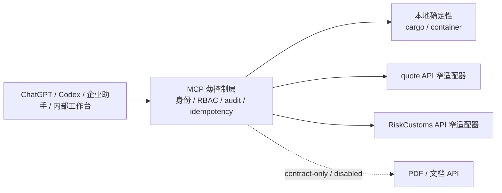

# 跨境物流 MCP

公司多人共享的薄控制层：ChatGPT、Codex、企业助手和内部工作台通过同一个远程 MCP 网关调用受控工具。MCP 负责身份、租户/RBAC、Schema、审计、幂等、状态和窄 API 适配，不复制报价、关务或文档系统。

## 开发业务模块前必读

所有团队拉取仓库后，必须先阅读 [业务模块开发与 MCP 热插拔集成规范](MODULE_DEVELOPMENT_STANDARD.md)，再开始新增模块、修改平台或执行集成发布。该规范统一 Module Contract、风险分级、能力注入、工具命名、热插拔、回滚、交付物和四类团队提示词。

当前 `main` 仍是 Phase 1 静态工具注册；规范中的模块控制平面和热插拔是目标架构，不是已经上线的能力。平台 RFC 和验收测试合并前，不得直接修改静态注册表接入新模块，也不得宣称已支持生产热插拔。

## 当前定位

- `cargo`、`container`：MCP 内的本地确定性计算，负责 CBM、体积重、分泡、计费重和理论/运营装柜摘要。
- AI 报价、RiskCustoms、PDF/文档的目标形态是只通过现有生产 API 的窄适配器接入；上游系统继续拥有价格、规则、关务和文档权威。
- 只有合同与生产资格验收通过的能力才在请求时直连上游；当前 quote 生产零调用、RiskCustoms 尚未注入生产组合，`quote.create_pdf` 已登记为第10个工具，但默认 handler unavailable 且 production 默认 disabled。
- AI 只负责理解意图、补输入、选择工具和解释结果；金额、重量、容量、状态和版本边界由确定性代码或上游 API 决定。
- `ready=false`、版本缺失、响应冲突和上游故障必须保持结构化 `needs_input`、`manual_review`、`blocked` 或 `unavailable`，不使用 fixture 静默回退。

## 当前真实状态

| 能力 | 当前状态 |
| --- | --- |
| quote API adapter | HTTP adapter 已实现并通过 fake-HTTP/local 组合测试，但经 10A 审查发现生产合同阻塞，未获生产启用资格，当前工具路径保持 `unavailable`/fail-closed；保留上游副作用 warning |
| RiskCustoms search adapter | 已实现 status→query 和失败闭合；当前生产服务仍缺少机器到机器认证合同，未接入生产组合 |
| `customs.ca.estimate` | `unavailable`；尚无已核验生产 API 合同 |
| PDF/文档能力 | `quote.create_pdf` RFC/wrapper/`write-result-v2` 已定义并登记为第10个工具；隔离核验 `/quotes/zone-preview` v2、`/v2/quote-pdfs` 的 replay/GET readback 形状，但当前仅 loopback HTTP，默认 handler unavailable 且 production disabled |
| 生产写工具 | `quote.save_draft` 和 `review.create_task` 固定 `unavailable`；上游未提供同一幂等键、取消和状态读回合同前不注入写源 |
| 生产平台 | 已接入 RS256/JWKS 令牌验证、SQLite audit/idempotency/session binding 和会话所有者校验；缺配置仍 fail-closed |

## 架构边界



单个业务 API 故障只关闭依赖它的工具；身份、审计、session/idempotency 等平台依赖缺失才会阻断生产入口。MCP 保存必要的版本引用、opaque handle、审计关联和写后读回证据，不建立报价或关务主表。

## 工具与契约

- [统一响应包络](docs/contracts/envelope.md)：五种状态、来源、警告、阻断、计算 trace 和审计字段。
- [工具目录](docs/contracts/tool-catalog.md)：覆盖既有工具与唯一新增 `quote.create_pdf` 的十个窄语义契约；PDF 已登记但默认 handler unavailable，production disabled。
- [权威矩阵](docs/contracts/authority-matrix.md)：Quote API、RiskCustoms API、cargo/container 及其失败边界。
- [Schema 目录](docs/contracts/schemas/) 与 [示例目录](docs/contracts/examples/)：Draft 2020-12 契约和结构化样例。
- [`quote.create_pdf` RFC](docs/rfcs/2026-08-13-quote-create-pdf-contract.md)：内部 PDF preview→approved commit→exact readback 的共享边界。

## 唯一当前执行计划

- [API-first 适配实施计划](docs/superpowers/plans/2026-08-12-api-first-integration-plan.md)：当前唯一权威执行计划，覆盖 quote、RiskCustoms、组合隔离、PDF 阻塞条件和验收。
- [产品实现说明](docs/product/2026-08-11-cross-border-logistics-mcp-product-implementation.md)：API 对接产品边界、流程、后台显示和验收。
- [后台控制台说明](docs/product/admin-console.md)：只展示来源、版本、状态、权限和审批证据，不启用未经合同核验的写入。

## 安全与验证

生产运行时由服务端注入 tenant/actor 和上游身份映射；客户端不能提交 token、base URL、密码或跨租户上下文。日志不写客户地址、报价明细、税务材料全文、原始聊天或凭证。

本仓库只用假值、fixture 和 fake HTTP 验证，不连接生产、数据库、服务器或外部业务仓库。提交前运行对应计划中的定向测试、`npm run typecheck`、`npm run lint`、`npm run validate:schemas` 和 `git diff --check`。

## 请求边界

- 进入工具前由服务端完成 Schema、tenant、actor、RBAC、权限和敏感输入校验。
- `cargo`、`container` 请求只在本地计算，并返回单位、规则版本、假设、warnings 和 trace。
- 获准启用后，quote 请求只调用现有 Quote API，RiskCustoms search 只调用 status/query API 的对应路径；当前两条生产路径均保持失败闭合。
- `quote.create_pdf` 在 AI Quote candidate hash、PDF HTTPS+allowlist、tenant credential、POST/replay/GET exact readback 和 deadline 合同完成前保持 handler unavailable；平台 outer deadline 为单一 30 秒，不在 MCP 本地生成或存储 PDF。
- 客户端不能选择任意上游 URL、提交上游 token，或把客户端 tenant/actor 当成服务端身份。

## 结果与故障隔离

- 统一包络只允许 `success`、`needs_input`、`manual_review`、`blocked`、`unavailable`。
- 上游 503、RiskCustoms `ready=false` 或 PDF dispatch 前连接失败只关闭 affected tools；PDF 已 dispatch 后 response timeout/unknown 进入 `manual_review`，不关闭本地工具或其他可用 API。
- quote 当前工具路径保持 `unavailable`/fail-closed；未获生产启用资格前不伪造可发送结果。
- customs estimate 当前固定 `unavailable`；`quote.save_draft` 仍等生产草稿 API 的完整写后读回合同；`quote.create_pdf` 已登记但默认 handler unavailable，当前保持 contract-only/production disabled。
- 生产组合的 JWKS、issuer/audience、SQLite 状态库或会话所有者配置缺失时，全局保持 fail-closed。

## 开发入口

本机先用真实编译产物和隔离演示数据跑通整条链路：

```bash
npm run start:fixture
```

启动后访问 `http://127.0.0.1:8080/admin/` 查看当前进程的中文脱敏只读快照；带
`?fixture=1` 的地址只用于完整界面演示。MCP 入口为 `http://127.0.0.1:8080/mcp`，
本机假 token 为 `local-fixture-token`。演示模式只绑定
`127.0.0.1`，`/readyz` 保持 `503/fixture_mode_not_production_ready`，不代表生产就绪。
一条命令验收编译产物、后台页面、认证拒绝、MCP 初始化、十个工具和
`cargo.calculate`：

```bash
npm run verify:runtime
```

- `src/logistics_mcp/adapters/`：Quote API 与 RiskCustoms API 的窄适配器。
- `src/logistics_mcp/server/composition.ts`：生产组合注入点和 fail-closed 默认适配器。
- `src/logistics_mcp/domains/cargo/`、`src/logistics_mcp/domains/container/`：本地确定性计算。
- `tests/adapters/`、`tests/domains/`、`tests/e2e/`：fake HTTP、fixture 和隔离证据；fixture 不自动回退。
- [API-first 适配实施计划](docs/superpowers/plans/2026-08-12-api-first-integration-plan.md) 是唯一当前执行计划。
- 文档中的 endpoint 仅表示已核验的路径形状，不代表仓库保存生产地址。
- 任何业务 API 合同缺口都保留为 pending、disabled 或结构化不可用状态。
- 组合测试通过不等于生产 API 获准启用。
