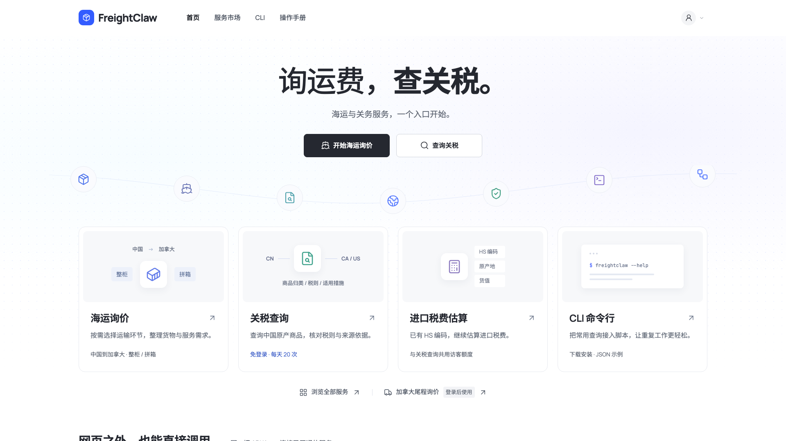
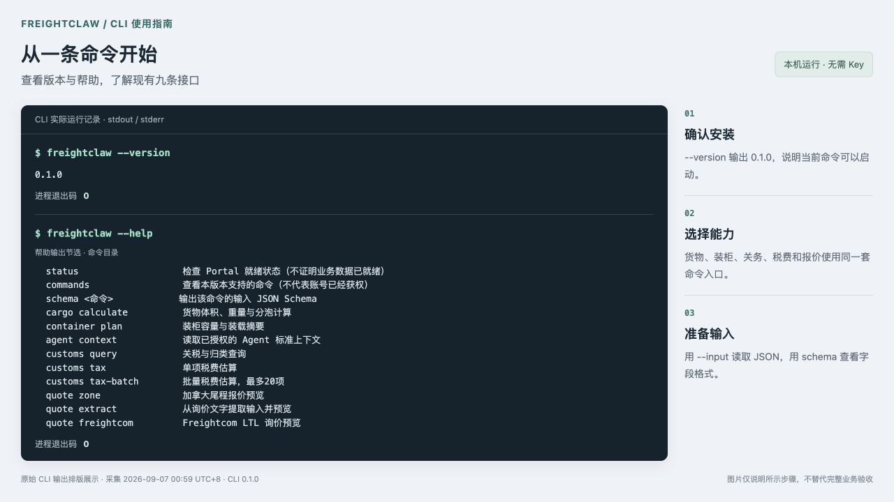
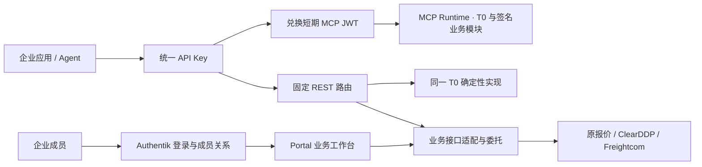

# FreightClaw · 跨境物流 API 与 MCP 工作台

FreightClaw 为业务人员、企业应用和 Agent 提供统一物流工作台、REST API 与 MCP 入口。既有报价与关务适配继续保留；当前开发分支新增原生关务和私人地址运价引擎及配置发布后台。业务服务维护各自来源与规则，平台统一身份、授权、凭证、审计和失败闭合。

**本地开发进度：2026-09-08。** 混装计价、原生报价保存／审核／退回／PDF、完整关务快照更新，以及两种询价共用资料已实现网页和人员 CLI 流程。已只读迁入线上 Toronto / Calgary 共 754 档价格和完整法规快照供本地验收；运价截止为用户确认的 2027-01-01，报价单有效期 7 天。175 项冲突邮编保持人工复核；关务来源仍为 15 staged、0 发布快照，未启用正式查询。当前未部署生产，Freightcom 正式报价、企业模板和目标容器仍待验收。见 [本次图文进度与真实数据边界](docs/product/2026-09-08-native-business-completion.md)、[部署与回滚手册](docs/runbooks/native-business-completion-2026-09-08.md)及[配置和 CLI 操作说明](apps/console/native-business.md)。

**既有生产记录：2026-09-07。** 代码已补齐八项 MCP 能力、调用记录、来源历史接入、签名模块切换和共享 Portal 持久化。RiskCustoms 来源服务与历史迁移已部署，Portal 已更新并开启关务历史，生产历史空列表读回通过。旧 `t0-v1` 保留三项；五项业务 MCP 的 `business-v1`、签名 Provider 与 PostgreSQL 多实例尚未由此次部署启用。正式关务数据、供应商凭证与真实客户验收仍须独立完成。

- [功能补齐与发布操作](docs/runbooks/capability-completion-v1.md)
- [当前进度、功能缺口与验收顺序](docs/product/2026-09-05-mcp-product-redesign/18-current-status-and-gaps.md)
- [2026-09-06 生产交付记录](docs/product/2026-09-05-mcp-product-redesign/17-market-manual-production-delivery.md) / [生产交付台账](docs/product/2026-09-05-mcp-product-redesign/15-implementation-delivery.md)
- [2026-09-07 关务来源与历史生产部署](docs/runbooks/riskcustoms-history-deployment-2026-09-07.md)
- [新服务接入指南](docs/integrations/new-service-onboarding.md)
- [FreightClaw CLI 使用说明](deploy/cli/README.md) / [客户端构建与交付](docs/runbooks/freightclaw-cli.md)：统一 Key 调用九条现有 REST 接口，支持 JSON、输入 Schema 和业务状态退出码；官网提供可直接安装的 npm 包。
- [布局、开源字体与图标审计](docs/runbooks/ui-refinement.md)：宽屏布局、中文与代码字体、Lucide 图标、手机截图与发布验证。
- [官网风格改版记录](docs/runbooks/joyagent-style.md)：首轮 JoyAgent 参考风格、公开入口与业务边界。
- [公开首页与访客关税说明](docs/runbooks/public-portal.md)：每天 20 次访客查询、尾程登录边界及首次发布记录。
- [官网与 CLI 统一入口的首次发布](docs/runbooks/unified-service-entry.md)：保留的整柜询价、CLI 入口和历史发布步骤。
- [简明海运询价图文说明](docs/runbooks/shipper-inquiry.md)：三步整理运输需求；完整费用目录保留，企业与合规咨询单独进入，邮件由客户自行确认发送。
- [CLI 图文使用指南](docs/runbooks/freightclaw-cli-illustrated.md)：四张实测截图说明安装后的命令选择、连接检查、输入校验与结果处理。

发布记录、当前代码、本地测试和真实业务调用分别留证。下文生产状态引用已保存回执，不代表读取 README 时刚刚重新探测了生产。`ready=false`、测试数据、证据冲突和写后读回失败不得提升为 `success`。

## 用户入口

| 入口 | 用途 |
| --- | --- |
| [官网服务首页](https://www.freightclaw.net/) | 海运询价、关税查询、税费估算与系统接入的统一入口 |
| [整柜 / 海运询价](https://www.freightclaw.net/inquiry/) | 选择服务、填写运输信息、确认需求并生成询价邮件 |
| [全部服务与费用](https://www.freightclaw.net/inquiry/details/) | 保留原 84 项费用目录、分币种汇总和完整询价表单 |
| [能力市场](https://www.freightclaw.net/console/#market) | 浏览能力、查询实际协议和接口、打开在线工作台 |
| [关税查询](https://www.freightclaw.net/console/#customs) / [税费估算](https://www.freightclaw.net/console/#tax) | 访客共用每天 20 次查询；企业用户沿用已开通服务 |
| [个人中心](https://www.freightclaw.net/console/#account) | 从右上角账号图标进入；登录后按角色查看工作区、历史和账号相关功能 |
| [业务工作台](https://www.freightclaw.net/console/#workbench) | 企业成员通过登录会话处理询价、关务和税费，无需粘贴 API Key |
| [API Key](https://www.freightclaw.net/console/#api-keys) | 应用负责人管理统一 Key、服务范围、交付、轮换和撤销 |
| [操作手册](https://www.freightclaw.net/console/#guide) | 账号、授权、REST、MCP 和结果处理 |
| [Agent 指南](https://www.freightclaw.net/console/skill.md) / [OpenAPI](https://www.freightclaw.net/console/openapi.json) | 按实际 Schema 接入；仓库副本见 [skill.md](apps/console/skill.md) 和 [openapi.json](docs/integrations/openapi.json) |
| [CLI 安装与使用](https://www.freightclaw.net/console/#cli) | `freightclaw` 命令行调用货物、装柜、报价、关务和税费；沿用统一应用 Key，人员历史仍使用网页登录 |

当前人员登录由 Authentik 提供邮箱、密码、邮箱验证及恢复；企业微信不在需求范围。平台审批和企业业务角色分别授权，不能因拥有查询 Key 自动获得审批、保存或文档权限。

首页、海运需求整理、市场、CLI 和操作手册可公开访问。关税和税费提供每天 20 次访客查询，同一网络共享、批量按商品数计次、北京时间零点恢复。加拿大尾程查询和个人数据仍需登录及相应权限；具体计次规则见 [访客查询说明](docs/runbooks/public-portal.md)。

下图为 2026-09-07 更新后的官网实际页面。宽屏首页扩大到 1536 px，服务正文统一为 16 px；中文、英文和代码分别使用自托管开源字体，配合统一 Lucide 图标。海运、关税、税费与 CLI 四个入口及账号菜单的权限规则保持一致。审计、手机截图与发布验证见 [图文说明](docs/runbooks/ui-refinement.md)。



### CLI 快速开始

`freightclaw` 为本机脚本、CI 和 Agent 提供统一命令入口。下图展示实际版本输出与帮助中的命令目录节选；完整步骤及另外三张实测图见 [CLI 图文使用指南](docs/runbooks/freightclaw-cli-illustrated.md)。

需要 Node.js 22.13 或更新版本。可从 [CLI 页面](https://www.freightclaw.net/console/#cli) 下载，或直接安装：

```sh
npm install --global https://www.freightclaw.net/downloads/freightclaw-cli-0.1.0.tgz
freightclaw --version
freightclaw status
```



## 当前能力与可用边界

| 能力 | 对外协议 | 已实现 / 已有证据 | 尚未完成 |
| --- | --- | --- | --- |
| `cargo.calculate` | MCP + REST | CBM、重量、体积重、分泡和计费重的确定性计算 | 客户客户端调用仍需按实际身份验收 |
| `container.plan_summary` | MCP + REST | 理论/运营容量、超方超重和装载顺序摘要 | 不提供三维坐标或实际装载承诺 |
| `system.agent_context.get` | MCP + REST | 受限 profile、生成的标准包和固定资源 | 不能代替业务授权或来源就绪检查 |
| `quote.zone_preview` | REST + 业务 MCP | 原报价系统的只读尾程试算；已有真实租户 service actor 调用回执 | 当前有效价格复核和真实人员业务验收 |
| `quote.ai_extract_preview` | REST + 业务 MCP | 新增原生确定性文本解析；保留逐行证据、缺项和冲突；网页／CLI 共用 | 未生产部署；图片、PDF 和不明确分组仍需人工整理 |
| `customs.query` | REST + 业务 MCP | 中、美、加完整结果适配及真实 M2M 连接 | 正式数据发布、复合快照及动态措施依赖未闭合 |
| `customs.tax.estimate` | MCP 单项 + REST 单项/批量 | 服务器估算接口、批量结果和来源校验 | 正式关务数据未就绪时保持 `unavailable` |
| `quote.freightcom_ltl.preview` | REST + 业务 MCP | 正式接口适配、企业权限、原币种费用和有效期校验 | 企业正式凭证、账号映射和真实生产 rate 读回 |
| 报价保存、历史、人工审核、PDF | 人员会话业务 API | 专用接口、预览、幂等、角色门禁和读回实现；有隔离流程测试记录 | 真实企业保存—审核—正式 PDF 完整验收；未开放为机器写权限 |

最近已保存的关务来源状态为 15 个 staged、0 个 published、0 个 publication snapshot；查询/估算返回 `data_not_ready` 或 `unavailable`。最近尾程试算来源版本为 `2026-06-03`，版本日期本身既不证明失效，也不证明当前价格已获批准。详见 [关务来源验收](docs/runbooks/customs-candidate-production-api.md) 与 [报价来源验收](docs/runbooks/quote-candidate-production-api.md)。

## 同一 Key 如何调用



- 固定 REST 路由支持 `Authorization: ApiKey <key>`。业务路由也兼容既有短期 Bearer JWT。
- MCP 使用版本化换票接口获取短期 JWT，再访问 `/mcp`；旧三项基础工具使用 `/access/v2/application/token/exchange`，包含业务工具时使用下述新接口。MCP Runtime 不接受长期 Key。
- 统一 Key 复用既有 Business 凭证权威，前缀为 `flcbk_`；旧 `lmcpk_` 路由保持兼容。
- 老 Business Key 获得基础工具范围需要负责人明确启用；新增业务服务后通过“更新服务”明确轮换，普通轮换不隐式增权。
- 换票及调用均核对当前企业、应用、负责人、授权、交付状态、有效期和撤销状态。已签发 JWT 不能绕过后来发生的撤销。
- 完整 Key 只显示一次，不进入浏览器持久存储、日志、代码或文档。
- 五项业务 MCP 使用 `/access/v2/application/mcp/token/exchange` 与 `application-mcp-exchange@2026-09-06.v1`，当前批准的精确工具范围进入短 JWT；工具列表同时受签名模块发布控制。旧换票合同不变。

具体请求、Schema 和状态以 [统一 Key RFC](docs/rfcs/2026-09-06-unified-application-key-v1.md)、[Business API v2](docs/runbooks/business-api-v2.md) 和 OpenAPI 为准。

## 前后台业务协作

[渠道配置与 CLI 本地交付](docs/product/2026-09-07-channels-cli-delivery.md)：已新增空白渠道、草稿、预览发布、停用、历史回退，以及询价管理 CLI。网页和 CLI 使用相同记录与权限。仅本地验收环境启用，渠道尚不含运价规则。**所有后续功能必须同时交付网页、API 和 CLI；已有成员、授权、个人历史的 CLI 覆盖仍待补齐。**

[询价受理第一阶段](docs/product/2026-09-07-business-cases-delivery.md) 已实现本地闭环：前台提交需求、后台处理、客户补充、双方读回同一记录。后台复用前台设计与现有账号。生产默认关闭，单实例通过 `PORTAL_CASES_ENABLED=true` 显式启用；原生引擎与配置后台仍在后续阶段，不能将此交付当作全部迁移完成。

## 界面职责

| 目录 | 职责 | 边界 |
| --- | --- | --- |
| `apps/inquiry` | 公开海运需求整理与企业咨询 | 三步生成邮件；不保存客户资料、不代发、不计算运价 |
| `apps/console` | 当前企业门户、能力市场、人员工作台与统一 Key | 主用户入口；来源不可用时保留真实失败状态 |
| `apps/access-console` | 既有 Access Gateway 的窄管理界面 | 保留租户、客户端、旧凭证、运营概览和接入诊断 |
| `apps/admin` | MCP 模块控制与本地隔离管理流程 | 本地模块管理与生产 Portal 不等价；旧生产模块控制 POST 仍被阻断；业务模块使用独立签名发布文件 |

Module Runtime v0 已有静态可信模块、manifest、capability、catalog 与 registration lease。它只在启动时挂载模块，尚未完成远程安装、通用隔离模块运行池及无重启热插拔。现有 Admin 的预览、不同操作者审批、activation 与 exact readback 只证明相应控制流程，不代表任意新代码可在线安装。

## 权威和失败闭合

- AI 负责理解、提取、追问和解释；价格、Zone、税率、重量、容量、权限和版本由确定性代码或权威源决定。
- 五种业务状态固定为 `success`、`needs_input`、`manual_review`、`blocked`、`unavailable`。接口有响应或授权生效不等于正式报价、税费或业务写入完成。
- 输入输出采用闭合、版本化 Schema。金额使用十进制字符串及三位币种，物理量携带单位；Freightcom 保留已接受合同规定的源整数最小货币单位，不做测试币种重标或隐式 FX。
- `unit_weight`、`piece_weights`、`line_total_weight` 是互斥重量证据；缺失或冲突不能猜测。
- 写操作使用服务端身份、精确权限、必要预览/审批、幂等和目标系统读回。未知写结果保留原操作引用，不盲目新建一笔。
- MCP 适配层只保留必要引用、接入状态与脱敏审计；本次原生业务迁移由独立报价、关务和文档服务维护业务数据及发布版本，见已接受的原生业务 RFC。
- 单个上游失败只影响依赖它的能力；平台身份、审计或会话基础依赖失败才阻断更大范围。

原 [Phase 1 工具目录](docs/contracts/tool-catalog.md) 和 [权威矩阵](docs/contracts/authority-matrix.md) 继续约束对应旧 MCP 工具。`customs.ca.estimate`、`quote.save_draft` 等旧工具的未启用状态不能用于推断新 Portal REST/人员接口不存在；两条合同轨道必须分别核对。

## 发布证据与剩余工作

2026-09-06 保存的回执记录 Portal 与 MCP Runtime 镜像为 `freightclaw-portal:a42849576004`，公网检查 12 项通过，Portal 三库及 Runtime 备份恢复完成。生产来源是以 `34e1e95` 为基线的工作树文件清单；该发布身份不会因为后来代码提交到 main 而改变。

2026-09-07 新回执确认 Portal 已更新为 main `712cddf7e355` 构建的 `freightclaw-portal:593b537df6c4`，六项就绪检查、七项公网检查通过；MCP Runtime 仍为 `a42849576004`。RiskCustoms main `18c113bf3243` 已部署、迁移至0008并接通六条来源路径，对应企业的关务历史开关已开启。正式关务数据仍为15 staged、0 published、0 publication snapshot。详见[本次部署及回滚记录](docs/runbooks/riskcustoms-history-deployment-2026-09-07.md)。

最新企业回执记录一个有效且已确认交付的统一 Key，但明确 `production_customer_key_invoked=false`、`last_used_at=null`。历史测试通过、服务端只读样例和用户真实客户端验收分别记录。

优先完成：

1. 关务正式发布、复合快照与动态措施依赖。
2. 报价价格有效性及真实人员保存、审核、PDF 和历史读回。
3. Freightcom 企业正式凭证与生产费率读回。
4. 现有统一 Key 的真实 REST/MCP 调用和权限变更验收。

个人中心新增“调用记录”和“关务历史”。调用记录包含脱敏身份、状态、耗时和请求编号；RiskCustoms 来源历史接口已通过本地真实 HTTP 联调，并于2026-09-07完成生产部署、迁移、路由及连接启用。查询与税费历史目前均为空，真实人员历史详情和恢复仍待业务记录验收。签名私有 Provider 支持无重启切换、排空、回滚和目录通知。Portal 提供经隔离并发、迁移及断连恢复验证的 PostgreSQL 模式；当前生产仍为单实例 SQLite，不能跨主机共享写入。自动客户发送、订舱、付款、正式报关和商业计费不在本阶段默认范围。

## 开发与本地验证

开始前按顺序阅读 [AGENTS.md](AGENTS.md)、[模块开发规范](MODULE_DEVELOPMENT_STANDARD.md)、本 README、[统一包络](docs/contracts/envelope.md)、工具目录、权威矩阵及相关 RFC。机器入口是 [docs/agent/index.json](docs/agent/index.json)，按实际角色选择 profile。

需要 Node.js >=22.13.0；CI 固定使用 22.13.0。不要在测试中配置生产数据库或真实业务凭证。

```bash
npm ci
npm run validate:schemas
npm run validate:agent-standards
npm run validate:agent-adapters
npm run build
npm test
npm run typecheck
npm run lint
git diff --check
```

`build` 生成运行包、Portal 静态资产、OpenAPI 和 `dist/standards/agent-standard-pack.json`。运行时只读取生成的标准包，不随意读取当前目录 Markdown。条件 PostgreSQL 集成测试只应在显式隔离数据库配置下启用。

Portal 隔离演示：

```bash
npm run start:console:fixture
```

默认访问 `http://127.0.0.1:8882/console/`；实际端口以启动输出为准。本地登录已改为账号、密码和图形验证码：`user` 为业务用户、`admin` 为管理员，体验密码均为 `FreightClaw2026!`。演示身份、授权和来源响应只用于本地验证，不是生产业务证据；正式站仍使用现有身份服务。见[登录与用户类型调整](docs/product/2026-09-07-login-simplification.md)。

既有 MCP/Admin 隔离演示：

```bash
npm run init:control-fixture
npm run start:fixture
```

首次 initializer 明确建立 control、tenant-access 与 plugin-config 状态。启动不隐式覆盖或修复已有控制状态；旧 checkout 的补初始化步骤见 [本地接入 runbook](docs/runbooks/tenant-api-key-fixture.md)。入口为 `http://127.0.0.1:8080/admin/?fixture=1` 和 `/mcp`，fixture `/readyz` 保持 `503/fixture_mode_not_production_ready`。

## 部署和进一步阅读

- [Portal 身份与生产验收](docs/runbooks/portal-production-acceptance.md)、[国内邮箱登录](docs/runbooks/portal-login-cn.md)
- [业务 API 部署](docs/runbooks/business-api-v2.md)、[Python 公网客户端验收](docs/runbooks/cloudflare-python-api-acceptance.md)
- [部署目录](deploy/README.md)、[T0 发布](docs/runbooks/t0-release.md)、[T0 回滚](docs/runbooks/t0-rollback.md)
- [模块 Runtime v0](docs/standards/module-runtime-v0.md)、[Agent 访问标准](docs/standards/agent-access-v0.md)
- [新服务接入](docs/integrations/new-service-onboarding.md)、[完整产品规划与历史方案](docs/product/2026-09-05-mcp-product-redesign/README.md)

本仓库 CI 执行编译、测试、Schema、演示门禁和镜像构建，不自动部署生产。提交或绿色 CI 不能替代目标环境的业务验收。

### 原生报价单模块

服务市场 → **报价单制作**：企业模板、分币种费用、草稿记录、人工核对和 PDF 导出；网页与十个 `freightclaw workspace documents` 命令共享人员权限及业务存储。代码移植自用户的 `quote-pdf-builder`，没有依赖旧站 API。详情、部署条件与截图见 [报价单模块说明](docs/product/2026-09-08-native-quote-documents.md)。当前为本地完成的功能，线上部署需单独验证；账单、收款和旧 PDF 回导尚未迁移。
