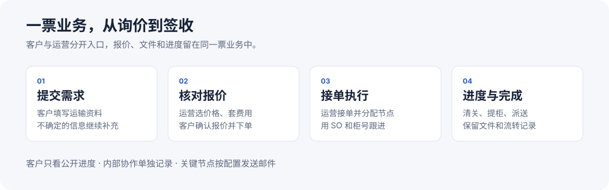

# 文档中心

[返回项目首页](../README.md)

**按要做的事找说明，不必先了解系统结构。**

## 使用系统

| 客户 | 运营 |
| --- | --- |
| [提交询价、确认报价、查看进度](guides/customer.md) | [维护价格、出报价、接单与跟进](guides/operations.md) |
| [客户中心](https://www.freightclaw.net/customer/) | [运营后台](https://www.freightclaw.net/ops/) |
| 报价、文件和公开进度只在本人业务中查看 | [发信服务、节点邮件、财务提醒](runbooks/fcl-mail-settings.md) |

## 开发与接入

| 目标 | 入口 |
| --- | --- |
| 安装 CLI | [快速开始](runbooks/freightclaw-cli-illustrated.md) · [参数与退出码](../deploy/cli/README.md) |
| 通过 CLI 操作本人业务 | [人员登录、FCL 与命令参考](../apps/console/workspace-cli.md) |
| 接入 REST / MCP | [Agent 接入指南](../apps/console/skill.md) · [OpenAPI](../apps/console/openapi.json) |
| 配置原生业务 | [关务、私人地址运价与 Freightcom](../apps/console/native-business.md) |
| 开始开发 | [本地启动与验证](guides/development.md) · [仓库约束](../AGENTS.md) |
| 新增服务 | [接入指南](integrations/new-service-onboarding.md) |

## 部署与维护

[发布与维护总览](guides/maintenance.md) · [部署配置](../deploy/README.md) · [CLI 交付](runbooks/freightclaw-cli.md) · [Authentik 候选配置](../deploy/self-hosted-authentik/README.md)

## 合同与历史

| 类型 | 怎么使用 |
| --- | --- |
| [Agent 标准入口](agent/index.json) | 根据开发、审查、发布或运行角色加载标准 |
| [统一包络](contracts/envelope.md)、[工具目录](contracts/tool-catalog.md)、[权威矩阵](contracts/authority-matrix.md) | 按适用合同执行，不将 Phase 1 边界套到所有新接口 |
| [完整文档索引](catalog.md) | 查阅全部 Markdown，包含专题参考、RFC、计划与验收原文 |

历史文档保留日期、事实和原链接，不作为当前生产状态。插图为流程示意；页面截图标明采集日期和环境。当前使用说明整理于 2026-09-29。
