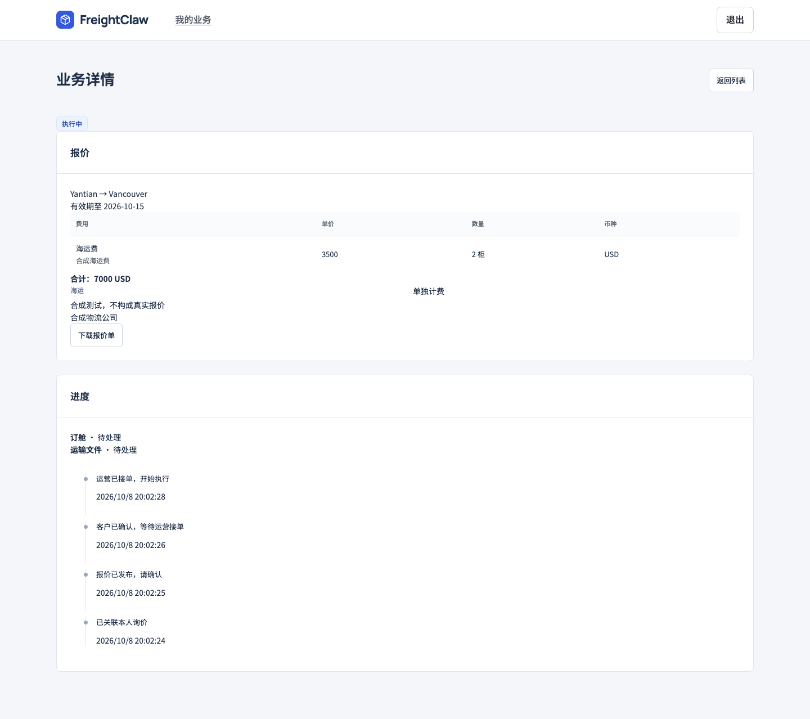

# 客户使用手册

[文档中心](../README.md) / 客户

**只需要做三件事：提交需求、确认报价、查看进度。**

## 1. 提交询价

从[客户中心](https://www.freightclaw.net/customer/)点击「发起询价」。填写已知的航线、柜型与柜数、货物、所需服务和联系方式，再提交。

不知道的资料留待补充，不要用 0 或猜测值代替。提交后保留询价查询链接；公开提交的询价可在登录后的「关联已有询价」中关联到本人账号。查询链接包含访问凭据，不要公开转发。

## 2. 确认报价

登录客户中心，打开待确认业务，检查以下内容：

| 看什么 | 核对内容 |
| --- | --- |
| 运输需求 | 起运地、目的地、柜型、柜数及服务范围 |
| 费用 | 收费项目、数量、币种及合计 |
| 条件 | 有效期、包含和不包含的服务、备注 |

确认无误后提交委托。需要修改时联系受理人，由运营更新报价。**客户确认后仍需运营接单**，不要把已提交委托理解成已经订到舱。

## 3. 查看运输进度

在「我的业务」打开订单。前期按询价号查找；录入 SO 和柜号后，列表优先展示它们。

列表可按单号、SO、柜号、航线和状态筛选；筛选范围是已加载的记录，更多记录点击「加载更多」。待确认的业务可直接点击「确认报价」，其他业务点击「查看」。手机上可左右滑动表格。

订单内查看报价、客户可见进度和共享文件。收到补资料通知时，按要求补充。内部备注、成本及内部协作记录不对客户公开。

## 页面示例

*2026-09-28 留存的本地合成测试截图，展示报价核对流程。布局与当前线上可能不同，图中价格不构成商业报价。*

## 遇到问题

| 情况 | 怎么处理 |
| --- | --- |
| 看不到已有询价 | 确认登录账号；公开询价通过原查询链接关联 |
| 报价更新或过期 | 联系受理人，查看最新发布版本后再确认 |
| 邮件没收到 | 先看订单进度，再查垃圾邮件；不要重复提交订单 |
| 提交后没有明确结果 | 保留页面与业务编号，先查询记录，再联系受理人 |
| 不能打开运营后台 | 客户使用客户中心；运营入口需要个人授权 |

首页、能力市场和 CLI 可从顶部导航进入。日常询价和订单跟进不需要配置 API Key。
