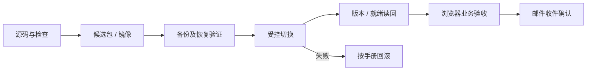

# 发布与维护

[文档中心](../README.md) / 运维

**先验证候选，再备份切换，最后从用户入口验收。** CI 通过不等于已经上线。

## 按服务选择手册

| 对象 | 操作依据 |
| --- | --- |
| 部署文件与环境参数 | [部署目录](../../deploy/README.md) |
| 个人整柜迁移、Portal 切换 | [FCL 切换手册](../runbooks/2026-09-21-fcl-production-cutover.md)，其中回执只代表该次发布 |
| Portal 身份与登录 | [身份配置](../runbooks/portal-identity.md) · [邮箱登录](../runbooks/portal-login-cn.md) |
| 发信连接及节点通知 | [邮件设置](../runbooks/fcl-mail-settings.md) |
| CLI 打包 | [CLI 交付](../runbooks/freightclaw-cli.md) |
| MCP T0 | [发布](../runbooks/t0-release.md) · [回滚](../runbooks/t0-rollback.md) |
| Gateway PostgreSQL | [数据库切换](../runbooks/access-gateway-postgres-cutover.md) |
| 版本编号 | [版本规则](../runbooks/versioning.md) |

## 一次发布留下什么

| 阶段 | 证据 |
| --- | --- |
| 源码 | 提交、改动范围、检查结果 |
| 候选 | Build ID、包哈希、镜像标识 |
| 数据 | 备份、恢复验证、迁移前后归属与数量 |
| 切换 | 目标环境、实际 release/build ID、依赖就绪结果 |
| 业务 | 登录、保存与读回、个人隔离、关键页面操作 |
| 邮件 | 发送记录、服务器接收、收件人确认分别记录 |

SQLite 迁移前停止写入，备份并验证恢复，再在隔离候选中检查迁移。企业关联数据必须先确认归属，不能随意归给个人账号。历史报价金额与快照不能被新价格覆盖。

## 上线后的最小验收

使用明确标注的测试业务，核对客户和运营独立入口、询价、报价、客户确认、接单、进度和附件。客户不能看到内部记录，其他账号不能看到本人的订单。真实邮件发送应获得授权，并核对收件人。

异常时记录业务编号和状态。未知发送结果不能盲目重试；来源不可用不能降级为虚构成功。回滚按对应服务手册执行，不把运行中的库直接替换成旧文件。

## 历史记录怎么读

[完整索引](../catalog.md)保留各次 RFC、发布和验收原文。日期、旧入口、数据条数和 Build ID 只描述当时环境。当前权限看实现，当前线上状态看实际读回；旧截图和回执不替代本次验收。
