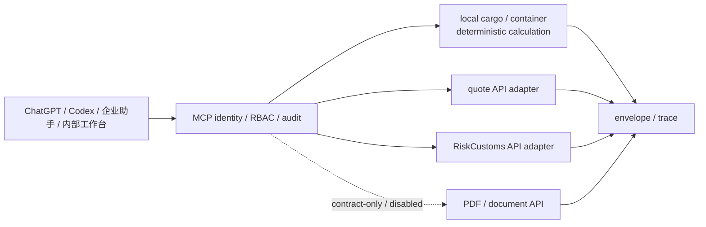

# 跨境物流 MCP API 对接产品实现说明

**日期：** 2026-08-12
**基线版本：** `2026-08-11.v1`
**性质：** API-first 产品边界与验收说明；不授权生产接入。

## 1. 目标与非目标

目标是为公司多人提供一个共享的薄 MCP 控制层：统一身份、租户/RBAC、Schema、审计、幂等、状态和窄 API 适配，让 ChatGPT、Codex、企业助手和内部工作台使用同一组结构化工具。

- `cargo`、`container` 在 MCP 内做本地确定性计算：CBM、体积重、分泡、计费重和理论/运营装柜摘要。
- AI 报价、RiskCustoms、PDF/文档的目标形态是通过现有生产 API 的窄适配器接入；上游继续拥有业务规则和数据。
- 只有合同与生产资格验收通过的能力才在请求时直连上游；当前 quote 生产零调用、RiskCustoms 尚未注入生产组合，`quote.create_pdf` 仅有共享契约，未注册且 production 默认 disabled。

非目标：不在 MCP 内重做报价或关务引擎，不在本地生成文档，不把上游业务记录复制成 MCP 主表，不发送/发布报价，不形成正式报关结论，不订舱或提供通用写入口。

## 2. 可视化架构



MCP 是访问控制和契约边界，不是报价、关务或文档权威库。业务 API 的故障只影响相应工具；身份、durable audit/idempotency/session binding 或真实 token verifier 缺失才影响生产 readiness。

## 3. API 合同与当前状态

| 能力 | 已确认调用 | MCP 映射 | 当前状态 |
| --- | --- | --- | --- |
| AI 报价 | `POST /quotes/zone-calculate`；请求含 `cbm`，通知固定关闭 | 隔离投影实现，仅用于 fake-HTTP/local 合同核对，生产不执行；不持有 Zone、价格或规则表 | HTTP adapter 已实现并通过 fake-HTTP/local 组合测试，但经 10A 审查发现生产合同阻塞，未获生产启用资格，当前工具路径保持 `unavailable`/fail-closed；保留 `quote.upstream_side_effects` |
| RiskCustoms status | `GET /api/status` | 只使用 `ready`、`reasons` 等状态字段 | adapter 已实现；每次 search 先检查 status |
| RiskCustoms search | `POST /api/query`；只发送显式 trim 后 query | 校验 query 响应 ready、非 test data、真实 `query.sources.releaseId` 和来源 hash | adapter 已实现；ready=false 或来源不完整为 `unavailable`/`manual_review` |
| customs estimate | 尚无已核验生产估算 API | 不拼造税额或正式结论 | 固定 `unavailable` |
| PDF/文档 | `quote.create_pdf` RFC/wrapper/`write-result-v2` 已定义；隔离核验 AI Quote `/quotes/zone-preview` v2、PDF `/v2/quote-pdfs` 的 USD lines、`sendable=false`、tenant+Idempotency-Key replay 和 201/200 后 metadata GET；当前仅 loopback HTTP | 仅允许后续窄适配器 preview→candidate hash→approved commit→PDF exact readback；不在本地生成/存储文档 | contract-only；未注册，production disabled |

上表中的路径是已确认的 API contract 形状，不是生产 URL。实际 base URL、服务认证、租户到上游身份映射和副作用仍需隔离合同核验；代码只接受运行时注入的受控引用。

### API 适配器调用约束

- 适配器只接收服务端注入的受控 endpoint、认证引用和 tenant mapping，不解析客户端提供的地址或凭证。
- 请求字段按已确认合同逐项映射；没有合同支持的字段不被猜造，也不转存为 MCP 业务记录。
- 上游 response 先做结构、ready、来源、版本和副作用校验，再进入统一响应包络。
- 适配器的 `health()` 只检查本地结构与生命周期；业务 API 是否可用由对应工具请求判定，生产 quote 路径当前仍保持 `unavailable`/fail-closed。
- 缺少 quote 或 customs adapter 时，默认实现仍返回结构化 `unavailable`，不使用 fixture 自动回退。

## 4. 请求时更新链路

```text
client request
  → server-authenticated tenant/actor + RBAC
  → Schema and sensitive-input validation
  → local cargo/container calculation OR one quote/customs API flow
  → map source/version/hash and calculation trace
  → envelope + audit record
```

报价、RiskCustoms 和 PDF 不使用 MCP 业务缓存；获准启用后，下一次请求直接读取当前上游状态。`quote.save_draft` 是窄写入口，只有生产草稿 API 的 preview/approval/commit/readback 合同完整后才能启用；`quote.create_pdf` 只有在 AI Quote candidate hash、PDF POST/replay/GET exact readback 和 deadline 合同完整后才能启用；写后读回不一致不得报告成功。

### 请求时证据

- 每次调用绑定 request ID、tenant/actor 脱敏标识、source ref 和响应 hash。
- quote 的金额、附加费和副作用 warning 原样保留可追溯引用；缺少版本证据不升级为 `success`。
- RiskCustoms 的 release 只能来自真实 `query.sources.releaseId`；MCP 不生成 release 或税率版本。
- 本地 cargo/container 结果记录输入、单位、规则版本、assumptions 和计算 trace。
- API 更新不通过后台刷新或缓存传播；下一次请求直接读取当前 API 响应。

## 5. 失败隔离与状态语义

统一包络只允许：`success`、`needs_input`、`manual_review`、`blocked`、`unavailable`。

| 情况 | 返回 | 边界 |
| --- | --- | --- |
| 输入缺失或不合法 | `needs_input` | 指出字段路径，零上游调用 |
| 版本/来源/响应冲突 | `manual_review` | 不把不完整证据升级为成功 |
| 权限、租户、SSRF、凭证或阶段禁止 | `blocked` | 安全门禁先拒绝，零上游调用 |
| 上游 5xx、RiskCustoms ready=false、PDF production qualification 未完成或 dispatch 前连接失败 | `unavailable` | 只关闭 affected tools，不关闭本地计算或其他 API 工具 |
| PDF 已 dispatch 后 response timeout/unknown、GET 404 或 readback identity/hash/version 冲突 | `manual_review` | 可能已经写入；先按 opaque reference 恢复，不盲目重发 |
| 所有证据满足合同 | `success` 或按业务规则 `manual_review` | 报价仍受 `sendable=false` 约束；HS 仍是候选 |

`status` 工具成功读取 `ready=false` 时可以返回 `success`，但依赖该状态的业务工具必须返回 `unavailable`/`manual_review`。fixture 只用于明确测试模式，不能自动回退。

### 隔离示例

- Quote API 503 时，quote 工具返回 `unavailable`；cargo/container 仍可计算，customs search 不因该故障被禁用。
- RiskCustoms status 返回 `ready=false` 时，customs search 返回 `unavailable`；quote 和本地工具继续按各自依赖运行。
- PDF production qualification 缺失只使 `quote.create_pdf` 保持 contract-only/disabled/未注册，不改变平台身份、审计或本地计算的边界；不以 loopback HTTP 证据声称 production ready。
- 平台 token verifier、durable audit、idempotency 或 session binding 缺失，才允许全局 readiness 失败。

## 6. 租户、身份与密钥边界

- 网关从真实 token verifier 和服务端 session 绑定取得 tenant、actor、client、role、scope；客户端提交的上下文不具权威性。
- 上游 base URL、服务认证和 tenant mapping 由部署注入；客户端不能传 token、密码、API key、任意 URL 或上游账户。
- 出站 HTTP 只允许 HTTPS 和 allowlist host；拒绝 URL 凭证、重定向绕过、私网/本机目标和未授权 host。
- 日志和审计只记录 opaque ref、版本、hash、状态、reason、request/audit ID；不记录客户地址、报价明细、税务全文、聊天原文或凭证。
- 生产组合要求 durable audit、durable idempotency、durable session binding 和真实 token verifier；缺失时 MCP 全局保持 fail-closed。

### 密钥与租户落地

- 部署只注入 secret reference；适配器在请求时取得最小权限服务身份，响应中不回显认证材料。
- tenant mapping 必须由服务端按 client、actor、scope 和目标 API 合同决定，不能由模型或客户端覆盖。
- endpoint allowlist、HTTPS、重定向限制和私网拒绝在出站请求前执行；门禁失败不产生上游调用。
- audit 记录操作和结果证据，不记录 token、密码、原始地址、报价明细或税务材料全文。

## 7. 后台显示字段

后台只展示控制面证据，不伪造上游业务状态：

- 客户端：只展示中文业务名称、登记状态和最近校验结论；身份来源、使用范围、允许来源地址和内部标识均隐藏；
- 数据源：只展示中文业务名称、是否已配置、当前可用性和原因；接口地址、凭证引用和版本原值均隐藏；
- 工具：只展示中文名称、操作类型、当前可用性、受影响来源和角色授权；内部工具名与权限码均隐藏；
- 结果与审计：只展示中文状态、原因和脱敏证据摘要；请求、审计、来源、版本和哈希标识不回显具体值；
- 写操作：只展示预览、审批、幂等和写后读回状态；预览引用、记录标识和内部审批标识均隐藏；
- 系统结构：只展示中文业务节点及关系；报价单能力显示“未注册”，不展示内部代码、路径或接口地址。

后台不显示原始 token、密码、base URL、客户地址、报价明细、税务材料、原始聊天或下游响应全文；fixture 视图必须有明确“演示数据 / 未连接正式后台”标记。

### 控制台判定规则

- source readiness 只展示注入状态、生命周期状态和最近请求证据，不把单个业务 API 失败汇总成平台故障。
- tool 状态必须同时显示 status、reason、affected source 和是否允许继续调用，颜色不能单独表达结论。
- quote 的 `manual_review`、`sendable=false` 和副作用 warning 必须可见；不能用“报价成功”覆盖证据缺口。
- customs estimate 固定显示 unavailable；PDF 显示 contract-only/disabled/未注册，直到 HTTPS、tenant credential、合同、replay/GET exact readback 和 deadline 证据齐全。

## 8. 激活清单与验收

### 可激活前提

1. 平台身份、tenant binding、RBAC、durable audit/idempotency/session binding 和安全出站策略已由服务端注入并通过负面测试。
2. quote HTTP 适配器仅通过 fake HTTP/local 核验请求响应映射与失败闭合；真实接口地址、认证、租户映射、业务副作用、CBM/origin 映射及版本有效期仍待合同核验，生产工具路径保持 `unavailable`/fail-closed。
3. RiskCustoms 已隔离核验 status/query、ready/test data/release/source 关联；estimate 仍固定 unavailable。
4. `quote.save_draft` 的生产草稿 API preview/approval/commit/readback 合同未齐全前保持 disabled；`quote.create_pdf` 虽已有共享契约，仍须完成 AI Quote 正式 API、PDF HTTPS+allowlist、tenant credential、staging POST/replay/GET exact readback、sendable/hash/version 校验和 deadline 验收后才可注册。

### 验收证据

- 每次 quote/customs 请求直接使用 fake HTTP 或隔离服务测试；不使用真实 URL、token、客户数据或生产网络。
- 单个 API 503、ready=false 或 dispatch 前连接失败只关闭 affected tools；PDF 已 dispatch 后 response timeout/unknown 必须进入 `manual_review`，cargo/container 和其他可用 API 工具继续工作。
- 所有结果保留版本、source refs、hash、assumptions、warnings、blockers 和 trace；敏感字段不进日志/fixture。
- 运行相关定向测试、Schema 校验、typecheck、lint 和 `git diff --check`；生产 readiness 还需真实 durable providers、token verifier、部署和 readback 证据。

### 发布结论

- 本说明完成 API-first 产品边界整理，不等同于生产连接、认证通过或部署完成。
- 只有已确认 API 合同、服务端身份注入、失败隔离测试和写后读回证据齐全的能力才可进入激活评审。
- 单一业务 API 的可用性不能作为平台全局 readiness 的替代条件；平台依赖必须单独验收。
- 未获生产资格的 PDF、estimate 和草稿写入能力保持 contract-only、`unavailable` 或 disabled，不用本地实现填补缺口；PDF 不引入队列、异步任务或本地文档主表。

当前唯一执行计划为 [API-first 适配实施计划](../superpowers/plans/2026-08-12-api-first-integration-plan.md)。本说明不定义本地组件化实现、独立业务主库或替代上游系统。
