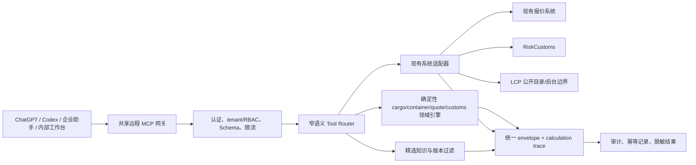
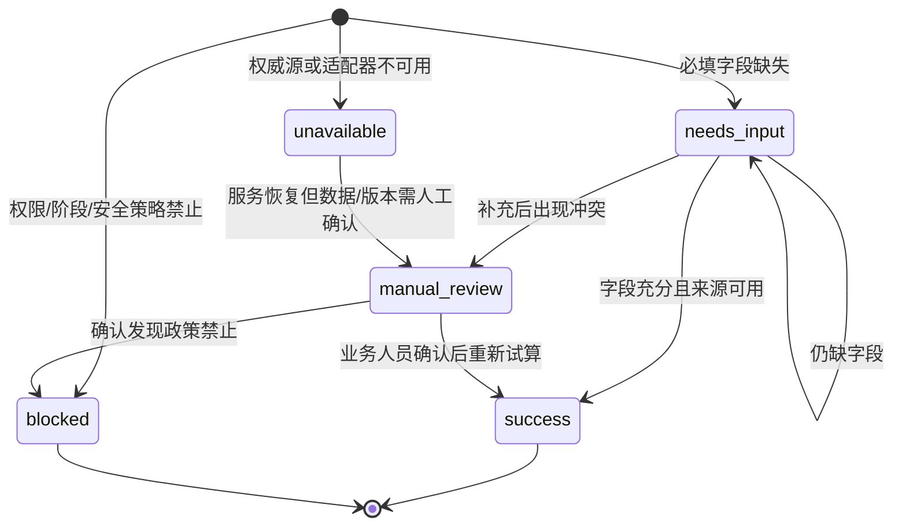

# 跨境物流 MCP 产品实现说明

**日期：** 2026-08-11
**基线版本：** `2026-08-11.v1`
**文档性质：** 可评审的产品与实现边界；不等同于运行时代码设计，也不授权生产接入。

## 1. 目标

本项目为公司内部多人提供一个共享的远程 MCP 网关，使 ChatGPT、Codex、企业助手和内部工作台能够调用同一组跨境物流能力。产品要延伸现有报价、关务、记录和运营流程，形成可追溯的“输入→确定性计算/查询→解释→草稿或人工复核”的闭环，而不是建立第二套报价或关务主系统。

必须达到的目标：

1. AI 负责理解意图、补齐缺失字段、选择工具和解释结果；金额、计费重、装柜容量、税率命中和规则判断由确定性代码完成。
2. 所有工具输入、输出、版本、来源、假设、警告、阻断原因、计算步骤和审计 ID 结构化呈现。
3. 价格、Zone、规则、关税和业务记录继续以现有系统为权威源，MCP 只通过适配器读取、计算、保存现有草稿或创建复核任务。
4. 对关键字段缺失、来源冲突、版本过期、权限不足和服务未就绪失败闭合；不默认、不猜测、不用相似记录替代当前记录。
5. 从第一天支持租户隔离、RBAC、短期凭证、审计、幂等、审批和写后读回。

## 2. 非目标与 Phase 1 禁止项

Phase 1 不做以下事项：

- 对外发送或发布报价、邮件、微信群消息或客户确认；
- 修改价格、Zone、燃油系数、税率、贸易措施或规则文件；
- 形成正式报关归类/税务结论，或代替报关行、CBSA 和客户的最终确认；
- 订舱、提交 SO、向供应商发送请求，或改变订单状态；
- 自动学习并将候选规则上线；
- 通用 `commit_operation`、通用 CRUD、删除/覆盖历史报价和跨租户写入；
- 3D 装箱坐标、重心承诺、实际装柜照片判定或现场装载执行；
- 复制一套价格、Zone、关税或业务主数据到 MCP 自有数据库；
- 通过地图、承运人门户、WPS、聊天或模型知识替代权威计算源。

允许的第一阶段写入只有：保存“现有报价系统的草稿”和创建人工复核任务，且必须经过本说明定义的窄语义、幂等、审批评估和写后读回。

## 3. 先行只读核验的现有系统证据

2026-08-11 在没有修改、没有网络请求、没有生产连接的前提下，使用 `rg --files`、`rg -n` 和只读文件查看确认了以下事实。路径和符号是适配器的证据，不代表跨系统 API 已稳定；未确认的调用方式均标为“待适配验证”。

| 系统 | 实际读到的入口/证据 | 对本项目的结论 |
| --- | --- | --- |
| `AI自动报价模块` | `apps/api/main.py:25-64` 创建 `Canada Final Mile Auto Quote API`，注册报价、AI 报价、认证、人工任务和审计 routes；`apps/api/auth.py:14-92` 定义 `admin/operator/sales/viewer` 角色，并支持 Bearer 与 `X-API-Key`；`packages/quote_engine/engine.py:6-11` 通过匹配和定价函数执行确定性报价。 | 报价 MCP 适配器应调用/复用现有 QuoteEngine 边界，不让模型控制价格公式；角色映射和正式 tenant 关系仍待适配验证。 |
| `AI自动报价模块` 数据与测试 | `apps/api/db/models.py:181-204` 有带唯一约束的 `zone_price_matrix`；`226-296` 有 `quote_audit_logs`、`sales_quote_records`、`manual_quote_tasks`；`tests/quote-engine/test_quote_engine.py` 覆盖精确 FSA、邮编优先、无匹配转人工和有效期；`tests/quote-engine/test_zone_lookup_exact_fsa.py` 覆盖 Zone 查找边界。 | 价格/Zone/报价记录/人工任务是现有系统的权威边界；MCP 只能保存版本引用、草稿和审计关联。 |
| `美国、加拿大关务` | `src/worker/index.ts:8-23` 注册 `/api/query`、`/api/status` 和 `/api/sources`；`src/worker/http/query-route.ts:61-65` 在非 fixtures 且没有 published DB 时返回 `503 data_not_ready`；`status-route.ts:55-71` 暴露 `ready` 和快照原因；`src/shared/contracts/query.ts:182-220` 严格校验 query、来源、`DataStatus` 和测试数据标志。 | `customs.ca.search`/`estimate` 必须绑定 RiskCustoms release/snapshot；`ready=false` 原样映射 `unavailable`/`manual_review`，不能让 AI 补齐。 |
| `美国、加拿大关务` 测试与审计 | `tests/worker/data-readiness.test.ts:8-70` 验证缺快照、release 不匹配、伪造 gate hash 和 malformed timestamp 都使 `ready=false`；`tests/worker/query-audit.test.ts:6-49` 验证审计只保存 operational metadata，不保存 raw query/IP/公司字段；`tools/customs_data/contracts.py:149-217` 拒绝 numeric rate value，要求 decimal string 和 Schema 校验。 | MCP 继承“就绪门禁、来源绑定、无原文审计、税率不使用 float”的安全边界。 |
| `物流LCP服务/canada-logistics-records` | `README.md:9-16` 说明客户页不保存订单/客户资料，公开目录失败时停止参考价自动计算，后台是单管理员私有 JSON；`app/lib/quote-data.ts:124-179` 定义服务目录、币种、费种、版本；`328-339` 定义目录失败时的安全回退；`471-482` 定义试算输入；`admin-server/server.mjs` 和 `tests/admin-server.test.mjs` 覆盖 Origin、CSRF、草稿 revision、发布、成本隔离和 ETag 读回。 | LCP 是公开服务目录/单管理员目录发布边界，不是加拿大尾程 Zone/价格权威；MCP 不把公开起价当最终报价。 |

未读取或输出真实密钥、密码、API key、SSH、生产配置和客户/报价/税务全文；本基线示例全部使用假值、fixture 或 `opaque_reference`。

## 4. 用户与角色

| 角色 | 主要任务 | Phase 1 可用能力 | 明确不能做 |
| --- | --- | --- | --- |
| 销售 Sales | 收集询价、补字段、解释结果、保存草稿 | `knowledge.search_curated`、货物/报价试算、`quote.save_draft`（草稿范围）、创建复核任务 | 发送/发布报价、改价、改 Zone、越权查看客户全文 |
| 运营 Operator | 核对货物、Zone、供应商确认、装柜摘要和任务 | 查询/试算、状态检查、复核任务读回 | 代替销售发送客户内容；写价格/Zone；提交订舱 |
| 关务审核 Customs Reviewer | 审核 HS 候选、税率、SIMA/措施和资料缺口 | RiskCustoms 查询/估算、创建复核任务 | 通过 MCP 形成正式报关结论或改官方数据 |
| 财务 Finance | 检查币种、计费口径、税费估算和结算风险 | 只读结果、来源、计算 trace、复核任务 | 发布客户价、覆盖历史报价或默许 CAD/USD 1:1 |
| 管理员 Admin | 管理租户、客户端、权限、审计和审批策略 | 管理平台配置（实现阶段分配）、查看审计 | 通过模型绕过审批；读取密钥全文 |
| 查看者 Viewer | 查看已授权的结构化结果 | 只读搜索/状态/结果 | 写工具、查看超出租户范围的原文 |
| MCP/后台服务 Service | 代工具执行确定性计算和适配 | 最小权限、服务端注入上下文 | 自行扩大权限、代理 token、伪造 actor |

AI 客户端不是业务角色。客户端发来的 actor、tenant、审批和版本只能作为不可信输入；网关必须用已认证的短期凭证和服务端上下文重新绑定。

## 5. 核心场景

### 5.1 加拿大尾程试算与草稿

销售或 AI 收到自然语言询价后：

1. AI 抽取地址类型、邮编、城市、省份、货物行、包装、件数、重量、服务选项；完整地址和原话用 opaque ref。
2. `cargo.calculate` 计算体积、体积重、实际重、分泡和计费重；缺证据先 `needs_input`。
3. `quote.canada_final_mile.calculate` 通过现有报价系统/规则适配器查唯一邮编/FSA/Zone 和价格矩阵；不可靠或无价则 `manual_review`。
4. 返回不可发送的 `QuoteResult`，带规则/价格数据版本、金额币种、附加费来源和 trace。
5. 销售可用 `quote.save_draft` 先 preview，再在权限/策略允许时保存到现有报价系统草稿；读回 record/version 后才报告 success。
6. 对歧义、供应商确认或风险使用 `review.create_task`，把原始内容留在 opaque ref 中。

### 5.2 货物与分泡

每个 CargoLine 必须说明数量单位、尺寸单位和重量证据模式。`unit_weight`（每单位重量）、`piece_weights`（逐件重量）、`line_total_weight`（整行重量）互斥；不能把整行重量当每件重量，也不能在证据不足时按件数摊派。渠道除数和分泡比例必须来自带版本的渠道规则，不是 MCP 全局常数。

输出同时列出实际重、体积重、泡重、客户计费重、供应商计费重和毛利基础重（如业务规则允许），以便销售、运营和财务使用同一事实。

### 5.3 装柜摘要

`container.plan_summary` 同时接受柜型物理容量、运营目标方数、最大载重和 CargoMetrics，输出总方数/重量、装载率、剩余方数、超方/超重和摘要装载顺序。敏感货靠柜头、报关件靠柜尾、大客户优先、其他货物 FIFO 作为可追踪约束，不承诺 3D 坐标或现场可装。

### 5.4 加拿大关务查询与估算

`customs.ca.search` 先返回候选 HS 和缺失问题，再由人员补充材质、用途、原产国等属性。`customs.ca.estimate` 只能基于已选候选、进口日期、货值、原产地待遇和 RiskCustoms 已发布 release 形成估算，分别列出关税、附加税、SIMA 风险、GST 等项目。未确认归类、措施适用范围或数据 `ready=false` 时，不返回正式结论。

### 5.5 精选知识与数据状态

`knowledge.search_curated` 只检索当前精选 SOP/规则说明/模板/异常案例，历史归档不进入运行上下文。`system.get_data_status` 对价格、关务、知识等系统返回 ready、版本和原因；状态本身 success 不等于依赖系统可用。

## 6. 系统边界与总体架构



边界规则：

- 网关是访问控制和契约入口，不是业务数据权威库。
- 领域引擎只做版本化确定性计算，不能绕过适配器取另一份价格/税率。
- 适配器负责翻译已有系统契约、source refs、错误和读回证据；真实 endpoint、字段映射和认证方式未核实前不得写死。
- 统一 envelope 让客户端理解状态、来源和风险，但不把 `data` 变成可发送/可报关的授权。
- 可保存的仅是现有系统草稿或复核任务的引用、版本和必要的脱敏摘要；MCP 不建立第二套 quote/customs master。

## 7. 数据权威矩阵

完整矩阵见 [`docs/contracts/authority-matrix.md`](../contracts/authority-matrix.md)。核心原则如下：

| 事实 | 权威 | MCP 产物 |
| --- | --- | --- |
| Zone/价格/附加费 | 现有报价系统及其版本化规则 | 计算结果、source refs、trace、不可发送 QuoteResult |
| HS/税率/措施 | RiskCustoms published snapshot 与官方 release | 候选/估算、release refs、ready 状态 |
| 报价记录/草稿/人工任务 | 现有报价系统记录和任务表 | 草稿/任务写操作的 readback evidence |
| 公开服务参考目录 | LCP 已发布脱敏 catalog | 参考服务项；不可替代尾程最终价 |
| 货物事实 | 用户/业务输入及已有记录 | 结构化派生指标，不改变事实源 |
| 柜型物理/运营容量 | 运营批准配置；基线尚未核验统一来源 | 理论/操作双口径摘要；无版本则 manual_review |

所有结果必须绑定 `version`、`source_refs` 和 `retrieved_at`；“最新”“默认”“相似”都不是权威版本。

## 8. 结构化数据模型

共享模型见 [`docs/contracts/schemas/`](../contracts/schemas/)：

- `Money`：`amount` 为 decimal string，`currency` 为 ISO 4217 三位字母；不使用 float。
- `Measurement`：数值为 decimal string，必须有明确单位；重量用 kg、长度用 mm/cm/m、体积用 cbm/m3、数量用 piece/pallet 等。
- `SourceRef`：来源类型、系统、定位、版本、读取时间、权威级别和可选 hash。
- `CalculationStep`：操作、输入、结果、来源 ID 和 rounding，能回放每个金额/重量/容量派生。
- `CargoLine`：一行货物事实和重量证据，三种重量字段互斥。
- `CargoMetrics`：行数、总数量、总体积、实际重、体积重和证据状态。
- `ChargeableWeight`：实际重、体积重、泡重、客户/供应商计费重、比例、方法和规则版本。
- `QuoteResult`：报价 ID、行项目、金额、币种、规则/数据版本、有效期和强制 `sendable=false`。
- `CustomsAssessment`：HS 候选/状态、计税价值、税率表达式、估算金额、release 版本和 broker 确认标记。
- `ContainerPlan`：物理容量、运营目标、最大载重、汇总装载率、超方/超重和摘要顺序，强制 `theoretical_only=true`。

敏感原始内容通过 `OpaqueReference` 传递；日志只留 opaque ref 的 ID/hash/生命周期，不落客户地址、报价明细、税务材料全文和凭证。

## 9. 状态机

### 9.1 请求与计算状态

包络的五种状态是接口状态，不与业务记录状态混用：



`success` 只表示当前工具结果可用，不表示可以对外发送、发布、正式报关或提交订舱。

### 9.2 草稿/复核写流程

```text
preview 请求
  → 校验 tenant/actor/权限/幂等键
  → 生成 preview_ref + request hash（不写外部记录）
  → 审批策略评估
  → commit 请求引用同一 preview_ref
  → 写入现有草稿或人工任务
  → 用原记录 ID/version 写后读回
  → verified=true 才返回 success；否则 manual_review/unavailable
```

同一租户、工具、`idempotency_key` 和请求 hash 的重试必须返回同一结果；不同 hash 复用同一键必须 `blocked` 或 `manual_review`，不能覆盖原操作。

## 10. 权限矩阵

| 能力 | Sales | Operator | Customs Reviewer | Finance | Admin | Viewer |
| --- | ---: | ---: | ---: | ---: | ---: | ---: |
| `knowledge.search_curated` | ✓ | ✓ | ✓ | ✓ | ✓ | ✓ |
| `system.get_data_status` | ✓ | ✓ | ✓ | ✓ | ✓ | ✓ |
| `cargo.calculate` / `quote...calculate` | ✓ | ✓ | 只读 | ✓ | ✓ | 视租户策略 |
| `container.plan_summary` | 只读 | ✓ | 只读 | ✓ | ✓ | 视租户策略 |
| `customs.ca.search` | 只读 | 只读 | ✓ | 只读 | ✓ | 视租户策略 |
| `customs.ca.estimate` | 只读 | 只读 | ✓ | ✓ | ✓ | 只读 |
| `quote.save_draft` | ✓ | 需明确授权 | — | — | ✓ | — |
| `review.create_task` | ✓ | ✓ | ✓ | ✓ | ✓ | — |
| 发送/发布报价 | **禁止** | **禁止** | **禁止** | **禁止** | **Phase 1 禁止** | **禁止** |
| 改价格/Zone/税率/规则 | **禁止** | **禁止** | **禁止** | **禁止** | **Phase 1 禁止** | **禁止** |
| 正式报关/订舱/SO | **禁止** | **禁止** | **禁止** | **禁止** | **Phase 1 禁止** | **禁止** |

最终权限由 tenant、actor、客户端、工具和资源作用域共同决定；表中的 ✓ 不绕过字段级脱敏和审批策略。

## 11. 审计、幂等与审批

### 审计

每次请求生成 `audit_id`，至少关联：`tenant_id`、`actor_id`、`client_id`、`request_id`、tool、schema/rule/data version、status、source IDs、reason codes、耗时、幂等结果和 readback 状态。原始输入、客户地址、价格明细、税务材料和凭证使用 opaque ref，不写入普通日志。

### 幂等

写工具要求客户端提供不含敏感内容的 `idempotency_key`；服务端按 tenant+tool+key 保存请求 hash、preview ref、目标 record ID、结果 status 和过期时间。重复相同请求返回已有结果；同键不同请求不执行第二次写。

### 预览与审批

- `preview` 不写现有系统，只产生要写入字段的脱敏摘要、版本、请求 hash 和 `preview_ref`。
- `commit` 必须引用相同 `preview_ref`；涉及外部可见或高风险动作的审批即使本阶段被禁止，也必须在策略结果中记录 `blocked`。
- `quote.save_draft` 只能保存不可发送草稿；`review.create_task` 只能创建待处理任务。
- 写后读回必须核对 tenant、record ID、版本、关键状态和引用字段；只收到 HTTP/业务 code 不能作为成功证据。

## 12. 异常与降级

| 异常 | 返回 | 处理 |
| --- | --- | --- |
| 缺完整邮编/地址类型/重量/原产国 | `needs_input` | 列出字段路径和问题，等待销售/用户补充 |
| 邮编/Zone/规则/供应商价格冲突 | `manual_review` | 创建复核任务；不外推、不猜价 |
| RiskCustoms `ready=false` | `unavailable` 或 `manual_review` | 原样暴露 ready/reasons/release；不把 fixture 或 AI 候选变可用 |
| 适配器超时、源版本缺失、快照校验失败 | `unavailable` | 标明系统/版本，不回退非权威数据 |
| 无权限、跨租户、试图 Phase 1 禁止动作 | `blocked` | 不调用下游写接口，审计 reason code |
| Schema/单位/金额类型错误 | `needs_input` 或 `blocked` | 不产生金额；记录字段级验证结果 |
| 写后读回缺失/版本不一致 | `manual_review` | 保留脱敏 opaque response ref，人工核对，不重试未知写 |
| 装载超物理容量/运营目标或载重 | `manual_review` | 输出理论结果和超限项，不承诺可操作装柜 |

不允许的降级包括：默认商业地址、默认 Zone、旧价格表无提示、CAD/USD 1:1、按相似客户推断费用、把非权威搜索结果写入规则、把“不确定”改成“成功”。

## 13. 部署与多客户端接入

### 共享远程网关

生产形态是一个共享远程 MCP 网关，建议通过 HTTPS 访问，前置企业身份/OAuth 或短期 JWT、租户隔离、工具级 RBAC、限流、审计和 WAF/SSRF 防护。具体云、域名、证书、OAuth provider、密钥轮换和部署拓扑尚未核验，进入 06 集成计划，不在本基线虚构。

### 客户端

- ChatGPT：配置远程 MCP endpoint，使用企业身份和短期凭证；只显示工具声明的结构化结果。
- Codex：使用相同远程 endpoint 和项目/用户级配置；开发期可使用本地 fixture harness，但不能形成第二个权威源。
- 企业助手/内部工作台：调用同一网关或共享 client SDK；不能直接绕过 MCP 访问现有数据库。

客户端配置示例只能使用 `https://mcp.example.invalid/mcp`、`tenant_demo`、`client_demo` 等假值，不得写入真实 token。所有客户端应处理五种状态，尤其不能把 `manual_review`/`unavailable` 渲染成价格可用。

### 部署边界

MCP 网关、适配器和确定性引擎可部署在同一应用进程；基线不引入事件总线、微服务拆分、向量数据库或新的业务主库。只有在请求量、隔离或合规证明必要时，才提出单独的基础设施 RFC。

## 14. 阶段路线图

| 阶段 | 范围 | 退出条件 |
| --- | --- | --- |
| P0 基线 | 文档、Schema、示例、权限/状态/权威矩阵和计划 | 契约校验通过；共享字段稳定；无运行代码/生产写入 |
| P1 货物/装柜 | `cargo.calculate`、`container.plan_summary`，纯确定性函数 | 单元测试覆盖单位、重量证据、分泡、理论/操作容量和失败闭合 |
| P2 平台/网关 | 远程 MCP、envelope、RBAC、tenant、审计、幂等 | 五状态端到端，短期凭证和敏感日志测试通过 |
| P3 现有系统适配 | 精选知识、状态、加拿大尾程、RiskCustoms、草稿/复核任务 | fixture contract + 沙盒适配器 + 写后读回；未核验 endpoint 不上线 |
| P4 集成发布 | 多客户端、部署、监控、回滚、e2e | 06 计划的发布门禁、公开 smoke、回滚和审计记录完整 |
| P5 后续评审 | 仅在业务批准后评估发送、订舱、更多国家、3D | 另立 RFC/产品评审；不沿用 Phase 1 隐式权限 |

## 15. 验收标准

### 契约与结构

1. 所有工具使用 `2026-08-11.v1` 或显式兼容版本，包络必含 11 个顶层字段，状态只能是五种枚举。
2. Schema 为 Draft 2020-12，object 默认 `additionalProperties=false`；金额无 float，单位不省略，核心模型版本字段不省略。
3. 共享示例覆盖 success、needs_input、manual_review、unavailable、blocked，并能被本地 JSON/Schema 校验工具读取。

### 业务正确性

4. 同一输入、同一规则/数据版本得到同一结果；旧报价固定绑定旧版本，新规则上线不改历史回放。
5. `unit_weight`、`piece_weights`、`line_total_weight` 混用、缺重量证据、FSA/Zone 冲突、价格表无覆盖、地址类型不明时不会输出可信报价。
6. 装柜结果明确区分物理容量和运营目标，理论结果不能宣称 3D/实际可装。
7. RiskCustoms `ready=false`、快照错配或 test data 不会进入 success 估算；候选 HS 不会变成正式归类。

### 安全与操作

8. 多租户、RBAC、短期凭证、限流、SSRF/输入校验、脱敏审计和工具级权限都有测试证据。
9. 写工具使用 preview→approval policy→commit→readback，重复幂等请求不重复写；写后读回缺失为 manual_review/unavailable。
10. Phase 1 不能发送/发布报价、改价/Zone、正式报关、订舱/SO、上线学习规则或执行通用写操作。
11. AI 关闭后，Cargo、Container 和报价/关务适配器的确定性核心可以通过普通 API/函数测试独立运行。

## 16. 风险与待确认项

以下项目不是本基线的隐式假设，必须在相应计划中形成证据或 RFC：

- **现有系统跨租户边界：** 已核验角色和 API key，但尚未核验正式 tenant 字段、行级隔离和可供 MCP 调用的稳定 API；适配器必须先做 contract fixture 和权限负测试。
- **报价系统写端点：** 已读到草稿/销售记录/人工任务模型和 routes，但 `quote.save_draft` 的稳定 API、幂等语义和写后读字段待适配验证；未确认前只能 fixture/preview。
- **RiskCustoms 估算接口：** 已核验查询、来源、快照和 ready gate，尚未确认可供 MCP 调用的估算端点和正式数据权限；`customs.ca.estimate` 必须保持估算/人工确认边界。
- **LCP 与报价权威的关系：** LCP 是公开服务目录和单管理员发布边界，不应默认承担尾程 Zone 价格；最终映射和公开 catalog revision 读取方式待适配验证。
- **运营容量参数：** 40HQ/45HQ 等物理容量和可操作目标尚未在现有目录中核验到统一权威表；没有批准版本时只能 manual_review。
- **认证与部署：** 共享远程网关的域名、OAuth/JWT issuer、证书、短期 token TTL、网络白名单、WAF、密钥轮换、监控和回滚责任人待 06 确认。
- **审批责任：** 销售草稿是否需要销售主管审批、财务是否只读、关务估算何时强制 broker review，需要业务负责人写入 approval policy；本基线默认高风险动作均不允许。
- **货物证据兼容：** 既有渠道的实际重、体积重和分泡口径尚未逐渠道完成映射；没有渠道规则版本不得使用全局除数或默认分泡。
- **数据保留：** audit、opaque ref、readback evidence 的保留期限和删除流程待合规确认；默认最小化、短期、不可重放原文。

## 17. 实现入口

后续任务按以下顺序执行：

1. 03 先实现货物/分泡确定性模型和测试；
2. 04 在 CargoMetrics 契约上实现装柜摘要；
3. 02 实现平台 envelope、租户/RBAC、审计、幂等和远程工具注册；
4. 05 在不改变共享契约的前提下接入现有系统 fixture/沙盒适配器；
5. 06 通过 e2e、部署、安全发布和多客户端配置把闭环跑通。

每个任务的具体文件、测试、命令和小步提交见 [`docs/superpowers/plans/`](../superpowers/plans/)。
