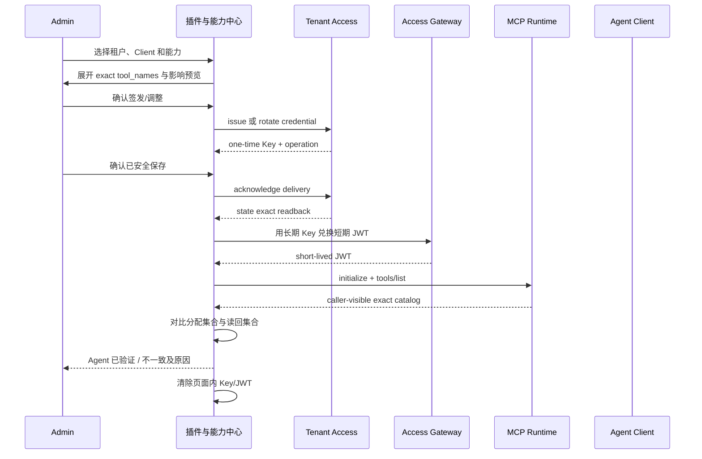

# 插件与能力中心 PRD

> 让企业管理员把正确的物流能力安全交付给正确的 Agent，并用服务端读回证明它已经按预期生效。

| 文档属性 | 内容 |
| --- | --- |
| 文档状态 | Product direction confirmed; implementation planning pending |
| 版本 | `2026-08-31.v1.1-draft` |
| 日期 | 2026-08-31 |
| 产品名称 | 插件与能力中心 |
| 产品定位 | 跨境物流 Agent 能力运营平台 |
| 设计基线 | `codex/tenant-api-key-control` / `41d9db3215fff76508edca9380ce82db465f49bc` |
| 首批范围 | P0 统一能力视图 + P1 插件化租户授权与 Agent 读回 + P1.5 受控插件配置 |
| 产品确认 | 用户于 2026-08-31 确认总体方向，并确认将受控插件配置纳入首批范围 |
| 不授权事项 | 本文不授权生产发布、任意插件安装、外部业务写入或公共工具合同变更 |

## 0. 产品决策摘要

### 0.1 核心决策

第一版不做插件市场，也不把页面设计成环境变量和技术开关的集合。产品统一入口命名为
**插件与能力中心**，用户围绕业务能力完成发现、判断、授权、接入、验证、监控和撤销；底层
Module Runtime、Tool Catalog、Adapter、Tenant Access、Access Gateway 和发布控制面继续保持
独立权威和安全边界。

用户已确认第一批必须同时包含受控插件配置。该能力不是任意设置页：每个可编辑字段必须来自
版本化、closed 的 `PluginConfigSpec`，配置必须经过 validation、preview、不同管理员审批、
publish、受控重启（如需要）和 exact readback。没有 ConfigSpec 的插件不显示可编辑表单。

一个页面并不意味着一个服务、一个数据库或一个通用写接口。统一发生在产品模型、导航、
聚合只读视图和操作编排层，不复制报价、关务、客户、订单或凭证权威数据。

### 0.2 首版要解决的问题

企业管理员应当无需命令行完成以下闭环：

```text
发现能力
  → 判断是否可用及为什么
  → 查看并调整获准的插件配置
  → 分配给租户和调用方
  → 签发或轮换凭证
  → 生成无密钥 Agent 配置
  → 真实连接 MCP
  → tools/list 精确读回
  → 查看调用状态和异常
  → 调整权限或吊销
```

### 0.3 首版不解决的问题

- 不在线下载、上传或执行任意插件源码；
- 不实现远程插件市场或生产 hot-plug；
- 不把报价、Zone、税率、关务规则或客户记录变成插件设置；
- 不允许浏览器提交任意 URL、路径、DSN、命令或 secret；
- 不开放正式报价、关务、Freightcom、发送、订舱、报关或资金写操作；
- 不把本地、fixture、HTTP 200 或绿色 UI 状态当成生产资格。

## 1. 当前事实与前提

### 1.1 当前已确认能力

1. Module Runtime v0 在进程启动时挂载静态可信模块，支持 manifest 校验、命名 capability、
   工具合同、重复名称拒绝和 registration lease 逆序释放。
2. Agent 标准注册表当前登记四个模块：
   - `cargo`：T0，导出 `cargo.calculate`；
   - `container`：T0，导出 `container.plan_summary`；
   - `agent-access`：T0，导出 `system.agent_context.get`；
   - `freightcom-ltl`：T1，导出测试预览工具，固定人工复核且不具生产资格。
3. T0 生产候选 Profile 只允许前三个模块和三个精确工具。
4. Admin 控制面已有模块 inventory、登记、preview、四眼 approval、publish、exact readback、
   reconcile 和 rollback 的本地受控模型与页面资产。
5. Access Console 已有租户、Client、长期 Key、三个 T0 工具精确授权、一次性显示、交付确认、
   轮换、吊销和操作读回。
6. 已确认交付的 Key 不能原地改权限；“调整功能”必须吊销旧 Key、签发新 Key并重新确认交付。
7. Agent 引导式插件构建已有书面设计，但 workflow、Schema、profile、模板和端到端运行实现尚未完成。

### 1.2 当前产品缺口

- Admin 与 Access Console 是两套独立入口，用户必须自己理解两套状态；
- 模块、工具、适配器、租户授权、Agent 读回和生产资格没有统一产品对象；
- Module Manifest 当前没有配置 Schema、配置作用域、配置 revision 或 UI Schema；
- 页面尚不能解释“已授权但不可用”发生在哪一层；
- 没有从 Client 选择到 MCP `tools/list` 精确读回的页面内完整自检；
- RiskCustoms、AI 报价等适配器候选容易被非技术用户误认为“已安装插件”；
- 现有页面强调技术对象，尚未围绕企业管理员的业务任务组织。

### 1.3 本 PRD 的工作假设

| 假设 | 产品建议 | 确认状态 |
| --- | --- | --- |
| 统一前端主壳 | 以新版 Access Console 为主壳，迁入 Admin 模块中心能力 | 待产品确认 |
| 首批可分配能力 | 只包含三个服务端 T0 exact tools | 已有合同约束 |
| Freightcom 展示方式 | 显示为“测试能力”，不可分配到正式生产租户 | 待产品确认 |
| Quote/RiskCustoms 展示方式 | 显示为“接入候选”，不能标记为已安装 | 待产品确认 |
| 旧 Admin 入口 | 先兼容保留，功能等价后再跳转到统一入口 | 待产品确认 |
| 第一批实现 | P0 + P1 + P1.5 受控插件配置；不同时实施构建器 | 用户已确认 |
| 首批配置作用域 | 只做 deployment 级受控配置；tenant 级仅保留 exact tool entitlement | 用户已确认方向 |
| 配置写入协议 | validate → preview → 不同管理员 approval → publish → restart/readback | 用户已确认方向 |

## 2. 产品愿景、目标与原则

### 2.1 产品愿景

成为企业管理跨境物流 Agent 能力的单一操作入口：每项能力的来源、权限、可用性、生产资格、
变更和实际读回都有独立证据，任何失败都能定位到下一步动作。

### 2.2 产品目标

1. **看得懂：** 用业务语言解释能力、输入、输出、限制和责任边界。
2. **分得准：** 按 tenant、Client 和 exact tool 分配最小权限。
3. **验得真：** 只有 MCP initialize 与 `tools/list` 精确读回完成，才显示 Agent 已验证。
4. **查得清：** 区分镜像、挂载、激活、适配、授权、Agent 读回和生产资格。
5. **收得回：** 权限调整、Key 轮换、吊销和模块回滚都有状态、operation 和 readback。
6. **配得稳：** 只允许调整 ConfigSpec 明确声明的 deployment 参数，并经过校验、预览、
   四眼审批、受控应用和 exact readback。
7. **扩得稳：** 后续新增能力先经过 Agent 诊断、合同、测试和发布候选门禁。

### 2.3 产品原则

- **业务能力优先于技术实现。** 首页说“货物与计费重计算”，详情才显示 `cargo.calculate`。
- **一个状态不能代替一条证据链。** 不显示含义不明的“插件正常”。
- **服务端决定动作。** 页面只服从 `allowed_actions`，不自行推断可点击按钮。
- **写入后必须读回。** 不做乐观成功，不把按钮点击或 HTTP 2xx 当成业务完成。
- **默认最小权限。** 插件选择最终展开为 exact `tool_names`，不恢复 broad scope。
- **缺证据保持非成功。** `ready=false`、测试数据、版本冲突或生产门禁缺失不能变绿。
- **统一体验，不统一权威。** 聚合只读事实，不复制业务主数据或 secret。

## 3. 用户、场景与 Jobs to Be Done

### 3.1 目标用户

| 角色 | 核心任务 | 首版权限边界 | 成功标准 |
| --- | --- | --- | --- |
| Owner | 判断企业是否可安全使用，查看资格和重大风险 | 全局只读；高风险动作另行审批 | 能区分本地候选与生产可用 |
| Admin | 创建租户、分配能力、签发凭证、接入 Agent | tenant/client/key 管理；受控模块操作 | 无命令行完成一次完整接入 |
| Operator | 诊断调用失败、定位依赖和人工复核 | 运行与异常只读；有限 reconcile 另行授权 | 能从异常直接获得处理动作 |
| Auditor | 追踪权限、凭证、发布和读回证据 | 全局脱敏只读 | 能回答谁在何时改变了什么 |
| Developer | 复用、配置或提出新能力候选 | 首版只进入 Agent 构建向导 | 不重复造已有能力，不绕过合同 |

### 3.2 核心 JTBD

#### JTBD-A：安全开通能力

> 当我要给加拿大运营团队的 Codex 开通货物计算和装柜摘要时，我希望按业务能力选择并看到
> 最终精确工具清单，以便确保报价、关务和 Freightcom 没有被一并开放。

#### JTBD-B：证明 Agent 已接通

> 当我完成 Key 交付和 Agent 配置后，我希望页面实际完成 MCP initialize 和 `tools/list` 读回，
> 以便确认配置不是只保存在控制台里。

#### JTBD-C：解释不可用

> 当某项能力调用失败时，我希望知道失败发生在授权、模块激活、上游 readiness 还是生产门禁，
> 并看到可以执行的下一步，而不是只看到“系统异常”。

#### JTBD-D：受控调整与撤销

> 当团队职责变化时，我希望调整能力后旧 Key 立即失效，并能够读回新 Key 的精确能力目录。

#### JTBD-E：提出新能力

> 当我描述一个新的物流自动化想法时，我希望 Agent 先判断能否复用、组合或配置已有能力，
> 只有确实缺失时才形成新模块候选，发布另走门禁。

## 4. 产品对象与统一模型

### 4.1 用户可见术语

| 用户术语 | 含义 | 内部映射 |
| --- | --- | --- |
| 能力 | 用户要完成的一项业务工作 | 一个 Module、Tool 组合或受控适配候选 |
| 插件 | 已按 Module Runtime 边界交付的能力包 | Business Module |
| 功能 | Agent 可直接调用的最小动作 | canonical MCP Tool |
| 外部连接 | 插件访问权威系统的受控通道 | Adapter + Capability Port |
| 分配 | 让某个租户/Client 获得精确功能 | exact tool entitlement |
| 发布 | 改变已内置模块的激活策略 | preview → approval → publish → readback |
| Agent 验证 | 真实客户端读回可见工具 | MCP initialize + tools/list |
| 生产资格 | 独立的部署、身份、数据和恢复证据 | production evidence，不由 UI 推断 |

### 4.2 能力类型

| 类型 | 示例 | 页面标签 | 首版允许动作 |
| --- | --- | --- | --- |
| 内置确定性插件 | Cargo、Container | 本地计算 / T0 | 查看、分配、Agent 验证 |
| 系统插件 | Agent Access | 系统能力 / T0 | 查看、分配、Agent 验证 |
| 测试插件 | Freightcom LTL | 测试 / T1 / 人工复核 | 查看，不进入正式租户分配 |
| 接入候选 | RiskCustoms、AI 报价 | 待适配验证 | 查看阻断和所需证据 |
| 未注册能力 | PDF/文档 | 未注册 | 查看缺失合同，不提供开关 |

### 4.3 Capability Aggregate

统一页面使用一个只读聚合模型，不新增业务权威：

```text
Capability
├── identity             名称、说明、类型、风险等级、owner
├── runtime              镜像、挂载、版本、module/tool catalog
├── release              登记、preview、approval、activation、readback
├── adapter              合同、环境、readiness、affected tools、blocker
├── entitlement          可分配工具、租户/Client 分配摘要
├── agent_verification   initialize、tools/list、精确集合对比
├── qualification        local / fixture / staging / production evidence
├── operations           五状态、延迟、异常和最近变更
└── allowed_actions      服务端允许的下一步
```

能力聚合只保存/投影控制元数据、引用和摘要。报价金额、Zone、税率、客户正文、完整凭证和上游
响应原文不进入该模型。

## 5. 范围与优先级

### 5.1 P0：统一能力视图

必须交付：

- 统一控制台主壳和全局导航；
- 插件与能力目录；
- 多维状态和能力航路账本；
- 能力详情的概览、功能、授权、发布、运维和证据视图；
- Module/Tool/Adapter/Tenant Access/Operations 的只读聚合；
- Quote、RiskCustoms、Freightcom 的真实资格标签；
- 旧 Admin 入口的兼容策略；
- 桌面、平板、手机和无障碍行为。

P0 不增加通用写接口，不增加配置数据库，不改变业务工具合同。

### 5.2 P1：插件化租户授权与 Agent 自检

必须交付：

- 按插件选择、按 exact tool 预览的授权方式；
- tenant、Client、Key 与能力之间的关系视图；
- active Key 调整功能继续执行原子轮换；
- 一次性 Key 安全交付流程；
- 无密钥 Agent 配置生成；
- 页面内短期 JWT 兑换、MCP initialize、`tools/list` 精确读回和内存清除；
- 旧 Key 吊销后的负向验证；
- 全流程 operation/readback 时间线。

### 5.3 P1.5：Schema 驱动的受控插件配置

P1.5 属于第一批，但进入实现前必须先通过独立 RFC。必须交付：

- `PluginConfigSpec` 与 closed Draft 2020-12 Schema；
- 仅 deployment 级的非敏感配置；
- 配置 revision、canonical digest 和变更 diff；
- draft validation、preview、四眼审批、publish、controlled restart 和 exact readback；
- secret slot 只绑定 Secret Manager opaque reference，不读取或回显 secret；
- egress 只允许选择部署端预批准 profile，不接受原始 URL；
- 字段级上下限、枚举、依赖条件和 restart policy；
- 配置回滚和 N/N-1 兼容声明。

首个 golden slice 建议使用 `freightcom-ltl` 测试插件，在 fixture/staging 中验证 timeout、轮询参数、
预批准测试 egress profile 和测试 secret slot 的完整流程；它仍固定人工复核、不可分配给正式生产
租户，也不能因此获得生产资格。Cargo、Container 和 Agent Access 没有批准的运行参数时，设置页
必须显示“本插件没有可调整的运行参数”，不得虚构开关。

P1.5 不允许任意 URL、任意字段、业务规则、secret 明文、生产模式开关或 tenant 级运行参数。

### 5.4 P2：Agent 插件构建向导

- 实现 `plugin-builder` profile、workflow、diagnosis/build-report Schema；
- 先诊断 `reuse_existing|configure_client|compose_existing|new_module_candidate|...`；
- 生成受控模板、fake tests 和 release candidate；
- T3 只允许设计和模拟，不执行真实动作；
- `released` 只能由独立发布流程写入。

### 5.5 P3：制品与规模化平台

签名制品、SBOM、attestation、quarantine、generation router、T1–T3 隔离运行、drain、dispose、
灰度和自动回滚属于后续平台项目，不与首批 P0/P1/P1.5 合并实施。

## 6. 核心用户流程

### 6.1 能力开通与 Agent 验证



### 6.2 模块激活变更

```text
选择已内置模块
  → 只修改页面草稿
  → 生成 base revision + exact module refs 的 preview
  → 不同 actor 审批
  → publish
  → runtime exact readback
  → 三态同时闭合后显示已读回
```

模块激活和租户授权是两条不同链路。已授权不代表模块已激活；模块已激活也不代表某个租户有权限。

### 6.3 不可用诊断

```text
调用异常
  → 是否已分配 exact tool？
  → 模块是否在镜像且已挂载？
  → activation policy 是否已读回？
  → adapter/upstream 是否 ready？
  → 当前环境是否有生产资格？
  → Agent tools/list 是否与分配一致？
  → 输出唯一责任层、reason 和下一步
```

### 6.4 受控配置发布与读回

```text
读取当前 exact config revision/digest
  → 仅按 ConfigSpec 创建草稿
  → 服务端校验字段、范围、secret slot 与 egress profile
  → 生成不可变 preview 和变更 digest
  → 不同管理员审批
  → publish 新 config revision
  → 按 restart policy 应用或受控重启
  → 精确读回 config revision/digest/module generation
  → 一致则完成；未知或不一致则 manual_review/blocked/unavailable
```

浏览器草稿、HTTP 成功或 approval 都不是配置生效证据。只有运行时 exact readback 闭合后，
页面才显示“配置已读回”。

## 7. 信息架构

### 7.1 一级导航

| 导航 | 用户问题 | 核心内容 |
| --- | --- | --- |
| 总览 | 今天有什么需要处理？ | 资格、能力状态、接入漏斗、五状态、最近异常 |
| 插件与能力 | 我们有哪些能力，能否使用？ | 能力目录、详情、设置、租户分配、证据 |
| 租户与 Agent | 谁能使用什么？ | tenant、Client、Key、配置、自检、轮换/吊销 |
| 审批与发布 | 哪些变更正在等待？ | 权限与配置的 preview、approval、publish、readback、rollback |
| 运行与审计 | 发生了什么？ | 调用、异常、操作、凭证、发布和审计时间线 |
| 构建新能力 | 现有能力不够怎么办？ | Agent 诊断与 release candidate，P2 开放 |

### 7.2 旧入口兼容

- `/access-console/` 作为统一主入口候选；
- `/admin/` 在 P0 保持可用，不删除现有模块控制能力；
- P0 达成功能等价后，`/admin/` 可显示迁移提示并导向 `/access-console/#capabilities`；
- 任何跳转不得把 token 放入 URL，也不得跨页面持久化页面内身份；
- 后端 `/admin/api/v1/**` 路径是否保留由实现 RFC 决定，产品统一不要求 API 改名。

## 8. UI 重设计方向

### 8.1 设计命题

- **具体主体：** 跨境物流 Agent 能力运营；
- **核心受众：** 企业 Admin 与 Operator；
- **页面唯一任务：** 安全交付一项能力并证明生效；
- **视觉隐喻：** 港口控制塔、航道、舱单、放行章和查验状态；
- **视觉风险选择：** 用贯穿详情页的“能力航路账本”替代常见 SaaS 卡片墙。

现有 Access Console 已建立港口控制塔辨识度，但长滚动结构更像展示页；旧 Admin 信息密度高但
入口分散。重设计保留港口语言和现有配色，把页面改为持续操作型 master-detail 应用。

### 8.2 设计自检与修正

初始方案如果只是“左侧导航 + 一排指标 + 圆角卡片网格”，可以套用到任何云后台，不足以表达
物流产品。修正后的结构使用：

- 舱单式能力目录行，而不是纯卡片墙；
- 真实顺序的航路账本，而不是装饰性 `01/02/03`；
- 放行章式状态印记，而不是所有信息都做 pill；
- 工具、租户、Client 的关系矩阵，而不是重复下拉框；
- 证据抽屉，显示 reason、readback 和下一步，不把技术引用铺满主界面。

### 8.3 颜色 Token

| Token 名称 | Hex | 用途 |
| --- | --- | --- |
| Harbor Ink / 港湾墨 | `#0B222B` | 主导航、标题、关键结构线 |
| Channel Blue / 航道蓝 | `#17556B` | 链路、选中态、信息状态 |
| Safety Orange / 安全橙 | `#E9672B` | 阻断、高风险动作、关键提醒 |
| Release Green / 放行绿 | `#2D7A62` | 仅用于有 readback 证据的完成态 |
| Inspection Amber / 查验黄 | `#D39A32` | 待输入、待审批、人工复核 |
| Manifest Paper / 舱单纸 | `#F2F5F2` | 主内容背景和证据纸张层次 |

规则：颜色不能单独承载状态；每个状态必须同时有中文文字、machine state、reason 或 readback。
绿色只能用于已读回的事实，不能表示“代码存在”或“可能可用”。

### 8.4 字体角色

| 角色 | 字体建议 | 用途 |
| --- | --- | --- |
| Display | `Avenir Next Condensed`, `DIN Condensed`, `PingFang SC` | 页面标题、能力名称、关键数字 |
| Body | `Avenir Next`, `PingFang SC`, `Microsoft YaHei` | 正文、表单、操作说明 |
| Utility | `SFMono-Regular`, `Menlo`, `PingFang SC` | 版本、工具名、状态码、时间和短引用 |

不以 Inter/Roboto/system-ui 作为标题字体，不引入外部 CDN 字体。中文正文保持清晰，不为风格牺牲
可读性。

### 8.5 几何与层次

- 主面板默认 `0–8px` 小圆角，状态章和表格边界以直线为主；
- 只允许一层轻阴影，抽屉和 dialog 使用边界与遮罩建立层次；
- 8px 基础间距，内容列最大宽度 1440px；
- 数据表、能力行和路线节点使用一致的 1px 航道线；
- 不把每个按钮、标签和状态都做成胶囊形。

### 8.6 标志性元素：能力航路账本

每项能力都有一条固定顺序的状态航路：

```text
镜像内置 ── 挂载 ── 发布读回 ── 租户分配 ── Agent 读回 ── 生产资格
```

每一站显示：

- 当前事实；
- 最后验证时间；
- evidence level；
- reason code 的中文解释；
- 下一步动作；
- 是否由当前用户执行。

航路账本是诊断工具，不是完成度进度条。后一步成功不能覆盖前一步失败，也不能把生产资格当成
百分比推断。

### 8.7 动效

- 页面首次加载只对航路线和当前检查站做一次 180–240ms 的有序显现；
- 状态刷新只更新改变的行并短暂标记，不整页闪烁；
- 发布/轮换等操作使用明确进度阶段，不使用无限装饰动画；
- `prefers-reduced-motion: reduce` 时关闭位移和连线绘制，只保留即时状态变化；
- 不使用脉冲绿灯暗示生产可用。

## 9. 页面线框

### 9.1 桌面全局框架（≥ 1180px）

```text
┌──────────────────┬──────────────────────────────────────────────────────────────┐
│ FreightClaw      │ 插件与能力中心                    [环境] [刷新] [管理员]     │
│ 能力运营         ├──────────────────────────────────────────────────────────────┤
│                  │ 全局生产边界：单机候选 / 待 staging 证据                    │
│ 总览             ├──────────────────────────────────────────────────────────────┤
│ 插件与能力  ●    │ [搜索能力或工具] [类型] [风险] [状态] [只看需处理]          │
│ 租户与 Agent     ├────────────────────────────┬─────────────────────────────────┤
│ 审批与发布       │ 能力舱单 38%               │ 当前能力详情 62%                │
│ 运行与审计       │                            │                                 │
│ 构建新能力       │ 货物与计费重计算            │ 货物与计费重计算 / T0            │
│                  │ 已挂载 · 3 租户 · 已读回    │ ─能力航路账本─────────────────  │
│                  │                            │ 镜像→挂载→发布→分配→Agent→资格  │
│                  │ 装柜摘要                    │                                 │
│                  │ 已挂载 · 2 租户 · 待读回    │ [概览][功能][设置][租户][发布] │
│                  │                            │                                 │
│                  │ Freightcom 测试询价         │ 业务说明 / 限制 / 下一步         │
│                  │ 测试 · 人工复核 · 不可生产  │                                 │
├──────────────────┴────────────────────────────┴─────────────────────────────────┤
│ 不存储完整凭证 · 不扩大工具权限 · 报价与关务仍由外部权威系统管理               │
└──────────────────────────────────────────────────────────────────────────────────┘
```

### 9.2 能力详情

```text
┌ 货物与计费重计算 ─────────────────────────────── [分配给租户] ┐
│ 本地确定性插件 · T0 · cargo · 2026-08-21.v0                  │
│                                                              │
│ 能力航路账本                                                  │
│ ●镜像内置 ─ ●已挂载 ─ ●已发布读回 ─ ●3租户 ─ ◐1个待验证 ─ ○未获生产资格 │
│                                                              │
│ [概览] [功能与工具] [设置] [租户授权] [版本与发布] [运行与审计] │
├──────────────────────────────────────────────────────────────┤
│ 解决什么问题             │ 当前限制                           │
│ 计算 CBM、体积重、分泡…  │ 不计算价格、不修改规则…            │
├──────────────────────────┴───────────────────────────────────┤
│ 需处理                                                             │
│ Codex 运营端尚未完成 tools/list 读回              [开始 Agent 验证] │
└────────────────────────────────────────────────────────────────────┘
```

### 9.3 租户分配抽屉

```text
┌ 分配“货物与计费重计算” ────────────────────────────────┐
│ 租户       北美业务组                                   │
│ 调用方     运营 Codex                                   │
│                                                        │
│ 将获得的精确功能                                       │
│ ☑ 货物与计费重计算     cargo.calculate                 │
│                                                        │
│ 当前 Key 已激活，调整功能会：                           │
│ 1. 吊销旧 Key                                          │
│ 2. 签发一次性新 Key                                    │
│ 3. 重新确认安全交付                                    │
│ 4. 重新执行 Agent tools/list 读回                       │
│                                                        │
│ [取消]                           [预览权限调整]          │
└────────────────────────────────────────────────────────┘
```

### 9.4 受控配置工作台

设置页使用“当前配置舱单 + 期望变更舱单”，不使用一列无限增长的通用表单：

```text
┌ Freightcom LTL 测试插件 / 受控配置 ───────────────────────────────┐
│ ConfigSpec freightcom-test@v1 · deployment · controlled restart │
├───────────────────────────────┬──────────────────────────────────┤
│ 当前已读回配置                 │ 期望变更草稿                     │
│                               │                                  │
│ 请求超时        10 秒          │ 请求超时        [15 秒       ▾]  │
│ 轮询间隔        1 秒           │ 轮询间隔        [2 秒        ▾]  │
│ 最大轮询次数    10             │ 最大轮询次数    [10             ] │
│ 出站档位        测试固定主机    │ 出站档位        [测试固定主机 ▾] │
│ 凭证槽位        已绑定/值隐藏   │ 凭证槽位        [测试凭证 A   ▾] │
│                               │                                  │
│ revision 7 · 已读回            │ 变更 3 项 · 需要受控重启          │
├───────────────────────────────┴──────────────────────────────────┤
│ 配置航路：草稿 → 校验 → 预览 → 不同管理员审批 → 发布 → 重启 → 读回 │
│ [放弃草稿]                                      [校验配置草稿]    │
└──────────────────────────────────────────────────────────────────┘
```

字段标签使用用户能理解的业务含义；技术字段名、Schema ID、revision 和 digest 放在 utility 层或
证据抽屉。任何不在 ConfigSpec 中的字段都不会被渲染，也不能通过请求体偷偷提交。

### 9.5 手机布局（≤ 767px）

```text
┌ FreightClaw             [环境] [菜单] ┐
│ 插件与能力中心                         │
│ [搜索能力或工具________________]       │
├───────────────────────────────────────┤
│ 货物与计费重计算                       │
│ T0 · 已挂载                            │
│ 镜像 ✓  发布 ✓  分配 3  Agent 待验证   │
│ [查看详情]                             │
├───────────────────────────────────────┤
│ 装柜摘要                               │
│ T0 · 已挂载                            │
└───────────────────────────────────────┘

详情页：
┌ ← 返回能力目录                        ┐
│ 货物与计费重计算                       │
│ [主要动作：分配给租户]                 │
│ 航路账本改为纵向检查站                 │
│ ● 镜像内置                             │
│ ● 已挂载                               │
│ ● 发布读回                             │
│ ◐ Agent 待读回                         │
│ ○ 未获生产资格                         │
│ [横向可滚动 tabs，不固定在视口底部]    │
└───────────────────────────────────────┘
```

手机端不展示压缩后的六列表格；改为摘要行和详情抽屉。高风险确认按钮不得紧贴系统返回手势区域。

## 10. 页面详细需求

### 10.1 总览

**用户目标：** 在 30 秒内判断今天需要处理什么。

必须展示：

- 当前环境和生产边界；
- 能力总数及按“可分配、待配置、待验证、受限、不可用”分类；
- 租户 → Client → Key → Agent 读回漏斗；
- 24 小时五状态分布；
- 最近异常与责任层；
- 待审批、待读回、待轮换和待人工复核；
- 不超过三个优先行动入口。

不得展示：

- 没有来源的“系统健康分数”；
- 把所有来源 readiness 汇总为一个绿色灯；
- 生产凭证、客户内容或业务金额。

### 10.2 插件与能力目录

**用户目标：** 找到能力并判断是否值得进入详情。

目录默认使用舱单行，不以卡片数量制造视觉噪声。每行显示：

- 中文能力名称和一句话用途；
- 类型、T0–T3 和环境；
- 当前最需要关注的状态；
- 已分配租户数、已验证 Client 数；
- 最近验证时间；
- 生产资格标签；
- `allowed_actions` 推导出的主动作。

筛选条件：能力类型、风险等级、发布状态、适配状态、租户分配、Agent 读回、生产资格、只看需处理。

空状态文案：

> 当前镜像没有返回可展示的能力目录。检查 Module Catalog 和聚合读模型；页面不会使用演示数据回退。

### 10.3 能力详情：概览

- 业务用途、输入、输出和明确非目标；
- 能力航路账本；
- 当前限制和下一步；
- owner、版本和风险等级；
- 影响的 tools、tenant 和 Client 摘要；
- 资格与证据等级；
- 最近一次发布、Agent 验证和调用状态。

### 10.4 能力详情：功能与工具

- 中文功能名在前，canonical tool name 作为 utility text；
- kind、risk、Schema 版本、权限、幂等提示；
- 可分配范围；
- 当前模块/适配器状态；
- 五状态及其处理方式；
- 写工具必须显示 preview/approval/readback 要求；
- 未注册或未获资格工具没有“启用”按钮。

### 10.5 能力详情：设置

P0/P1 设置页先提供只读配置边界和租户分配入口：

- 当前可配置范围说明；
- 租户和 Client 分配入口；
- 模块激活策略摘要；
- 外部连接是否配置、合同是否验证、secret slot 是否存在；
- 不可编辑项及权威系统说明。

P1.5 对声明有效 ConfigSpec 的插件增加受控配置工作台：

- 左侧显示当前服务端已读回 revision，右侧显示期望草稿；
- 字段只由 closed Schema 渲染，支持 number、enum、boolean 和 opaque secret slot 等批准类型；
- number 必须显示单位、最小值、最大值和服务端校验结果；
- egress 只显示预批准 profile 的业务名称，不接受文本 URL；
- secret slot 只显示“未绑定/已绑定/待轮换/不可用”，不显示 secret 或完整引用；
- 草稿先做服务端 validation，再生成不可伪造的 preview；
- creator 不能审批自己的变更；
- publish 后若 `restart_policy=controlled_restart`，页面显示重启和恢复阶段；
- 只有 config revision、digest、module generation 和运行时 readback 精确匹配才显示“配置已读回”；
- 任一未知结果保持 `manual_review`，不回退到浏览器草稿；
- 没有 ConfigSpec 的插件显示“本插件没有可调整的运行参数”，不生成空白或任意表单。

### 10.6 能力详情：租户授权

关系矩阵：

| 租户 | Client | Key 状态 | 精确功能 | Agent 读回 | 可执行动作 |
| --- | --- | --- | --- | --- | --- |

规则：

- 页面按插件选择，提交前展开 exact `tool_names`；
- 不显示内部 broad scope；
- active Key 调整权限必须显示轮换影响；
- `pending_delivery` 不能显示已可用；
- Agent 读回集合与分配集合不一致时为 `manual_review`；
- 页面只展示服务端 `allowed_actions`。

### 10.7 能力详情：版本与发布

- inventory、registration、preview、approval、release、readback、rollback；
- creator 与 approver 必须可辨别为不同受控身份，但不暴露 credential；
- 显示 exact module ID/version/digest 的脱敏摘要；
- `active_verified` 必须解释为运行时激活读回，不是生产签名；
- rollback 文案固定为“回滚到上一已读回版本（本地受控环境）”；
- unresolved release 存在时阻断新 publish，并给出 reconcile 入口或责任角色。

### 10.8 租户与 Agent

- 租户、Client、Key 分层浏览；
- 从租户查看能力，从能力反查租户；
- Key 一次性显示和交付确认；
- 轮换/吊销；
- 三种客户端配置模板；
- Agent 自检工作台；
- 页面离开、刷新或显式清除时销毁内存 token；
- 不在 URL、storage、cookie、console 或普通日志中保存凭证。

### 10.9 审批与发布

- 所有待审批变更统一排队，但按“模块发布、权限轮换、受控配置发布”区分类型；
- 不提供通用批准 API；每项动作调用其已有窄接口；
- 展示 before/after、影响租户/Client、风险、有效期和阻断；
- 高风险动作不使用预勾选；
- approval 成功不等于 publish 成功，publish 成功不等于 production eligible。

### 10.10 运行与审计

- 五状态、延迟、调用量和异常；
- 过滤能力、tenant、Client、状态、操作类型和时间；
- 只显示脱敏引用；
- 最近异常不是业务复核任务系统；
- 点击异常进入证据抽屉，显示责任层、reason、影响和下一步；
- 审计导出属于后续需求，首版不导出包含敏感原文的数据。

### 10.11 构建新能力（P2）

- 首屏只问一个最能减少不确定性的问题；
- 诊断优先复用已有能力；
- 显示诊断卡、权威源、副作用、风险和验收标准；
- 用户确认前不生成代码；
- 本地构建完成只显示 `release_candidate`；
- 发布和外部连接需要重新授权。

## 11. 插件设置产品模型

### 11.1 设置分层

| 设置层 | 示例 | 首版是否可编辑 | 写入路径 | 安全规则 |
| --- | --- | --- | --- | --- |
| 功能分配 | Cargo 分配给某 Client | 是 | Tenant Access issue/rotate | exact tools + readback |
| 模块激活 | Cargo 是否进入 active profile | 本地受控 | Module Control Plane | preview + 四眼 + readback |
| 外部连接状态 | RiskCustoms 合同/secret 是否就绪 | P0 只读 | 部署系统 | 不显示真实 endpoint/secret |
| 运行参数 | timeout、轮询、配额档位等批准字段 | P1.5 | Config Control RFC | closed Schema + revision |
| 出站配置 | 预批准 test/staging egress profile | P1.5 | Config Control + deployment profile | 不接受原始 URL |
| Secret | 选择批准的 credential slot | P1.5 只绑定引用 | Secret Manager workflow | 页面只持有 opaque ref |
| 业务规则 | 价格、Zone、税率、容量 | 否 | 权威业务系统 | MCP 页面禁止修改 |
| 高风险动作 | 发送、订舱、报关、资金 | 否 | 独立 T3 流程 | 首版不执行 |

### 11.2 P1.5 ConfigSpec 最小要求

首批每个允许配置的插件必须声明：

```text
config_schema_id
config_contract_version
scope: deployment
fields: closed typed fields
secret_slots: opaque reference only
restart_policy: none | controlled_restart
approval_policy
validation_policy
readback_policy
rollback_policy
```

禁止增加 `settings: Record<string, unknown>`、任意 JSON 编辑器或任意环境变量编辑器作为替代。

### 11.3 首批可配置与不可配置边界

首批允许：

- bounded timeout、poll interval、max attempts 和并发/限流档位；
- 部署端预批准的 test/staging egress profile；
- 已存在 Secret Manager slot 的 opaque 绑定；
- 明确由插件合同声明、不会改变业务权威结果的非敏感运行参数。

首批禁止：

- 原始 endpoint、任意 URL、代理地址、重定向目标或客户端提供的 host；
- secret、token、API Key、密码、私钥、DSN 或文件路径明文；
- 价格、Zone、税率、汇率、容量、业务状态或客户/订单数据；
- `production=true`、正式发送、订舱、报关或资金动作开关；
- tenant 级运行参数、任意 JSON、脚本、SQL、命令或环境变量编辑；
- 通过配置把 T1–T3 模块降级到未隔离同进程运行。

### 11.4 配置状态机

```text
current_readback
  → draft
  → validated
  → previewed
  → approved_by_distinct_actor
  → published_pending_apply
  → restarting（仅 controlled_restart）
  → readback_verified | manual_review | blocked | unavailable
```

回滚必须引用一个已有 exact readback 的旧 config revision，并创建新 revision；不得编辑历史记录或
在数据库中直接改指针。

## 12. 状态与资格模型

### 12.1 七个独立状态维度

| 维度 | 可能状态 | 用户问题 |
| --- | --- | --- |
| Package | 未包含 / 镜像内置 / descriptor 漂移 | 当前应用是否包含它？ |
| Runtime | 未挂载 / 已挂载 / mount failed / closed | 代码是否已进入目录？ |
| Release | 未登记 / 待审批 / pending readback / active verified / manual review / disabled | 激活策略是否已读回？ |
| Adapter | 未配置 / 待验证 / ready / unavailable / manual review | 权威来源是否可用？ |
| Entitlement | 未分配 / pending delivery / active / revoked / suspended | 谁被允许调用？ |
| Agent Verification | 未测试 / 正在验证 / exact match / mismatch / unavailable | Agent 实际看到了什么？ |
| Qualification | local / fixture / staging / production eligible / blocked | 能否在当前环境声明可用？ |

不得根据后一步倒推前一步。例如 Agent `tools/list` 出现工具，不能证明上游 ready 或生产资格。

### 12.2 用户可见处理标签

| 标签 | 适用情况 | 色彩 |
| --- | --- | --- |
| 已读回 | exact readback 完成 | Release Green |
| 待操作 | 缺输入、交付确认、Agent 验证 | Inspection Amber |
| 需人工复核 | 状态冲突、未知写结果、集合不一致 | Inspection Amber + 明确 reason |
| 已阻止 | 权限或政策禁止 | Safety Orange |
| 不可用 | 依赖、合同或服务不可用 | Harbor Ink 低对比灰阶 |
| 未获生产资格 | 缺生产证据 | Safety Orange 边框，不使用绿色 |

## 13. 组件规范

### 13.1 Capability Manifest Row

- 目录主组件；
- 一行一个能力，支持键盘上下导航；
- 左侧业务名，中部航路摘要，右侧主动作；
- 不在一行展示超过三个状态标签，其余进入详情；
- 选中态用 Channel Blue 左边界和背景变化，不使用大阴影。

### 13.2 Capability Route Ledger

- 固定六站；
- 桌面横向、手机纵向；
- 每站可打开 evidence drawer；
- 当前失败站必须显示下一步；
- 不计算总体完成百分比。

### 13.3 Status Stamp

- 采用小型矩形放行章，不使用全圆 pill；
- 文字永远存在；
- machine state 在 hover/focus 或详情中显示；
- 未获生产资格不得使用绿色。

### 13.4 Entitlement Matrix

- 行为 tenant/Client，列为插件内 exact tools；
- 插件全选只是一种选择帮助，提交仍是工具集合；
- 权限变化显示旧/新集合 diff；
- active Key 变化固定提示轮换。

### 13.5 Evidence Drawer

- 显示验证时间、evidence level、reason、readback 和下一步；
- 默认脱敏，不显示完整 digest、token、endpoint 或业务正文；
- 复制动作只允许复制批准的非敏感诊断摘要。

### 13.6 Change Preview

- 展示 before/after、影响范围、审批要求和回滚目标；
- 预览过期后按钮立即禁用并要求重新生成；
- approval、publish 和 readback 分别显示，不合并成一个“发布中”。

### 13.7 Operation Timeline

- 按服务端时间和 operation ID 排序；
- 显示动作、状态、原因、责任角色和读回；
- 同一轮换/发布的阶段归组，但不删除中间失败；
- 重放结果明确标记 replayed。

## 14. 交互与文案规范

### 14.1 动作命名

| 场景 | 使用文案 | 禁止文案 |
| --- | --- | --- |
| 分配能力 | 分配给租户 | 启用一切 |
| 权限变更 | 预览权限调整 | 保存设置 |
| Key 轮换 | 轮换 Key | 更新 Key 权限 |
| 交付确认 | 确认已安全保存 | 完成 |
| Agent 验证 | 开始 Agent 验证 | 测一下 |
| 发布 | 发布并读回 | 一键上线 |
| 回滚 | 回滚到上一已读回版本（本地受控环境） | 恢复默认 |

动作名称在按钮、dialog、toast 和审计摘要中保持一致。

### 14.2 成功反馈

成功反馈必须说明读回对象：

> 新 Key 已激活，并读回 `cargo.calculate`、`container.plan_summary` 两项功能。旧 Key 已吊销。

禁止只显示：

> 操作成功。

### 14.3 失败反馈

失败文案使用“发生了什么 + 未发生什么 + 下一步”：

> Key 已签发，但尚未确认安全交付，因此 Agent 认证仍被阻止。保存一次性 Key 后选择“确认已安全保存”。

### 14.4 空状态

空状态给出下一步，但不伪造默认数据：

> 此租户还没有调用方。创建第一个调用方后，才能分配能力并签发 Key。

### 14.5 危险确认

- 吊销、轮换、停用和 rollback 明确列出影响；
- 不要求用户输入技术 ID 作为确认；
- 不使用默认勾选；
- 高风险按钮与取消按钮保持足够距离；
- 生产未授权动作直接 `blocked`，不通过二次确认绕过。

## 15. 响应式与无障碍

### 15.1 响应式断点

| 宽度 | 布局 |
| --- | --- |
| ≥ 1440px | 232px rail + 38/62 master-detail |
| 1180–1439px | 208px rail + 42/58 master-detail |
| 768–1179px | 可折叠 rail + 单栏详情，目录使用摘要表 |
| ≤ 767px | 顶部应用栏 + 单栏能力列表 + 纵向航路账本 |

### 15.2 无障碍要求

- 提供跳到主要内容链接；
- 所有导航、tabs、drawer、dialog 和矩阵可由键盘完成；
- `:focus-visible` 对比度明显且不只依赖颜色；
- 状态刷新使用 `aria-live=polite`，凭证错误使用适当 alert；
- loading 和提交状态使用 `aria-busy`；
- icon 必须有文字或可访问名称；
- 状态颜色达到 WCAG AA 对比要求；
- 支持 200% 缩放且无水平页面溢出；
- 支持 `prefers-reduced-motion`；
- 一次性 Key output 能被辅助技术识别，但关闭后从 DOM 清除。

## 16. 数据与 API 产品要求

### 16.1 P0 聚合读模型

建议新增版本化、closed 的管理端只读模型，例如：

```http
GET /admin/api/v1/capabilities
GET /admin/api/v1/capabilities/{capability_id}
```

路径名称是产品建议，最终由 Admin API RFC 决定。实现可以采用 BFF 或受控并行读取，但必须满足：

- 不新增业务权威表；
- 不复制完整凭证或客户数据；
- 每个字段能追踪到 Module Catalog、Control State、Adapter Snapshot、Tenant Access、Gateway
  Operations 或 Agent readback；
- 任一来源不一致时聚合结果失败闭合或明确标记局部 `unavailable`；
- 不因一个 adapter 不可用而关闭全部能力目录；
- 响应包含 `generated_at`、source freshness 和 `allowed_actions`；
- 默认 `additionalProperties: false`；
- 不提供 `POST /capabilities/update` 之类通用写入口。

### 16.2 概念字段

```json
{
  "schema_version": "capability-admin@v1-proposed",
  "generated_at": "2026-08-31T12:00:00Z",
  "capabilities": [
    {
      "capability_id": "cargo",
      "display_name": "货物与计费重计算",
      "delivery_type": "module",
      "risk_level": "T0",
      "runtime": {},
      "release": {},
      "adapter": null,
      "tools": [],
      "entitlement_summary": {},
      "agent_verification_summary": {},
      "qualification": {},
      "operations_summary": {},
      "allowed_actions": []
    }
  ]
}
```

这只是产品字段分组，不是已批准 Schema，不得直接作为生产合同实现。

### 16.3 写操作复用与 P1.5 配置控制

P0/P1 不建立统一写端点：

- 模块登记/preview/approval/publish/reconcile 继续调用 Module Control API；
- tenant/client/key 继续调用 Tenant Access API；
- Key 兑换继续调用 Access Gateway；
- Agent 验证调用 MCP initialize、`tools/list` 和受控只读 probe；
- 页面在每次动作后重新读取相应权威状态并做 exact match。

P1.5 在独立 RFC 后增加窄 Config Control API，概念动作仅包括：

```text
read config spec/state
validate draft
create preview
decide approval
publish revision
readback/reconcile
rollback through a new revision
```

它不得与模块发布、Tenant Access 或业务写入合并成 `POST /capabilities/update`、`save_all` 或
`generic_config`。服务端必须拒绝 unknown fields、过期 preview、自批自审、越界数值、未批准
egress、明文 secret、同 key 不同请求和 readback 不一致。

### 16.4 数据新鲜度

- 目录与详情首次进入时读取；
- 写操作后强制读取，不使用本地乐观结果；
- 运营概览允许显示其合同定义的时间窗口；
- adapter readiness 不由前端主动探测任意 endpoint；
- 页面显示“最后验证”而不是含义不明的“最后更新”。

## 17. 安全、隐私与权威边界

1. 页面不接收客户端提交的 tenant/actor/role/scope 覆盖。
2. 页面 token 只保存在内存，刷新、关闭、离开验证流程或显式清除后销毁。
3. 完整 Key 只显示一次；确认交付后不再通过状态接口返回。
4. Secret Manager 只显示存在性、版本摘要和轮换状态，不显示 secret。
5. endpoint、credential、digest 和 identity 使用脱敏引用；需要技术细节时进入受权证据抽屉。
6. 不展示客户地址、报价金额、税务材料、原始聊天或下游响应全文。
7. 不允许浏览器输入任意 URL、Git 地址、路径、命令、DSN 或源码。
8. 正式报价、关务、Freightcom 和业务写工具继续由现有合同和生产资格阻断。
9. `active_verified` 只表示 runtime activation readback，不表示 artifact signature 或生产资格。
10. `tools/list` 精确读回只证明目录可见性，不证明上游业务结果可用。

## 18. 指标与分析

### 18.1 北极星指标

**完成精确工具目录读回的活跃 Agent Client 数。**

一个 Client 只有同时满足以下条件才计入：

- tenant 和 Client active；
- credential 已安全交付且有效；
- 成功兑换短期 JWT；
- MCP initialize 成功；
- `tools/list` 与分配的 exact tool set 完全一致；
- 验证证据仍在定义的有效窗口内。

### 18.2 核心漏斗

```text
tenant_created
→ client_created
→ capability_assigned
→ credential_issued
→ credential_delivery_acknowledged
→ jwt_exchanged
→ mcp_initialized
→ tool_catalog_exact_match
→ first_tool_call_completed
```

首批上线先采集基线，不在没有真实使用数据时编造转化率目标。

### 18.3 安全护栏指标

| 指标 | 目标 |
| --- | --- |
| 已吊销旧 Key 仍能认证 | 0 |
| 非授权工具出现在 exact-entitlement `tools/list` | 0 |
| 页面/storage/URL/log 出现完整凭证 | 0 |
| 测试/fixture 能力显示生产可用 | 0 |
| 没有 readback 却显示操作完成 | 0 |
| 跨 tenant 数据或操作 | 0 |

### 18.4 运营指标

- 从创建租户到首次 exact catalog readback 的时间；
- 一次接入成功率；
- Key 交付完成率；
- 权限轮换完成率；
- Agent 目录 mismatch 数；
- 按责任层分类的 `unavailable` 和 `manual_review`；
- 从异常出现到责任层确认的时间；
- 未解决 release/readback 数和存在时长。

### 18.5 分析事件隐私

事件只记录受控匿名引用、动作、阶段、结果和 reason；不记录 token、Key、客户内容、业务金额或
完整 tool input/output。

## 19. 功能需求清单

| ID | 需求 | 优先级 | 验收摘要 |
| --- | --- | --- | --- |
| CAP-001 | 提供统一能力目录 | P0 | 四类当前能力与候选状态不混淆 |
| CAP-002 | 提供能力详情和业务说明 | P0 | 用途、限制、owner、版本和风险完整 |
| STA-001 | 展示独立状态维度 | P0 | 不使用单一综合绿色状态 |
| STA-002 | 提供能力航路账本 | P0 | 六站均有事实、时间、reason 和下一步 |
| ENT-001 | 按插件选择并展开 exact tools | P1 | 提交集合与预览集合精确一致 |
| ENT-002 | active Key 权限调整执行轮换 | P1 | 旧 Key revoked，新 Key pending delivery |
| ENT-003 | 交付确认后精确读回 | P1 | operation、credential、tools 均匹配 |
| AGT-001 | 生成无密钥客户端配置 | P1 | 不写入 token，按批准模板生成 |
| AGT-002 | 页面内完成 Agent 自检 | P1 | initialize + tools/list exact match |
| AGT-003 | 自检后清除页面凭证 | P1 | memory、DOM、storage、URL 均无残留 |
| REL-001 | 复用模块发布控制流程 | P0 | preview、四眼、publish、readback 分离 |
| REL-002 | 正确显示 production qualification | P0 | local/fixture 不显示 production eligible |
| OPS-001 | 聚合五状态和最近异常 | P0 | 单 adapter 故障不关闭全局视图 |
| OPS-002 | 提供 operation/readback 时间线 | P1 | 轮换、吊销和发布阶段可追踪 |
| SEC-001 | 页面只服从 allowed_actions | P0 | 前端不推导越权动作 |
| SEC-002 | 敏感信息不进入页面持久层 | P0 | secret/客户原文扫描为零 |
| UI-001 | 桌面 master-detail 与手机单栏 | P0 | 390px 无水平页面溢出 |
| UI-002 | 键盘、焦点和 reduced motion | P0 | 核心流程仅键盘可完成 |
| CFG-001 | Schema 驱动配置 | P1.5 | 无任意 settings map 或 JSON 编辑器 |
| CFG-002 | 配置 preview、四眼审批和 publish | P1.5 | creator 不能审批，preview/digest/revision 固定 |
| CFG-003 | controlled restart 与 exact readback | P1.5 | 重启失败或 revision 不一致保持非成功 |
| CFG-004 | Secret/egress 只使用预批准引用 | P1.5 | 明文 secret 和原始 URL 固定拒绝 |
| BLD-001 | Agent 诊断和构建候选 | P2 | 未确认不写代码，released 不由构建器设置 |

## 20. 验收场景

### 场景 A：只开放 Cargo

管理员为 `tenant_demo_a / codex_ops` 选择“货物与计费重计算”。预览只包含
`cargo.calculate`。Key 交付确认后，Agent `tools/list` 只返回该工具；Container、Quote、
RiskCustoms 和 Freightcom 不可见。

### 场景 B：权限调整触发轮换

现有 Client 增加 Container。页面明确说明旧 Key 将失效。服务端返回新 Key 后，旧 Key 立即
认证失败；新 Key 在交付确认前失败，确认后 `tools/list` 精确返回 Cargo + Container。

### 场景 C：模块已挂载但未发布

能力详情显示“镜像内置”“已挂载”，Release 站显示“未发布读回”；页面不得显示可用，也不得
把 inventory 当 active set。

### 场景 D：Freightcom 测试能力

目录显示“测试 / T1 / 人工复核 / 未获生产资格”。正式租户分配主动作不可用；详情说明不能保存、
发送、订舱或作为正式报价。

### 场景 E：RiskCustoms ready=false

能力显示“接入候选 / 上游不可用”，保留真实 reason。Cargo 和 Container 不受影响。页面不使用
缓存、搜索或模型结果替代。

### 场景 F：Agent 目录不一致

分配集合与 `tools/list` 不一致时显示“需人工复核”，保留两侧脱敏摘要，不显示“接入成功”。

### 场景 G：生产门禁缺失

本地所有测试通过但缺少真实 SSO/MFA、KMS、托管数据库、备份恢复、负载和回滚证据时，页面
持续显示“未获生产资格”。

### 场景 H：新增 CBM 插件请求

用户在构建向导中提出“做一个 CBM 插件”。Agent 识别已有 `cargo.calculate`，返回
`reuse_existing`，不生成重复模块。

### 场景 I：受控调整 Freightcom 测试参数

管理员在 fixture/staging 中把测试插件 timeout 从 10 秒调整为 15 秒，并选择部署端已批准的测试
egress profile。页面拒绝原始 URL 和 secret 明文；草稿校验后生成 preview，由不同管理员审批，
publish 后执行受控重启并精确读回 config revision、digest 和 module generation。结果仍标记为测试、
人工复核和未获生产资格。

### 场景 J：无 ConfigSpec 的插件

Cargo 设置页显示“本插件没有可调整的运行参数”，仍允许租户分配和 Agent 验证。页面不生成
价格、分泡规则、Zone、容量或其他虚构开关。

## 21. 分阶段交付与退出条件

| 阶段 | 交付 | 退出条件 |
| --- | --- | --- |
| P0-A | 统一壳、导航、能力目录、详情、航路账本 | 当前能力和候选全部真实投影，无假默认 |
| P0-B | 聚合读模型、状态和 evidence drawer | 来源缺失/冲突失败闭合，安全扫描通过 |
| P1-A | 插件化权限矩阵和 Key 轮换 UX | exact tool diff 与现有合同一致 |
| P1-B | Agent 配置与端到端自检 | JWT→initialize→tools/list→clear 完整读回 |
| P1-C | 操作时间线和异常定位 | 每次写操作可追踪到 operation/readback |
| P1.5-A | ConfigSpec、配置舱单和草稿校验 | 只有批准字段可编辑，unknown fields 全部拒绝 |
| P1.5-B | 配置 preview、审批、publish 和重启 | 四眼、revision、digest 和 restart 状态完整 |
| P1.5-C | 配置读回、reconcile 和 rollback | exact readback；回滚创建新 revision |
| P2 | Agent 插件构建向导 | 四个既定诊断场景通过，不自动发布 |
| P3 | 制品平台与隔离运行 | 独立平台 RFC 和生产演练通过 |

P0/P1/P1.5 完成不等于生产上线。生产还需要企业身份、非导出 signer、Secret Manager、托管数据库、
限流、告警、备份恢复、负载、区域故障和回滚演练的环境证据。

## 22. 依赖、RFC 与所有权

### 22.1 P0/P1/P1.5 依赖

- Module Runtime v0 与模块目录；
- Writable Module Control Plane v1；
- Tenant Credential Control v1；
- Tenant Exact Tool Entitlements v1；
- Credential Exchange v1；
- Access Operations Overview v1；
- Agent Standard Access v0；
- 现有三个客户端模板。

### 22.2 必须新增或更新的 RFC

1. **Capability Aggregate Admin Read Model RFC**：定义只读聚合字段、来源、失败闭合和权限；
2. **Unified Console Routing RFC**：决定统一主壳、旧入口兼容、同源身份和 CSP；
3. **Agent Onboarding Self-check RFC**：定义页面内兑换、MCP probe、readback 和内存清除；
4. **Plugin ConfigSpec RFC（P1.5）**：定义配置 Schema、scope、revision、secret slot、审批和回滚；
5. **Enterprise Member Roles RFC**：Owner/Admin/Operator/Auditor 精确 scope 和 break-glass。

这些 Admin 产品合同不得直接修改 Phase 1 MCP 业务工具 envelope、状态或业务 authority。

### 22.3 建议实施所有权

| 范围 | 建议所有者 |
| --- | --- |
| 产品 PRD、状态词典、Admin Schema | 基线/产品合同维护者 |
| Capability read model 与 Module 聚合 | 平台控制面团队 |
| ConfigSpec、配置控制与 apply/reconcile | 平台控制面 + 安全/运维团队 |
| Access/Tenant/Gateway 聚合 | Access Gateway 团队 |
| 统一 Console 与响应式 UI | 集成/控制台团队 |
| Agent 自检与客户端模板 | Agent Access + 集成团队 |
| 安全、SSO、KMS、数据库和生产演练 | 安全/运维团队 |

## 23. 决策清单

| 决策 | 推荐选项 | 状态 |
| --- | --- | --- |
| 用户可见名称 | 插件与能力中心 | 总体方向已确认 |
| 产品总定位 | 跨境物流 Agent 能力运营平台 | 总体方向已确认 |
| 统一主壳 | 新版 Access Console | 待确认 |
| 首批实施 | P0 + P1 + P1.5 受控插件配置 | 用户已确认 |
| Cargo/Container/Agent Access | 可分配的内置能力 | 已有合同基础 |
| Freightcom | 测试能力，只读展示 | 待确认 |
| Quote/RiskCustoms | 接入候选，不标记已安装 | 待确认 |
| 旧 Admin | 先兼容，等价后导向统一入口 | 待确认 |
| P1.5 受控配置 | ConfigSpec 驱动，先 RFC 后实现，只限 deployment scope | 用户已确认 |
| P2 Agent 插件构建向导 | 不进入首批 | 用户已确认首批不同时实施 |
| P3 插件市场/hot-plug | 不进入第一版 | 推荐固定 |

## 24. Definition of Done

第一版产品只有同时满足以下条件才算完成：

- [ ] 用户从一个入口看到所有当前能力及真实资格；
- [ ] Module、Tool、Adapter、Entitlement、Agent readback 和 Qualification 不被混成一个状态；
- [ ] 页面按插件选择，后端仍获得 exact tool set；
- [ ] active Key 的权限调整执行轮换，不原地扩权；
- [ ] 一次性 Key、短期 JWT 和页面身份不进入持久存储、URL、日志或审计正文；
- [ ] 只有声明有效 closed ConfigSpec 的插件显示可编辑字段，未知字段和任意 JSON 固定拒绝；
- [ ] P1.5 配置只作用于 deployment scope，不承载价格、Zone、税则、容量或其他业务权威规则；
- [ ] Secret 只绑定 opaque credential slot，出站目标只选择预批准 egress profile；
- [ ] 配置发布完成 validation、preview、不同管理员 approval、publish、必要时受控重启和 exact readback；
- [ ] 配置 revision/digest/module generation 任一不一致都保持 `manual_review`、`blocked` 或 `unavailable`；
- [ ] 配置 rollback 创建新 revision，保留原 revision 与完整 operation/audit 链；
- [ ] 至少一种 Agent 客户端完成 initialize + `tools/list` 精确读回；
- [ ] 旧 Key 吊销后立即失败；
- [ ] 每次写操作有 operation、服务端状态和 exact readback；
- [ ] Freightcom、Quote、RiskCustoms 和未注册 PDF 的页面状态不夸大；
- [ ] 桌面、平板和 390px 手机完成视觉与交互验收；
- [ ] 键盘、焦点、screen reader live region 和 reduced motion 验收通过；
- [ ] Schema、typecheck、lint、相关全量测试、敏感信息扫描和 `git diff --check` 通过；
- [ ] 所有生产门禁未验证项仍明确显示，不因 UI 完成而获得生产资格。

## 25. 参考基线

- [业务模块开发与 MCP 热插拔集成规范](../../MODULE_DEVELOPMENT_STANDARD.md)
- [后台控制台说明](admin-console.md)
- [Agent 引导式物流插件构建设计](../superpowers/specs/2026-08-22-agent-guided-logistics-plugin-builder-design.md)
- [Module Runtime v0](../standards/module-runtime-v0.md)
- [Agent Standard Access v0](../standards/agent-access-v0.md)
- [Tenant API Key 精确工具授权 v1](../rfcs/2026-08-27-tenant-client-tool-entitlements-v1.md)
- [Access Gateway 产品实施路线图](../../services/access-gateway/PRODUCT_ROADMAP.md)
- [统一响应包络](../contracts/envelope.md)
- [工具目录](../contracts/tool-catalog.md)
- [权威矩阵](../contracts/authority-matrix.md)
