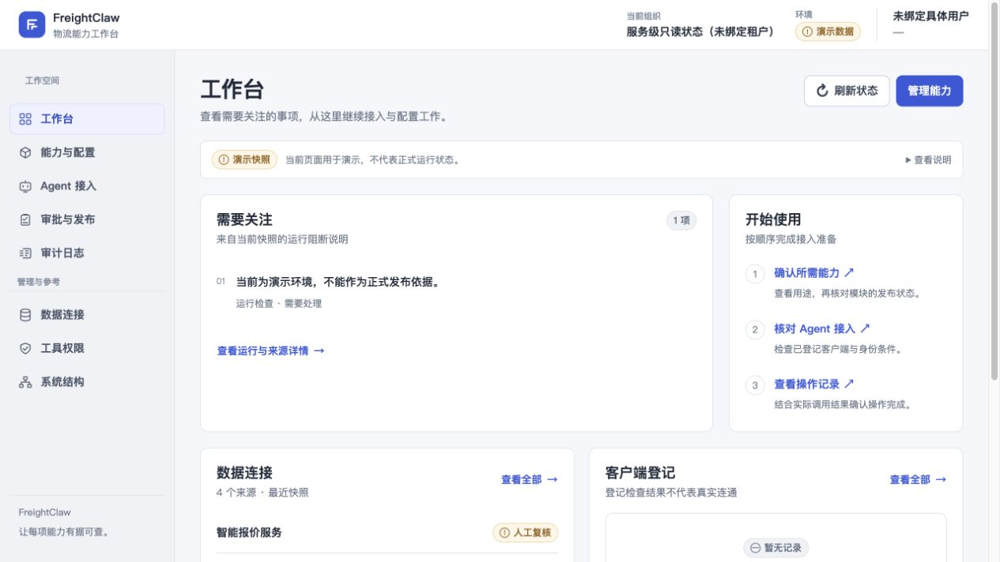

# 首轮 UI 实现与验证

[返回产品方案](README.md) · [当前代码证据](06-evidence.md) · [独立复核](08-review.md)

**既有实现记录：** 联合入口版的页面与验证见本文末尾“联合复用一期”。用户随后要求 API 直连、用户管理与申请审批，最新目标见 [11 号 PRD](11-api-native-platform-prd.md)；本文截图与通过结果不作为新 API 平台的完成证据。下文按实施轮次保留记录。

2026-09-05，基于当前工作区 `codex/tenant-api-key-control`、HEAD `34e1e9567440e768eb9e7a1b6cfe8c2ded70baed`。本记录描述已实现和验证的范围；产品方案中的完整接入向导、统一工作流与企业登录仍是目标。

## 已实现

| 区域 | 当前行为 |
| --- | --- |
| 视觉与导航 | Admin 与 Access Console 改为浅色工作界面，重做布局、导航、列表、表单、状态、弹窗及手机适配；沿用 FreightClaw 品牌 |
| 工作台 | 首屏显示当前快照中的待处理项、操作指引、数据连接和客户端登记；版本、来源与技术指标放在详情 |
| 能力与配置 | 能力目录与受控模块、配置管理分开呈现；“查看授权”带入所选工具；模块表区分登记状态、运行状态与期望启停 |
| 当前工具文案 | 直接核对本地运行时的 11 项目录；为新增助手上下文、零担测试报价及测试来源补齐准确中文映射，保留人工复核与不可正式报价的边界 |
| Agent 接入 | Admin 保留客户端登记和接入条件；Access Console 提供其现有租户、调用方、凭证与精确 T0 权限操作 |
| 状态表达 | 目录快照、授权和真实运行分别解释；模块缺少精确读回时显示“尚未确认生效” |
| 凭证更换 | 从目标凭证读取权限，展示权限变化、旧凭证失效影响及新有效期；防双击；未知结果复用原请求；已写入但读回失败时仅允许核验 |
| 错误恢复 | Access 读取失败结束加载状态，给出下一步；一次性凭证显示和交付语义保留 |

没有增加通用写入口、替换领域算法、修改 MCP 业务五状态或扩大工具权限。现有审批与配置接口继续决定按钮资格与生效条件。

## 本地预览与截图

- [运行时预览](http://127.0.0.1:8881/admin/)：独立本地 fixture 实例，使用当前服务端返回的 11 项工具目录和新建临时 SQLite 状态。
- [演示身份与模块管理](http://127.0.0.1:8881/admin/?fixture=1#modules)：可选择演示申请人，已验证绑定后读取模块控制面；该参数同时切换为旧版 9 项静态演示快照，不能拿它代表当前服务端目录。
- [静态 Admin 预览](http://127.0.0.1:8765/admin/?fixture=1)：客户端演示快照，用于页面与导航检查。
- [Access Console 预览](http://127.0.0.1:8765/access-console/)：未连接 Access 后端，展示真实不可用状态，不填充虚假可用数据。

这些地址只在本机预览进程运行时可用。预览使用本地合成数据，没有客户数据或生产凭证。



| 截图 | 情境 | 图像像素 |
| --- | --- | --- |
| [当前运行时工作台](ui-preview/runtime-workbench-desktop.jpg) | 直接读取隔离 fixture 后端 | 1265 × 712 |
| [当前运行时目录](ui-preview/runtime-capabilities-desktop.jpg) | 服务端返回 11 项能力 | 1265 × 712 |
| [当前新增能力](ui-preview/runtime-capabilities-tail-desktop.jpg) | 目录底部，展示新增能力及测试限制 | 1265 × 712 |
| [工作台桌面](ui-preview/admin-desktop.jpg) | 演示快照 | 1265 × 712 |
| [工作台手机](ui-preview/admin-mobile.jpg) | 演示快照 | 375 × 812 |
| [能力目录桌面](ui-preview/capabilities-desktop.jpg) | 演示快照 | 1265 × 712 |
| [能力目录手机](ui-preview/capabilities-mobile.jpg) | 演示快照 | 375 × 812 |
| [模块管理](ui-preview/module-controls-desktop.jpg) | 隔离 fixture 后端，已绑定演示申请人 | 1265 × 889 |
| [Access 总览](ui-preview/access-overview-desktop.jpg) | 后端不可用 | 1280 × 900 |
| [Access 接入](ui-preview/access-desktop.jpg) | 后端不可用、表单可见 | 1265 × 889 |
| [Access 手机](ui-preview/access-mobile.jpg) | 后端不可用、表单可见 | 375 × 812 |
| [差异弹窗](ui-preview/draft-dialog-desktop.jpg) | 静态演示草稿的本地预览 | 1265 × 889 |
| [身份弹窗](ui-preview/identity-dialog-desktop.jpg) | 未输入凭证的真实界面入口 | 1265 × 712 |

截图来源为本机浏览器原生捕获，格式为 JPEG，逐一打开检查过内容。测试浏览器视口宽度为桌面 1280、手机 390；原生捕获的图像像素存在缩放或边框差异，表内报告的是实际文件尺寸。截图是验收证据，页面没有使用这些图片作为 UI 素材。

## 实际验证结果

| 检查 | 实际输出 |
| --- | --- |
| `npm run build` | 通过；T0 module artifact attestation passed |
| `npm run validate:agent-standards` | 通过；13 standards、5 profiles、4 modules、5 resources |
| `npm run build:agent-pack` | 通过；构建 13 standards |
| `npm run validate:schemas` | 通过；17 schemas、11 examples；6 Access Gateway schemas |
| `node --check apps/admin/app.js` | 退出码 0 |
| `node --check apps/access-console/app.js` | 退出码 0 |
| `node apps/admin/self-check.mjs` | `admin console self-check: PASS` |
| 相关自动测试 | 10 个测试文件，103 项全部通过 |
| 最后文案修正 | 先复现名称隐藏断言失败，再通过自检；重建及 2 个 Admin 测试文件的 36 项测试再次通过 |
| `git diff --check` | 退出码 0 |

自动测试命令：

```sh
npx vitest run tests/platform/admin-control-ui.test.ts tests/platform/admin-assets.test.ts tests/platform/admin-static.test.ts tests/platform/admin-plugin-config-api.test.ts tests/platform/admin-tenant-access-api.test.ts tests/control-plane/runtime-activation.test.ts tests/control-plane/runtime-restore.test.ts tests/access-gateway/start.test.ts tests/access-gateway/console.test.ts tests/access-gateway/console-rotation.test.ts --pool=forks --no-file-parallelism --maxWorkers=1 --testTimeout=30000
```

浏览器检查覆盖 Admin 八个页面、Access 四个页面，桌面与手机导航、手机横向溢出、表格内部滚动、目标工具授权筛选、导航后回到页首，以及模块控制面的身份绑定与实际状态读取。最终检查的浏览器警告和错误日志为空。没有通过浏览器执行完整的生产审批、发布或真实凭证更换；这些操作逻辑的本轮验证来自隔离自动测试。

Access 已登录态另经代码核对：当前 `startAccessGateway()` 在未配置企业 Admin IdP 时会按设计拒绝管理接口；仓库没有可直接启动的已登录 Console fixture。现有 synthetic fixture 只组装领域层和 token exchange，不能代替凭证管理 HTTP 运行验证。因此本轮没有新建假成功接口，凭证更换的验证范围明确为执行真实页面脚本的合成行为测试。

设计检测器仅运行一次，结果为降级检查：部分解析依赖不可用，未执行对比度评价；返回 Access 就绪/错误记录两条语义色边提示，已在独立复核修正中移除。没有重复运行检测器，不能把这一结果报告为完整设计或可访问性扫描通过。独立审查结果见[复核记录](08-review.md)。

## 尚未完成的产品目标

- 统一外壳中的真实跨服务跳转需要明确部署路由；当前不假定 `/admin/` 与 `/access-console/` 可互相直达。
- 企业 SSO、组织和 Agent 选择式向导、统一待办与变更列表需要相应后端能力，未用前端模拟成功。
- 真实 Agent 接通、MCP 主动探测和上游业务可用性需要目标环境验证。目录快照与凭证交付不替代这些证据。
- 本轮未提交、推送或部署；生产状态未改变。

## 追加：关税查询与正式询价页面

用户追加范围后，Admin 增加 `#customs` 与 `#inquiries` 两个主导航入口及工作台入口，总计 10 个页面。详细产品设计见[业务服务方案](09-business-services.md)。

- 关税页包含商品/编码、税则日期、材质、用途与钢铝信息的基础资料检查；业务流程覆盖编码确认、税率与措施和来源核对。
- 正式询价页区分加拿大尾程与 Freightcom 零担，两组表单分别整理对应资料，切换来源后保留各自的本页输入。
- 输入检查使用浏览器内存，支持缺项提示、无效日期、地址类型、正数和整数格式等基础检查。它不是完整请求 Schema 校验，也没有发起关税或询价调用。
- 正式查询按钮保持禁用，结果区域为空，说明具体未开通原因。快照中的工具与来源按精确名称匹配并放入折叠详情，不从快照就绪推导生产资格。
- 页面模块随现有构建打入 Admin 主脚本；没有扩大静态服务资产白名单，也没有新增业务 API 或修改当前 T0 三工具权限。

本次追加实际验证：

```sh
node apps/admin/self-check.mjs
node --check apps/admin/app.js
node --check apps/admin/business-services.js
npm run build
npx vitest run tests/platform/admin-control-ui.test.ts tests/platform/admin-assets.test.ts tests/platform/admin-static.test.ts tests/platform/quote-production-delegation.test.ts --pool=forks --no-file-parallelism --maxWorkers=1 --testTimeout=30000
git diff --check
```

输出：两项前端自检 `PASS`；语法检查退出 0；构建报告 T0 artifact attestation 通过并生成 13 条 standards；4 个测试文件的 51 项测试全部通过；差异格式检查退出 0。新增基础检查先在缺少实现时失败，再通过实现及上述自检。

浏览器在隔离 fixture 运行时验证：关税、加拿大尾程及 Freightcom 三组资料的缺项/基础检查；正式调用仍禁用；来源切换保留输入；桌面与手机宽度无页面横向溢出；检查结果获得焦点，修改资料使原结果失效。浏览器警告与错误日志为空。这些结果证明本地页面行为，不证明上游正式业务可用。

新增截图是本机浏览器原生 JPEG 捕获，未进行图像生成或修图：

| 桌面 | 手机 |
| --- | --- |
| [关税查询](ui-preview/customs-desktop.jpg) | [关税查询顶部](ui-preview/customs-mobile.jpg)、[关税资料](ui-preview/customs-form-mobile.jpg) |
| [加拿大尾程](ui-preview/inquiries-desktop.jpg) | [询价顶部](ui-preview/inquiries-mobile.jpg)、[询价资料](ui-preview/inquiries-form-mobile.jpg) |
| [Freightcom 正式版方案](ui-preview/freightcom-formal-desktop.jpg) | 共用同一手机表单布局 |

## 联合复用一期：统一业务入口已实现

用户同意联合方案后，提供了报价 `https://quote.freightclaw.net` 和关务 `https://clearddp.com`。当前本地 Admin 已将旧资料准备表单替换为原服务入口，并增加税费估算页，共 11 页。首页突出开始询价、查询关务和估算进口税费；询价页另提供 AI 报价与异常处理入口。原服务登录、业务权限、记录和计算逻辑保持归属。

新增 `GET/HEAD /admin/api/v1/business-entrypoints`，只从服务端启动配置读取两个规范 origin，生成五个固定路径。非法或未配置地址各自返回空入口，不外发请求；沿用本地 Admin 的 enabled、loopback、Host/Origin、安全响应头限制。没有放宽 snapshot、MCP 工具或 T0 profile。

前端独立读取业务入口，平台 snapshot 失败不阻断可信入口；入口读取失败可重试，设置说明展开状态会保留。外部链接使用新标签和 `noopener noreferrer`，不携带商品、地址、报价或凭证。手机常驻四个业务导航，菜单展开七个管理页，Escape 关闭菜单并恢复焦点。浏览器返回可恢复上一个业务页面。

本地运行地址为 `http://127.0.0.1:8881/admin/`，使用新建隔离 fixture 状态库，配置了用户指定的两个公开 origin。它不是生产部署。

### 本次实际验证

| 检查 | 实际结果 |
| --- | --- |
| 前端功能红测 | 新的入口渲染/校验导出尚不存在时按预期失败 |
| `node apps/admin/self-check.mjs` | `Business entrypoint frontend checks: PASS`、`admin console self-check: PASS` |
| 后端红测 | 新模块不存在时失败；补充规范 URL/Host 负例后再现 2 项失败，随后修复 |
| `npx vitest run tests/platform/admin-business-entrypoints.test.ts tests/platform/admin-static.test.ts tests/platform/admin-assets.test.ts tests/platform/admin-control-ui.test.ts tests/platform/quote-production-delegation.test.ts --pool=forks --no-file-parallelism --maxWorkers=1` | 5 个文件、58 项测试通过 |
| `npm run typecheck` | 最新完整执行退出 0 |
| `npm run validate:schemas` | 17 个合同 Schema、11 个示例、6 个 Access Gateway Schema 通过 |
| `npm run validate:agent-standards` | 13 个标准、5 个 profile、4 个模块、5 个资源通过 |
| `npm run build:agent-pack` 与 `npm run build` | 标准包及构建通过，T0 artifact attestation 通过 |
| Chromium 浏览器 | 1440×1040、390×844；320px 与 768px 宽度无页面水平溢出；五个原生新标签链接、返回、菜单/键盘、未配置、读取失败/重试、snapshot 失败隔离全部通过 |

第一轮根代理发现并修正桌面菜单误显示和手机菜单过窄；第二轮截图与交互验证通过。浏览器无非预期脚本错误和外部请求。**五个外部导航使用拦截 fixture 验证目标 URL 与新标签行为，没有访问生产网站或提交业务查询，不能用这项检查证明原站点路由在线可用。**

最终 GPT-5.6 独立复核为 `disposition: ship`，无剩余必改项。随后已重新构建并重启隔离预览，浏览器精确读回确认关务页标题与无障碍切页播报均为“关务查询”，入口元数据仍为用户指定地址；该次窄检查输出 `PASS`，没有追加视觉打磨轮次。详见[当前复核记录](08-review.md)。

截图与自动化记录保存在本任务可视化目录，原生浏览器截图未进行图像生成或修改：

- [桌面工作台](/Users/autumn/.codex/visualizations/2026/09/05/01a0706e-46c2-7e43-837e-48cfd6d5a231/reuse-workbench-desktop.png)
- [手机工作台](/Users/autumn/.codex/visualizations/2026/09/05/01a0706e-46c2-7e43-837e-48cfd6d5a231/reuse-workbench-mobile.png)
- [手机菜单](/Users/autumn/.codex/visualizations/2026/09/05/01a0706e-46c2-7e43-837e-48cfd6d5a231/reuse-menu-mobile.png)
- [浏览器检查结果](/Users/autumn/.codex/visualizations/2026/09/05/01a0706e-46c2-7e43-837e-48cfd6d5a231/reuse-qa.json)

### 剩余实施边界

一期交付统一入口与真实配置投影，没有修改两个原业务仓库，没有建立 SSO、资料/结果交接、报价只读 API、完整关务 MCP 投影或新的生产工具 profile。下一阶段的具体合同与所有权见 [RFC 草案](../../rfcs/2026-09-05-existing-services-reuse-v1.md)和[实施计划](../../superpowers/plans/2026-09-05-existing-services-reuse-implementation.md)。它们仍为 Draft，不是已经接受的合同或生产接入证明。没有提交、推送或部署本轮改动。
