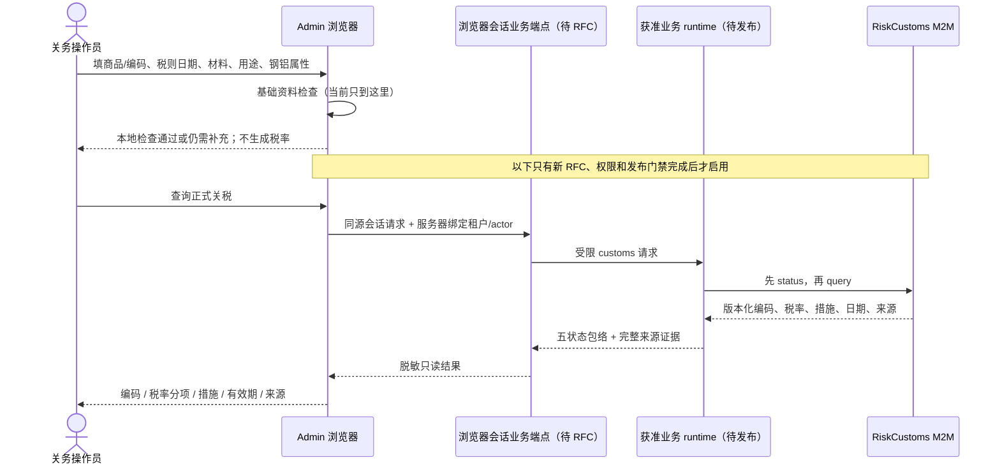
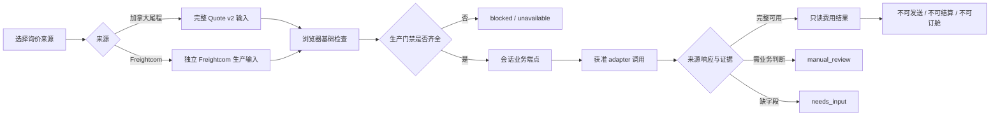

# 页面 09：关税查询与正式询价草稿记录

[方案总览](README.md) · [能力目录](02-capabilities.md) · [工作台](01-workbench.md) · [数据与操作记录](05-operations.md)

**本页保留已有 Admin 草稿和此前内嵌工作区的设计记录。** 用户进一步要求复用已有两个服务后，跨库核查发现：RiskCustoms 原服务已有完整三国结果与浏览器税费计算器，主要缺口在 MCP 投影和发布；MCP Quote v2 所期待的只读路由在原报价服务不存在，且真实请求/响应、租户和副作用均不匹配。后续以[两套现有服务联合复用方案](10-existing-services-reuse.md)为准：人工业务先沿用原页面，Agent 接入先关务 M2M、后报价只读接口。本页流程不再作为默认扩建方向，也不限制原业务服务已经获准的记录或客户回复动作。

## 1. 首期正式业务目标

在 FreightClaw Admin 内为获准业务操作员提供两个只读业务工作区：

1. **关税查询：** 针对原产中国、进口加拿大的商品，输入商品描述或编码与税则日期，获得可追溯的编码结果、税率分项、监管措施、适用日期和来源版本。
2. **正式询价：** 在加拿大尾程与 Freightcom 零担两条来源方案中选择一条，提交满足该来源合同的运输资料，获得保留源币种、费用分项、有效期、限制和发布证据的只读报价。

首期不发送客户、不结算、不订舱、不保存业务草稿到服务器，也不让 AI 补税率、费用或缺失条件。业务权威仍在经批准的上游 API。

当前代码只完成页面、浏览器内草稿和基础资料检查。正式调用按钮是禁用态；没有外部请求、业务结果或生产资格。这个事实是后续开发的起点，不是待修饰的 UI 文案。

## 2. 当前页面地图

```text
FreightClaw Admin（10 个导航页面）
├── 工作台
│   └── 业务工作区
│       ├── 关税查询
│       └── 正式询价
├── 关税查询 #customs
│   ├── 正式调用未开通
│   ├── 四步流程说明
│   ├── 资料准备与浏览器内检查
│   ├── 空的正式结果区
│   └── 相关工具 / 数据来源快照
├── 正式询价 #inquiries
│   ├── 加拿大尾程方案
│   ├── Freightcom 零担方案
│   ├── 各自资料准备与浏览器内检查
│   ├── 空的正式结果区
│   └── 相关工具 / 数据来源快照
└── 管理页面
    ├── 能力与配置 / Agent 接入 / 审批与发布 / 审计日志
    └── 数据连接 / 工具权限 / 系统结构
```

Admin 的新业务页面与 Access Console 仍是不同后台。浏览器会话调用业务 API 的认证、授权、CSRF/重放防护、租户绑定、审计与超时策略尚无已接受合同，必须通过新 RFC 定义；不能复用页面里临时输入的控制面身份，也不能把长期 API Key 暴露给浏览器。

## 3. 当前实现与正式目标差距

| 能力 | 当前已实现 | 当前缺口 | 正式结果最低要求 |
| --- | --- | --- | --- |
| 关税资料准备 | 固定加拿大进口、中国原产；收集商品/编码、日期、材料、用途和钢铝属性；基础检查日期与文本长度 | 没有正式调用；检查结果只存在当前页面状态 | 调用状态、请求关联和脱敏审计 |
| `customs.ca.search` | RiskCustoms M2M 安全 adapter：服务端上下文、状态→查询、host/tenant/secret 门禁、版本和来源校验 | MCP 投影只保留 `candidates`、`next_questions`、`data_status`、`source_refs`；没有税率、措施和文档输出 | 版本化编码结果、税率分项、措施、适用日期、来源；候选状态不得升级 |
| `customs.ca.estimate` | 工具与 Schema 保留 | 固定 `unavailable`，不发 HTTP | 独立 estimate API 合同、完税价格/币种/贸易待遇输入、税额分项、来源与人工确认规则 |
| 加拿大尾程资料准备 | 检查仓库代码、邮编、地址类型、件数、包装、重量、体积、最长边、托盘数和计价日期 | 页面仍缺 v2 的始发省份、可堆叠和完整服务项；不调用 adapter | 完整 v2 输入；费用分项、USD、有效期、限制、release/hash/source 证据，`sendable=false` |
| 加拿大尾程 Quote v2 | MCP 侧已有严格候选 contract 与 HTTP adapter，核对租户仓库映射、ready/test、有效期、release/hash 和来源集合 | 原报价服务没有该只读路由；请求/响应、租户与副作用不匹配，未进入生产 runtime | 先补齐真实上游只读合同与实现；全部门禁通过后才返回 `success` |
| Freightcom 资料准备 | 检查提送地址文本、日期、逐托明细和附加服务 | 当前是准备清单，不是结构化生产请求 | 独立的结构化地址、日期窗口、逐托重量/尺寸/货运等级、附加服务合同 |
| Freightcom adapter | 测试/fixture 提交与轮询已实现 | 生产模式硬禁用；测试结果固定人工复核且缺生产发布证据 | 新生产合同与 adapter；源币种、费用分项、有效期、限制、来源与发布证据 |
| 生产工具目录 | `t0-v1` 精确允许 `cargo.calculate`、`container.plan_summary`、`system.agent_context.get` | 拒绝 quote/customs/Freightcom adapter | 新 profile 或独立业务服务发布；不能原地扩大既有 T0 权限 |

## 4. 关税查询旅程



### 输入

| 字段 | 当前页面 | 正式规则 |
| --- | --- | --- |
| 商品描述或海关编码 | 必填，最多 200 字 | 必须明确查询模式；不能把自然语言猜测当选定编码 |
| 税则日期 `rule_date` | 必填日期 | status 与 query 必须对应同一日期，适用范围由上游返回 |
| 目的国 / 原产国 | 加拿大 / 中国固定 | 当前 MCP RiskCustoms 适配合同只接受 CN→CA；原服务支持中、美、加，扩展 MCP 国家范围须新合同 |
| 主要材料、实际用途 | 选填 | 缺失若影响分类则返回 `needs_input` 或 `manual_review` |
| 是否含钢或铝 | 是 / 否 / 不确定 | 不确定且影响措施时必须人工复核 |
| 税额估算字段 | 当前没有 | 若建设 estimate，另需完税价格、币种、进口日期、贸易待遇和已确认分类 |

### 正式输出

- 编码及 `candidate/confirmed` 状态；候选编码不能自动变成正式归类。
- 税率分项：税种/措施名称、原始率表达式或金额规则、适用状态（适用、不适用、待确认）、计算口径。
- 监管与贸易措施：例如需要核对的钢铝、SIMA 或其他上游明确返回项目；不从商品描述自行推导。
- 适用日期/有效期、税则数据版本、合同版本、release/snapshot 标识。
- 每个编码、税率和措施对应的 `source_ref_ids`，以及外层完整来源引用。
- 缺失问题、warnings、blockers、人工确认责任和最近读取时间。

现有 adapter 即使上游响应包含更多字段，也只投影编码候选等当前 Schema 字段。正式关税页面不能直接消费被丢弃的税率、措施或文档；必须先通过 RFC 更新共享合同，再由 adapter 保留和验证这些字段。

## 5. 正式询价旅程



### 加拿大尾程输入

当前页面已收集仓库代码、加拿大邮编、地址类型、件数、包装、重量 kg、体积 cbm、最长边 cm、显式托盘数和计价日期。正式发起前必须补齐 Quote v2 的始发省份、目的省份/城市策略、`is_stackable`、预约、尾板、手叉车、滞留分钟、偏远地区、受限地点及完整单位对象。仓库代码必须由当前租户的服务端映射得到 canonical origin；页面不能猜 origin。计费托数不能代替实体托盘数。

### Freightcom 输入

Freightcom 必须使用独立合同，至少结构化提货与送货地址、地址类型、提货日期/时间窗口、每个实体托盘的数量、重量、长宽高、货运等级以及附加服务。当前多行文本只是准备清单，不能直接透传为 provider body。客户端不得提交 provider token、base URL、tenant、actor 或任意扩展字段。

### 两路共同输出

- 来源原币种及金额；金额使用 decimal string，币种使用三位代码，重量/长度/体积必须带单位。任何币种转换都必须有独立 FX 来源和 calculation trace。
- 费用分项、总价、计价口径、承运商/服务（适用时）、预计时效（来源提供时）。
- `valid_from`、`valid_to` 或等价有效期，以及明确的适用限制和不可计算原因。
- tenant、canonical origin、数据/规则/服务/合同版本、release/hash、发布时间和来源引用。
- `sendable=false`；Freightcom 首期也必须 `bookable=false`。页面不提供发送、结算和订舱动作。

Freightcom 是否纳入首批仍待范围确认，正式版需要新合同和 adapter，不能在测试实现上只换 host。此前仅从 MCP 侧建议优先验收 Canada tail；跨库核查后，该顺序已调整：先复用用户已有报价工作台，Agent 接入先做已有对应接口的关务 M2M，再补报价只读入口，详见 [10](10-existing-services-reuse.md)。

## 6. 状态、异常与恢复

| 状态 | 关税页面 | 询价页面 | 恢复动作 |
| --- | --- | --- | --- |
| `success` | 完整版本化编码/税率/措施/来源均通过合同 | 来源金额、费用分项、有效期、限制和发布证据完整 | 查看结果和证据；仍遵守不可发送/订舱边界 |
| `needs_input` | 缺商品、日期或影响分类的属性 | 缺地址、货物、实体托盘、日期或服务条件 | 保留当前表单、标注缺项；补齐后再请求 |
| `manual_review` | 候选冲突、上游明确要求人工判断的措施适用问题 | 来源要求人工判断、受限地点或偏远地址 | 展示需核对项、责任角色和可接受证据；不升级为成功 |
| `blocked` | 无业务权限、跨租户、身份或会话策略不通过 | 无报价权限、试图提交 provider token/任意 URL、重复未知写入 | 说明允许范围；重新登录或联系有权限角色，不能用前端绕过 |
| `unavailable` | `ready=false`、测试数据、无来源、版本/hash 不完整、estimate 未接入 | adapter 未发布、上游不可达、生产禁用、响应不符合合同 | 保留输入和失败时间；修复依赖后显式重试 |

页面的“基础资料已检查”是本地表单状态，不是业务包络 `success`。HTTP 200/202、目录可见、adapter 单测、状态端点可达或本地 readback 也分别不能证明关税或报价成功。

## 7. 正式开通依赖

1. **产品选择：** 确认首批租户、关务/询价角色、询价来源范围和结果保留策略；Freightcom 与加拿大尾程可并存，但必须分别签合同和发布。
2. **合同 RFC：** 为浏览器会话业务调用、权限、输入输出、状态映射、审计与数据保留提交新 RFC。关税合同必须新增税率、措施、适用日期和来源字段；Freightcom 必须新增独立生产合同。RFC 接受前不改共享合同。
3. **权限与 profile：** 建立独立业务 profile 或经评审的新生产 profile，精确列出 customs/quote 工具、role/scope 与 tenant entitlement。现有 `t0-v1` 三工具集合保持不变。
4. **浏览器会话边界：** 由服务端绑定 tenant/actor，使用短期会话身份；定义 CSRF、重放/幂等、限流、超时、取消和脱敏审计。浏览器不持有上游 token 或长期 MCP Key。
5. **上游合同和发布：** 核验正式 endpoint、认证、host allowlist、tenant mapping、请求副作用、版本、有效期、release/hash 与来源证据；准备 staging fixture 和失败响应。
6. **Adapter 完整性：** RiskCustoms 保留并验证税率/措施/日期；Canada tail 完成正式 runtime 装配；Freightcom 新建生产 adapter，禁止从测试模式切换 host 复用。
7. **页面集成：** 将禁用按钮替换为服务端 `allowed_actions` 控制的提交；提交中锁定请求，五状态逐项渲染，敏感字段不进 URL/storage/log。
8. **运行与回滚：** 独立 readiness、告警、审计关联、限流、超时、上游故障隔离、发布读回和回滚演练。单个业务来源故障不能关闭 cargo/container。

## 8. 分阶段验收

| 阶段 | 可验证出口 | 明确不能宣称 |
| --- | --- | --- |
| B0 页面准备 | 10 页导航可达；两表单能保留当前会话草稿并给出字段级缺项；正式按钮禁用；无外发 | 已接入、已报价、已查税 |
| B1 合同接受 | RFC 有旧/新 JSON、版本兼容、权限、迁移、测试和回滚；关税结果覆盖税率/措施/日期/来源；两路询价合同独立 | 生产已启用 |
| B2 Adapter staging | 正式身份与 host allowlist 生效；ready/test/release/hash/source 门禁和五状态在 staging fixture 与授权环境读回 | 客户可用、生产成功 |
| B3 浏览器端到端 | 真实短期会话从页面发起；服务端绑定 tenant/actor；成功与四类失败均展示准确；无 token/地址/报价明细进入日志或 storage | 目标客户端或所有租户已开放 |
| B4 小范围正式发布 | 指定租户 entitlement、监控、告警、审计、负载、备份/恢复和回滚演练完成；业务结果与上游可比读回一致 | 其他来源或发送/订舱能力已上线 |

上表保留此前内嵌工作区的验收条件。最新联合方案的实施顺序以 [10](10-existing-services-reuse.md) 为准；候选 adapter 的存在不能代替真实上游兼容性，原页面复用与 Agent 接入分别验收。

## 9. 开发所有权

| 工作项 | 任务所有权 | 可写范围 | 交付 |
| --- | --- | --- | --- |
| 产品与共享合同 | 01 基线 | `docs/product/**`、`docs/contracts/**` | 接受 RFC 后更新合同、Schema、示例、迁移和回滚 |
| 变更 RFC | 提出变更的实现任务 | `docs/rfcs/YYYY-MM-DD-<slug>.md` | 动机、旧/新 JSON、兼容、权限、迁移、测试与回滚；接受前不改共享合同 |
| 生产 profile、浏览器会话 MCP/服务边界、RBAC 与审计 | 02 平台 | `src/logistics_mcp/platform/**`、`server/**`、`control-plane/**` 等 02 范围 | 精确工具集、服务端身份、权限、包络和失败闭合 |
| RiskCustoms、Quote v2、Freightcom 正式 adapter 与领域投影 | 05 适配器 | `src/logistics_mcp/adapters/**`、相关 quote/customs domains 与测试 | 窄 adapter、完整来源投影、fake HTTP 与失败测试 |
| Admin 页面接线、E2E、部署与 runbook | 06 集成 | `apps/admin/**`、`tests/e2e/**`、`deploy/**`、`docs/runbooks/**` | 页面到受控端点的端到端、状态展示、发布与回滚验证 |
| 长期 Key 换短期 JWT（若复用接入网关） | 07 接入网关 | `services/access-gateway/**` 等 07 范围 | 只负责凭证兑换/JWKS/entitlement；不得把长期 Key verifier 嵌入 MCP |

任何任务发现共享字段必须变化时先写 RFC，由 01 维护合同；02/05/06 不跨目录直接修改共享契约。

## 10. 旧草稿与后端证据

旧表单已被联合入口替换。其外观和检查行为保留在[旧版复核截图](08-review.md)；下列后端证据不表示新页面已经能够发起业务调用。

| 事实 | 代码证据 |
| --- | --- |
| 旧版 10 页及资料准备表单 | [旧版实现与验证记录](07-implementation.md)、[旧版复核截图](08-review.md)；已由 11 页联合入口替换 |
| MCP RiskCustoms adapter 仅 CN→CA，先 status 后 query | `src/logistics_mcp/adapters/customs/riskcustoms-api-adapter.ts:680-727`、`:857-887` |
| RiskCustoms 当前投影只有候选、问题和 data status | `src/logistics_mcp/adapters/customs/riskcustoms-api-adapter.ts:919-976` |
| estimate 固定 unavailable | `src/logistics_mcp/adapters/customs/riskcustoms-api-adapter.ts:734-743` |
| Quote v2 完整输入与 `sendable=false` 结果合同 | `src/logistics_mcp/adapters/quote/quote-v2-contract.ts:66-150` |
| Quote v2 校验来源/费用证据并投影 release/hash | `src/logistics_mcp/adapters/quote/quote-api-adapter.ts:430-548` |
| Freightcom 生产硬禁用，测试完成仍为人工复核 | `src/logistics_mcp/adapters/quote/freightcom-rate-adapter.ts:621-770` |
| Freightcom 输出固定不可发送/订舱/权威 | `src/logistics_mcp/domains/quote/freightcom-ltl-tool.ts:145-170`、`:315-337` |
| `t0-v1` 精确三工具集合 | `src/logistics_mcp/module-runtime/production.ts:12-29`、`src/logistics_mcp/server/composition.ts:475-523` |

这些是当前源码证据，不是运行测试、真实上游调用或生产发布证明。本次产品文档没有连接外部业务系统，也没有新增已接受 RFC。
