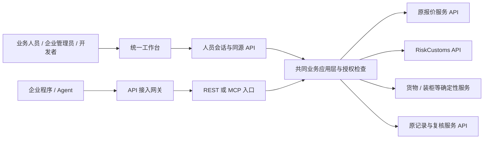

# FreightClaw API 统一工作台与用户接入产品规划

> 实施状态：本规划已进入代码交付阶段；当前覆盖、验证范围和生产缺口见 [15-implementation-delivery.md](15-implementation-delivery.md)。原规划与验收标准继续有效。

日期：2026-09-05 · 本轮交付：产品规划，未实现新页面或新业务接口。

[方案总览](README.md) · [页面与操作流程](12-api-platform-pages.md) · [当前接口与差距](13-api-capability-gap-matrix.md) · [实施与验收](14-api-platform-delivery.md)

## 1. 已确认方向与默认方案

用户明确要求：所有服务通过 API 连接，不使用网页跳转作为业务集成；增加用户管理、API 申请界面，并从产品经理角度重新规划。用户已确认允许按方案在原服务独立分支继续改造。这项授权延续有效，本规划不再次要求跨仓库修改授权，也不据此推断允许生产部署。

这取代 [10 号方案](10-existing-services-reuse.md)中“先打开原业务页面”的产品方向。已经实现的入口页保留为历史实现证据，**不满足当前新版验收**。原服务继续拥有报价、关税、业务记录和计算规则；统一工作台负责完整的人机操作界面，通过服务器 API 使用这些能力。

| 类型 | 当前决定 |
| --- | --- |
| 已确认 | 统一页面录入、确认、调用、展示结果；不外跳原报价站或关务站完成业务 |
| 已确认 | 用户管理、API 申请和审批、应用与凭证管理进入首期产品范围 |
| 已确认 | 复用已有服务的 API、确定性引擎、权限与证据；缺少接口的能力在原服务补齐 |
| 推荐默认，待用户纠正 | 内部员工＋受邀企业客户；提供企业接入申请，但不开放匿名自动开通生产权限 |
| 推荐默认 | 先完成组织与 API 接入闭环，再依次接通关务查询、报价、税费估算；正式版只有全部必选业务通过端到端验收才完成 |
| 未验证 | 两个域名对应的生产构建、生产数据、身份 provider 与实际 API 连通性 |

本规划区分“产品范围已授权”和“技术合同已冻结”。新增字段、权限和版本还要形成可验证的 Schema/RFC，由既有基线流程维护；不能把用户确认解释为任意新增工具、默认全权或现有 T0 自动扩权。

## 2. 产品定位与完成标准

FreightClaw 是一个面向物流业务人员、企业管理员和开发者的统一服务平台：人员登录后在页面完成业务；程序通过获批 API 或 MCP 使用同一套能力；管理员管理成员、应用、授权、运行和异常。

“所有服务可以 API 连接”的定义是：每项对外提供的业务动作都有受认证、可授权、可验证的服务器接口。网页调用与机器调用最终进入相同的业务应用层，复用同一引擎与数据发布证据。不同调用方式保留各自身份和权限，不能用网页已登录、来源 HTTP 200 或 Key 已签发证明结果可用。

以下条件同时满足，才能把某项服务标为正式可用：

1. 输入输出、单位、权限和副作用合同与实际服务一致。
2. 对应企业、成员或应用获得精确操作权限，测试与正式环境明确分离。
3. 数据与规则有当前有效的发布证据，未就绪不能补成成功。
4. 页面内完成输入、补充、执行、结果阅读、异常恢复；没有返回原业务网站继续操作的必需步骤。
5. 需要保存或人工复核时，调用明确的写 API，并从原业务系统读回记录和状态。
6. 自动化客户可按公开接口文档完成一次真实获准调用；网页端和 API 端的同一请求在相同版本下得到一致业务结果。

## 3. 三个使用区，同一产品体验

### 业务工作区

服务询价和关务操作人员。主导航为“工作台、询价、关务查询、税费估算、货物与装柜、业务记录”。登录后按授权直接操作，不要求填写上游地址、Token、租户 ID 或 MCP 工具名。

### 开发者中心

服务企业开发者和 Agent 集成维护者。主导航为“我的应用、API 申请、凭证、调用记录与用量、接口文档”。应用详情是管理中心：负责人、环境、申请、已开通能力、Key、REST/MCP 接入指引在同一上下文内。

### 组织与平台管理

企业管理员看到“成员与角色、组织资料、企业应用、服务授权、组织审计”。平台运营在单独管理区处理“企业接入、API 审批、服务发布、运行与审计”。企业客户不能看到其他企业，也不会因为是本企业 owner 而获得平台管理权限。

现有 `/admin/` 是有 loopback 与管理身份限制的运维面，不能直接对公网开放并改名成客户门户。建议增加面向客户的 `/console/` 路由与同源浏览器服务层，复用设计系统、已有组件和应用服务；现有 Admin 与 Access 管理功能按角色逐步整合，不制造第二套授权数据。

图为目标架构；现有代码只实现其中部分。身份认证跳转如采用标准企业登录，可以在认证完成后返回当前页面；不得用业务网页跳转、iframe、浏览器 Cookie 搬运或抓取页面代替上述 API。

浏览器业务请求的企业、原始操作者、Membership、角色与调用渠道由服务器从当前会话解析并绑定，浏览器不能提交或覆盖。BFF 向原服务传递受认证的委托上下文；原服务验证调用服务与实际操作者的对应关系，同时记录服务身份和原始人员/应用归属。不能只用一个后台服务账号覆盖销售人员归属。上下文无法验证时拒绝请求；尚无该合同的上游保持未开放。

## 4. 用户、企业、应用与权限模型

| 对象 | 产品含义 | 复用 / 新增及边界 |
| --- | --- | --- |
| User | 一个真实登录人员 | 新增业务侧用户资料；绑定身份服务的稳定 subject，不自建另一套密码算法 |
| Organization | 企业或明确隔离的内部业务组织 | 扩展现有 tenant；企业资料不等于组织成员关系 |
| Membership | 人员在某企业的身份与角色 | 新增；一人可属于多个企业，切换企业必须重新验证成员资格 |
| Invitation | 一次加入企业的邀请 | 新增；绑定企业、接收身份、角色、有效期和签发者，单次领取 |
| Application | 企业拥有的 API 消费应用 | 复用现有 client 作为机器主体，补名称、用途、负责人、环境和状态；先创建应用，再申请和发 Key |
| Agent | 应用的使用方式或实例标识 | 首期作为应用类型/调用标签，不重复创建一套凭证或权限体系 |
| ServiceGrant | 某企业网页用户或某应用获准使用的精确能力 | 新增版本化授权；明确授权对象类型、企业、应用（如适用）、Web/REST/MCP 使用方式、环境、操作、限制与有效期 |
| ServiceConnection | 平台到原业务服务的连接与租户映射 | 保存受控绑定引用、环境和连通证据；不以应用获批代替连接核验 |
| AccessRequest | 为应用或企业申请一组能力 | 新增；保存申请版本、用途、请求权限、申请人和审核意见 |
| ReviewDecision | 对某版申请的决定 | 新增；只针对申请快照，不混入现有模块发布审批 |
| Credential | 应用的长期 API Key 元数据 | 复用现有强哈希、一次展示、交付确认、轮换和吊销；不属于某人的个人业务账号 |
| Operation / Audit | 执行与审计记录 | 复用现有幂等、脱敏审计与读回；申请状态不冒充业务计算状态 |

API 申请必须有已验证的人员、企业和应用归属。网页业务资格来自当前人员的企业成员角色及企业服务授权；程序资格来自当前应用、凭证和获准能力。网页用户不需要领取 Key 才能询价，机器 Key 也不能登录网页或管理企业。

授权对象必须明确区分企业 Web 使用与应用机器使用，分别由当前主体的权限与 grant 求交；不把一份应用 Key 的额度或 scope 当成全企业 Web 权限，也不把成员角色复制进机器 JWT。企业获批的服务范围是上限，应用申请只能在该范围内开通或显式申请扩展。

### 建议角色及能力

| 角色 | 允许的主要操作 | 不自动获得 |
| --- | --- | --- |
| 业务操作员 | 已授权询价、关务与估算；查看自己或明确分配范围内的记录；发起复核 | 企业成员管理、Key 领取、客户发送、规则修改 |
| 业务主管 | 分配业务记录、处理获准复核、查看本团队业务 | 平台审批、后台任意改价 |
| 企业开发者 | 创建/维护获分配应用、申请 API、领取/轮换应用 Key、看脱敏调用记录 | 其他应用 Key、原始客户业务材料、审批自己申请 |
| 企业管理员 | 邀请成员、分配角色、管理企业应用负责人、提交服务申请与停用应用 | `platform:admin`、未经平台批准的新服务 |
| 企业所有者 | 管理员能力，加企业所有权移交和高影响停用 | 绕过平台服务授权与上游数据门禁 |
| 平台审核员 | 审核企业接入与 API 申请，给出原因，核验开通 | 查看客户 Key 明文、修改报价税率、默认浏览所有客户记录 |
| 平台运维管理员 | 服务接入、配置与发布、运行故障和撤销处置 | 自动代客户调用业务、自审自己提交的授权申请 |

角色是产品模板，最终权限按操作拆分并由服务器校验。页面隐藏只是体验；所有详情、搜索、导出和修改 API 都必须再次限制企业与对象归属。

### 成员生命周期

邀请→身份验证→加入企业→分配角色→正常使用→角色调整/暂停→移交与移除。

- 默认邀请加入；企业接入申请可以提交审核，但不会自动创建生产管理员。
- 企业邮箱域名相同不等于属于同一企业；受邀身份不符必须重新验证或重发邀请。
- 邀请过期、撤销、重复领取和成员已存在给出明确下一步，重发使旧邀请失效。
- 暂停成员应停止新会话和人员操作，并按会话撤销机制处理已登录页面。
- 移除应用唯一负责人前必须移交或暂停该应用；不能通过离职流程误删整个企业的正常集成。
- 企业始终至少有一名有效所有者；最后一位所有者不能直接退出、降权或被删除。
- 企业停用同时影响 Web 与 API。重启企业后重新核验授权、应用和凭证状态，不复活已吊销 Key。

## 5. API 申请到首个调用的完整闭环

首期采用“企业准入＋应用能力申请”。企业准入只在第一次或企业身份变更时执行；同一企业的后续应用按策略申请精确能力，不反复填写同一份企业资料。

1. **创建应用**：名称、用途、负责人、接入方式 REST/MCP、目标环境。应用先获得稳定 ID，Key 不再是创建应用的入口。
2. **选择能力**：按业务名称列出可申请范围，如关务查询、税费估算、报价试算；详情展示对应接口、读/写性质、数据要求和当前服务状态。
3. **填写申请**：业务用途、所需操作、数据范围、预计调用频率/峰值、技术联系人。测试与正式申请分开；不让用户提交上游密码或任意 endpoint。
4. **提交确认**：展示最终权限清单、环境、负责人和申请版本；重复点击不生成多份申请。
5. **审核与补充**：审核员可以批准部分能力、要求补充或拒绝，每项说明原因。申请人不能审批本人申请；修改已提交权限必须生成新版本，旧审批不能套用。
6. **执行开通**：批准形成版本化授权，后台执行精确 entitlement 写入并读回。失败停留“开通失败/处理中”，复用同一操作查询或重试，不生成重复 grant。
7. **领取凭证**：仅在环境与权限已开通后，由应用授权负责人主动创建 Key；审核员的页面不生成或看到客户 Key。Key 只展示一次，客户确认交付后才允许换票。
8. **接入验证**：提供当前环境的真实端点、权限和最小调用示例；程序使用 Key 换短期令牌，再调用 REST 或 MCP。页面只显示脱敏诊断，不上传用户的 Key。
9. **运行维护**：显示最近一次被核验的调用时间、环境、操作、结果与 request ID；支持申请增权、续期、轮换、主动暂停和吊销。

### 状态必须分为四条线

| 对象 | 状态和含义 |
| --- | --- |
| 申请 | 草稿、已提交、审核中、待补充、已批准、已拒绝、已撤回；终态修改需新版本/新申请 |
| 授权开通 | 未执行、处理中、已开通、失败、已暂停、已撤销、已到期；由服务器写后读回决定 |
| 服务连接 | 未配置、待验证、已验证、降级、不可用、已停用；绑定上游环境、租户映射和检查时间 |
| 接入验证 | 未验证、验证中、已验证、验证失败、证据已过期；绑定应用/环境/授权版本/被调用服务版本 |

这些是申请、授权和验证对象的业务状态，不扩展 MCP `success/needs_input/manual_review/blocked/unavailable` 包络。

“已批准”不能显示“已接通”。“已开通但来源未就绪”允许查看文档和状态，正式业务仍阻断。一次关务调用成功不代表报价和估算均已验证。服务凭据或权限版本变化后，旧验证证据不能继续代表当前接入。

签发前检查当前授权、环境、目录和平台受控连接证据；领取后再验证客户应用的真实调用。不能把“客户尚未领取的 Key 已调用成功”作为领取前提，形成循环依赖。平台连接自检使用明确获准的最小服务身份，不使用审核员的管理 Token 代客户调用。`ServiceGrant` 的 active 只表示授权生效；可调用状态还要同时检查会话/凭证、连接、实际发布目录和上游当前数据。

### 凭证与撤销体验

- 完整 Key 只在创建/轮换成功的当前响应展示，随后仅保留前缀、用途、到期时间和最后使用摘要。
- 刷新或丢失展示不能重新取回原 Key；先查操作状态，再明确吊销并重新签发，不能盲目重试创建。
- 首期轮换沿用现有立即失效的真实语义，在确认页展示影响；没有实现重叠有效窗口时不能宣传无中断轮换。
- 停用企业、应用或 Key 应立即阻止新换票；已发短期令牌按实现的撤销检查与到期上界显示实际生效时间，不能仅凭按钮成功宣称全部调用即时断开。
- ServiceGrant 暂停、撤销、到期或缩权后，立即按当前 grant 拒绝新的人类业务请求与超范围的新换票；凭证元数据仍可保留，但不会保住旧权限。已发短期令牌按明确的撤销/到期上界收敛；重新申请产生新授权版本，不自动恢复已撤销授权。
- 技术限流、企业配额和商业计费分别建模。现有每分钟防滥用限流不冒充月度额度；首期不虚构套餐价格、免费次数或扣费规则。

## 6. 统一业务操作：页面内完成，API 返回证据

### 询价与 AI 资料整理

客户原话或手动资料→识别/编辑货物→核对起运仓、目的地、地址性质和单位→服务器试算→费用分项/风险→用户明确保存或发起人工复核→记录读回。

AI 只提取和解释；确定性引擎计算价格。原 `/quotes/zone-calculate` 具有业务写入，不能直接当作只读按钮后端。需在原服务抽取同一计算核心，分别提供只读试算与明确保存/复核的 API。已存在的 AI 接口会写记录，同样不能伪称“纯解析”。报价状态、有效期、币种、费用覆盖、来源和人工限制在结果附近展示。

“正式询价”指通过正式服务与数据得到可核验结果，不等同于自动发送客户、订舱或承诺价格。若业务需要发送/发布，必须新增相应权限、审批和执行读回，不能从试算权限继承。

### 关务查询

商品/编码、原产国、查询法域、规则日期→补充材质/用途→候选确认→CN/US/CA 对照结果→税率、措施、文件与来源→带已确认商品进入站内估算。

复用 RiskCustoms 的 M2M status/query，保留结构化追问、候选、税率、文件、措施、来源及发布身份。当前加拿大窄工具不能悄悄扩大为三国查询；完整能力需新合同与精确权限。候选未确认、原数据未就绪或发布快照变化要在页面要求补充/复核或暂不可用。

### 税费估算

已确认归类→目的国、商品原产国、申报货值/币种、申报数量及单位、所需运保费→汇率与税则日期核验→服务器估算→分项与未覆盖事项→可追溯结果。

必须在 RiskCustoms 提供受认证的单项估算 API。复用现有 Decimal 计算核心，移到前后端共享且服务器可调用的位置；MCP/BFF 不另写一套税费公式。Excel 首期在浏览器解析并让用户确认行项，提交有界服务器批量请求；逐行状态、重试与汇总不把失败行当 0。

### 货物、装柜及其他服务

现有货物计算、分泡和装柜摘要通过同一应用服务暴露 REST/MCP，不把模块计算复制到 UI。装柜摘要继续表达理论/运营配置边界。精选知识、系统状态保留查询性质；报价草稿、人工复核与历史必须走其权威业务服务的专用接口。

Freightcom 的测试连接与正式费率是两项资格：正式版本属于全服务路线图，需独立核验生产账号、生产 API、返回币种和读回，测试结果不能出现在正式报价列表。PDF/文档若进入正式功能，同样先补接口与权限，不能用页面按钮或文件示例代替接入。

### 联合上下文与记录

一次业务的已确认商品事实可以在站内复用；返回结果各自保留系统、引用、日期、版本和状态。报价原点不等于商品原产国，包装件数不等于申报数量，运费不等于货值，HS6 不等于各国完整税号。

首期统一工作台只在当前会话暂存编辑资料；正式草稿与历史由原业务服务保存，列表通过授权 API 聚合必要引用并受权回读。现有 RiskCustoms 没有结果恢复 API，需先补原系统记录/保留合同；不能拿 queryId 冒充可恢复历史。持久联合主记录不默认落入 MCP，若需要须先确定业务所有者。

修改目的地、重量或包装使报价结果失效；修改材质、原产国、HS、规则日期、货值或汇率条件使关务/估算结果失效。各结果分别提示重算，不拼出没有核实币种、费用覆盖和重复项的“DDP 总价”。

## 7. UI 与交互约束

沿用已经建立的浅色、蓝色重点、清晰表格和紧凑工作台视觉。以业务表单和结果作为首屏主体，移除大面积跳转卡片；不再先填写一套无法执行的表单，再提示去其他站点处理。

- 主导航按工作区和角色收敛。技术标识、发布详情和原始 JSON 放详情，不占用业务主流程。
- 主按钮每页一个明确动作；结果保留在原页面，执行中防重复，失败保留输入并给出恢复动作。
- 申请采用“应用资料→选择服务→确认提交”三步；审核采用列表＋详情，清楚比较申请与现有权限。
- 桌面业务表单与结果左右分区；手机分成“资料/结果”，保持同一草稿和状态，固定主要动作不遮挡字段错误。
- 页面必须覆盖首次访问、无权限、无数据、加载、补充、部分失败、过期、会话失效、处理中和读回失败。
- 技术详情可以复制 request ID；默认不展示上游密钥、客户敏感正文、堆栈或内部主机配置。

详细页面字段、动作和验收见 [12 号页面规格](12-api-platform-pages.md)。本轮没有绘制或实现新版 API 页面，上一轮截图只能说明旧入口版的视觉基础。

## 8. 首期范围与交付顺序

| 交付 | 必须能完成的闭环 | 发布含义 |
| --- | --- | --- |
| A 用户与企业 | 登录→受邀加入→角色分配→暂停/移交 | 人员身份可用；不代表业务服务已开通 |
| B API 接入 | 应用→申请→审批→授权读回→Key 交付→一次获准调用→吊销验证 | 可先以既有 T0 完整验证平台闭环；不能称全部业务正式版完成 |
| C 关务业务 | 页面/API 查询→追问→确认→完整来源结果 | 正式数据与发布身份核验通过才标正式 |
| D 报价业务 | 解析/编辑→只读试算→明确保存/复核→原记录读回 | 不允许原计价写副作用伪装成试算 |
| E 税费估算 | 单项/批量→汇率税则快照→分项/复核→原记录 | 受认证服务器计算，网页与机器一致 |
| F 全服务覆盖 | 货物装柜 API、知识状态、历史/复核和独立 Freightcom 正式接入资格 | 服务逐项验收；缺一项就逐项列出，不用平台通过覆盖业务缺口 |

每段都有 UI、后端合同、权限、错误恢复和测试，不采用“先把所有菜单画完，最后再找接口”的排法。用户系统和 API 申请不是末尾装饰模块，是业务正式开放的前置条件。

自动订舱、正式报关、客户自动发送、商业套餐计费和原业务规则自由编辑不在本次默认范围。它们若需要开放，同样通过 API 和独立写权限实施。

## 9. 关键验收与暂未确定事项

验收必须同时包含页面与直接 API 调用，覆盖多人角色、跨企业、过期/撤销、重复提交、操作超时、数据源未就绪和真实写后读回。[14 号交付清单](14-api-platform-delivery.md)给出可执行场景与责任边界。

首期客户范围目前按推荐默认记录；用户答复后调整，不阻止当前规划。企业身份 provider、正式环境配额和会话保留策略需在实施前依据部署条件冻结。生产地址、凭证、版本、数据和调用记录仍待目标环境验证；这些不能从当前本地代码推导。

本轮代码事实由 GPT-5.6 子代理独立核查，主代理负责产品决策、页面规格和最终一致性。本地代码与现有工具合同的具体差距见 [13 号清单](13-api-capability-gap-matrix.md)。
