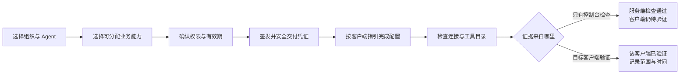

# FreightClaw 前端与操作流程重新规划

**当前状态入口（2026-09-06）：[18 当前进度与功能缺口](18-current-status-and-gaps.md)。** 统一门户、用户与企业管理、业务 REST、市场、手册和统一 API Key 已实现，已有生产发布记录；正式数据、客户机器调用及部分业务流程仍需验收。最近保存的发布证据见 [17 市场与统一 Key 交付](17-market-manual-production-delivery.md)，各来源状态见 [15 生产交付台账](15-implementation-delivery.md)。main 提交与生产发布分别核对。

本目录按阶段保留设计历史：01–10 是早期 Admin/Access Console 与网页入口方案；11–14 是 API 原生平台的初始规划；15–18 是后续交付、简化接入和现状核查。**下文保留 2026-09-05 首轮方案，其中“尚未实现用户系统/API”、两类 Key、原网页跳转等描述不是当前状态。** 合同版本仍以已接受 RFC 和 Schema 为准。

> 产品目标与首轮 UI 实现 · 2026-09-05
>
> 基于当前工作区 `codex/tenant-api-key-control`、HEAD `34e1e9567440e768eb9e7a1b6cfe8c2ded70baed` 的代码审查。产品规划完成后，已继续重做 Admin 与 Access Console 的实际界面。下文仍描述目标体验；各项的实现状态以[本轮实现与验证](07-implementation.md)为准，不表示已部署或所有目标功能均已实现。

[两套现有服务联合复用方案](10-existing-services-reuse.md) · [本轮实现与验证](07-implementation.md) · [工作台线框](01-workbench.md) · [能力目录线框](02-capabilities.md) · [Agent 接入线框](03-agent-onboarding.md) · [变更中心线框](04-changes.md) · [运行记录线框](05-operations.md) · [代码证据](06-evidence.md) · [上一版业务页面草稿](09-business-services.md)

**既有实现状态：** 上一轮 Admin 已把资料草稿表单替换为原工作台导航，新增独立税费估算页，共 11 个页面，配置了用户提供的两个域名。该版完成本地运行与浏览器验证，但以网页入口复用为主，**不满足最新的 API 直连要求**。本轮未把旧预览改称新版，也未部署。

当前实现的布局、颜色、组件与状态规范见 [DESIGN.md](/Users/autumn/Documents/ChatGPT/物流产品MCP/apps/admin/DESIGN.md)，本轮复核结果见[独立复核记录](08-review.md)。

## 1. 产品判断

现有前端已经具有能力、接入、配置和审批页面，问题不能概括为“缺一个好看的后台”。更具体的问题是：使用者需要在两套入口和多个技术对象之间，自己拼出“让一个 Agent 用上一项能力”的完整流程。

建议把 FreightClaw 定位为：**让业务人员进入已有物流服务，让管理员把经过验证的能力交给指定 Agent，并持续知道是否生效、哪里出错、下一步由谁处理。**

这次优先改变三件事：

1. 页面按用户任务组织；后台服务和模块结构放到详情。
2. 跨页面的工作形成连续流程；保留正在操作的组织、Agent、能力和变更上下文。
3. 每一步有准确的完成条件；“已签发”“已交付”“目录检查通过”“客户端已验证”分别表达。

管理页面仍以企业接入管理员、平台运营和审批人员为主，业务入口服务关务与询价操作员。当前通过配置的原报价工作台、原三国关务查询和税费计算器承接人工操作，保留原服务的业务权限和结果权威。MCP 的自动业务调用、资料交接与结果回看仍待合同和实现。

## 2. 与现有 PRD 的关系

本方案承接工作区现有《插件与能力中心 PRD》，不重新发明一套产品定位。既有 PRD 在文件中记录的首批范围为统一能力视图、租户与 Agent 接入，以及受控插件配置；本次保留配置，不把它推迟到遥远的后续阶段。

| 现有方向 | 本轮产品调整 | 原因 |
| --- | --- | --- |
| 插件与能力中心 | 名称保留；导航简写为“能力目录” | 使用者首先寻找业务能力 |
| 一条“镜像→挂载→发布→分配→Agent→资格”长账本 | 主页面展示独立的使用、授权和连接状态；技术过程进入详情 | 这些事实不是统一的线性进度，部分能力无需配置 |
| 一个聚合能力视图 | 一个产品外壳，保留组织、环境和 Agent 上下文 | 页面切换时无需重新识别操作对象 |
| 大量状态、指标与证据 | 首页优先“我的待办”；结果和原因先于证据 | 提升下一步的可判断性 |
| 受控配置工作台 | 能力详情编辑，变更中心跟进审批与应用 | 避免一个页面出现两组相似的预览、审批、发布按钮 |
| Agent 构建向导 P2 | 先保留“提出新能力”入口，进入需求诊断 | 当前没有可宣称自动构建并上线的实现 |

现有 PRD 是未跟踪工作区文件，文内确认记录不等于本轮重新确认，也不等于已生效的接口合同。

## 3. 改版前的问题及产品影响

以下是初始代码审查时的问题。其中轮换上下文、导航与视觉重做已在本轮处理，统一接入与跨服务流程仍属于后续目标，详见[实现状态](07-implementation.md)。

| 问题 | 使用者可能卡在哪里 | 建议 |
| --- | --- | --- |
| Admin 与 Access Console 各有总览和接入相关入口 | 不知道该在哪完成一次接入 | 一个主导航，统一接入旅程 |
| 管理员需要输入 JWT；模块操作又需绑定作用域身份 | 不知道凭证从哪里来、为何再次登录 | 企业登录作为目标；登录和会话处理移出业务表单 |
| 签发时手填 tenant/client 标识 | 重复输入、选错对象、难以复用已有接入 | 组织选择器、Agent 选择器与就地创建 |
| 创建调用方隐含在发 Key 中 | 不知道按下按钮会同时创建什么 | 确认页明确“将创建 Agent 并签发凭证” |
| 轮换取全局权限勾选值和有效期 | 误以为保留目标 Key 原有设置 | 从目标凭证发起，默认带出原权限，展示差异 |
| 模块启停与参数配置出现相似的发布流程 | 不知道审批的是哪种变更 | 统一变更列表，明确类型和影响范围 |
| 目录可见、已授权与实际可用容易混淆 | 看到绿色状态后仍无法使用 | 将权限、连接验证和能力状态分别显示 |
| 测试询价的 USD 数字重标容易被理解为换汇 | 测试结果可能被当成正式报价 | 来源币种金额为主，测试显示字段降级展示 |

这些是静态页面和事件处理代码支持的可用性风险；没有用户访谈或真实行为数据，不能声称已测得流失率、完成时长或错误发生率。精确代码位置见[审查证据](06-evidence.md)。

## 4. 页面地图与角色

```text
FreightClaw
├── 工作台
│   ├── 首次使用：接入一个 Agent
│   ├── 我的待办
│   ├── 业务入口：开始询价 / 查询关务 / 估算进口税费
│   └── 最近使用与当前环境状态
├── 业务工作台（复用原服务）
│   ├── 报价 / AI 报价 / 人工异常处理
│   ├── 中、美、加关务查询 / 编码确认 / 税率与措施
│   └── 美加进口税费估算
├── 能力与配置
│   ├── 内置能力
│   ├── 测试能力
│   ├── 待接入能力
│   └── 能力详情：用途 / 配置 / 授权与接入 / 运行情况
├── Agent 接入
│   ├── 组织与 Agent 列表
│   ├── 接入向导
│   └── Agent 详情：能力 / 凭证 / 连接检查 / 历史
├── 审批与发布
├── 审计日志
└── 管理与参考
    ├── 数据连接
    ├── 工具权限
    └── 系统结构
```

当前 Admin 导航共有 11 页：工作台、询价工作台、关务查询、税费估算、能力与配置、Agent 接入、审批与发布、审计日志、数据连接、工具权限、系统结构。手机保留四个常用业务入口，菜单展开七个管理入口。导航出现不代表对应业务已经进入生产工具目录。

以下是目标产品角色分工，不代表当前后端已经实现四套独立权限。实施前需要核对角色与实际 scope 的映射；目前不能只靠隐藏按钮达成职责隔离。

| 角色 | 日常主入口 | 主动作 | 权限说明 |
| --- | --- | --- | --- |
| 接入管理员 | Agent 接入 | 开通、交付、更换或撤销凭证 | 不能因此获得模块发布权限 |
| 平台运营 | 能力目录 | 配置能力、申请启停、定位上游问题 | 不能修改报价、税率等业务权威规则 |
| 审批人 | 变更中心 | 查看差异、批准或驳回有权限的申请 | 自己发起的变更不能由自己审批 |
| 审计人员 | 运行记录 | 查证谁在何时做了什么 | 脱敏只读 |
| 关务操作员 | 关税查询 | 准备商品资料、核对编码、税率、措施与来源 | 不能由 AI 补税率，不能把候选编码当正式归类 |
| 询价操作员 | 原报价工作台 | 准备运输资料、核对报价、处理原业务流程 | 原服务动作按原角色授权；MCP 只读工具不获得发送、结算或订舱权限 |

一个人可以拥有多个真实授权角色。界面按实际权限投影导航和动作；角色显示不能替代服务端权限检查。统一页面外壳不要求合并服务、数据库或写接口。

## 5. 当前十一个 Admin 导航页面

| 页面 | 首屏必须回答 | 主动作 | 次要信息 |
| --- | --- | --- | --- |
| 工作台 | 现在什么需要我处理？ | 继续最重要待办；首次用户“接入一个 Agent” | 近期接入、环境摘要、最近异常 |
| 关务查询 | 原工作台如何进入，数据和 MCP 分别是否就绪？ | 打开原关务查询，或进入税费估算说明 | 国家、编码候选、税率与措施及来源在原服务完整呈现 |
| 询价工作台 | 原报价工作台如何进入，Agent 接口是否已接通？ | 打开原报价、AI 报价或异常处理 | 原工作台负责计价、风险、原业务动作和记录 |
| 税费估算 | 需要哪些资料，在哪里计算？ | 打开原美加税费计算器，或先查编码 | 保留原计算器的单项/批量、汇率及人工复核流程 |
| 能力与配置 | 有什么能力，我能否使用？ | 对应状态的“分配给 Agent / 查看配置 / 查看原因” | 技术工具名、版本、风险、依据 |
| Agent 接入 | 谁在用什么，是否接通？ | 接入 Agent；已有 Agent 进入详情 | 凭证元数据、权限集合和连接记录 |
| 审批与发布 | 什么变更在等谁处理？ | 执行当前允许的下一步 | 完整变更历史和结果核验 |
| 审计日志 | 发生了什么，怎么追溯？ | 查看原因或定位责任页面 | 技术详情、脱敏引用与审计关联 |
| 数据连接 | 业务来源是否已登记、就绪并获生产资格？ | 查看原因和所影响工具 | endpoint、凭证和发布证据的脱敏状态 |
| 工具权限 | 当前角色和租户能看到、调用哪些工具？ | 查看授权差异 | 工具代码、权限和当前可用性 |
| 系统结构 | 页面、工具和来源如何关联？ | 查看节点证据 | 静态结构和独立审批生命周期 |

全局只固定显示当前组织、环境、当前身份；版本和 digest 不占据顶栏。切换组织时清空旧组织对象选择和敏感内容；有未提交表单时提示保留或放弃非敏感草稿。正式环境、测试环境和演示数据必须显著区别。

“我的待办”和统一问题详情需要新的只读聚合或关联能力，当前没有已核实的统一接口。首版可以先按来源分区读取、独立失败并展示最后检查时间；不能靠跨库随意拼接、前端猜测责任人或伪造统一成功状态实现。

## 6. 核心旅程 A：接入一个 Agent



1. **选对象。** 先选已有组织。选择已有 Agent，或输入新 Agent 的名称及客户端类型；技术 ID 放高级详情。用户输入的名称不能直接代替服务器身份。
2. **选能力。** 展示“货物体积与计费重”“装柜容量摘要”等业务名称；默认只勾选本次明确选择的能力。Agent 使用说明作为接入辅助单独解释，其工具权限仍要显式列入确认摘要，不能自动扩大授权。
3. **看影响。** 展示组织、Agent、业务能力、实际工具集合、有效期与将创建的对象。当前首次签发会创建调用方时，明确写出这一点；不假装已经有独立创建接口。
4. **交付。** 完整 Key 只出现一次。复制成功仅表示复制，点击“我已安全保存”后等待服务端确认。若刷新后无法再次读取，提示更换凭证，不伪装可找回。
5. **配置和检查。** 根据客户端提供无密钥配置与具体步骤。仅展示服务器支持的配置方式；需要凭证时使用受控输入，不让用户粘贴到对话里。
6. **如实结束。** 浏览器对 MCP 的检查不等于 Codex、ChatGPT 或企业助手真实接通。缺少目标客户端证据时显示“服务端检查通过，客户端待验证”。只有目录检查时也不能写“业务调用已验证”。

第 5–6 步是待补齐的目标体验，当前 Access Console 没有已核实的主动 MCP 探测能力。若只读了凭证或配置状态，结果只能称“凭证/配置状态已确认”；只有实际完成受认证的 MCP initialize 和 tools/list，才能显示“服务端目录检查通过”。不能用现有 readiness 响应替代目录探测。

向导进度可以在当前会话保留非敏感选择。跨刷新恢复需要服务端可读对象；本地存储不得保存 Key、JWT 或原始业务数据。中途离开不会隐式撤销已签发凭证，后续从“待交付”任务继续处理。

## 7. 核心旅程 B：修改已接入 Agent 的权限

从 **Agent 详情 → 能力与权限 → 调整权限** 发起，不能借用其他页面的勾选项。

```text
带出原权限与有效期
  → 编辑目标权限
  → 对比新增 / 保留 / 移除
  → 提示旧凭证将失效及受影响 Agent
  → 确认更换
  → 一次性交付新凭证
  → 更新 Agent 配置
  → 再次验证连接
```

当前轮换语义会停用旧 Key，不能承诺无感切换或旧新 Key 自动共存。确认前明确提示：**“确认更换后旧凭证失效；Agent 更新凭证前可能中断。”**

“更换凭证但保留权限”与“调整权限并更换凭证”分成两个入口。均显示实际影响，不把两者都叫“轮换”。吊销位于目标凭证详情，需要确认目标、用途和影响；未核验结果时显示“正在确认撤销结果”，不允许连续盲目提交。

## 8. 核心旅程 C：修改能力配置

从 **能力详情 → 配置** 编辑。没有已批准配置定义时显示只读说明和缺失原因，不给任意 JSON/URL/Secret 输入框。

```text
读取当前配置
  → 编辑允许字段
  → 检查配置
  → 查看修改前后及影响范围
  → 提交变更申请
  → 另一位有权限的管理员审批
  → 应用配置 / 必要时受控重启
  → 核验实际配置
```

用户提交后进入变更详情。页面正文只说“等待审批”“正在应用”“正在确认是否生效”等动作语言；revision、digest、generation 和 exact readback 放在展开的技术证据里。

这里的配置是部署范围，可能影响多个组织。确认页必须说明范围；实际受影响组织数量无法读取时写“影响范围待核实”，不能伪造“只影响当前组织”。审批后再次修改任何字段会失效原预览和审批，必须重新提交。应用失败、需要重启、结果未知分别展示，不统称“发布失败”。

模块启停与参数修改共用变更中心的展示方式，但保留不同类型、后端操作及资格门槛。统一 UI 不增加万能保存接口。

## 9. 核心旅程 D：处理不可用或调用异常

用户从待办、Agent 详情或调用记录进入同一个问题详情，看到：

1. **发生了什么：** 例如“已授权，但该 Agent 尚未完成验证”。
2. **影响谁：** 当前组织、Agent 和能力；未知范围明确标注。
3. **下一步是什么：** 补输入、完成交付、更新凭证、等待审批、检查上游，或联系有权限的管理员。
4. **如何判断恢复：** 哪一步需要重新读取或验证。
5. **依据是什么：** 最近检查时间、证据来源和脱敏引用，按需展开。

无正式合同、无权限、上游故障、输入不足是不同原因。只有可重试且不会重复产生业务副作用的操作提供“重试”；未知写结果进入待处理，不默认重复提交。

## 10. 状态与按钮规则

### 10.1 三组独立状态

| 状态对象 | 页面用语示例 | 不能推导出的结论 |
| --- | --- | --- |
| 能力与环境 | 内置能力、测试专用、待接入、待配置、暂不可用、待正式环境验收 | 已内置不等于当前生产可用 |
| 授权与凭证 | 未分配、已分配、待交付、已交付、已撤销、已过期 | 已分配不等于 Agent 已连接 |
| 连接验证 | 尚未检查、服务端检查通过、客户端待验证、客户端已验证、需重新验证 | 目录一致不等于所有业务结果可用 |

能力列表只显示当前用户最相关的摘要与原因，不把多组状态合并成一个“正常”。最近验证时间过旧或配置/权限已变化时显示“需重新验证”，沿用何种有效期由产品与接口合同明确，前端不自行设定。

### 10.2 业务五状态

| 服务端状态 | 面向人的表达 | 可执行下一步 |
| --- | --- | --- |
| success | 测算已完成 / 状态已读取 | 查看结果和依据；只开放合同允许的后续动作 |
| needs_input | 还缺少必要信息 | 列出缺失项，跳到首个需要补充的字段 |
| manual_review | 需要人工核对 | 展示需核对项、责任角色和可接受证据；无任务系统时不提供虚假“已创建任务” |
| blocked | 当前操作不被允许 | 解释允许范围及可联系角色；再次确认不能绕过 |
| unavailable | 当前能力暂不可用 | 说明缺合同、未配置、上游故障等原因，给对应下一步 |

管理变更进度不是 MCP 业务五状态。界面可以展示“待审批”等工作流用语，但不得把这些新状态写回业务包络。

### 10.3 通用交互

- 首次进入先显示载入；空数据、没有权限、读取失败分别设计。
- 提交中锁定当前操作并保留上下文，防止双击；不能用本地乐观状态宣布生效。
- 审批/配置过期或被别人修改时展示冲突和最新值，不覆盖。
- 部分接口失败时保留其他已核验区域，并注明时间；不能整页显示“全部正常”。
- 字段错误留在字段旁，页面错误提供行动；焦点进入错误摘要或首个错误字段。
- 无权限动作应显示原因或合适替代路径；列表发现范围仍遵守授权，不能为解释而泄漏其他组织信息。
- 返回/关闭抽屉恢复原列表筛选和滚动位置；深链接只含非敏感对象引用。
- 手机采用单栏列表与全屏流程，不压缩桌面多列表格；键盘可完成主要流程，状态不只靠颜色。

## 11. 各能力如何面向用户表达

| 用户名称 | 默认分类 | 页面承诺 | 合适下一步 |
| --- | --- | --- | --- |
| 货物体积与计费重 | 内置能力 | 已有确定性实现；当前环境资格另行展示 | 分配给 Agent、查看输入示例 |
| 装柜容量摘要 | 内置能力 | 理论与运营目标摘要，不承诺实际装得下 | 查看限制、在允许环境中测试 |
| Agent 使用说明 | 接入辅助 | 提供工具规则和受限上下文 | 在接入确认中展示真实权限 |
| Freightcom 托盘测试询价 | 测试能力 | 测试响应、需人工核对、不可对客发送 | 查看测试说明与获准配置 |
| 加拿大尾程正式询价 | 原业务页面 + 待接入的 Agent 能力 | 原服务有工作台；MCP 预期只读接口在原服务不存在 | 先复用工作台，再补只读接口、身份和发布证据 |
| Freightcom 正式询价 | 正式业务候选 | 与测试预览分开建设，不能只换 host | 先确认供应商方案，再建立独立合同和 adapter |
| 关务查询 | 原业务页面 + 待发布的 Agent 能力 | 原服务已有中、美、加完整结果；当前 MCP 投影仅 CN→CA 子集 | 复用现有 M2M，经过合同扩展保留税率、措施和完整来源 |
| 进口税费估算 | 原业务页面 | 原服务已有美加浏览器计算器；没有 M2M estimate | 先复用页面，按需要在原服务内共享计算核心并补 API |
| PDF、业务写入 | 不列为已可用 MCP 能力 | 合同或实现未齐全 | 在需求区查看后续范围 |

Freightcom 金额以**来源金额及原币种**为主。现有测试 USD 数值重标只能在次级说明中呈现，并明确“未换汇”；此次仅提出展示建议，不改变合同字段。结果主标题是“测试响应已返回，需人工核对”，不提供发送客户、结算或订舱按钮。

## 12. 首批边界与实施顺序

| 批次 | 产品交付 | 验收出口 | 当前依赖 |
| --- | --- | --- | --- |
| P0：主壳与对象关系 | 11 页 Admin 导航、环境上下文、业务入口、能力目录、Agent 详情、状态说明 | 用户能分清原业务入口、能力、分配与连接状态；旧入口有清晰对应关系 | 统一入口已经本地实现；统一业务身份和结果聚合仍需新增合同 |
| P1-A：接入闭环 | 选择式向导、确认页、一次性交付、客户端指引与分层检查 | 从指定组织开通一项能力；检查结果与证据来源一致 | 现有签发/轮换/读回；目标客户端验证仍需补齐 |
| P1-B：权限与撤销 | 目标凭证详情、权限差异、轮换和吊销影响提示 | 不再读取全局表单；旧 Key 失效及新 Key 交付准确反馈 | 复用现有窄操作 |
| P1-C：受控配置 | 能力配置页、统一变更列表、审批与生效核验 | 能完成获准配置的本地受控流程并正确处理未知结果 | 现有配置定义和流程；正式资格仍独立 |
| P1-D：异常闭环 | 待办、问题详情、操作追踪和恢复路径 | 能定位接入、权限、配置、上游各类问题 | 证据和允许动作的只读投影 |
| P1-E：现有服务联合复用 | 原业务入口 → 关务 M2M → 报价只读接口 → 资料与结果交接 | 人工操作沿用原服务；Agent 调用身份和证据完整；交接不越权、不伪称结果恢复 | 新 RFC、真实上游合同、角色与租户映射、发布验收；详见 [10](10-existing-services-reuse.md) |
| P2 | 新能力需求诊断与 Agent 构建引导 | 先识别已有能力，再形成需确认的候选 | 既有构建设计尚需实现 |

这是依赖顺序，不是开发工期承诺。没有团队人数、目标客户和环境信息，本轮不编造日期或转化率。

实施时先选一个前端入口承载统一外壳，保留旧路由直至功能覆盖；不为统一导航重写全部后端。对缺少只读聚合、客户端验证或登录机制的能力明确立项，不用前端假状态填补。

## 13. 可验收场景

| 编号 | 场景 | 通过条件 |
| --- | --- | --- |
| UX-01 | 新管理员为指定 Agent 只选货物测算 | 最终权限摘要无额外业务工具；目标组织和 Agent 始终可见 |
| UX-02 | Key 已签发但未确认交付就离开 | 列入待交付；重新进入不回显完整 Key，不标已接通 |
| UX-03 | 从某个凭证调整权限 | 默认显示该凭证原权限；与页面其他选择无关 |
| UX-04 | 确认更换凭证 | 先明确中断影响；按服务端结果显示旧 Key 失效、新 Key 待交付 |
| UX-05 | 控制台检查通过但没有客户端证据 | 显示客户端待验证，不写“Codex 已接通” |
| UX-06 | 实际目录与授权工具集合不一致 | 显示差异和需复核，不显示完成 |
| UX-07 | 测试 Freightcom | 测试环境、原币种、未换汇说明清晰，不出现正式发送或订舱 |
| UX-08 | 自己申请配置变更后尝试审批 | 服务端拒绝，页面说明需要另一位有权限管理员 |
| UX-09 | 审批后配置已变化 | 原审批失效，要求新预览，不沿用旧批准 |
| UX-10 | 应用返回但核验失败 | 保持未确认生效，进入需处理；不重复盲目写入 |
| UX-11 | 上游单项能力故障 | 仅该能力异常；货物/装柜等无关能力按自身证据展示 |
| UX-12 | 只读用户直接进入管理深链接 | 无越权动作或跨组织信息，服务端继续拒绝 |
| UX-13 | 手机与键盘操作 | 向导、确认、错误恢复、抽屉焦点均可完成 |
| UX-14 | 工作台已配置原关务地址 | 只显示入口已设置和访问状态未验证，不显示正式查询成功或生产已就绪 |
| UX-15 | MCP 当前 RiskCustoms 投影只有编码候选等子集 | 不补造被投影丢弃的税率；指向原完整工作台，经过合同变更再补齐 MCP 结果 |
| UX-16 | 加拿大尾程输入完整但生产 profile 未授权 | 返回或显示 `blocked`/`unavailable`，不能把浏览器校验当报价成功 |
| UX-17 | Freightcom 测试接口返回费率 | 仍标测试、人工复核、不可发送、不可订舱；不转成正式询价结果 |
| UX-18 | 原关务页面可用，但 MCP 接入尚未完成 | 原服务入口、数据状态、MCP 状态分别展示，不互相推断 |
| UX-19 | 点击报价或关务入口 | 当前只承诺到达页面，不伪称自动带资料或恢复某次结果 |
| UX-20 | 后续跨服务交接商品与运输信息 | 单位、国家、来源与确认状态保留；商品原产国、始发仓库、申报货值与运费不混用 |

## 14. 产品验证与指标

先用上述任务做原型走查，再采真实基线：首次接入完成率、卡住的步骤、首次完成时长、凭证交付后仍未验证的比例、权限调整后的恢复时长、配置未知结果的处理时长。

埋点仅记录脱敏对象引用、步骤、结果类别和耗时，不记录 Key、JWT、完整地址、报价明细或聊天。没有目标客户端证据的“配置下载”不能算接入转化成功。

## 15. 本轮实际交付与限制

- 3 个 GPT-5.6-sol 子代理完成当前代码读取；随后按用户澄清补充页面和业务操作审查。
- 形成产品方案、页面线框、产品背景和代码证据表，并新增正式业务工作区设计。
- 随后完成两套原服务的跨库只读审查，形成联合复用方案，修正“先验收报价 adapter”和重复建设内嵌业务页的默认方向。
- 当前 Admin 的 `#inquiries`、`#customs` 和 `#calculator` 为原服务入口与流程指引，已替换旧草稿表单。没有原服务结果或业务资料持久化。
- 线框中的组织、Agent、计数与操作状态全部是设计示例。它们不是实时后台截图，也不是可执行的管理页面。
- 本次产品文档更新没有修改共享合同或生产配置，也没有调用外部业务系统。
- 页面与基础检查的验证记录以 [07-implementation.md](07-implementation.md) 为准；页面存在和检查通过都不构成生产业务调用或结果验收。

后续正式接口接线以本方案经复核后的范围为准；真实上游适配、生产权限与发布验收仍属于后续实施。

最新生产交付：[Wind 风格市场、操作手册与统一 Key](17-market-manual-production-delivery.md)（2026-09-06）。当前生产 UI、企业与原 Key 状态以该记录为准。
