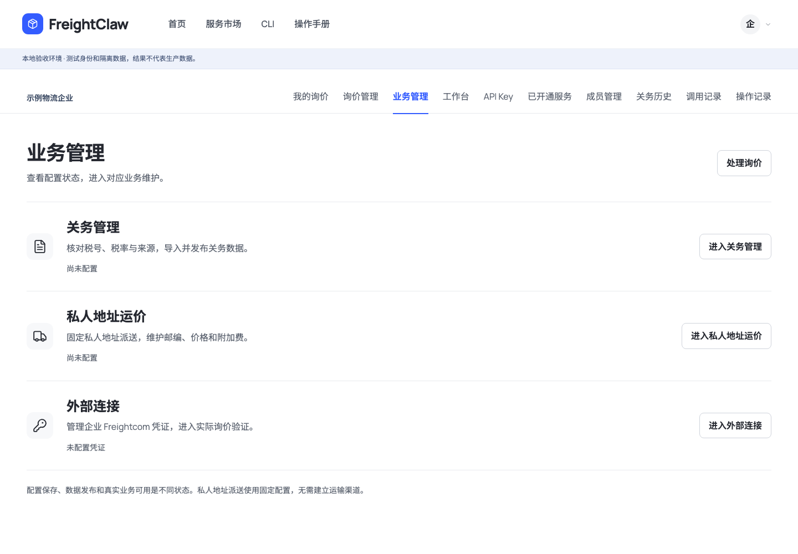
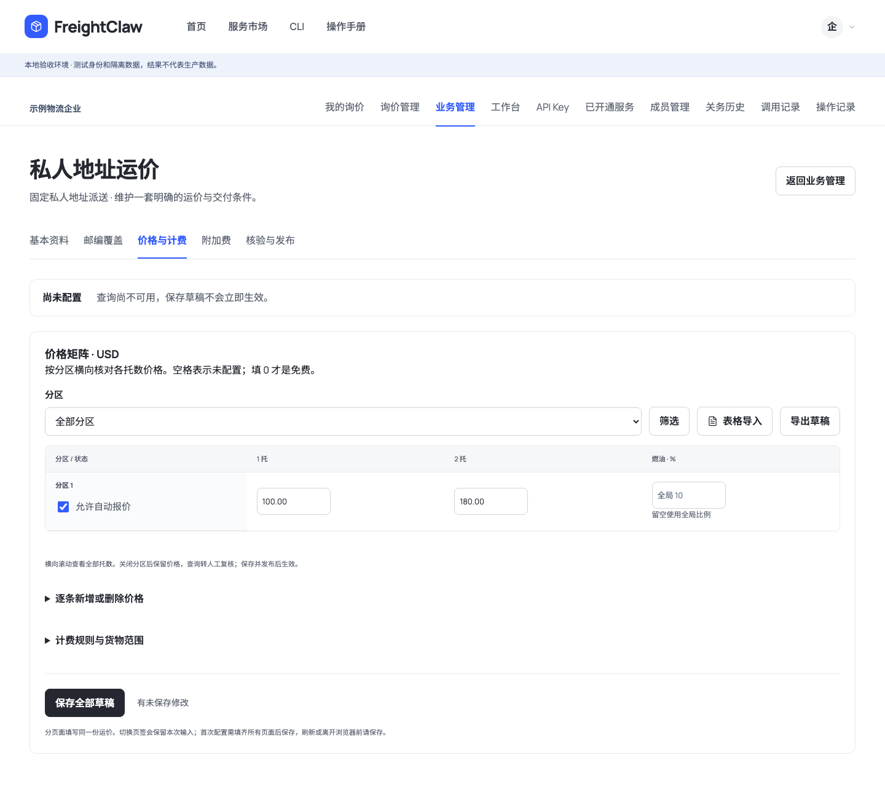
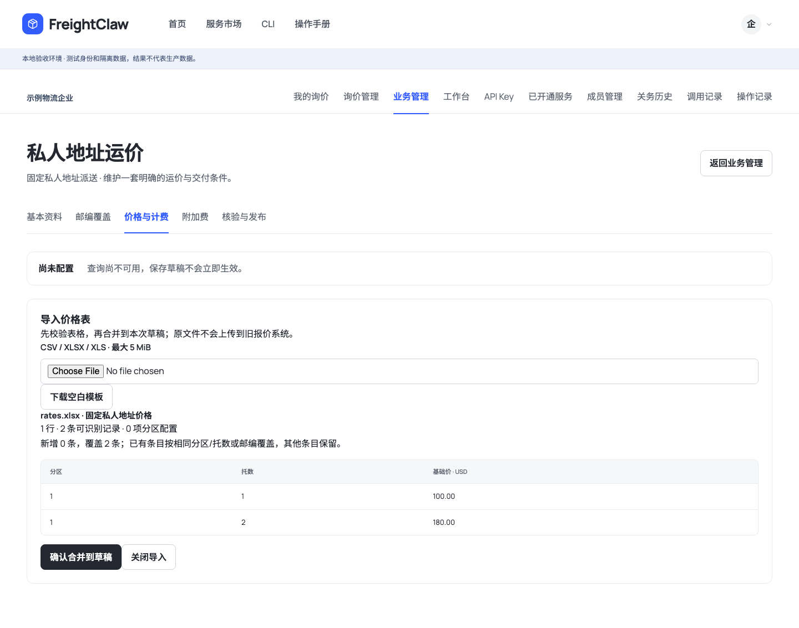
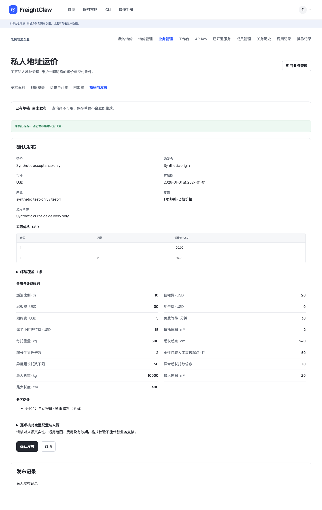
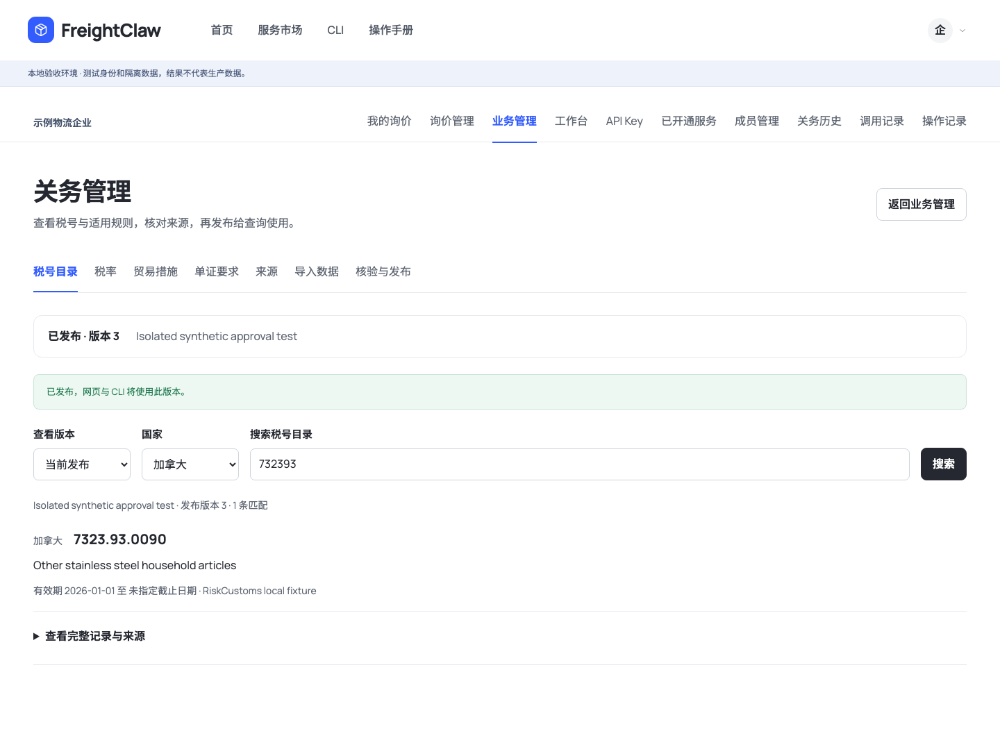

# 业务后台独立页面与固定私人地址配置移植

## 实际范围

原报价后台的日常配置能力已移入 FreightClaw native business：价格矩阵、分区和邮编筛选、分区启停与燃油覆盖、表格导入预览、模板和导出、附加费与计费规则、可读的发布核验。私人地址维持每企业一套固定派送配置，没有新增渠道。

来源是本地冻结源码副本 `canada-final-mile-auto-quote@e7d26d9711ea2183dacea9ab6016008f5ad64ff1`。具体文件及哈希在 [provenance](../../services/quote-native/provenance.json)。该副本与原网页当前部署是否完全一致尚未核验；原线上后台本轮只看到登录页，没有读取或修改生产配置。

原 React 管理界面的矩阵分组、表格格式识别与操作流程适配为新站组件及网页/CLI 共用的 TypeScript 转换逻辑，价格仍由已迁移的 Python Decimal 核心计算。原系统的默认旧数据、账号、凭证、AI、邮件和企业微信设置没有复制进此业务配置。业务配置继续从空白开始。

## 页面职责

| 页面 | 负责什么 |
| --- | --- |
| 业务管理 | 关务、固定私人地址、外部连接的真实配置状态与统一入口 |
| 私人地址 · 基本资料 | 固定始发仓、来源、有效期、客户交付条件 |
| 私人地址 · 邮编覆盖 | 分区/城市/邮编筛选，逐行及表格批量维护 |
| 私人地址 · 价格与计费 | 分区 × 托数矩阵、启停、燃油覆盖；展开新增/删除及计费阈值 |
| 私人地址 · 附加费 | 住宅、尾板、地牛、预约、燃油与等待费用 |
| 私人地址 · 核验与发布 | 直接核对价格与费用，确认发布、停用、历史回退 |
| 关务管理 | 税号、税率、措施、单证、来源分别检索；导入和发布单独页面 |
| 外部连接 | Freightcom 企业凭证配置与实际询价入口 |
| 工作台 | 本人真实询价状态、继续处理和快捷操作 |
| 服务市场 | 发现服务与进入对应工作页面 |

账号菜单和页内导航的「业务管理」现在指向同一入口。旧渠道资料页保留兼容路径，明确不参与固定私人地址计价。旧报价记录不再作为全局个人中心主入口；本次没有把规则试算包装成已保存或已发出的正式报价。

## 日常维护

1. 首次填写基本信息和完整规则，可从空白 CSV 模板或原后台格式导入价格/邮编。
2. 表格在本机读取，展示错误行、工作表名和新增/覆盖数量。CSV、XLSX、XLS 上限 5 MiB / 5000 行 / 100 列，不接受公式或跨固定始发仓数据。
3. 确认导入只合并到本次编辑草稿；未涉及条目保留，空矩阵格不当成零。低频参数可展开维护。
4. 保存全部草稿，再核验和确认发布。网页和 CLI 只使用当前发布；停用分区转人工复核，独立燃油覆盖参与实际 Decimal 计算。
5. 手机保持正常字号和 44 px 触控区域；页签及大矩阵可局部横向滚动，矩阵每组最多 20 个分区 × 20 个托数列，避免大表阻塞页面。

所有能力保留 CLI：当前构建有 **43 条 workspace 命令**，新增 `customs-data browse`、`residential-rates import-preview`、`residential-rates export`。表格预览不写库，返回可审阅的 `save_input`，沿用既有保存/核验/发布命令。详见 [操作说明](../../apps/console/native-business.md)。

## 本地验证记录

- `npm run typecheck`、`npm run lint`：通过。
- `npm run validate:schemas`：17 schemas / 11 examples，以及 42 Access Gateway schemas 通过。
- `npm run generate:native-schemas`：生成 16 份严格 native 管理 Schema。
- `npm run validate:agent-standards`：14 standards、6 profiles、5 modules、5 resources 通过；`npm run build:agent-pack` 生成 14 standards。
- `npm run build`、`npm run build:cli`：通过。
- 相关回归：`npx vitest run tests/access-gateway tests/customs-native tests/quote-native tests/e2e/freightclaw-cli.test.ts tests/e2e/freightclaw-cli-package.test.ts tests/e2e/application-business-mcp.test.ts --maxWorkers=2`：400 通过、7 跳过；跳过项不算已验证。
- `tests/e2e/portal-browser/native-business-flow.mjs`：11 项本地浏览器/构建 CLI 联动检查，0 页面错误。覆盖表格导入、矩阵编辑与跨页保留、同价核对、草稿隔离、发布/停用/回退、CLI 导出、关务测试数据阻断与检索、人员权限及承运商参数拦截验证。
- 最后修复后：CLI 安装包与表格转换专项 8 项通过；重新构建与网页/CLI 11 项联动检查通过。独立审查使用默认 agent 替代 finish reviewer，手机首屏、可读发布核验与折叠入口问题均关闭，最终修复评分 `ship`；不代表生产就绪。
- 截图尺寸：桌面 1440 × 1000、手机 390 × 844，完整页面截图高度随内容变化。全部使用隔离合成数据。

## 截图

统一业务入口：

价格矩阵，低频设置折叠：

导入先核验再合并：

发布时核对实际价格和费用：

关务数据独立检索：

手机价格矩阵：

## 尚未代表完成的事项

本轮是本地代码与隔离数据验收，未部署生产，没有导入正式运价、官方关务全量数据或真实 Freightcom 凭证。旧系统当前生产功能和本地冻结提交的差异未核对。现有 native 关务导入仍接受归一化 JSON，不解析任意官方 PDF/HTML；报价导出 PDF、邮件订舱、OCR/SO 等后续业务不由本轮页面移植自动完成。
