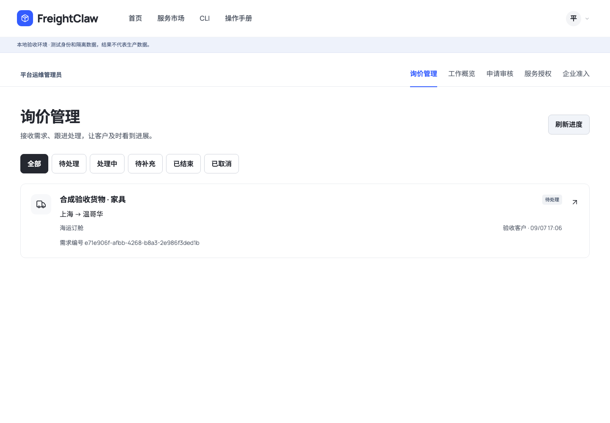
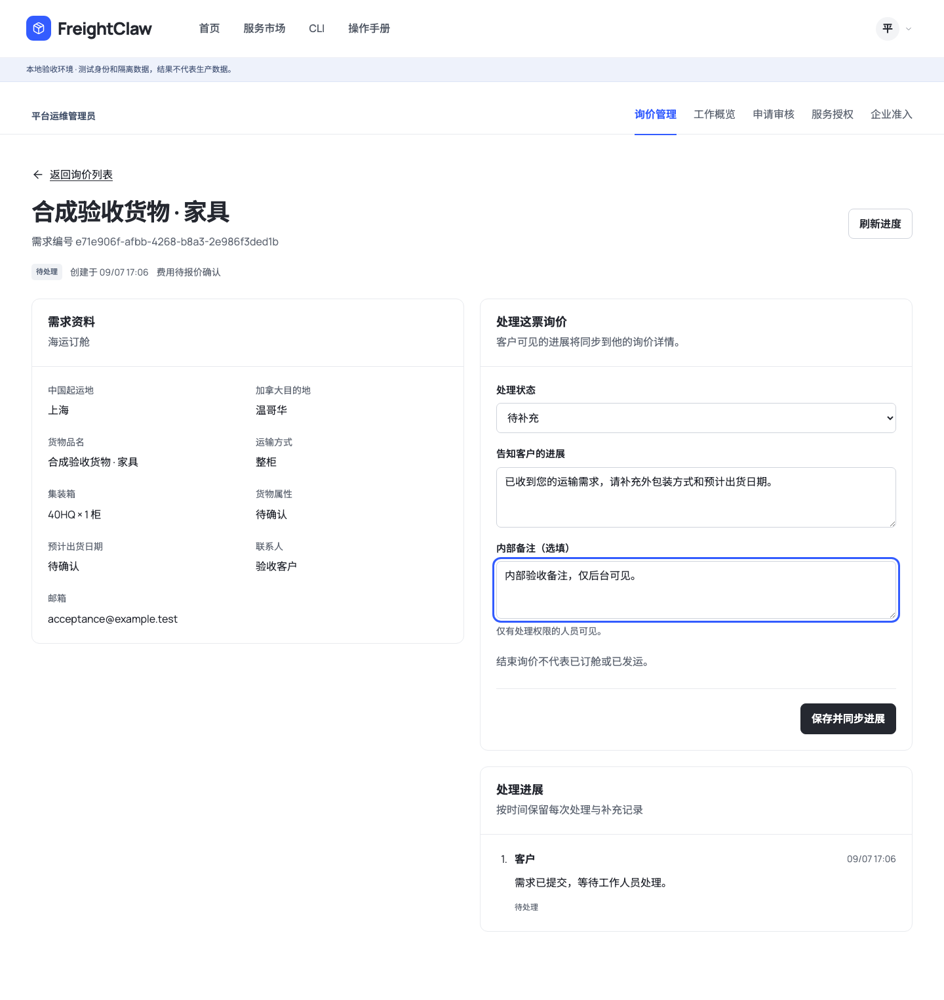
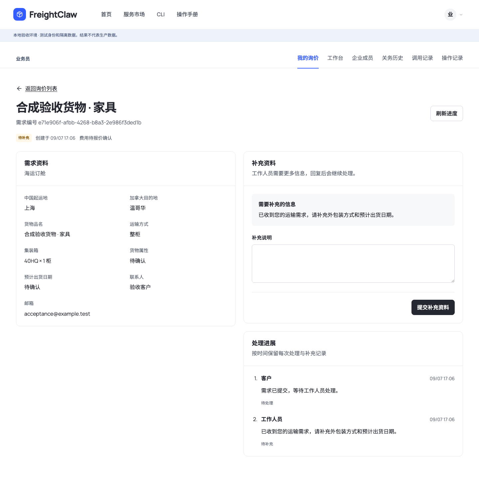

# 前后台打通 · 第一阶段交付

范围：在线询价受理与进度协作。此文记录代码和隔离验收结果，不表示生产已经启用，也不表示报价/关务引擎已经迁移完成。

## 用户流程

1. 货主在 `/inquiry/` 选择服务、填写需求、确认联系方式。浏览与填写无需登录。
2. 保存线上需求时使用现有账号；未登录可在新窗口登录，当前页保留已填写内容，返回再提交。也可选择原有邮件询价方式。
3. 提交成功得到需求编号，点击“查看询价进度”进入详情。账号菜单的“我的询价”可找回记录。
4. 工作人员进入账号菜单 → 询价管理，按待处理、处理中、待补充、已结束或已取消筛选。
5. 后台填写客户可见的进展与可选内部备注，保存后前台刷新即可看到进度；需要补充时，客户可回复，后台读取同一条回复。

这里的“同步”是同一记录、提交后读回，以及打开/刷新页面读取最新状态；尚未实现实时推送或邮件提醒。

## 与前台一致的后台

复用 Console 当前的 Manrope / Noto Sans SC、现有图标、黑色主按钮、蓝色强调、白色面板、12px 圆角和宽版布局。后台没有另换管理模板。桌面详情分为需求资料与处理区；手机优先呈现处理操作和进展，再显示资料。未接收需求时只展示空状态。

以下均为本地合成验收数据，不是客户真实资料。







手机端：[客户详情](assets/cases-20260907/customer-mobile.png) · [后台处理](assets/cases-20260907/management-mobile.png) · [我的询价](assets/cases-20260907/list-mobile.png)。

## 当前边界

- 新需求保存在独立业务库；不导入旧配置或旧历史，不改变账号及 API Key。
- 普通客户只能看自己的需求；企业管理员只处理当前有效企业的需求；平台 operator 在平台上下文处理全队列。
- 内部备注由服务端过滤；重复提交、并发旧版本、越权访问均由服务端拒绝或安全重放。
- 费用仍待报价。结束询价不表示确认价格、订舱、支付或发运。
- 首版只支持单实例 SQLite；共享 Postgres 模式拒绝启用。生产需显式 `PORTAL_CASES_ENABLED=true`，默认关闭。
- 新库内有需求资料、处理事件（含服务端 actor_id）及幂等记录；目录/文件权限复用 Portal 持久化控制。初始化版本为 1，不兼容版本拒绝运行。

契约、状态迁移、初始化与回退见 [询价受理 RFC](../rfcs/2026-09-07-portal-business-cases-v1.md)。

## 验收与复现

浏览器脚本 `tests/e2e/portal-browser/cases-flow.mjs` 只允许 loopback，使用隔离 fixture 服务、独立客户/后台会话，真实执行提交和更新；它不拦截 API，也不发送邮件。覆盖匿名保留表单、登录提交、后台要求补充、内部备注过滤、客户回复、后台读回、账号菜单，以及 1440 / 1920 / 390 像素布局。

```sh
npm run build
PORTAL_FIXTURE_PORT=8906 PORTAL_FIXTURE_DIRECTORY=.runtime/cases-acceptance-unique node dist/src/logistics_mcp/server/portal-fixture.mjs --fixtures
# 另开终端，配置本地安装的 Playwright 与 Chromium 路径：
PLAYWRIGHT_MODULE=/absolute/path/to/playwright/index.mjs CHROMIUM_EXECUTABLE_PATH=/absolute/path/to/chromium node tests/e2e/portal-browser/cases-flow.mjs
npm run typecheck
npm run lint
npm run validate:agent-standards
npm run build:agent-pack
npm run validate:schemas
npx vitest run tests/access-gateway tests/e2e/shipper-inquiry.test.ts tests/e2e/portal* --maxWorkers=2
```

本次实际输出：68 个测试文件通过、2 个跳过；306 项测试通过、7 项跳过。跳过项为未提供隔离 Postgres 环境的集成测试，不计入通过。类型检查、代码检查、17 个平台 Schema / 11 个示例、33 个接入 Schema，以及 14 项 Agent 标准的校验与构建均通过。浏览器 12 项检查通过，脚本错误为 0；截图包含 1440、1920 和 390 像素视口。独立设计复核的四项修改均判定 resolved，结论只覆盖本轮修改。

每次完整脚本使用新的隔离 fixture 目录，因为它首先验收空列表。Schema 可用 `node --import tsx/esm deploy/scripts/generate-case-schemas.ts` 重建；运行时还有共享询价模型的跨字段校验。

## 后续执行顺序

| 阶段 | 交付 | 前后台验收方式 |
|---|---|---|
| 1 | 询价受理、需求详情、进度与补充资料 | 本次已实现；生产尚未启用 |
| 2 | 运价、邮编分区、附加费、关务数据及供应商配置后台；原生引擎迁移 | 后台空白配置→校验发布→前台按已发布版本计算，未配置明确不可用 |
| 3 | 报价版本、导出与文件中心 | 客户及后台下载同一份固定版本报价 |
| 4 | OCR 与 SO 识别、人工确认 | 原文件→候选字段→人工确认→关联同一票业务 |
| 5 | 邮件订舱、回执与任务管理 | 草稿→人工审核→显式发送→回执；发送成功不等于订舱成功 |

完整范围继续以 [自有引擎与新后台规划](2026-09-07-native-business-admin.md) 和 [业务扩展路线](2026-09-07-logistics-workflow-roadmap.md) 为准。
