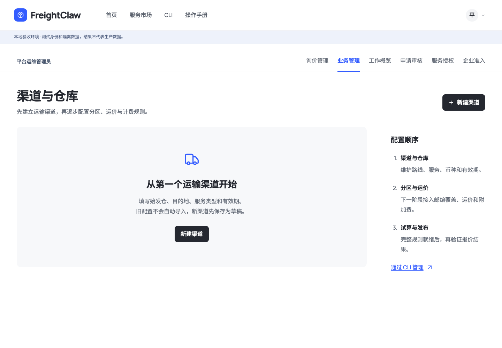
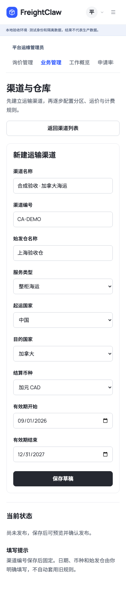
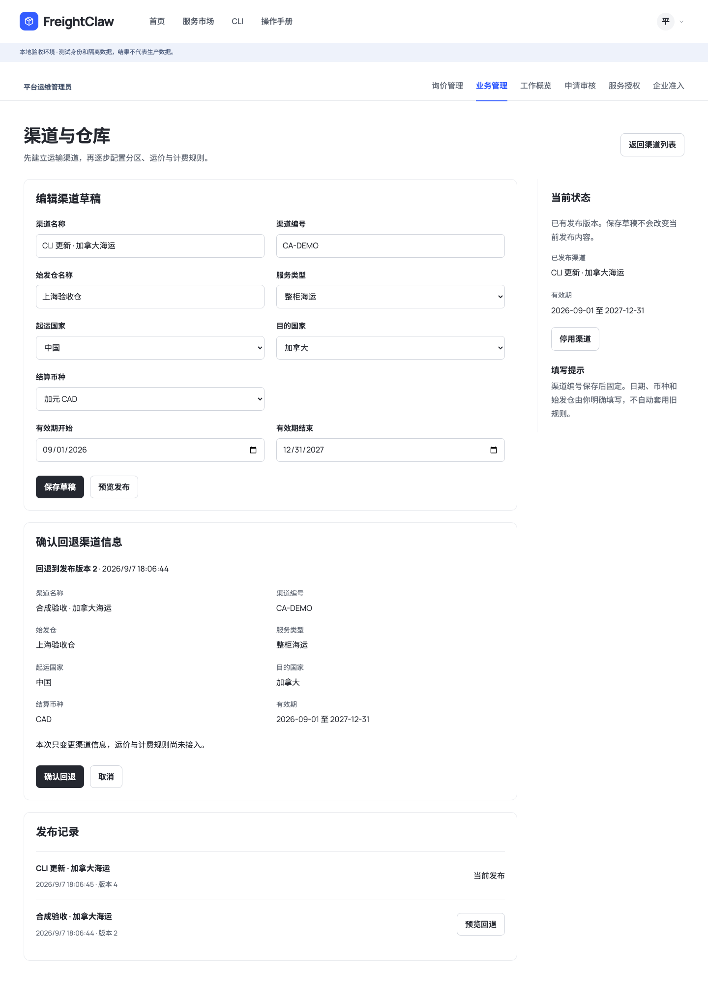
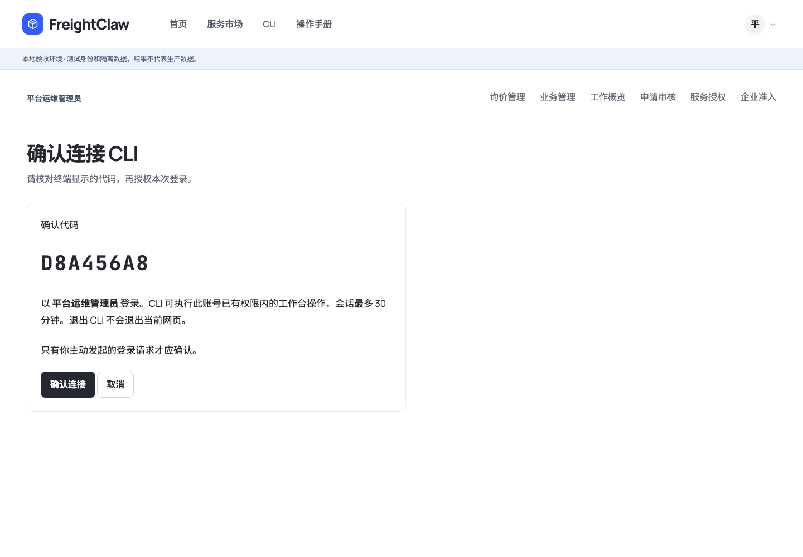

# 渠道配置与 CLI：本地交付记录

日期：2026-09-07。开发分支：`codex/native-business-admin-20260907`。本阶段未合并 main、未部署生产，也未导入原服务配置。所有截图来自隔离本地验收环境，名称与仓库均为合成资料。

## 已完成

- 后台新增“业务管理 → 渠道与仓库”，复用前台字体、图标、导航和视觉风格；适配 1440/1920 桌面与 390 手机。
- 空白配置起步，明确填写路线、仓库、运输类型、币种和有效期。保存草稿、完整预览、确认发布、停用、发布历史与指定版本回退已接通独立持久化。
- 草稿与已发布内容分开；未保存修改不会被旧预览覆盖。发布和回退确认内显示完整字段、版本，回退明确显示所选历史内容。
- 新增 `workspace` CLI 18 个具名管理操作（含渠道、询价、身份/企业状态），另有登录、退出、命令目录及输入 Schema。网页确认后签发独立会话，退出 CLI 不退出浏览器，旧应用 Key 不增权。
- 客户从 CLI 提交和补充询价，管理员从 CLI 处理进度；网页/CLI 读取同一记录，内部备注按角色过滤。
- **后续所有功能的完成条件是网页、API、CLI 一起交付和验收。** 已写入原生后台计划与工作流路线图。

## 截图与操作

从空白渠道开始，既有规则不会自动进入新后台：

手机上字段按单列排列，保存前由使用者明确填写：

回退确认显示目标历史版本的完整内容；当前草稿继续保留：

人员 CLI 登录由网页登录确认；图中代码属于已消费的本地合成验收请求，不是凭证：

## 实际验证

| 检查 | 实际结果 |
| --- | --- |
| `npm run typecheck` | 通过 |
| `npm run lint` | 通过 |
| `npm run build` / `npm run build:cli` | 通过 |
| `npm run validate:schemas` | 17 个领域 Schema、11 个示例、42 个 Access Gateway Schema 通过 |
| `npm run validate:agent-standards` | 14 个标准、6 个 profile、5 个模块、5 个资源通过 |
| `npm run build:agent-pack` | 生成 14 个标准 |
| `npx vitest run tests/access-gateway tests/e2e/freightclaw-cli.test.ts tests/e2e/freightclaw-cli-package.test.ts --maxWorkers=2` | 73 文件通过、2 文件跳过；326 测试通过、7 测试跳过 |
| `tests/e2e/portal-browser/channels-cli-flow.mjs` | 8 项交叉流程通过，0 页面脚本错误；含真实构建 CLI 子进程与浏览器确认 |
| `git diff --check` | 通过 |

交叉流程：空白页面 → 未保存修改保护 → 网页草稿/预览/发布 → CLI 修改并发布/网页读回 → 网页回退/CLI 读回 → 越权拒绝 → CLI 客户提交、管理员处理与客户补充/内部备注过滤 → 独立 CLI 退出。

界面审阅使用独立通用 Agent 执行 Impeccable 降级审阅规范，替代当前环境未提供的专用角色。首轮 `fix` 指出确认内容不完整；补齐后四张复核截图的结论为 `ship`，仅表示该项确认页修复已解决，不是生产就绪或全部系统无问题的声明。设计检测执行一次，其新字体阶梯提示为 advisory，独立审阅按既有系统和可读性检查。

## 本地打开与 CLI 使用

预览：`http://127.0.0.1:8907/console/#channels`。使用登录页“本地体验账号”中的平台管理员，按账号、密码、图形验证码登录。此目录保留此前询价演示记录；新渠道库为空。验收写入位于其他独立 fixture 目录。

[管理 CLI 完整说明](../../apps/console/workspace-cli.md) 包含构建、浏览器确认、输入示例、发布/回退、幂等和退出。CLI 安装包内附 `workspace.md`。官网 v0.1.0 下载包尚未更新，本地开发命令由当前分支构建。

## 尚未完成

渠道当前只保存元信息，`ready_for_quotes` 始终为 false。邮编分区、运价、附加费、原生关务发布、OCR、报价导出、邮件订舱、SO 识别继续按路线图推进；既有成员、授权、个人历史等网页仍有 CLI 覆盖缺口。

人员 CLI 授权目前只在本地 fixture 启用。生产多实例授权存储、限流、正式身份验收、迁移备份恢复、权威业务规则与真实调用验收需单独交付。本阶段不代表原服务迁移完成或报价数据已经可用。
