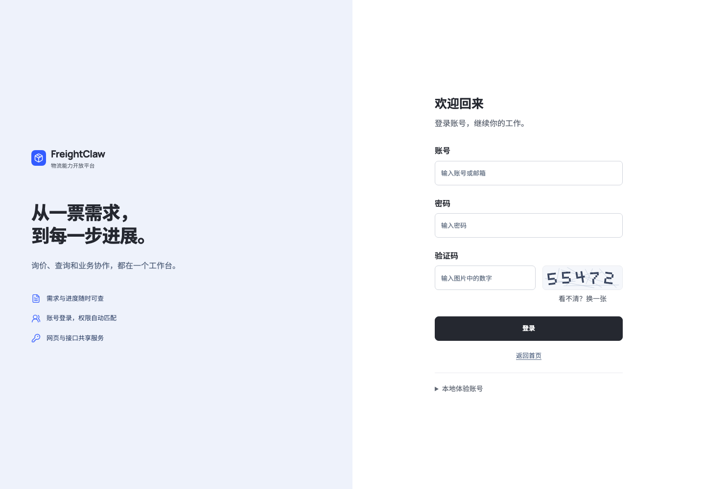
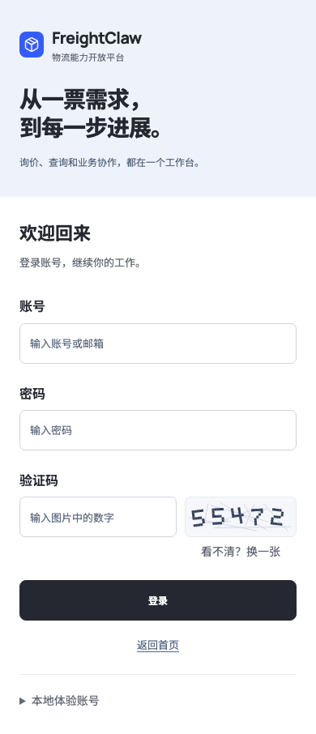

# 登录与用户类型调整（本地验收）

更新日期：2026-09-07。此次调整针对本地预览中的身份选择和登录体验，正式站身份服务尚未切换。

## 用户看到的变化

- 登录页使用账号、密码、图形验证码三个输入项，取消五个测试身份选择按钮。
- 输入账号后由服务端确定身份。业务用户默认进入“我的询价”，平台管理员默认进入“询价管理”；业务流程已保存的登录后返回地址优先。
- 成员邀请只提供“业务用户”和“管理员”两个常用选项。已有接口权限、企业负责人和平台审核权限仍独立保留，不迁移或扩大旧账号权限。
- 前后台继续使用同一套白色、深色文字、浅蓝背景与开源字体样式。手机上改为上下布局。

本地登录地址为 `/console/#login`。启动命令见 README，端口以本地启动输出为准。

| 本地账号 | 用途 | 本地体验密码 |
| --- | --- | --- |
| `user` | 业务用户 | `FreightClaw2026!` |
| `admin` | 平台管理员 | `FreightClaw2026!` |

这些是公开的合成验收账号，不是正式账号；请勿向本地表单输入正式密码。页面底部“本地体验账号”可展开查看。

## 实现与边界

图形验证码由服务端生成，有效期 120 秒；绑定会话与地址，刷新后旧图失效，每次校验后消耗。账号、密码或验证码不正确时统一提示，清空密码和验证码并加载新图。每个地址在 10 分钟窗口内最多失败 10 次，超限暂时限制尝试；成功后清除该地址的失败计数。

`/console/api/v1/login/captcha` 与 `/console/api/v1/login/password` 仅在本地 fixtures 身份提供方启用。后者检查来源、CSRF、请求字段和体积，身份由服务端映射，成功后轮换会话。生产模式拒绝这两条本地认证接口。原 fixture-login API 仅继续供隔离的权限回归使用，不再作为可见登录入口。

正式站继续使用 Authentik/OIDC。此次没有更改生产密码、用户组、数据库或身份服务配置；本地固定密码与验证码实现不能直接作为正式认证服务发布。正式图形验证码登录仍需与真实账号身份服务接通并另行验收。

## 验证记录

| 检查 | 实际结果 |
| --- | --- |
| `npm run typecheck`、`npm run lint`、`npm run build` | 通过 |
| `npm run validate:agent-standards`、`npm run build:agent-pack` | 14 项标准验证与打包通过 |
| `npm run validate:schemas` | 通过 |
| `npx vitest run tests/access-gateway --maxWorkers=2` | 297 通过、7 跳过；跳过项为需独立 PostgreSQL 环境的集成测试 |
| 增加生产禁止测试后，`npx vitest run tests/access-gateway/portal-http.test.ts tests/access-gateway/portal-form-login.test.ts --maxWorkers=2` | 6 通过 |
| `tests/e2e/portal-browser/login-flow.mjs` | 4 项浏览器检查通过，0 JavaScript 错误 |
| 实际输入随机图形验证码的本地验收 | 7 项检查通过：1440/390/1920 布局、刷新、错误清空、两类账号在手动刷新后成功登录并跳转；0 JavaScript 错误 |

浏览器回归通过 `PORTAL_BASE_URL` 指定隔离本地地址；可用 `PLAYWRIGHT_MODULE` 和 `PLAYWRIGHT_EXECUTABLE_PATH` 指定本机 Playwright 与 Chromium。旧业务流程测试已改为通过 fixture API 安排身份，本次没有重新执行全部旧浏览器业务脚本。

独立界面复核发现“刷新完成后旧按钮内容覆盖新验证码”的问题。先新增回归复现，再修复通用按钮还原逻辑；最终复核给出 `ship`，仅表示该项刷新修复已解决，不构成新的全站审核或生产就绪结论。专用设计审查角色不可用，本次由独立代理按降级审查规范完成复核。截图仅说明本地界面，不代表生产部署或真实业务准备完成。

## 页面截图

桌面（1440 × 1000）：

手机（390 像素宽，完整页面）：

截图来源：本仓库本地构建，2026-09-07 使用 Chromium 捕获；只含合成验证码与界面文案，无客户或正式凭证。
