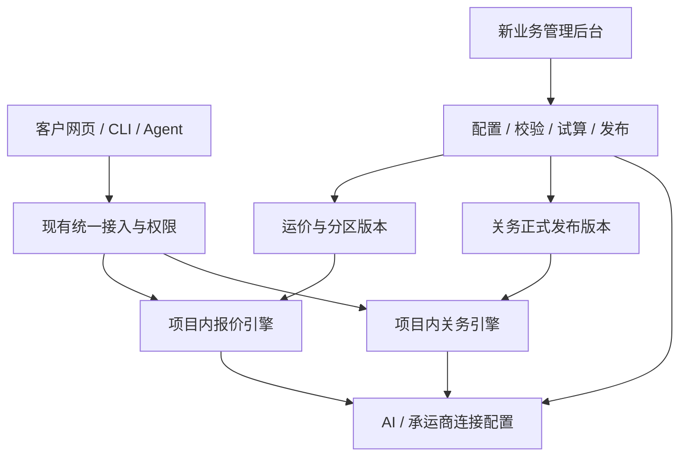

# FreightClaw 自有业务引擎与新管理后台

状态：产品方向和空白初始化已由用户确认；本文为迁移设计与源码核对结果，不代表代码迁移、后台或部署已经完成。

后续 OCR、报价导出、邮件订舱与 SO 识别纳入[业务工作台与能力扩展规划](2026-09-07-logistics-workflow-roadmap.md)。新后台设计需提前保留业务单据、文件版本、后台任务、模板和确认记录的边界；不等到接邮件或识别功能时再重建账号和业务关联。

## 已确认的选择

- 报价、关务业务代码迁入 FreightClaw 项目维护，逐步解除对原报价和关务在线服务的依赖。
- 新建面向运营人员的业务管理后台，复用现有账号、组织及 API Key；不重建一套登录系统。
- 运价、分区、附加费、业务阈值、关务发布和外部服务凭证从空白开始；旧配置只能作对照，不自动导入、不默认生效。
- 企业微信不迁移。Freightcom 和 AI 模型仍属于外部能力，需要正式连接配置。
- 继续保留海运询价入口、当前网页/CLI/API/MCP 入口、尾程登录要求和关税访客每日 20 次规则。

## 目标结构

业务代码可以放在同一仓库、同一发布流程中，同时保留独立进程和数据边界。项目内部仍可以使用 API 通信；目标是代码、配置和运行由 FreightClaw 自己管理，正常调用不再依赖旧业务网站。MCP 继续承担接入职责，业务引擎负责计算与数据，不把业务规则堆进 MCP transport。

## 新后台页面

入口建议放在账号菜单中的“业务管理”，仅对被授权的管理人员显示。平台全局配置由平台运营角色维护；企业管理员只维护自己企业的配置，不能借组织身份修改全局规则。

| 页面 | 主要操作 | 空白状态 |
|---|---|---|
| 运行概览 | 查看各服务的代码状态、配置状态、正式发布版本和失败原因 | 显示待配置事项，不能显示虚构可用率 |
| 渠道与仓库 | 建始发仓、目的范围、供应商渠道、币种与有效期 | 无启用渠道；不按省份猜起运仓 |
| 邮编与分区 | 导入/维护邮编、FSA、城市、Zone 和覆盖范围；查看冲突 | 无生效分区；未覆盖地址明确提示 |
| 运价与附加费 | 维护价格矩阵、燃油、尾板、地牛、预约、住宅和等待费用 | 全部未配置；未配置与明确免费分开 |
| 计费与货物规则 | 配置体积/重量折托、超长件、包装例外及人工复核阈值 | 没有默认业务阈值；明确单位与舍入方式 |
| 关务数据 | 导入官方数据、校验来源与生效日期、查看变更、复核发布、回退 | 无正式发布；不能将空库、样例或旧快照标为已就绪 |
| AI 与承运商 | 配置服务商、模型、正式凭证引用、超时；执行明确的连接测试 | 未连接；不显示或复制旧凭证 |
| 试算与发布 | 用草稿试算，比较旧/新结果，发布完整版本或回退 | 无待发布版本；试算不影响正式查询 |
| 记录与审计 | 查看新业务记录、查询历史、配置修改和失败请求 | 新业务记录为空；既有账号与接入审计保留 |

关务后台以数据导入、核验和发布为核心。税率不是任意调整的经营参数；修正必须关联官方来源、适用条件、生效日期与审核记录，不能只填一个百分比覆盖法规。

## 运营操作流程

1. 新建渠道或数据批次，填写必需信息；空值不转换为 0。
2. 导入配置时先展示列映射、单位、重复和冲突，不直接写入正式版本。
3. 保存草稿，完成格式、引用、有效期和覆盖校验。
4. 使用草稿执行只读试算，展示完整计费过程和缺失项；试算结果标为草稿。
5. 确认变更范围与生效时间后发布。发布操作幂等、事务化，并读回已生效版本。
6. 线上查询固定使用一个已发布版本；后续修改产生新草稿，不原地修改历史。
7. 回退使用明确选择的既有有效版本；未配置、失效或失败时不自动调用旧服务兜底。

## 源码核对与迁移方式

2026-09-07 已核对两个来源工作树，并读取 GitHub main 的提交标识：报价 `e7d26d9711ea2183dacea9ab6016008f5ad64ff1`，关务 `50aa174b6316c6b24d2df7f49aa51fbdf70d9d51`。报价本地工作树仍基于 `15b55f1` 且有未提交改动；关务工作树有大量“ 2”后缀未跟踪副本。正式导入必须按冻结提交逐文件确定来源，不能递归复制整个工作目录。

| 来源模块 | 可复用内容 | 迁入前必须处理 |
|---|---|---|
| quote_engine/zone_engine.py、zone_lookup.py | 分区匹配与报价编排、冲突拒绝、匹配过程 | 去除省份到仓库的隐式经营规则；改为显式已发布渠道配置 |
| quote_engine/zone_pricing.py、zone_config.py | Decimal 费用计算、附加费与总价拆分 | 清除燃油、附加费、等待时间、区域上限等默认配置；配置缺失即阻断 |
| quote_engine/pallet_calculator.py | 计费托数分项与超长/包装处理 | 当前存在 2 CBM/托、500 kg/托、240 cm 等硬编码规则；改为显式配置并增加回归案例 |
| 资料提取模块 | 输入校验、字段提取与确认流程 | 保留否定词与证据；失败不当成功；不自动套用商业地址等默认值 |
| RiskCustoms shared/domain 与 worker/rules | 编码规范化、税则/措施/单证判断、Decimal 税费估算 | 从运行环境中解耦，保持来源与有效期、人工复核语义 |
| RiskCustoms query-service 与 repositories | 三国归类查询、后续问题、版本与发布校验 | 替换仓储装配；生产启动不得隐式选择 fixture assistant/repository |
| 现有 Portal 接入平台 | 登录、组织、授权、统一 Key、访客额度和审计 | 扩展新后台的窄管理操作；现有 Key 不重发、不自动扩大权限 |

已有公式可复用，但原问题也需要对应的失败案例和修复。没有配置不能通过“35% 燃油”“50 USD 附加费”“2 CBM/托”等旧常量继续算价。测试可以显式使用合成参数，但测试数据不得成为初始生产数据。

## 实施顺序与验收

1. **冻结与清理源码**：建立来源清单、提交、文件哈希、依赖和许可证记录；剔除旧 UI、旧登录、通知、缓存、旧导出界面、凭证和业务数据。保留有价值的报价记录/审核/PDF 渲染核心、正确边界及测试，按新文件和版本模型迁移。
2. **空白配置后台与报价引擎**：先完成渠道/分区/计费/价格/附加费的草稿、导入、试算、发布和回退闭环；断开原报价域名仍可用新配置计算。
3. **关务引擎与数据发布后台**：迁入查询和估算核心，使用新数据空间；建立官方数据导入和发布流程。无正式发布时保留不可用，不解除测试数据保护。
4. **AI 与 Freightcom 配置**：新后台管理安全配置；失败提示可定位；模型只提取和解释，不生成经营费率或税率。
5. **接入与上线验收**：同一账号、Key、CLI 和 MCP 调用新引擎；对比多币种、有效期、未覆盖区域、超限、跨企业拒绝、配置重启持久化和回退；完成桌面/移动端实测。

每阶段明确区分“代码已迁入”“配置可保存”“试算通过”“正式版本已发布”和“生产切换已验证”。旧服务保留到切换验收结束；切换不删除旧系统，也不自动导入旧业务记录。

## 完成标准

- 禁止访问两个旧业务域名的隔离验收中，已配置的内部报价与关务功能仍能完成真实计算。
- 初始新库没有有效运价、分区、附加费、关务快照、模型或承运商凭证。
- 管理员通过后台完成配置闭环，无需修改代码、数据库或服务器环境文件来维护日常业务规则。
- 仅有已发布、有效期内、属于当前业务主体的数据能进入正式查询。
- 公开 API 和 CLI 的输入、状态和现有权限保持兼容；不因业务代码迁移而扩大工具权限。
- 计费差异有可追溯的输入、公式、规则版本和理由；缺来源、缺配置和失败均不能伪装成成功。
