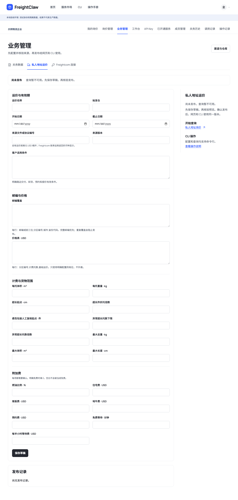
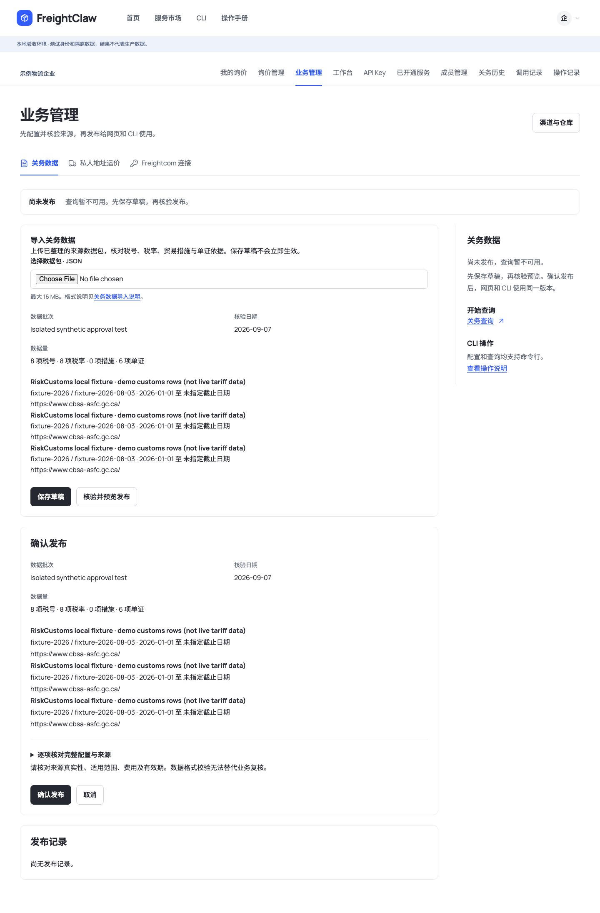
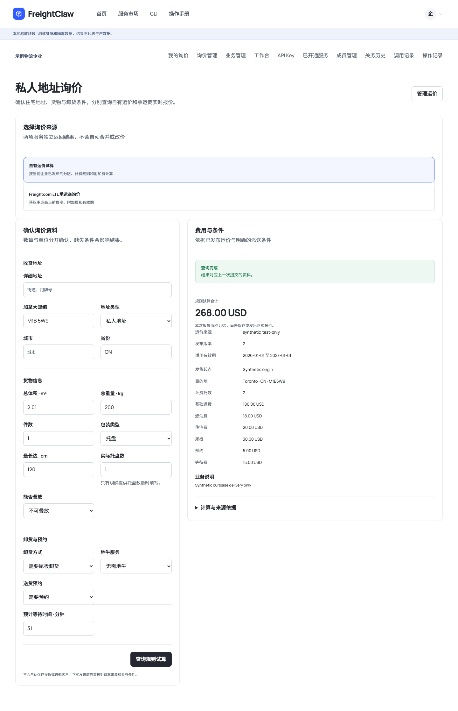
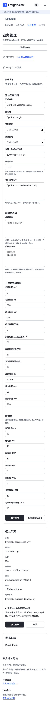

# 关务与私人地址询价：本地交付记录

日期：2026-09-07。范围：当前开发分支的原生业务后台、网页、CLI 与隔离合成验收；本记录不代表生产已升级。

## 已实现的业务流程

| 功能 | 网页 | CLI | 就绪边界 |
| --- | --- | --- | --- |
| 关务数据管理 | 规范化 JSON 上传、保存、来源预览、确认发布、停用、历史回退 | `workspace customs-data get/save/preview/publish/disable/rollback` | 正式来源数据尚未导入 |
| 关务查询 | 保留税号候选、国家结果、税率、措施、单证、版本和来源 | `workspace customs query` | 查询读取当前企业明确发布的数据；测试数据不允许发布 |
| 税费估算 | 单笔与批量，保留需复核结果 | `workspace tax estimate/batch` | 跨币种需要有来源及有效期的汇率，无汇率不换算 |
| 个人关务历史 | 当前用户的查询及税费快照 | `workspace customs-history list/get` | 企业和用户范围隔离，服务身份不生成个人记录 |
| 自有私人地址运价 | 邮编、分区、托数档位、计费阈值、住宅及服务附加费、条件、有效期 | `workspace residential-rates get/save/preview/publish/disable/rollback` | 从空白开始，明确零费用，缺失、冲突和过期不补价 |
| 自有运价询价 | 住宅地址、货物、尾板/自卸、地牛、预约、等待费 | `workspace quote self` | 当前自有运价合同为 USD；不是已批准或已发送的正式报价 |
| Freightcom | 企业加密凭证管理、住宅 LTL 询价、原币种结果 | `workspace freightcom get/save/disable`、`workspace quote freightcom` | 正式凭证未录入，真实承运商费率待适配验证 |

后台入口 `#business-admin/customs-data`、`#business-admin/residential-rates`、`#business-admin/freightcom`；私人地址询价入口 `#quote/private`。企业管理者修改业务配置，普通业务成员查询已授权服务。应用 Key 不自动获得后台管理权。所有后台变更通过显式资源接口，采用企业/人员上下文、幂等键、版本检查和读回。

## 移植来源与运行方式

关务核心来自 RiskCustoms 固定提交 `50aa174b6316c6b24d2df7f49aa51fbdf70d9d51`；自有运价计算来自 canada-final-mile-auto-quote 固定提交 `e7d26d9711ea2183dacea9ab6016008f5ad64ff1`。各自的 `services/*-native/provenance.json` 保存文件、源版本、SHA-256 和本地适配说明。没有迁入旧数据库、旧业务配置、旧凭证或上游测试数据到正式运行入口。当前移植属于仓库所有者授权的内部使用，未凭空补写开源许可证。

关务查询、税率与税费规则在 FreightClaw 进程内运行；自有运价以本地 Python Decimal 核心计算。Freightcom 仍然调用承运商正式 API，因为当前费率由承运商产生。网页与 CLI 调用同一个服务，分别保留两种报价来源，不自动合并币种或改写金额。

新后台默认不启用。生产启动需要 `PORTAL_NATIVE_BUSINESS_ENABLED=true`，并按企业显式启用原生连接；未配置、未发布或失败时不回退旧服务。当前只支持单实例 SQLite，PostgreSQL 多实例会明确拒绝。加密主密钥与数据库须共同保管；已存在凭证却丢失密钥时拒绝启动，避免静默换密钥。

详细输入格式、配置要求和 CLI 示例见 [操作说明](../../apps/console/native-business.md)。当前分支构建的 CLI 有 40 条 workspace 命令，另保留 9 条应用 Key 业务命令。官网旧 `0.1.0` 下载包未由本轮更新；需要本分支重新构建安装。

## 本地验收

- 相关回归：`npx vitest run tests/access-gateway tests/customs-native tests/quote-native tests/e2e/freightclaw-cli.test.ts tests/e2e/freightclaw-cli-package.test.ts tests/e2e/application-business-mcp.test.ts --maxWorkers=2`：392 通过，7 跳过。跳过项依赖额外环境，不计作已验证。
- `npm run typecheck`、`npm run lint`、`npm run build`、`npm run build:cli`：通过。
- `npm run validate:schemas`：17 个领域 Schema / 11 个示例、42 个接入网关 Schema 通过；新增 11 个原生后台 Schema 的编译与生成一致性由回归测试校验。
- `npm run validate:agent-standards`、`npm run build:agent-pack`：14 个标准、6 个 profile、5 个模块、5 个资源校验通过并生成标准包。
- 网页与构建后 CLI 的 8 项联动验收通过，0 个页面错误、无横向溢出；Freightcom 的住宅 / B2C、尾板或自卸及预约条件只做本地请求捕获，没有真实承运商调用。
- 本地浏览器脚本：`tests/e2e/portal-browser/native-business-flow.mjs`，使用独立 fixture 目录和本机回环地址；桌面 1440 × 1000、手机 390 × 844。
- 合成报价预期：基础 180 + 燃油 18 + 住宅 20 + 尾板 30 + 预约 5 + 等待 15 = **268.00 USD**。变更草稿不改结果，确认发布后变为 273.00，停用后不可查询，回退恢复 268.00。这些数字只用于测试，不是可对客运价。
- Docker 运行层已加入 Python；本机 Docker 服务未运行，因此没有完成镜像构建验收。Node/Python 本地构建与真实子进程计算已验证。

## 界面说明

截图均来自隔离的本地合成环境，顶部保留测试环境标识。用户的本地预览使用另外的空白业务配置库。

先确认当前企业与发布状态，再填写运价、适用条件、覆盖和费用。保存草稿不会影响查询。

关务发布预览列出数据批次、核验日期、数量和来源；完整配置可展开逐项检查。格式校验不能代替来源真实性与覆盖范围的业务审核。

结果展示币种、来源、发布版本、有效期和费用拆分；尾板、自卸和预约由用户明确选择。

手机保持相同字体、控件和图标体系，当前发布状态位于表单前，避免滑到页面末尾才知道是否生效。

## 尚未交付的生产条件

正式关务数据包、经过复核的自有运价和 Freightcom 企业正式凭证仍为空；本轮没有生产数据库迁移、线上切换或承运商真实询价。生产发布前需要对已配置的数据、账号和具体业务逐项读回。OCR / SO 识别、邮件订舱及原生报价记录导出属于后续范围，本轮不会伪装为可用功能。
