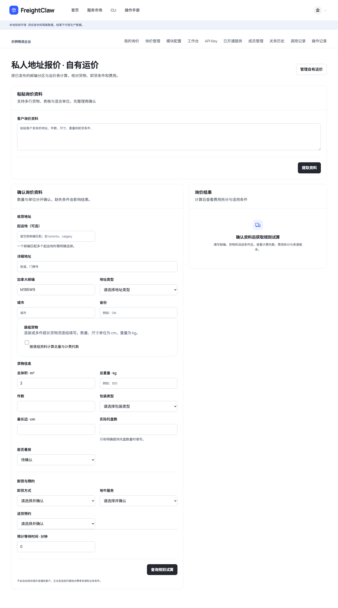
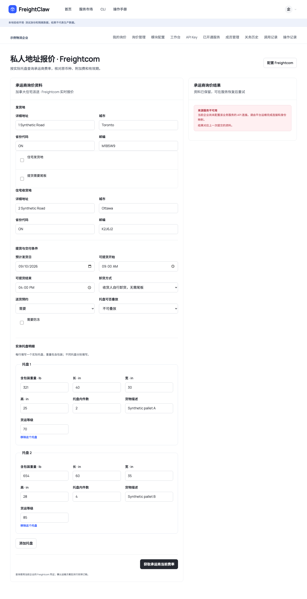
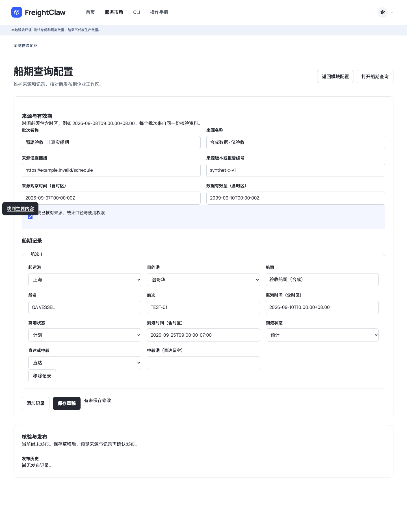
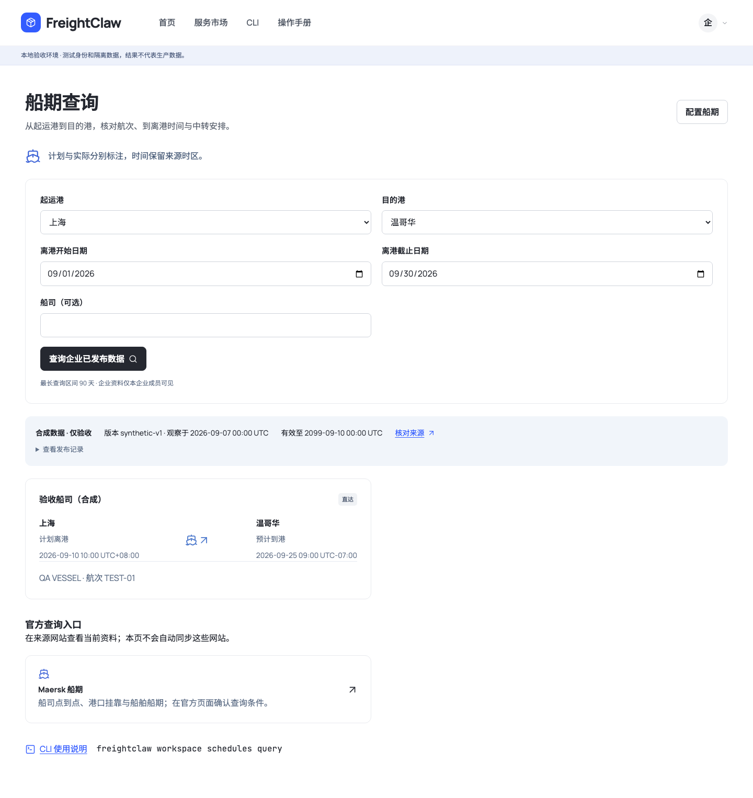
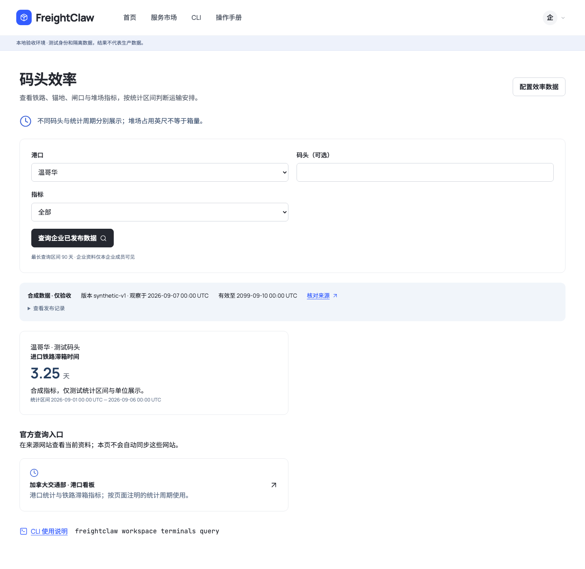
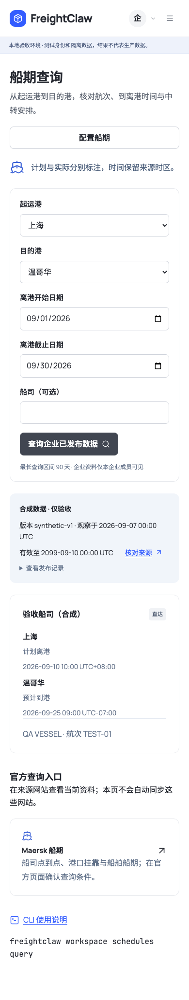

# 独立报价、船期与码头效率

本次为本地功能交付。新增两项服务市场模块，两种私人地址报价分开操作；生产网站尚未部署本次修改。船期和效率支持企业核验快照，不代表已经自动接通船司或港务局数据。

## 入口与职责

| 市场模块 | 前台 | 模块配置 | CLI |
| --- | --- | --- | --- |
| 私人地址报价 · 自有运价 | `#quote/private` | `#configure/quote.zone_preview` | `workspace quote self`；`workspace residential-rates` |
| 私人地址报价 · Freightcom | `#quote/freightcom` | `#configure/quote.freightcom_ltl.preview` | `workspace quote freightcom`；`workspace freightcom` |
| 船期查询 | `#schedules` | `#configure/ocean.schedules` | `workspace schedules` |
| 码头效率 | `#terminal-efficiency` | `#configure/port.efficiency` | `workspace terminals` |

报价页不再显示来源切换器，各自保留地址、货物、条件与结果。Freightcom 逐个填写实体托盘，重量和尺寸分别提交；不从自有运价推导实体托盘，不自动覆盖另一份询价。自有报价继续使用原生计价、保存、审核和 PDF 流程。旧 `#quote` 仍进入自有运价，旧配置链接继续跳转到市场模块。

## 船期与效率的数据流程

1. 管理员从市场进入对应模块配置，填写一份来源的名称、证据链接、版本、观察时间和有效期。
2. 船期逐航次填写港口、船名、航次、直达/中转，以及含时区的到离港时间。每个事件分别标为计划、预计或实际。
3. 效率逐码头填写指标、数值、统计区间与口径。单位随指标固定：铁路滞箱为天、锚地等待为小时、闸口周转为分钟、堆场占用为英尺。缺值留空并说明原因。
4. 保存草稿不会改变已发布查询结果。预览完整批次，完成来源核验后确认发布。错误、过期和未核验来源阻止发布。
5. 前台与 CLI 查询同一个发布版本。停用即时关闭新查询；回退需要预览历史批次并重新验证有效性。查询结果过期后保留历史证据及复核状态。

每批最多 500 条记录，一批对应一份明确来源。不同来源或统计口径应分别核验。相同航次、重复指标周期、实际时间晚于来源观察时间、到港早于离港、单位冲突均需纠正。没有匹配记录，不代表没有船，也不代表码头运行正常。

来源初始为空。下图中的发布数据有明显“合成 / 隔离验收”标签，只证明页面与发布流程，不是当前船期或码头效率。

## 来源接入状态

公开页面提供官方查询入口，不需要登录；企业维护的快照仅本企业成员可见。首期港口目录为上海、宁波、深圳、青岛、厦门、天津，到温哥华、鲁珀特王子港、蒙特利尔、哈利法克斯。此目录不承诺每个组合都有直达服务。

已核对官方入口说明：[Maersk 船期](https://www.maersk.com/schedules/)、[Maersk 船期使用说明](https://www.maersk.com/support/faqs/2025/03/09/how-to-find-schedules)、[鲁珀特王子港到离港](https://www.rupertport.com/arrivals-departures/)、[蒙特利尔港运营入口](https://www.port-montreal.com/en/goods/real-time)、[加拿大交通部海运与港口看板](https://tdih-cdit.tc.canada.ca/en/dashboard/marine-and-port-dashboard)。来源访问可能受登录、网络或站点策略影响；本次没有抓取后缓存为当前业务数据，也没有自动同步后台任务。

自动点到点船期、自动港口指标同步仍需要确定供应商与授权方式，核对正式输入输出、时区、更新频率、复用许可、费用和失效规则，再做适配验收。船舶到离港清单不能替代可订航线表，月度平均滞箱也不能冒充今日码头等待。

新模块仅进入 Portal / 人员 CLI 合同，没有添加公共 MCP 工具、扩张查询 Key 权限或宣称通用热插拔。实现规范见 [RFC](../rfcs/2026-09-08-maritime-workspaces-v1.md)，输入与响应见 [OpenAPI](../integrations/openapi.json)。

## 验证

合成数据测试覆盖：独立报价入口和请求、多托重量不摊派、草稿与发布分离、网页保存和 CLI 读回、CLI 发布和网页查询、停用、回退、重启、哈希篡改拒绝、缺值/过期语义、企业隔离、权限、CSRF、幂等和 Schema。桌面 1440 px / 手机 390 px 检查横向溢出、真实点击与提交、控制台错误并截图。

2026-09-08 本地验收结果：

| 检查 | 实际结果 |
| --- | --- |
| 全量 Vitest 测试 | 215 个测试文件通过、2 个按环境条件跳过；1,896 项通过、7 项跳过。共享 PostgreSQL 的环境测试由 CI 单独提供数据库运行。 |
| `npm run typecheck`、`npm run lint`、`git diff --check` | 通过。 |
| `npm run validate:schemas` | 17 个 MCP Schema、11 份示例和 42 个 Access Gateway Schema 通过。另用 Ajv 编译本次 12 个新 Schema，两份 OpenAPI 内容一致。 |
| `npm run validate:agent-standards`、`npm run build:agent-pack` | 14 份标准校验并生成标准包。 |
| `npm run build`、`npm run build:cli` | 应用与 CLI 均构建通过。 |
| 隔离浏览器验收 | 8 组模块场景通过，未发现页面错误或横向溢出；详见[结果记录](assets/independent-quotes-maritime/qa-results.json)。 |
| 原生询价解析浏览器回归 | 8 组场景通过：网页与 CLI 解析一致，未确认条件保持空白，重新解析清除旧报价和确认状态，合成运价结果符合预期。 |

浏览器验收使用现有 Playwright，实际保存、发布和停用仅发生于本地合成企业。隔离环境未开启公开关税额度服务的预期提示单独记录，不用于判断生产服务可用性。

正式运价与关务的既有发布门禁继续有效；本次没有配置 Freightcom 正式凭证、发起真实承运商查询或部署生产。公司资料仍由企业自行填写。
