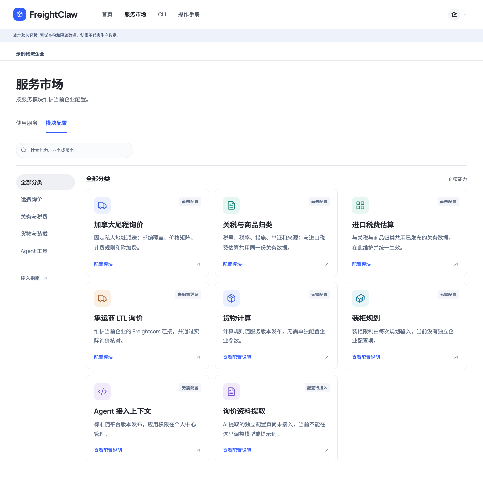

# 按服务市场模块配置

## 操作入口

服务市场提供「使用服务」和「模块配置」两个视图；管理员点击模块即可进入该模块的配置。名称、图标、分类共用一份目录，服务详情也提供配置入口。账号菜单和工作台都指向同一配置视图。

配置页保留当前企业和模块内部页签，不再混入个人中心的整排业务入口。原「业务管理」三分区总览被移除，旧地址自动跳到对应模块，数据和 CLI 命令保持兼容。

| 市场模块 | 配置职责 |
| --- | --- |
| 加拿大尾程询价 | 固定私人地址：基本资料、邮编、价格与计费、附加费、核验与发布 |
| 承运商 LTL 询价 | Freightcom 企业连接 |
| 关税与商品归类 | 关务目录、来源、导入和发布 |
| 进口税费估算 | 共用同一关务配置，不复制数据 |
| 货物计算、装柜规划、Agent 接入上下文 | 明确说明无需企业配置 |
| 询价资料提取 | 明确说明配置页面尚未接入 |

模块卡上的状态来自现有配置读取接口；保存凭证不代表已取得实时承运商价格。普通业务员和访客不展示配置操作，直接访问也保留管理权限边界。

## 本地界面

## 验证范围

使用隔离本地数据验证模块目录、市场到配置、配置返回市场、旧链接跳转、关务共享配置、访问权限及原有草稿/发布/CLI 流程。没有生产部署或正式数据变更。

实际结果：相关回归 402 项通过、7 项跳过；原生业务浏览器/构建 CLI 联动 12 项通过、0 页面错误。新增检查覆盖访客登录边界、业务员拒绝访问、市场直达配置、共享关务入口、旧链接跳转，以及返回市场后保留未保存的运价草稿。桌面 1440、平板 820 和手机 390 px 截图已检查；可配置模块优先展示。

`npm run typecheck`、`npm run lint`、`npm run build`、`npm run build:cli` 通过；Agent 标准验证 14 standards / 6 profiles / 5 modules / 5 resources，标准包生成 14 项。Schema 与服务合同未改变，43 条 workspace 命令继续有效。
