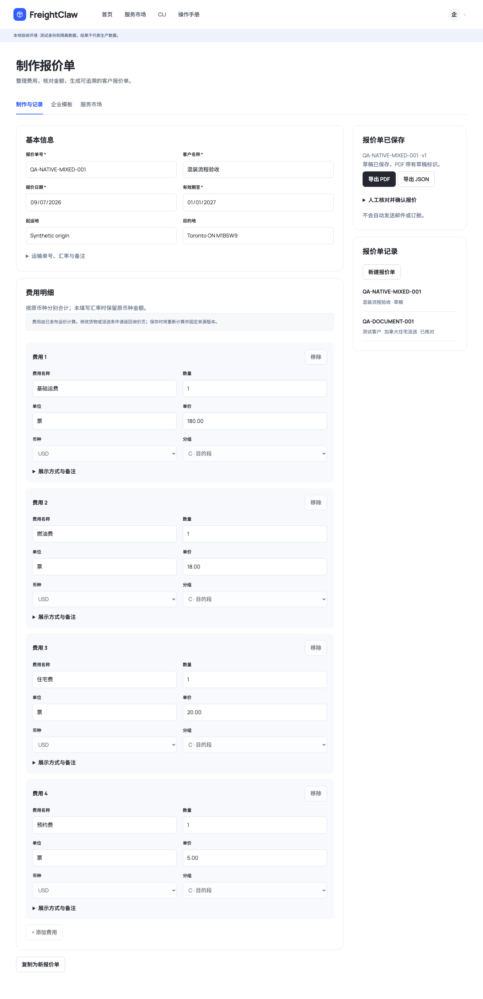
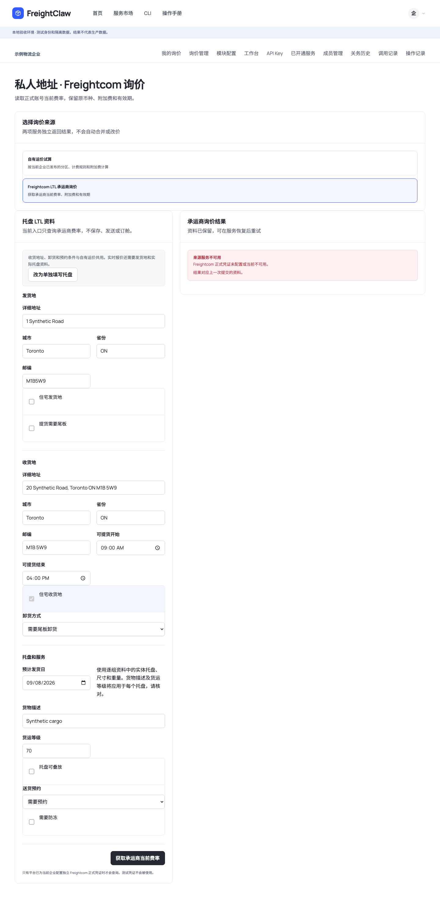
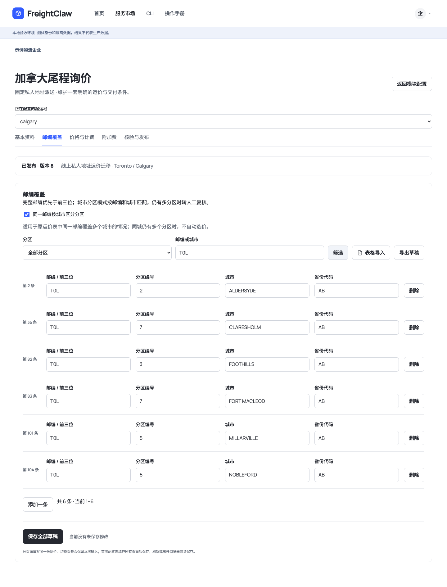
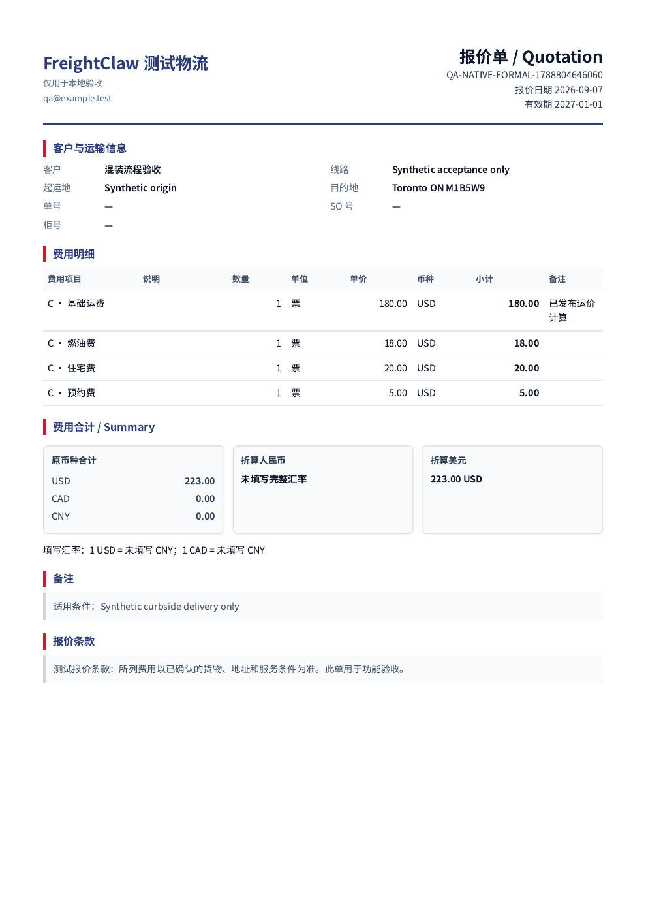

# 原生业务闭环与线上配置迁移

更新：2026-09-08。当前是本地验收候选版，未部署生产。原有生产入口继续运行。

## 已实现并验证的流程

- 混装按逐组包装、尺寸、数量和重量口径计算。1 件超长货与 9 件普通货不再按 10 件超长计价；超长木箱不重复计算。汇总与明细冲突时要求修正，缺明细时不猜测。
- 自有运价试算可制作原生报价单。服务器重新计算并绑定原始请求、发布版本及金额；网页不能修改派生费用。保存、人员审核、退回、PDF 导出共用文档记录。来源停用或报价过期后不导出正式版本。
- 自有运价和 Freightcom 共用收货地址、卸货、预约及逐组实体托盘资料。按总重填写的多托盘组不得平均分配重量；纸箱不能按计费托数转成实体托盘。切换来源不会将待确认的卸货条件改为“无需”。
- 关务完整 SQLite 快照可接收、核验、分页查阅、启用及停用。读取迁入的 SQL 数据，不受手动 JSON 上传的 16 MiB 限制。来源没有就绪快照时保留待审核状态。
- 上述功能均有人员 CLI 入口；候选包包含 60 项 `workspace` 命令，公开查询命令仍为 9 项。查询 API Key 不因此获得配置或审核权限。

## 已从线上核对的配置

用户指定资料取自已运行服务，并确认运价截止日期为 **2027-01-01**。报价单有效天数单独沿用来源的 **7 天**，同时不得超过运价截止日期。

| 数据 | 只读提取结果 | 本地迁移结果 |
| --- | --- | --- |
| Toronto 运价 | 390 档 | 390 档；1,513 条邮编与城市规则（932 个前缀） |
| Calgary 运价 | 364 档 | 364 档；498 条邮编与城市规则（388 个前缀） |
| 邮编规则 | 2,013 行 | 2,011 条有效规则完整保留，2 条停用规则不启用；2 组同城多分区保留人工复核 |
| 关务来源 | 15 项，均 staged | 原状态保留；正式发布快照 0 项 |
| 税号 / 税率 | 177,865 / 728,805 | 完整复制及分页读回 |
| 措施 / 单证要求 | 326,356 / 2,996 | 完整复制及分页读回 |

运价内容、分区燃油、启停和客户条款按源配置保存。源规则未设置重量/体积/长度上限，这三项明确使用 null；其他人工复核规则仍执行。迁移版开始日期采用接收时 UTC 日期（2026-09-07），不将该日期当作原始合同生效日期。后台切换起运地查看其独立邮编和价格；共用费用及有效期保持一份配置。

两地已分别通过本地人员 CLI 试算，来源版本读回一致。此结果证明迁移版计算可运行，不证明任意客户地址、承运商费率或正式对客报价已经验收。

关务快照为 901,402,624 字节，SHA-256：`e1c3cb0a931ffb9ae0f8241970399c193abc3e4a0a0ff06d0271048dae1793a1`。导出仅复制法规白名单表；不含账号、密钥、查询历史或客户记录。原库只读，生产服务未切换。

## 截图与本地入口

下图使用隔离测试数据，金额和企业名称仅用于流程验收。

本机预览：`http://127.0.0.1:8907/console/`。此处使用隔离身份，已载入线上运价和待审核法规快照。服务市场 → 模块配置 → 加拿大尾程询价，可切换 Toronto / Calgary；关务模块 → 数据更新或目录 → 已保存草稿，可核对真实数据。不会把本地示例企业身份迁到生产。

## 实际验证记录

- 前轮相关测试：25 个文件、138 项通过。本轮选定 25 个业务测试文件、136 项通过，另有 1 项候选打包回归通过（测试范围不同，不直接比较总数）。覆盖计价、数据包生命周期、权限、来源绑定、审核、幂等、持久化重开与 CLI 安装。
- `npm run typecheck`、`npm run lint` 均退出 0；`npm run build`、`npm run build:cli` 构建成功。
- Schema 校验：17 个合同 Schema、11 个示例、42 个接入 Schema；Agent 校验：14 个标准、6 个 profile、5 个模块、5 个资源。
- 浏览器：资料解析、手动报价单、原生报价及退回、实际 PDF、共用托盘和关务目录均完成，1440 / 390 像素无横向溢出，页面错误数组为空。
- 正式样式的原生测试 PDF：1 页，223.00 USD 与服务器明细一致，中文可提取，无草稿标识，文件 SHA-256 验证通过。该文件使用合成企业和运价，不能作为对客报价。
- 真实法规包五类目录均经 CLI 读回；网页税率目录返回 728,805 条总数、每页 25 条，待审核包没有启用按钮。Calgary CSV 导出 364 行、起运地保持一致。

## 尚未满足的上线条件

1. 关务源没有已发布来源和就绪快照；必须完成来源内容核验及正式发布。已确认运行版本包含提取、规范化、来源检查与发布工具；此前仅凭本地 clone 判断缺少流水线不准确。当前运行源的 20 项归档有 19 项校验通过，旧版 ca-sima-details-2026-08-14 缺有效归档引用。候选报告仍缺高风险规则、美国附加税交互矩阵、加拿大法文法律数据及最新来源检查的完成证据，不能自动改成已审核。
2. 已恢复按城市区分的邮编覆盖。仅 H8Y / PIERREFONDS（Zone 7/8）及 J0Y / ROUYN-NORANDA（Zone 8/9）两组仍有原表同城冲突，保持人工复核，不影响其他匹配规则。
3. Freightcom 正式企业凭证及真实承运商报价尚未在新后台验收；本地测试只验证请求和失败状态，不代表实时报价成功。
4. 公司资料由各企业用户自行配置，平台上线无需预置统一出单公司。企业负责人或管理员在首次制作报价单前填写公司名称和条款；其他功能保持可用。现有本地测试模板不迁入正式企业。
5. 已在 Oracle 目标机完成候选容器构建及沙箱 PDF 渲染验证；正式企业端到端验收、生产数据库备份/迁移及生产切换尚未执行。正式配置与关务审核条件未齐，不能把候选构建成功写成已上线。

部署及回滚要求见 [上线运行手册](../runbooks/native-business-completion-2026-09-08.md)。

## 本轮补充验收

- 已逐条运行 2,011 条有效源规则：1,279 条正常计价；728 条因原配置停用相应分区而转人工；两组同城冲突共 4 行转人工。未发现分区或基础价误匹配。数量表示源规则覆盖，不能当作成功订单数。
- 网页与人员 CLI 在本地保存、发布并读回全部 754 档价格与 2,011 条城市规则，Toronto / Calgary 试算成功、来源版本一致。
- 新增 4 项城市匹配回归，包含同城冲突 CSV 往返，避免导入时悄悄丢掉某个分区。网页提供城市匹配开关，未知或缺少城市有中文提示。
- 候选镜像使用非 root、只读文件系统、移除所有主机能力、no-new-privileges 和专用 seccomp；PDF 无需关闭 Chromium 沙箱。样张渲染成功并返回字节数与 SHA-256，样张不包含业务资料。

候选归档打包已补充 Python 与 SQL 文件，并纳入 Compose 和 Chromium 沙箱配置；此前打包遗漏 Python 引擎会造成 Docker 构建失败，现有回归会检查这些运行必需文件。

逐项证据及仍待补齐的条件见 [本轮上线验收记录](2026-09-08-release-acceptance.md)。
