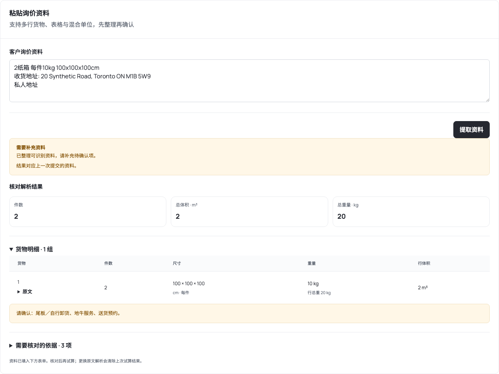

# 私人地址报价：来源代码与解析加强

用户确认代码所有权和复用授权后，核对了 GitHub main `e7d26d9`。该版本与之前计价引擎的移植来源相同。私人地址价格矩阵、附加费与 Decimal 计价核心已在 FreightClaw 原生服务中；这次把资料解析接入同一条询价路径。

## 现在怎么用

服务市场 → 询价资料提取／私人地址询价 → 粘贴资料 → 核对逐行结果 → 补充条件 → 勾选资料确认 → 查询规则试算。后台继续从服务市场的「加拿大尾程询价」进入，不增加渠道或第二套配置中心。

| 原文情况 | 处理方式 |
|---|---|
| `3件，12.2kg，43*22*38cm` | 件数 3、体积 0.107844 m³；12.2 kg 是单件还是整行需确认 |
| `3纸箱，每件12.2kg，43*22*38cm` | 行总重 36.6 kg，保留每件尺寸和原文 |
| `3纸箱，总重30kg，40x30x20cm` | 总重 30 kg，不再乘三，也不伪造单重 |
| 多行包含厘米／英寸、公斤／磅 | 逐行精确换算，再核对整票合计 |
| 逐行共 5 件，另写总件数 6 | 件数合计留空，提示冲突 |
| 某行缺重量／体积 | 不把其他行的部分合计当完整总量 |
| 没写尾板、地牛、预约 | 保持待确认，不能默认客户不需要 |
| 一个请求出现多个邮编 | 提示确认唯一收货地址 |
| 粘贴表格 | 支持 tab／竖线分列，表头指定长宽高、单位、数量和重量口径 |

重新解析会清除旧试算结果和确认状态，避免两份询价资料混用。只有填完必要字段并确认才能继续计价。结果保留原文依据供人员核对，不把解析置信度作为报价资格。

CLI 使用和退出码见 [业务配置及 CLI](../../apps/console/native-business.md#私人地址资料解析)。网页和 CLI 共用同一个服务端解析器，不再各自维护一套解析规则。现有应用 API Key 权限边界不变。

## 当前边界

本次是确定性文本解析，不是 OCR，也没有调用大模型或地图服务。图片、PDF、没有明确货物分组的复杂资料仍需先整理为文字或人工补充。免费使用的解析实现无需模型凭证。

源系统的销售记录和人工改价不等于当前平台已经完成原生记录、审核和正式 PDF。该部分仍须按当前账号隔离、来源版本、审核和写后读回要求迁移，不能直接复制原服务的全局记录接口。

本地测试使用隔离的合成运价。用户预览库仍保持空白；未发布真实运价时只能解析资料，试算明确返回不可用。本次没有生产部署、正式承运商报价、客户消息或订舱。

## 本地验证

解析专项 23 项通过；相关网关、CLI、业务 MCP、原生报价回归运行记录为 364 项通过、7 项跳过。类型、Lint、Schema、标准包和 Web／CLI 构建检查通过。桌面 1440 px 和手机 390 px 实测无横向溢出；浏览器执行了空白配置下解析、CLI 对照、缺失条件确认、合成运价试算及重新解析清除旧结果。

本地合成样例为 2 纸箱、每件 10 kg、每件 100 × 100 × 100 cm；确认自行卸货、无需地牛、需要预约后，依据测试配置计算 135.00 USD。这个数值只证明已发布配置的调用链，不是可对客户使用的运价。

浏览器没有解析页面的脚本错误；本地 fixture 的访客关税额度接口未配置，另有 503 响应，已单独识别，不宣称关税额度服务通过本次验收。

下图为合成资料的实际解析页面，缺少的卸货／预约条件保持待确认：

