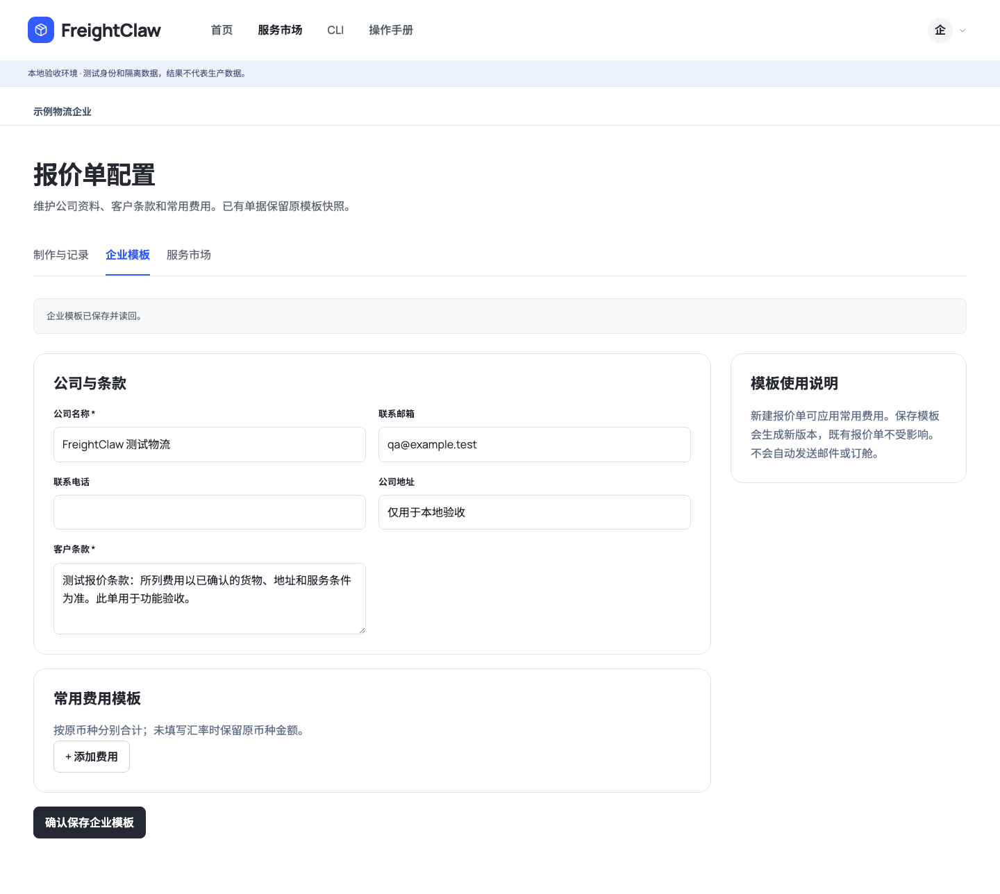
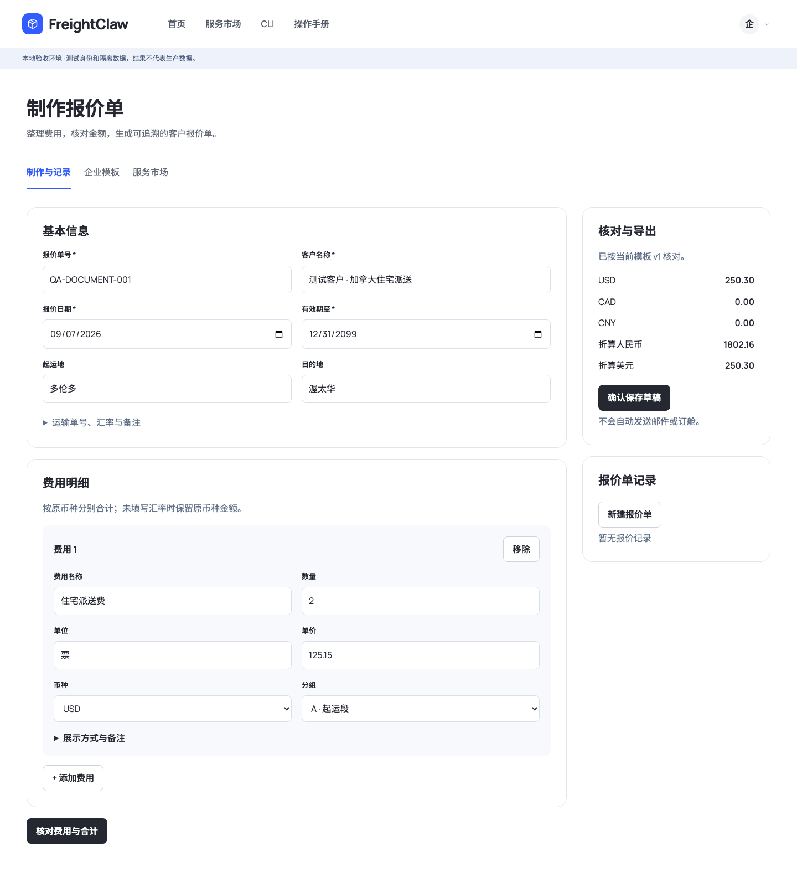
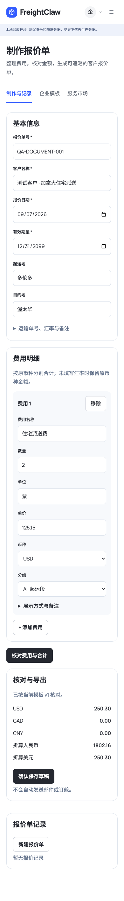

# 报价单模块：原生移植与验收

## 使用流程

服务市场新增「报价单制作」，后台通过同一模块卡片进入「企业模板」，沿用 FreightClaw 前台字体与布局。

1. 企业负责人或管理员填写公司资料、客户条款和常用费用，确认保存模板。
2. 成员新建报价单，填写客户、有效期与费用；也可从成功的尾程试算点击「制作报价单」，带入试算总额和来源说明，再人工核对。
3. 核对费用与合计，确认保存草稿。记录固定保存时的模板版本、费用与汇率，后续改模板不会改旧报价。
4. 可立即导出有草稿标识的 PDF。负责人/管理员逐项核对价格、来源和条款，填写核对依据后确认，才可在有效期内导出正式版。
5. 网页与人员 CLI 操作同一数据库。PDF 下载检查长度、文件标识与 SHA-256；CLI 不覆盖已有文件。

费用支持 A/B/C 分组、USD/CAD/CNY、明细展示、隐藏计入、隐藏不计和合并显示。数量乘单价按 decimal.js 计算，行金额保留两位后汇总；汇率必须明确填写，空值保留为缺少折算依据。客户 PDF 不内嵌编辑数据，隐藏明细不会泄漏到 PDF 附件。

## 代码来源与范围

源仓库：`zqj372-ops/quote-pdf-builder`，固定提交 `0b6e439f4203b3fc3159ca7ef613a3e51a1afc09`。复用了 A4 文档布局和费用展示规则；适配成严格金额合同、原生业务存储、网页、人员 CLI。逐文件来源散列见 `services/quote-documents/PROVENANCE.json`。

这次交付是报价单模块，不是整个 Electron 桌面软件的完整迁移。账单、收款、Logo、旧 JSON/PDF 回导与原电脑历史记录仍未移植；没有导入默认公司、旧价格、客户资料或凭证。此模块也不代表关税正式数据、Freightcom 配置、业务单自动关联或原生完整报价审批系统的其他缺口已经完成。旧来源报价记录仍是独立入口。

## 本地部署

测试启动器自动创建独立 `quote-documents.sqlite`，公司模板为空。生产代码通过 `PORTAL_QUOTE_DOCUMENTS_SQLITE_PATH` 显式启用本地 SQLite，`PORTAL_PDF_BROWSER_EXECUTABLE` 指定绝对路径的 Chromium/Chrome 可执行文件。使用系统沙箱运行浏览器，不自动加入 `--no-sandbox`。当前不支持此业务库的共享 Postgres 部署；误配置会拒绝启动。

先执行 `npm run build`，构建会复制开源字体到 `dist/services/quote-documents/fonts`。从仓库/应用根目录启动服务。PDF 不依赖外部网站；渲染进程限时十秒、单任务并发、文件上限 8 MiB。模板与报价输入上限 128 KiB。导出失败不发布半成品。

发布前应在目标环境验证 Chromium 与字体可读、存储备份、真实企业权限和 PDF 导出。本次仅在隔离本地环境验收，没有改动线上服务或数据库。

## CLI 与接口

八个命令：`documents config/config-save/preview/save/list/get/approve/export`；均在 `freightclaw workspace` 下，复用人员网页登录授权。保存/模板更新/人工确认要求幂等键。完整例子见 `apps/console/workspace-cli.md`，请求及响应 Schema 见 `schemas/admin-control/quote-documents/`，OpenAPI 由构建生成。MCP 工具目录与查询 Key 权限保持现有合同。

## 验收截图

验收使用测试客户、测试公司和合计 250.30 USD 的合成费用。网页保存后 CLI 读回同一记录；分别导出草稿与人工确认后的 PDF，并校验文件。浏览器 1440/390 宽度无横向溢出。具体测试输出保留于本地 `.runtime/quote-document-*.txt`。公共关务额度在隔离环境未配置，会出现预期 503，与报价单导出无关。

最终检查：`npm run typecheck`、`npm run lint`、`npm run build`、`npm run build:cli`、`npm run validate:schemas`、`npm run validate:agent-standards`、`npm run build:agent-pack` 和 `git diff --check` 均通过。针对报价模块、市场入口、登录目的地、Portal HTTP、原生管理与独立 CLI 包的回归为 9 个文件、30 项测试通过。新模块 16 个输入/输出 Schema 由额外测试编译校验。最终浏览器脚本为 `tests/e2e/portal-browser/quote-documents-flow.mjs`，成功生成并读回两份单页 PDF；金额、草稿标识和无内嵌附件已检查。
