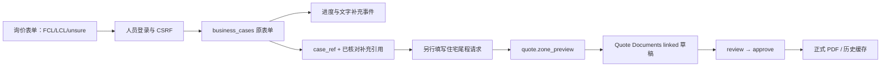
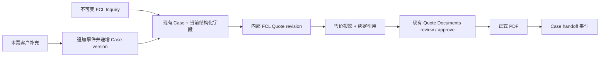

# FreightClaw FCL 主闭环：第一轮审计与最小方案

> 说明：本文是 FCL 主闭环实施前快照，不是当前运行时合同或当前完成度声明。文中“尚无/待实施”描述只对应审计时刻；后续 13a–13c 已增加 HTTP、Web 与 CLI 实现。运行时权威是当前代码和生成的 Zod/JSON Schema。

日期：2026-09-20。审计基线：本地 `main`，`2c0356adb05987317a9813d4036f9bf2d040424f`。

范围：用户附件要求的第一轮 14 项交付。本文区分代码事实、建议方案和待验证能力。未查询远端 HEAD，未连接生产或真实业务来源；没有修改运行代码、正式 Schema、既有业务数据库或部署配置。测试仅使用可丢弃 fixture。文档分支为 `codex/fcl-main-loop-audit`。

用户最新明确：**公开提交，固定由本人受理，不建公司。** 此决定替代较早的“固定运营企业”答复。后台使用现有个人账号；公开客户只有本票摘要与补充权限。个人受理需要下述窄权限扩展，当前代码尚未支持整条个人报价链。

## 1. Repo Audit：八个问题的答案

| 问题 | 当前代码事实 | 证据 |
|---|---|---|
| Inquiry 如何工作 | 三步表单，支持 FCL/LCL/unsure；主按钮已经是“提交询价”，先读人员 session，再 POST `/console/api/v1/cases`；保留 mailto 次入口。不存在独立 Inquiry No | `apps/inquiry/app.js:17`、`:73`、`:109`、`:119`；`apps/inquiry/model.ts:1` |
| Case 如何保存和补充 | SQLite `business_cases` 保存不可变原表单 `input_json`；update/reply 仅改状态、version、时间并追加事件；reply 只有文字 | `services/access-gateway/portal/cases.ts:20`、`:88`、`:101`、`:114`；`case-contracts.ts:17` |
| Case 和 Document 如何关联 | 已有 `inquiry_case_link_v1={case_ref,reviewed_customer_event_ref}`；服务端检查当前企业、Case 权限、终态和最新补充引用；**没有绑定 Case version** | `services/quote-documents/contracts.ts:40`；`service.ts:64`；`workflow.ts:524` |
| Quote Documents 可复用什么 | A/B/C 无价格模板、草稿、同 ID 编辑、追加版本、review/approve/reject、公司/条款快照、Decimal、汇率快照、正式/历史 PDF、幂等和读回 | `services/quote-documents/workflow.ts:84`、`:224`、`:715`、`:796`、`:827`；`engine.ts:8` |
| 已有 FCL Rate 吗 | 本轮查到的可执行原生报价是住宅尾程 Zone/托盘引擎。渠道有 `ocean_fcl` 标签，但合同固定 `ready_for_quotes:false`；船期/码头数据不是运价 | `services/quote-native/contracts.ts:10`；`client.ts:19`；`services/access-gateway/portal/channel-contracts.ts:14` |
| Web/API/CLI 有统一服务吗 | Case、人员报价单已共用服务与 HTTP；CLI 使用同一人员 session 路由。业务查询 Service 中没有 FCL 操作，不能借“统一 Service”推断 FCL 已存在 | `portal/http.ts:472`、`:523`；`deploy/cli/workspace.ts:41`、`:64`、`:97`；`portal/business/service.ts:10` |
| 哪些 Contract 要补 | 外部提交与本票补充权限、仅 FCL 的个人管理/Rate/文档归属、结构化 Case、Cost/Sell、来源/Case 审核绑定、交接投影与版本化 HTTP/CLI | 见第 5–11 节及配套 RFC |
| 是否需要 RFC | **需要一个窄 FCL RFC**。公开写入、数据权威、现有严格 Schema 和审核失效规则都会变化；仅 UI 改字段无法满足需求 | `AGENTS.md`“基线文件变更流程”；现有 09-13 Link RFC 与 09-15 Workflow RFC |

事实纠正：README、`apps/inquiry/PRODUCT.md`、早期 runbook 仍有“只生成邮件，不保存”的描述，落后于当前 `app.js`。本审计以当前代码和本轮测试为准。另一方面，linked fixture 中的 Case 虽写 `transportMode:fcl`，实际调用仍为 `quote.zone_preview`，不能算 FCL 成本报价验收。

权威边界：`2026-09-07-native-business-authority-v1.md` 仍标 Draft（产品方向确认、实施合同未冻结）。本文将现有 NativeAdmin 视为可复用代码，不把该旧 RFC 当作已接受的 FCL 价格权威。新增 FCL 数据集权威与个人归属由本次窄 RFC 明确；真实成本须由本人核验后发布，fixture 不成为默认价。

## 2. 当前 Inquiry → Case → Quote → Document



关联入口已在 `apps/console/cases.js:56`；它没有把柜型和 POL/POD 转成海运成本。旧来源报价记录还通过 `portal/business/quote-record-client.ts` 的外部适配器存在，本阶段不把它设为 FCL 根对象，不复制一份外部历史。

## 3. 整柜链路断点与已复现问题

| 优先级 | 断点 | 影响与最小处理 |
|---|---|---|
| 必需 | 外部提交当前返回登录门禁 | 新增窄公开提交合同，唯一受理人只能来自服务端配置；复用现有 Case 业务服务 |
| 必需 | 个人能保存 Case，但普通个人不能管理；NativeAdmin/DocumentWorkflow 要求企业身份 | 仅 FCL 增加固定个人管理与数据隔离，文档表显式个人归属；不创建占位公司，不全局移除组织检查。证据：`cases.ts:57`、`native-admin.ts:31`、`workflow.ts:387` |
| 必需 | 起运/目的自由文本、单柜型；缺 POL/POD/Incoterm | FCL 新合同分开字段，多个柜型；不能从城市猜港口 |
| 必需 | 原始提交与当前结构化处理共用旧 input 语义 | 保留独立不可变 Inquiry 快照；Case 保存当前结构化需求，追加完整事件证据 |
| 必需 | 无 FCL 价格来源、匹配、Cost/Sell | 在原生运价服务内增加 FCL 专用实现，不改造 Zone 引擎 |
| 必需 | 当前 native 绑定是 Zone DTO，并把引擎价格直接变成客户费用 | 新 FCL 绑定固定内部成本与人工售价的版本，客户文档仅得到售价白名单投影 |
| 必需 | 当前 Link RFC 明确不绑定 Case version，普通进度不失效 | FCL 新路径显式绑定版本；旧路径不被暗改 |
| 已复现 | v3 reject 调用 `assertPayloadGates(...,true)` | 新补充或来源更新反而阻断“退回”；退回应保留授权/版本检查，允许失效来源被退回 |
| 必需 | 审核退回与 Case needs_input 是两个独立写入 | 报价退回不等于已通知客户补充；须显示各自读回，部分失败可用原幂等键继续 |
| 必需 | 无服务端询价通知、FCL 编号和交接事件 | 增加固定通知模板与窄配置，提交先持久化；交接用现有 Case 事件 |

本轮临时合成 fixture 复现输出：

```json
{"scenario":"v3_reject_after_customer_supplement","error":"inquiry_quote_case_review_required","state":"draft"}
{"scenario":"v3_reject_after_source_update","error":"native_quote_source_changed","state":"draft"}
{"scenario":"original_inquiry_preserved","original_pod_text":"Vancouver","case_version":3}
```

此问题定位在 `services/quote-documents/workflow.ts:806`，其依赖门禁见 `:452`、`:524`。旧 v2 `service.ts:72` 的纠正性退回可以复用其权限语义。以上仅复现，没有实施修复。

## 4. 直接复用与最小新增

| 能力 | 复用位置 | 本次必要变化 |
|---|---|---|
| Case 与事件 | `business_cases`、`business_case_events`、`CaseService` | FCL 版本化输入、类型化补充/结构化确认事件、Inquiry 引用 |
| Rate 发布与历史 | `NativeAdminStore` 的 `native_configs/native_releases` | 新增 `kind=fcl` 的个人闭合数据集；一个发布包含多条 Rate，不新增供应商表 |
| 报价计算 | `services/quote-native`、已有 Decimal 依赖 | 专用 FCL 精确匹配与成本/售价计算；不建立通用 Rate Engine |
| 报价审核与文件 | `DocumentWorkflowService`、现有 revision/PDF 表 | 仅 FCL 的个人归属、出具人模板、绑定与审核上下文；保留唯一审核状态来源 |
| Web/API/CLI | 现有 Inquiry、Case、报价编辑器、人员 CLI | 共用版本化端点和服务，公开提交走独立窄鉴权边界 |
| 交接 | 已有 Case 事件 | 一种手工交接事件，包含批准版本；pending 从当前正式文件派生 |

建议仅增加两张业务表，逐项有明确用途：

1. **`fcl_inquiries`**：客户原始提交、UUID、Inquiry No、Case 引用、提交时间，以及本票补充凭据的哈希/期限。必须保存独立原件，才能允许 Case 后续结构化整理；不新增第二套 Case。
2. **`fcl_quote_revisions`**：内部成本、销售价、FX 与来源绑定的不可变版本。客户文档不能承载这些内部数据；此表没有第二套审批状态，审批权威仍在 Quote Documents。

其余尽量复用：Rate 存现有发布表；通知配置存现有配置容器的闭合 FCL 字段，通知结果存脱敏 Case 事件；交接存 Case 事件。不增加 Inquiry 服务进程、Supplier/Carrier 主表、订单表、工作流引擎、FX 服务、队列平台或新公共 MCP 模块。

“两张新表”不代表零迁移：现有文档归属列、索引与约束须支持明确个人分支，不能用虚构 org 值绕过权限。后台只向固定受理人开放这条 FCL 链；本人可制单并在独立审核步骤确认，真实记录同一审核人。出具人名称可填真实个人名称，模板不要求成立公司。详细迁移边界见 RFC 第 3.2 节。

## 5. 最小 FCL Inquiry Schema

配套 [候选 Schema](../rfcs/2026-09-20-fcl-main-loop.schema.json) 的 `$defs.inquiry` 为审阅草案，不是运行合同。

| 字段 | 形式与初次提交规则 |
|---|---|
| transport_mode | 固定 `FCL` |
| origin_city / pol / pod / final_destination | 四个独立可空文本；不猜映射 |
| containers | 最多四个不同柜型，`{type,quantity}`；数量为正整数或 null，未确认不能填 0；空数组表示柜型待确认 |
| cargo_name / cargo_type | 可空；类型固定 general/battery/liquid_powder/wood/regulated/other |
| estimated_weight | null 或 `{value:"18000",unit:"kg"}`，整票估算毛重，不能再乘柜数 |
| cargo_ready_date / incoterm | 日期可空；EXW/FOB/CIF/DDU/DDP/Other 可空；Other 须在正式报价前写清说明 |
| selected_services | pickup/export_customs/ocean_freight/canada_customs/devanning_storage/delivery；独立选择，不导出价格 |
| contact | name、email 必填；company、phone 可空；notes 单一字段避免三步重复备注 |

Inquiry 可以不完整，但结构、枚举、正数、日期格式、文本长度仍须合法。提交成功表示需求保存，不表示可报价。报价前至少确认路线、柜型数量、货物、重量、Ready Date、Incoterm 和服务范围；final_destination 在没有内陆服务时可明确为空，选择加拿大派送时必须填写。

`inquiry_id/case_id/inquiry_no/owner_id/actor/created_at` 全由服务端确定，`organization_id=null`，客户不能指定受理人。建议编号按 Asia/Shanghai 日期，在同一 SQLite 写事务内分配当日递增号、检查唯一键并同时建立 Inquiry 与 Case；重放不另分配编号。四位为最小宽度，超过 9999 不回绕。

公开提交、本票补充凭据、邮件失败隔离的具体边界见 RFC。原始 Inquiry 永远不被补充或内部编辑覆盖。

## 6. 最小 FCL Rate Schema 与发布

候选 Schema 的 `$defs.rate` / `$defs.rate_dataset`：

```json
{
  "rate_id":"00000000-0000-4000-8000-000000000001",
  "supplier_label":"Synthetic supplier",
  "pol":"Yantian",
  "pod":"Vancouver",
  "valid_from":"2026-10-01",
  "valid_until":"2026-10-15",
  "source_ref":"fixture:fcl-rate-001",
  "source_version":"3",
  "note":null,
  "items":[{"container_type":"40HQ","ocean_freight":"3200.00","currency":"USD"}],
  "additional_fees":[]
}
```

示例全部是测试数据，不是当前真实运价。`release_id`、发布版本、digest、发布时间沿用 `native_releases` 服务端字段。相同业务 rate_id 更新版本时保留历史发布。不同来源的同线路有效报价允许同时存在；重复行、倒置日期、同 Rate 重复柜型拒绝发布。

常用附费只允许明确服务、A/B/C 分组、币种、成本、单位与已说明的数量依据。`CNTR` 费用按适用柜型数量；`SHIPMENT` 按一票；仓储天数、等待时长等第一版必须人工明确数量与单位，不能用“服务已勾选”自动生成金额。

一个 Rate 必须覆盖本票全部已确认柜型才是完整候选。第一版不自动跨供应商拼价；部分覆盖只显示缺项。若以后确需分别选择来源，再按真实业务需求扩展。

## 7. 最小 Cost / Sell Model

内部费用行见候选 Schema `$defs.quote_line`，保留：`id/name/group/quantity/unit/cost_price/sell_price/currency/note`。`cost_price/sell_price` 缺失为 null，可保存草稿，审核时不得缺失。成本引用另外保存在所属报价版本中，不能把来源说明混入客户备注。

```text
Ocean Freight | B | 2 CNTR | Cost 3200.00 USD | Sell 3500.00 USD
Revenue = 7000.00 USD
Cost = 6400.00 USD
GP = 600.00 USD
Gross Margin = 600 / 7000 = 8.571429%
```

复用现有 Decimal 精度与“行金额保留两位再汇总”的口径。每币种单独汇总；统一利润可用本次显式 USD→CNY、CAD→CNY 汇率快照折算。缺 FX 时仍显示各币种利润，但不显示伪造的统一 Margin；需要统一摘要才能审批的混币种报价返回 needs_input。Revenue=0 时 margin 为 null 并提示，不除零；负利润应原样显示并要求人工确认，不变成零。

客户费用由服务端白名单映射 `unit_price=sell_price`。**不把成本藏在 hiddenExcluded 行里**：现有费用对象也会从 API/CLI 返回，且 detail 行 note 会进入 PDF。成本、供应商、内部来源备注与利润均只在内部报价及审核上下文存在，不进入客户文档输入、渲染参数、PDF 元数据或客户可见 API。

## 8. Case 关联、补充、退回与交接



客户补充记明实际公共提交主体和时间；工作人员确认字段使用自己的 actor，不能冒充客户。已批准文档保持不可改，新需求触发重新报价及新审核；普通被退回草稿可沿用现有编辑/版本追加机制。

FCL 报价至少固定 Case ID、Case version、最新补充 ref、Quote revision、选用 Rate 来源、售价格式化 digest 和 FX。第一版建议严格核对 Case.version：即使仅新增进度备注，也需要重新生成 FCL review。此保守行为须在 FCL RFC 明示；旧 09-13 linked 路径继续保持“普通进度不失效”，不得全局改写。如果日后要排除无关备注，再引入经过批准的需求版本语义。

交接只有 pending / handed_off。记录 inquiry_no、case_id、document_id、approved_version、客户、POL/POD、containers、approved_at、note。交接成功不表示客户已接受、已订舱或已发运。绑定文件或 Case 已过时则阻止新的交接；历史交接保留并标注版本。

## 9. Source Version 方案

复用现有发布来源证据和签名绑定方式，不能直接套用严格限制为 `zoneInputSchema` 的 `native_quote_v1`。

FCL 内部报价保存选用的 `rate_id/release_id/source_ref/source_version/content_digest/valid_from/valid_until/selected_at`，以及确定性计算结果和 trace。文档只持有受签名保护的 FCL Quote 引用及对应 digest，服务端沿引用解析来源，不把完整内部成本复制进 Document。

所有 prepare/save/review/approve/formal-export/handoff 都调用同一个当前性检查。Rate 更新时保留旧报价数值，仅返回“报价来源已更新”和旧/当前版本；禁用、内容不一致、无法读取来源均不能当成当前成功。第一版保守地把 FCL 数据集发布变化视为须复核，不做未用行变更的依赖优化。

## 10. Rate Validity 与 Quote Validity

- 匹配按确认的 POL + POD + 全部柜型 + Cargo Ready Date。港口按显式值比较，只做确定的大小写/首尾空白规范化，不猜别名或邻港。
- `valid_from <= cargo_ready_date <= valid_until`，两端包含；多候选时返回 manual_review 和候选清单，必须显式选择。即使选择了 rate_id，也重做路线/柜型/有效期检查。
- 缺匹配字段：needs_input；没有完整 Rate：manual_review；数据集未发布或不可读：unavailable；绝不生成零成本。
- Quote 日期和截止日期均必须明确，`quote_date <= valid_until`；客户 valid_until 不得晚于所用成本来源截止日。人工附费来源期限更短时也收紧。
- **Cargo Ready 在未来有效期内，和今天可以签发报价，是两个门禁。** 用户的 10-01～10-15 Rate 可匹配 10-08 出货，但若 09-20 就签发正式报价，不能从该例子推断供应商允许提前承诺。第一版保守要求正式签发日期也落在已发布来源有效窗口；测试把时钟固定到 10-08。提前报价语义如有业务证据再单独明确。
- 不允许悄悄截短用户填写的 valid_until。冲突返回明确字段问题；重新选择有效 Rate 后重算、重审。

## 11. Web / API / CLI 一致性方案

内部共用 `CaseService → FCL 专用计算/报价方法 → DocumentWorkflowService`。Web 和 CLI 只组装输入、展示服务端结果；不自行匹配、计算、判断可审批或复制价格表。

| 操作 | Web | API/CLI 路径原则 |
|---|---|---|
| 外部首次提交 | `/inquiry/` 三步表单 | 窄 public FCL submit；CLI/API 客户端使用相同合同及公开请求限制 |
| 客户补充 | 原询价页的本票补充模式 | 有期限、仅本票的 opaque 凭据；不能使用查询 Key 代替 |
| Case 读取/确认 | 现有 Case 详情 | 扩展人员 `workspace cases`，相同 expected_version |
| Rate 配置/发布 | 现有后台新增 FCL 配置页 | 沿用 native config/save/preview/publish/disable/rollback；CLI 全覆盖 |
| 匹配/内部报价 | Case 内 FCL 编辑器 | 窄 FCL 操作，不调用 Zone 或 Freightcom |
| Review/approve/reject/PDF | 现有报价单工作流 | 扩展现有 `workspace documents` 显式合同版本 |
| 交接 | Case 详情的交接动作 | 窄幂等操作，返回同一事件与批准版本 |

三端一致指同授权范围、同记录、同版本。外部客户 API 不能返回 Cost/GP，固定受理人的内部 API 可以；这属于权限投影，不能为了“完全一致”泄露内部数据。查询 API Key 不因本轮取得报价审批权限。个人受理路径不得要求选择/创建企业，企业管理员身份也不能访问此个人报价。

## 12. UI Information Architecture

沿用 primary `#3659db`，不换品牌、不增加 KPI 看板。

- `/inquiry/`：标题“中国 → 加拿大 · FCL 整柜询价”。Step 1 路线、Ready Date、Incoterm、多柜型；Step 2 货物、重量、六项 Service Scope、备注；Step 3 联系人及完整摘要。主操作仅“提交询价”。字段待确认可保存，服务选项不带费用。提交成功展示 Inquiry No、已保存状态和本票补充入口；通知失败与保存成功分开显示。
- 现有询价管理列表：Inquiry No、路线、柜量、Ready、状态、更新时间。当前结构化 Case 与原始 Inquiry 可分别查看，原件只读。
- Case 工作区：左为客户需求/缺项，中为 A/B/C Cost/Sell 行，右为预计利润、来源有效期及审核门禁；顶部优先展示 POL→POD、柜型数量与 Ready。
- 审核页：Case 与补充差异、成本/售价、利润、Rate/version/日期、冲突警告；按钮“退回补充”“审核通过”。具体缺什么直接定位字段，不能只给“不可用”。
- 正式报价/交接：保留报价记录页和已有 PDF 流程；文件固定版本；完成后一个交接区，不增加 Booking/Shipment 页面。
- 手机 390/320：按 Case→费用→利润→操作堆叠，字段标签保留，缺项与冲突不靠颜色；桌面 1280/1440 验证可快速扫描。

## 13. 测试矩阵与本轮证据

| 类别 | 必须新增的 FCL 验收 |
|---|---|
| 提交 | 无登录可提交；客户端 tenant/owner/actor 字段拒绝；未配置或失效受理人 fail closed；Inquiry/Case/编号原子写入与重启读回；同 key 不重复 |
| 个人受理 | fixture 不建公司/成员记录仍能处理完整 FCL；其他个人、企业管理员、查询 Key 不可读内部数据或写入；本人显式审核留痕；撤销账号立即失权；不静默转让归属 |
| 外部补充 | 伪造/过期/跨票凭据拒绝；只可在 needs_input 补充；内部备注/成本不可见；补充保留原件与实际 actor |
| Schema | 未确认可空；负数/浮点金额/非法日期/重复柜型/未知字段拒绝；缺价保持 null；服务选择不能生成价格 |
| 匹配 | POL、POD、柜型、有效期冲突分别拒绝；多个有效 Rate 不选最便宜；无 Rate 不产生零元；多柜型完整覆盖 |
| 成本/利润 | 2×3200=6400；2×3500=7000；GP=600；Margin=8.571429%；不同币种、缺 FX、零收入、负利润、舍入 |
| 来源与有效期 | Rate v3→v4 不改旧报价；禁用/回退/摘要篡改；Ready 和签发日期边界；Quote 截止超来源有效期 |
| 审核 | Case v3→v4；新补充；报价版本变化；FX/售价变化；过期 review；受理人授权失效；来源变化后仍可退回 |
| PDF | 售价白名单；成本/供应商/内部 note 哨兵字符串在 HTML、PDF、客户 API 均不存在；生成中变化丢弃结果；真实浏览器渲染和抽取检查 |
| 交接 | 未批准/过时文档不交接；同 key 重放不重复；版本与文件引用完整；并发新版本不能返回旧状态为当前 |
| 通知 | fake mail 成功、异常、超时、禁用、缺配置；都不撤销已保存 Inquiry；幂等重放不再发；不声称邮件送达 |
| 三端 | 以同一 fixture 服务和数据库跑 Web、真实 loopback API、CLI；比较 Inquiry No、Case/version、Rate/version/digest、Cost/Sell/FX、有效期、审核状态 |
| 兼容/存储 | 旧 v1/v2/v3 输入/历史仍可读；新合同禁止降级；旧 writer 拒绝不兼容数据库；保留备份、历史及只读回退 |

三端目标 fixture：Yantian→Vancouver、40HQ×2、Ready 2026-10-08、Rate USD 3200/CNTR、2026-10-01～10-15；测试 clock 固定 2026-10-08，人工售价 USD 3500。这是待实现验收，未声称通过。

本轮实际运行：

```sh
npx --no-install vitest run tests/e2e/shipper-inquiry.test.ts tests/access-gateway/portal-cases.test.ts tests/access-gateway/portal-cases-http.test.ts tests/access-gateway/portal-workspace-cli.test.ts tests/access-gateway/portal-quote-workflow-v3-http.test.ts tests/quote-documents/engine.test.ts tests/quote-documents/schemas.test.ts tests/quote-documents/service.test.ts tests/quote-documents/workflow.test.ts tests/quote-documents/workflow-linked.test.ts --maxWorkers=2
```

结果：**10 files passed；113 passed / 2 skipped；6.93s**。Node v24.14.0；实际 runner Vitest v4.1.10，包声明是 4.1.11，未安装或升级依赖。两项跳过为 Linux `/proc`/旧进程句柄测试，在本机 macOS 不运行。SQLite 实验特性警告没有测试失败。

另外执行了上文临时 fixture 反例，并确认测试前后仓库无业务源码差异。没有启动前端做 FCL 浏览器验收；没有运行真实 PDF 渲染、本次新 FCL 业务代码或生产业务。测试中模拟 PDF 只证明接口/缓存门禁。

文档交付另行验证：使用本地 Ajv 2020 与 ajv-formats 编译候选 Schema，28 项正反例检查通过；4 个相对文档链接有效；审计包含 14 节，三份文件无行尾空白。跨字段日期排序、同柜型去重、权限和业务完整性列为实施验收，未伪称由草案 Schema 完成。

`npm run validate:agent-standards` 输出 `validated 14 standards, 6 profiles, 5 modules and 5 resources`；`npm run build:agent-pack` 输出 `built 14 standards`，生成既有运行标准包。新 RFC/Schema 未注册到该包。`git diff --check` 无输出；工作区仅新增本审计、配套 RFC 和候选 Schema 三份文档。

## 14. RFC 判断与实施顺序

配套 [FCL RFC 草案](../rfcs/2026-09-20-fcl-inquiry-quote-loop-v1.md) 具体列出旧/新合同、公开身份边界、表的必要性、权限、状态、迁移、测试和回退。状态为 Proposed，不能当成已接受规范。

建议实施切片：

1. 合同与公开入口：候选 Schema、固定个人受理与仅 FCL 的权限/存储迁移、Inquiry/Case 原子提交、编号、fake mail、外部补充权限。
2. 结构化 Case 与 Rate：追加补充/确认，现有后台 FCL 发布，精确匹配及全部冲突测试。
3. 内部 Cost/Sell：报价版本、FX 快照、预计利润与客户售价投影。
4. 审核与文件：复用文档 revision/review，补 FCL 绑定、失效后退回、正式 PDF 防泄漏、历史导出。
5. 交接及完整验收：Web/API/CLI 同一服务实跑、四个视口、真实 fixture PDF、重启/回退与写后读回。

每一步同时交付 Web/API/CLI，不先做网页再补 CLI。正式 Schema 由基线维护者在接受 RFC 后维护；任务目录按 RFC 的文件级清单分工。第一轮没有提交、推送、合并、部署、真实发邮件或连接生产。
