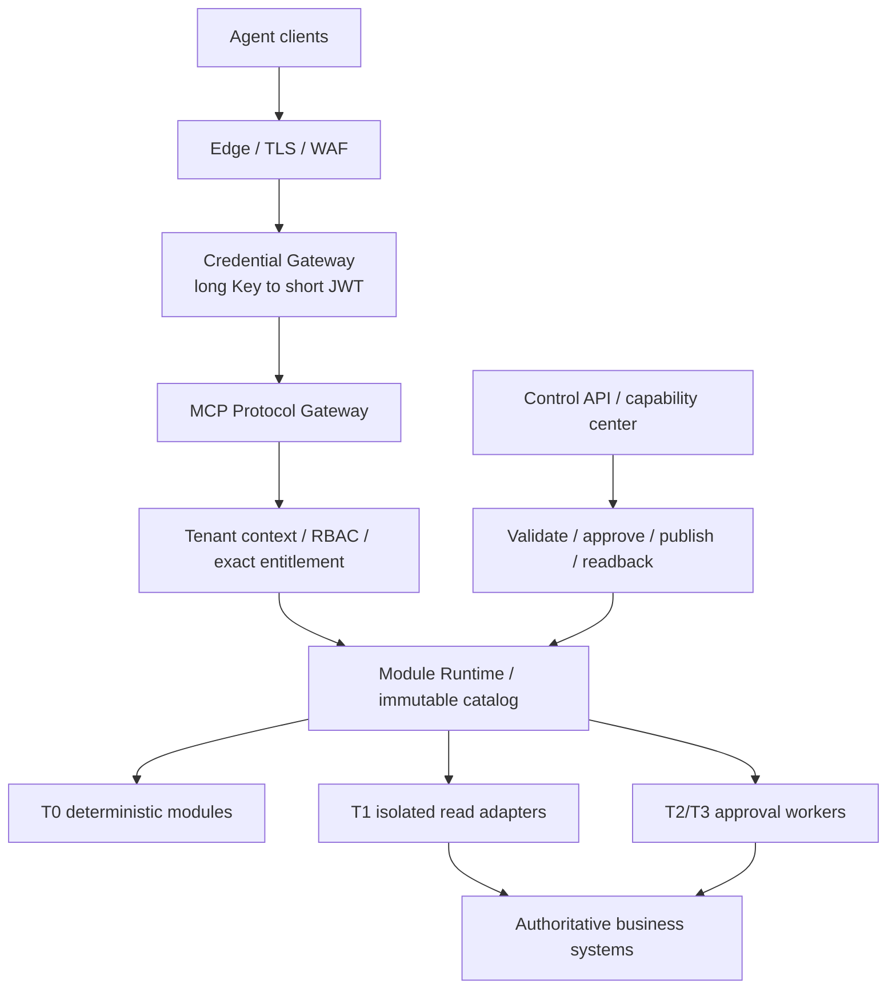

# RFC：独立 MCP Server Architecture v1

- 状态：accepted for implementation；生产资格仍取决于目标环境证据
- 日期：2026-09-02
- 接受依据：用户确认目标是独立 MCP Server 架构并要求开始执行
- 影响范围：MCP transport、生产平台依赖、部署配置、模块与控制面边界、Agent 接入
- 不改变：三个 T0 工具和五个资源、业务工具输入输出、五状态包络、业务权威归属

## 1. 变更原因

当前仓库已经分别实现 MCP HTTP、平台安全、静态 Module Runtime、Admin control-plane 和
Unified Access Gateway，但这些能力尚未由一份共同的服务器架构冻结。页面容易被误解为
MCP Server 本身，协议 session 也被当成生产正确性和持久状态的必要依赖。

本 RFC 将产品收敛为一个独立部署的多租户 MCP Server 平台。能力中心只是控制面客户端；
长期 API Key 只进入接入网关；MCP 数据面只接受短期 JWT；模块和配置只能按受审版本发布。

## 2. 架构决策



### 2.1 Edge 与身份边界

- Edge 负责 TLS、Host/Origin、WAF、受信代理、限流和紧急 denylist。
- 管理员通过企业 IdP、MFA 和角色映射进入控制 API。
- 机器长期 Key 只允许调用 Unified Access Gateway 的 exchange。
- Edge、IdP、KMS 或数据库存在配置文件不等于生产资格通过。

### 2.2 Credential Gateway

- 负责 tenant/client/credential/entitlement、Key hash+pepper、轮换、吊销和短 JWT。
- MCP Runtime 不读取长期 Key，不加载长期 Key verifier，也不保存明文凭证。
- JWT 的 `session_id` 是认证会话引用，不等于 MCP transport session。
- 签名、审计、吊销或限流依赖失败时停止签发，不能降级到本地 fixture。

### 2.3 MCP Protocol Gateway

- 统一暴露远程 Streamable HTTP `/mcp`。
- 负责协议版本、Tools/Resources/Prompts、Schema、请求大小、超时、取消和审计。
- 每个请求重新验证 Bearer JWT 并由服务端构造 tenant/client/actor context。
- 客户端不能提交 tenant、actor、role、scope、secret 或任意上游 URL。

### 2.4 Policy 与目录

- `tools/list`、`resources/list` 和调用权限由同一精确 entitlement 投影。
- 当前 `t0-v1` 目录继续精确等于 3 tools / 5 resources。
- 管理员角色不自动获得 MCP 业务工具权限。
- 未来目录 generation 必须不可变；发布后只能新增、激活、排空或回滚。

### 2.5 Module Runtime

- v1 生产只加载镜像内静态可信模块。
- manifest、工具合同、artifact digest、能力依赖和风险等级必须在监听前校验。
- T0 可在进程内运行；T1 外部只读进入隔离 worker；T2/T3 必须走作业、审批和读回。
- 页面不得安装任意 GitHub/npm/pip/Docker 代码，也不得把配置启用等同于生产资格。

### 2.6 Control Plane

- 控制面管理模块目录、配置 revision、审批、发布、激活、精确读回和回滚。
- UI 只调用 closed API；隐藏按钮不是权限门禁。
- 当前 production Admin POST 继续阻断，直到真实身份、多实例事务和发布证据完成。
- 配置、运行激活、租户授权、上游 readiness 和生产资格是独立状态。

## 3. Transport 模式

本 RFC 的 `MCP-TRANSPORT-001` 在协议 session 依赖上以 priority 95 覆盖
`t0-production-profile-v1` 中“生产必须具备 session registry/binding”的旧表述：该依赖只适用于
显式 `stateful`。认证 JWT 内的 `session_id`、持久审计和幂等依赖不受此覆盖影响。

### 3.1 `stateless`（生产默认）

- 每个 HTTP 请求创建独立 SDK server/transport，请求完成后释放。
- 不生成或返回 `Mcp-Session-Id`，也不接受客户端携带该 header。
- 不需要 session registry、sticky owner 或 durable session binding store。
- 每次请求必须携带有效短 JWT；后续请求使用协商后的 `MCP-Protocol-Version`。
- 审计、幂等和业务权威依赖仍然必须持久化，stateless 不代表无状态审计。

### 3.2 `stateful`（兼容模式）

- 显式配置后保留现有 `Mcp-Session-Id`、有界 registry、context binding 和 durable owner。
- 只能用于已验证需要 stateful transport 的旧客户端或 SSE/resumption 场景。
- 缺 session store、owner、健康检查或上下文一致性时失败闭合。
- 不允许一个实例同时接受 stateless 和 stateful 请求，避免降级和 confused-deputy。

Managed production startup 必须显式设置：

```text
MCP_TRANSPORT_MODE=stateless
```

未知值、空值或 stateless 配置 session dependency 必须在监听前失败。fixture 默认保持
stateful，避免把本地兼容行为静默写成生产行为。

## 4. 旧/新合同

旧生产装配概念：

```json
{
  "transport_mode": "implicit_stateful",
  "requires": [
    "audit_repository",
    "idempotency_repository",
    "session_runtime_registry",
    "session_binding_store",
    "session_owner_id"
  ]
}
```

新生产装配：

```json
{
  "transport_mode": "stateless",
  "requires": [
    "audit_repository",
    "idempotency_repository"
  ],
  "forbids": [
    "mcp_session_id",
    "session_runtime_registry",
    "session_binding_store",
    "session_owner_id"
  ]
}
```

兼容装配：

```json
{
  "transport_mode": "stateful",
  "requires": [
    "audit_repository",
    "idempotency_repository",
    "session_runtime_registry",
    "session_binding_store",
    "session_owner_id"
  ]
}
```

这些对象是架构合同示例，不是新的 MCP 工具输入或输出。

## 5. 状态、权限与数据影响

- 不增加任何工具或业务权限，不扩大三个 T0 entitlement。
- 不改变统一包络的五种状态。
- stateless 请求仍执行完整认证、租户隔离、Schema、RBAC、审计和幂等。
- transport mode 不进入客户端可控工具参数。
- MCP 数据库不得新增报价、Zone、税率、客户或订单主表。
- Access DB、Control DB 和集中审计在逻辑上独立；同一托管数据库可使用独立 schema，
  但不得共享隐式事务权威。

## 6. Agent 兼容

- ChatGPT、Codex、Claude 和企业 Agent 优先使用同一个远程 Streamable HTTP endpoint。
- 只为客户端提供 transport/auth 配置模板，不复制业务算法和权限表。
- 仅支持 stdio 的本地客户端使用独立薄 bridge；生产 Gateway 不启动任意 stdio 子进程。
- A2A/REST 后续使用独立 facade，不能绕过 MCP Policy 和 Module Runtime。

## 7. 迁移

1. 新增 transport mode parser 和红测。
2. `createMcpHttpHandler` 增加 stateless per-request runtime，同时保留显式 stateful。
3. production platform assembly 仅在 stateful 模式要求 session dependencies。
4. managed startup、Compose、环境示例和 readiness 显式要求 transport mode。
5. 使用官方 SDK 对 stateless initialize、tools/list、resources/list 和三个 T0 调用读回。
6. 对仍需要 stateful 的客户端单独记录兼容原因、容量和 sticky-owner 证据。
7. 后续再实施不可变 catalog generation、T1 worker 和生产 Control API；不得把本 P0
   写成完整热插拔已上线。

## 8. 测试

至少覆盖：

- stateless initialize 不返回 `Mcp-Session-Id`；
- stateless 后续 tools/resources/call 不需要 session binding；
- stateless 拒绝客户端 session header 和服务端 session dependencies；
- stateful 明确配置后的现有 context binding、过期、容量和关闭回归；
- 两种模式均执行 JWT、tenant、RBAC、Schema、审计和幂等；
- production managed startup 缺失/未知 transport mode 在监听前失败；
- 3 tools / 5 resources exact 目录、长期 Key 拒绝和非 T0 零构造保持不变；
- `npm run validate:agent-standards`、`npm run build:agent-pack`、typecheck、lint、相关测试和
  `git diff --check`。

## 9. 回滚

- 回滚 transport 时必须部署上一已验证镜像和配置，不允许运行中静默切换。
- 若某客户端不能完成 stateless 官方 SDK 读回，可为该客户端部署显式 `stateful` 兼容 profile；
  仍必须保留短 JWT、durable binding、容量和 tenant context 检查。
- 回滚不得恢复长期 Key 直连、宽目录或非 T0 adapter。
- 任一模式下 3 tools / 5 resources、审计或身份读回失败，继续 NO-GO。

## 10. 生产资格边界

本 RFC 和本地测试只授权仓库实现。真实 Edge、IdP、OCI KMS、托管数据库、共享限流、集中
吊销、备份恢复、负载、告警和回滚演练仍需独立证据。当前 Access Gateway provider 与
Console 代码存在不代表这些外部设施已经完成。
