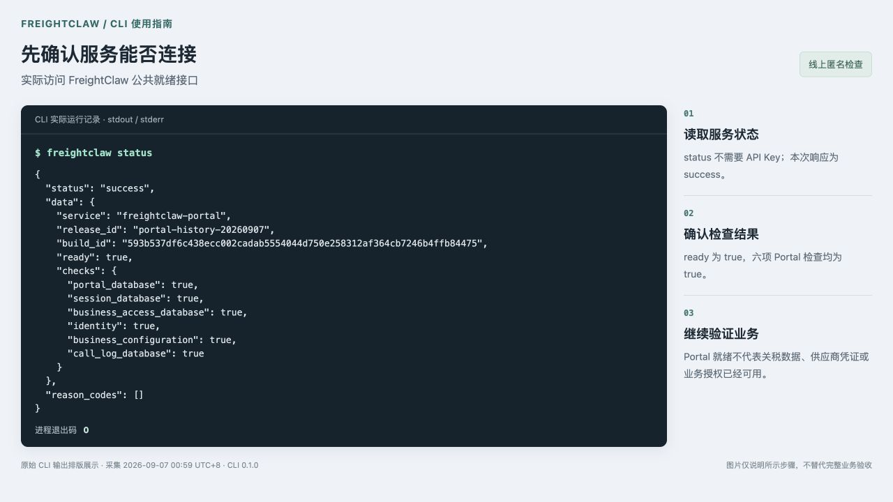
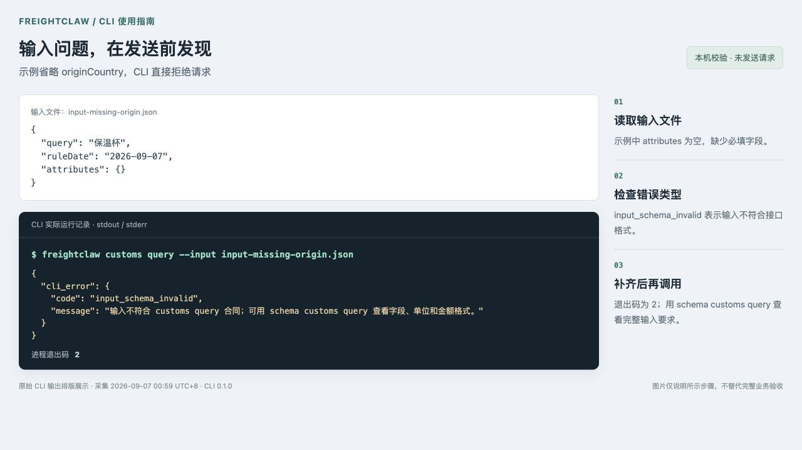
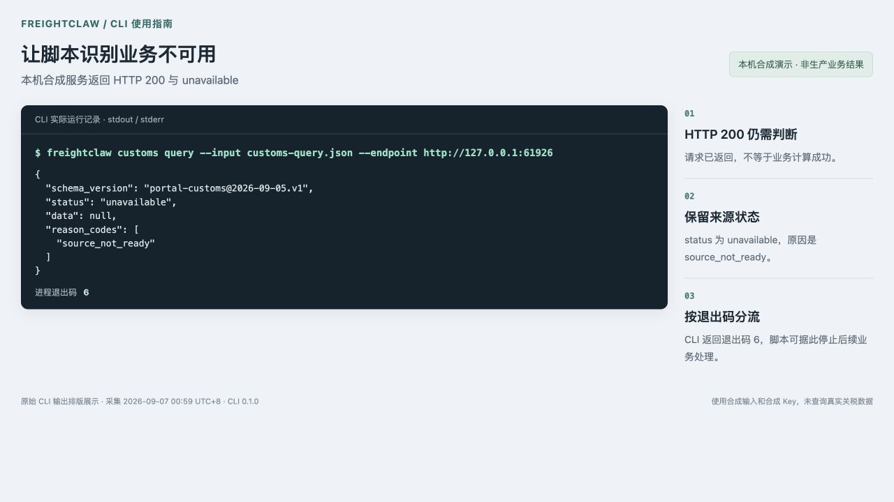

# FreightClaw CLI 图文使用指南

版本：`0.1.0`。截图采集：2026-09-07（UTC+8）。CLI 沿用现有账号和统一应用 Key，直接调用 FreightClaw REST API，适合本机脚本、CI 和 Agent。

本文按“安装 → 查看命令 → 检查连接 → 准备输入 → 处理结果”说明。图片来自实际 CLI 运行输出的浏览器排版截图；右侧为操作注释。线上匿名检查与本机合成演示分别标明，原始输出保存在 [采集记录](assets/freightclaw-cli/capture-record.json)。

## 1. 安装后确认命令可用

需要 Node.js 22.13 或更新版本。[官网 CLI 页面](https://www.freightclaw.net/console/#cli) 提供安装包、校验文件和可下载的输入示例。目前使用官网托管的 npm 安装包交付，尚未发布到公共 npm registry：

```sh
npm install --global https://www.freightclaw.net/downloads/freightclaw-cli-0.1.0.tgz
freightclaw --version
freightclaw --help
```

也可以下载 `.tgz` 后，将安装命令中的网址替换为本地文件的实际路径。

若从 GitHub 源码构建，在仓库根目录执行：

```sh
npm ci
npm run build:cli
npm pack ./dist/cli
npm install --global ./freightclaw-cli-0.1.0.tgz
```

看到版本号 `0.1.0` 表示命令能够启动。下图展示实际版本输出及帮助中的命令目录节选。


| 要做的事 | 命令 | 输入示例 |
| --- | --- | --- |
| 计算货物体积、重量和分泡 | `cargo calculate` | [cargo.json](../../deploy/cli/examples/cargo.json) |
| 查看装柜容量和装载摘要 | `container plan` | [container.json](../../deploy/cli/examples/container.json) |
| 读取已授权的 Agent 标准 | `agent context` | [agent.json](../../deploy/cli/examples/agent.json) |
| 关税与归类查询 | `customs query` | [customs-query.json](../../deploy/cli/examples/customs-query.json) |
| 单项税费估算 | `customs tax` | [customs-tax.json](../../deploy/cli/examples/customs-tax.json) |
| 批量税费估算，最多20项 | `customs tax-batch` | [customs-tax-batch.json](../../deploy/cli/examples/customs-tax-batch.json) |
| 加拿大尾程报价预览 | `quote zone` | [quote-zone.json](../../deploy/cli/examples/quote-zone.json) |
| 从询价文字提取输入并预览 | `quote extract` | [quote-extract.json](../../deploy/cli/examples/quote-extract.json) |
| Freightcom LTL 报价预览 | `quote freightcom` | [quote-freightcom.json](../../deploy/cli/examples/quote-freightcom.json) |

这些文件都是合成输入示例。实际使用前须替换货物、日期、地址、归类和来源引用；分泡规则及装柜参数也要使用实际业务证据。

## 2. 检查是否连接到服务

```sh
freightclaw status
```

这个命令不读取 API Key。下图为本次实际访问 `https://www.freightclaw.net/console/readyz` 的结果：`status=success`、`ready=true`，六项 Portal 检查通过，进程退出码为 `0`。



它只说明截图时 Portal 的就绪状态。业务服务仍会检查应用授权、来源数据和供应商凭证；不能据此判断当前关税数据或报价已可用。

## 3. 使用现有 Key，准备正确的输入

应用负责人在 [API Key 页面](https://www.freightclaw.net/console/#api-keys) 管理统一 Key。已有服务开通后继续使用同一个 Key，不需要为 CLI 再建一套账号。

凭证选择以下一种方式：

- 由本机凭证工具或 CI secret 注入 `FREIGHTCLAW_API_KEY`。
- 通过 `--key-file` 读取已有私有文件。macOS/Linux 文件须归本人所有且没有其他用户权限，例如 `600`；Windows 使用仅本人可读的文件 ACL。

不要把 Key 放到命令参数、截图或 Git 仓库中。环境变量和 Key 文件不能同时指定。下方仅展示文件路径，不包含 Key 内容：

```sh
freightclaw schema customs query
freightclaw customs query --input ./customs-query.json --key-file ~/.config/freightclaw/application-key --json
```

业务输入使用示例中的 JSON 对象，CLI 自动添加 API 所需的外层包装。金额和物理量按 Schema 使用字符串并带币种或单位。

下图故意省略 `attributes.originCountry`：CLI 在发起请求前返回 `input_schema_invalid`，退出码为 `2`。补齐必填字段后再调用。



## 4. 按业务状态处理结果

`--json` 输出紧凑 JSON，适合脚本读取。不要只判断 HTTP 状态；服务器可能在 HTTP 200 中返回业务不可用。

下图用本机合成 HTTP 服务和合成 Key 演示：服务器返回 HTTP 200，业务状态为 `unavailable`，原因为 `source_not_ready`。CLI 保留这份响应，并以退出码 `6` 结束。图中的本机端口只用于这次演示，不是生产服务地址。



| 退出码 | 如何处理 |
| --- | --- |
| `0` | 成功；帮助、版本、Schema、命令目录等本地命令也返回0 |
| `1` | 网络、超时、重定向或响应格式异常，先检查错误信息 |
| `2` | 参数、输入、文件或凭证配置问题，修正后重新调用 |
| `3` | `needs_input`：补充资料 |
| `4` | `manual_review`：交人工复核 |
| `5` | `blocked`：检查权限、鉴权或策略阻止原因 |
| `6` | `unavailable`：业务服务或来源尚不可用 |

有效的服务端响应写入标准输出；CLI 自身的参数、网络或协议错误写入标准错误。CLI 不自动重试，不跟随重定向。具体参数、大小限制和输出格式见 [完整命令说明](../../deploy/cli/README.md)。

## 5. 当前边界与截图证据

个人关务历史、报价保存、人工审核和 PDF 等人员操作继续使用网页登录。应用 Key 不代替人员身份。正式关务来源未就绪时，CLI 会保留不可用状态。

本次截图没有使用真实客户应用 Key，也没有查询真实报价或关税。图2是线上公开就绪接口；图1、图3在本机运行；图4只调用本机合成 HTTP 服务。原始命令、执行时间、退出码和输出见 [采集记录](assets/freightclaw-cli/capture-record.json)，图片尺寸及校验值见 [图片清单](assets/freightclaw-cli/screenshots.json)。

构建和发布操作见 [CLI 交付与验证](freightclaw-cli.md)。
