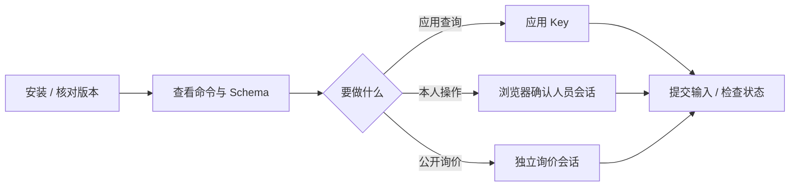
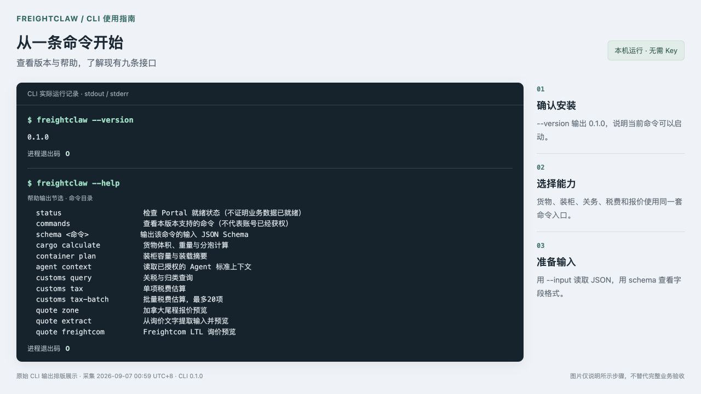

# CLI 快速开始

[文档中心](../README.md) / CLI 入门

**先安装，再选身份，最后按 Schema 准备输入。** 普通客户办理业务可直接使用网页，不必安装 CLI。


```mermaid
flowchart LR
  A[安装 / 核对版本] --> B[查看命令与 Schema]
  B --> C{要做什么}
  C -->|应用查询| D[应用 Key]
  C -->|本人操作| E[浏览器确认人员会话]
  C -->|公开询价| F[独立询价会话]
  D --> G[提交输入 / 检查状态]
  E --> G
  F --> G
```

## 1. 安装并查看命令

需要 Node.js 22.13+。从[官网 CLI 页面](https://www.freightclaw.net/console/#cli)选择已发布包，安装命令及版本说明见[CLI 参考](../../deploy/cli/README.md)。

```sh
freightclaw --version
freightclaw commands
freightclaw workspace commands
```

## 2. 检查连接

```sh
freightclaw status
```

就绪只说明 Portal 的相应检查通过；还需要有效身份、服务权限和可用业务来源。`unavailable` 时先检查返回原因，不反复提交业务。

## 3. 准备输入

```sh
freightclaw schema customs query
freightclaw workspace schema fcl quote-match
```

使用对应 Schema 和[合成示例](../../deploy/cli/README.md#机器业务命令)，换成实际资料。缺少单位或来源时补齐，不猜测。

## 4. 登录或配置凭证

人员操作按[人员 CLI](../../apps/console/workspace-cli.md)完成浏览器确认。应用查询从私有文件或环境变量读取 Key；不要把凭证写到命令参数、截图或仓库。

## 5. 读取结果

```sh
freightclaw customs query --input query.json --json
```

| 返回状态 | 下一步 |
| --- | --- |
| success | 核对结果、币种、来源和日期 |
| needs_input | 补充提示的资料 |
| manual_review | 转人工复核 |
| blocked | 核对账号、服务权限和策略 |
| unavailable | 检查服务及来源，不当作零价格或零税率 |

机器试算不会自动完成订舱或业务审批。完整参数、退出码及限制见[CLI 参考](../../deploy/cli/README.md)。

<details>
<summary>历史终端截图</summary>



此图来自 2026-09-07 的旧版本记录，仅用于了解终端输出形式。版本与命令目录以当前安装包为准。原输出见 [capture-record.json](assets/freightclaw-cli/capture-record.json)。

</details>
