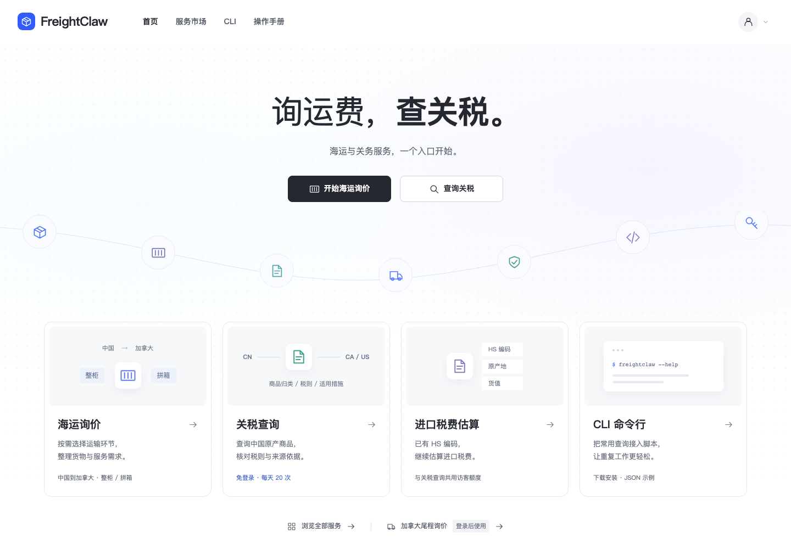
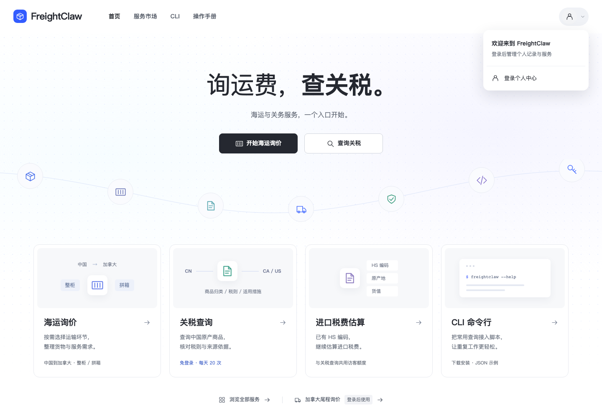
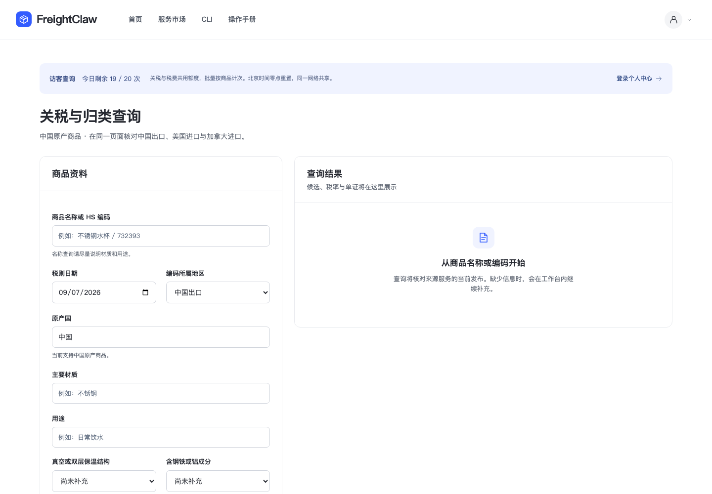
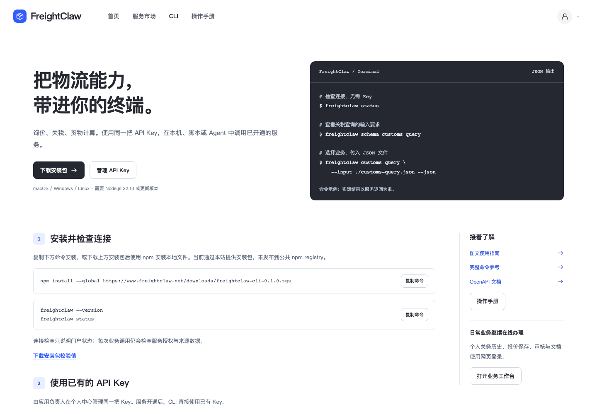
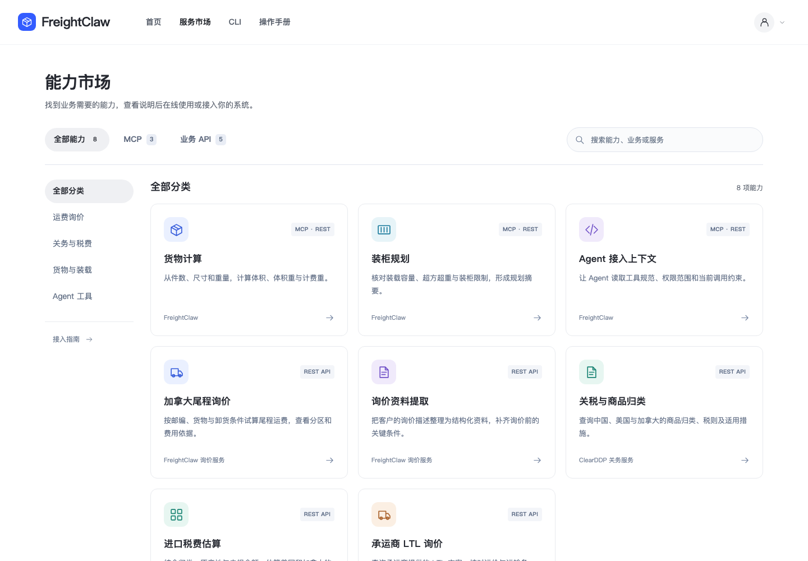
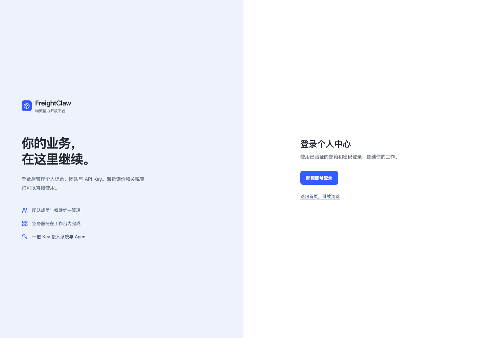
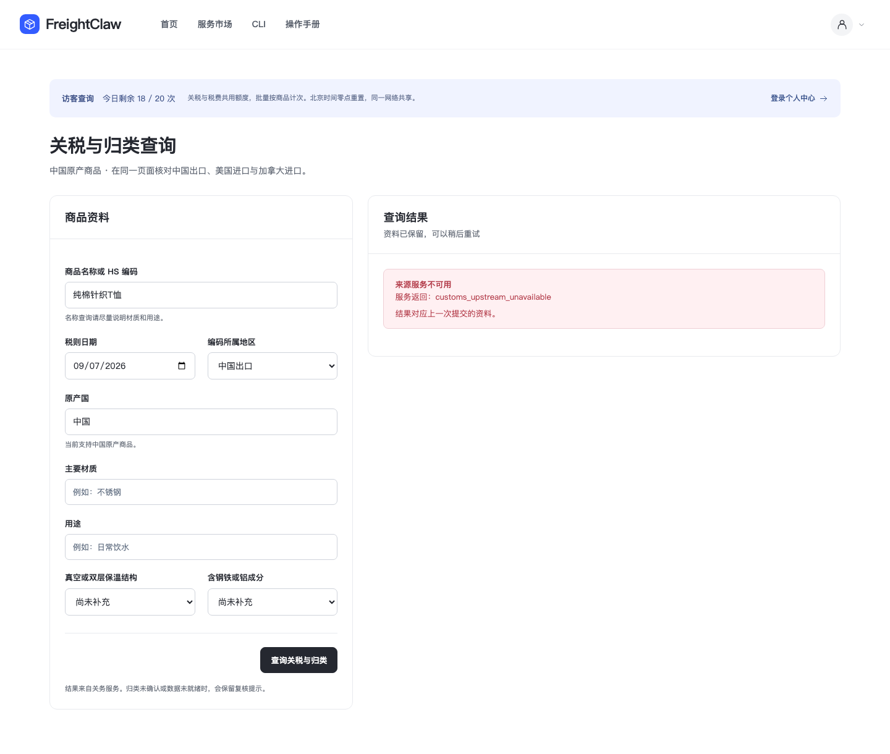
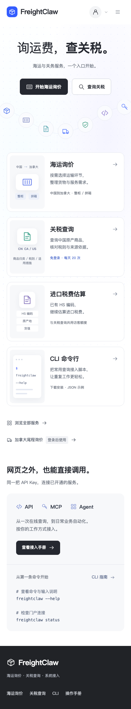
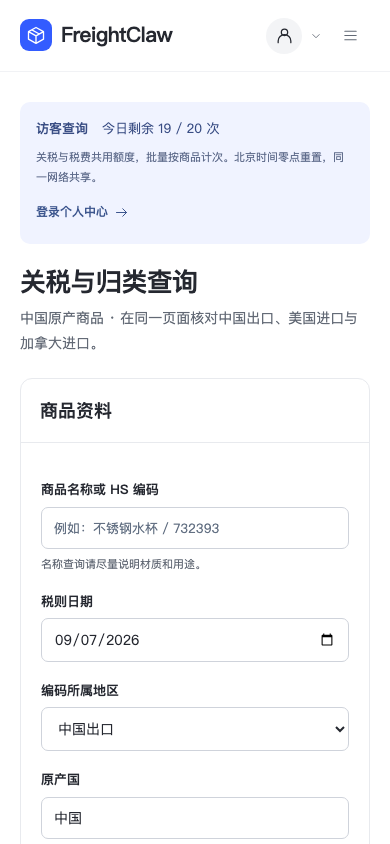
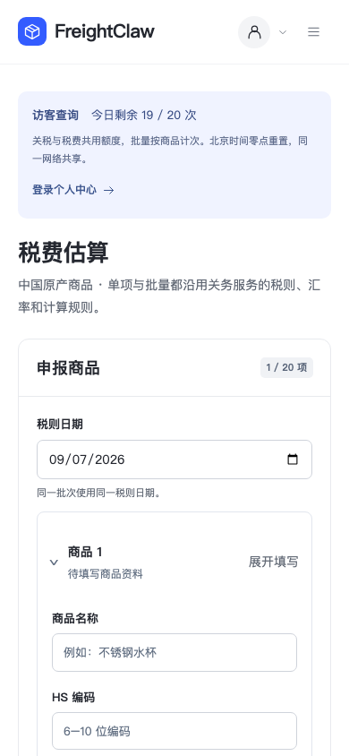

# FreightClaw 官网视觉更新

本次按用户指定的 [JoyAgent](https://joyagent.jd.com/pl/) 页面风格重做 FreightClaw 公共入口：白底留白、黑色主按钮、居中的轻重标题、淡蓝点阵与弧线图标、浅色服务预览、深色页脚。内容、品牌、业务能力与权限仍以 FreightClaw 实际实现为准。

## 页面与操作

首页提供“开始海运询价”和“查询关税”两个直接操作。下方四个入口分别为海运询价、关税查询、进口税费估算和 CLI，接入说明集中在后面的 API、MCP、Agent 区域。市场、CLI、表单与手册共用新的导航和按钮样式。

个人中心仍在右上角账号图标内，登录后按角色显示历史、API Key 和退出。海运、关税、税费、市场、CLI、手册可直接打开；尾程与个人数据保持登录要求。关税与税费共用每天 20 次访客额度，同一网络共享，批量按商品计次，北京时间零点重置，具体规则见 [访客查询说明](public-portal.md)。

### 桌面首页

### 账号菜单

### 关税与 CLI 页面

### 服务市场与登录边界

市场的接入方式按生产部署展示：货物计算、装柜规划、Agent 上下文支持 MCP；五项业务服务显示 REST API。代码支持的 `business-v1` 尚未部署，不能据此把市场八项能力全部标成 MCP。

### 当前查询结果

2026-09-07 的匿名合成商品查询，HTTP 返回 200，但业务状态为 `unavailable`，原因 `customs_upstream_unavailable`。页面保留商品资料并显示“来源服务不可用”；访客额度由 19 扣到 18，刷新后仍为 18。这里确认的是公开查询、扣次与状态处理；没有得到有效税率结果，也没有据此确认源数据的发布快照。旧发布记录中的 `ready=false` 不作为本次来源失败原因的替代证据。

### 手机端

| 首页 | 关税查询 |
| --- | --- |
|  |  |

[1920 px 宽屏首页](assets/joyagent-style/08-home-wide.png)。

以上图片从本次发布后的公网实际页面采集，不含真实客户资料。尺寸、采集时间、URL 与 SHA-256 记录在 [截图清单](assets/joyagent-style/screenshots.json) 中。参考网站自己的 390 px 页面存在固定宽度裁切；FreightClaw 单独实现移动布局，不继承该限制。

## 验证范围

- 本地实际浏览器覆盖 1440、1920、768、390、320 px；公共页面无横向溢出、无脚本异常。
- 账号菜单支持键盘关闭和焦点返回；尾程、关务历史、个人中心的匿名深链进入登录。
- 访客一次查询从 19 扣到 18，刷新保留额度；来源不可用时保留输入和 unavailable。此为隔离 fixture 的行为证据。
- 市场搜索、无结果、清除筛选和分类有效；回归测试与实际浏览器确认 8 项总计、3 项 MCP、5 项 REST，关务详情显示 REST API；CLI 安装命令复制与业务命令选择有效。
- 业务成员无 Key 管理入口；开发者菜单按角色提供 Key 管理；退出回到公开首页。

视觉审查由通用独立代理执行，替代当前环境缺少的专用角色。首次审查要求修正市场协议范围与首页原产地说明；修正后复核结果为 `ship`，没有要求继续调整布局。设计系统同样由通用独立文档代理根据最终实现更新。Impeccable 检测器仅运行一次，因缺少解析依赖降级为正则扫描，无法评价计算后的样式与对比度；新配色和尺度相对旧 DESIGN 的提示交由最终设计文档记录。网页生产运行时没有新增位图依赖，几何图标与路径由代码绘制，未复制参考站图片、商标、价格或产品声明。

## 发布与回滚

本次仅更新 Portal 页面资源与根 HTML，不迁移数据库，不修改关务来源连接、代理规则和业务授权。发布前备份 Portal 状态并执行恢复校验，保留原镜像和根 HTML。新镜像就绪后将根 HTML 原子替换为同一构建的文件。公网 HTML 被 Cloudflare 追加一段统计脚本；核对并单独排除这一段后，页面与本机构建逐字节一致，JS/CSS 则直接逐字节一致。原始响应和归一化后的 SHA-256 都保留在读回记录中。

回滚时将 Portal 镜像与发布环境恢复到本次备份版本，同时恢复备份的根 HTML。继续使用当前状态库，避免覆盖用户在发布后产生的数据与访客额度。海运询价、完整费用目录、下载包的文件校验值需与发布前相同。

## 自动化验证

本机 `npm test -- --run`：179 个文件通过，1729 项通过；两个 PostgreSQL 文件中的 7 项因本机没有独立测试库而跳过。审查修复的 `npm exec -- vitest run tests/access-gateway/console-market.test.ts` 先得到 1 项预期失败，再在修复后 3 项全部通过。`npm run build`、`npm run typecheck`、`npm run lint`、`npm run validate:schemas`、`npm run validate:agent-standards`、`npm run build:agent-pack` 与 `git diff --check` 均通过。[GitHub 功能提交验证](https://github.com/zqj372-ops/cross-border-logistics-mcp/actions/runs/34088286165) 使用独立 PostgreSQL，181 个测试文件、1736 项全部通过，镜像构建和发布门禁也通过。最终图文提交的检查状态见 [PR #22](https://github.com/zqj372-ops/cross-border-logistics-mcp/pull/22)。

## 生产读回

2026-09-07 已发布到 [官网](https://www.freightclaw.net/) 与 [控制台首页](https://www.freightclaw.net/console/#home)。发布身份及验证记录如下；`ready=true` 表示门户依赖检查通过，不能据此认定关务来源数据就绪。

| 项目 | 本次结果 |
| --- | --- |
| 运行时代码提交 | `c87d6f544d3ed85885c2f10413d7e11fcf9ab5db` |
| 构建身份 | `e0b3d1b86db16cd130a4869111a54610d004d06346f6faf03ad3e5fbbeedbbc4` |
| Portal 镜像 | `freightclaw-portal:e0b3d1b86db1` |
| 旧 Portal 镜像 | `freightclaw-portal:db4ac278e9dd` |
| 源文件核对 | 411 个打包输入与代码提交一致，上传后重新核对归档及每个文件 |
| 门户就绪 | 6 项依赖检查通过，公网版本与构建身份一致 |
| 根页面 | 与 `/console/` 使用同一构建；去除已确认的 CDN 统计脚本后，SHA-256 为 `6a30d523752d042a034967e20c5de01d8e2cf7eb0655c2c0f13c611a38c23068` |
| JS / CSS | 公网资源逐字节匹配本机构建，URL 带本次内容指纹 |
| 既有服务文件 | 根 HTML 之外的 32 个文件保持不变，包含询价、费用目录和 CLI 下载 |
| 公开入口 | 官网、控制台、海运询价、费用明细、Agent 指南、OpenAPI 与 CLI 下载返回 200 |
| 权限 | 匿名尾程、历史、应用与状态接口返回 401；没有公开尾程与公开历史路由，返回 404 |
| 数据库 | 5 个 SQLite 库备份恢复检查通过；本轮没有迁移或重置状态与额度 |
| MCP Runtime | 保持既有镜像与 `t0-v1` 生产模式 |

状态与根 HTML 备份：`/data/logistics-mcp/portal/backups/joyagent-e0b3d1b86db1`。发布环境回滚备份：`/data/logistics-mcp/portal/backups/portal-promotion-20260907T055156Z`。这些备份含私有状态，只保存在服务器。

脱敏记录见 [生产证据](assets/joyagent-style/production-readback.json)。截图和查询使用匿名会话及合成商品，没有提交真实报价、保存客户记录或发送消息。
