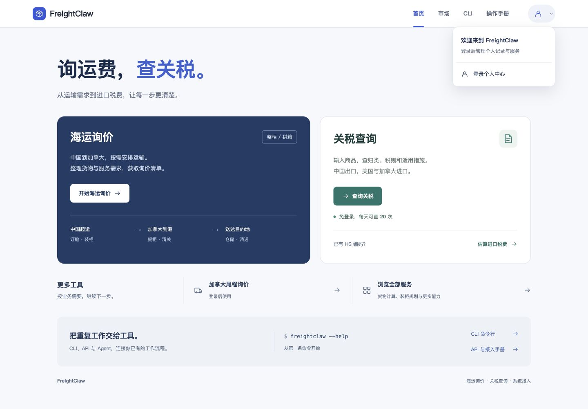
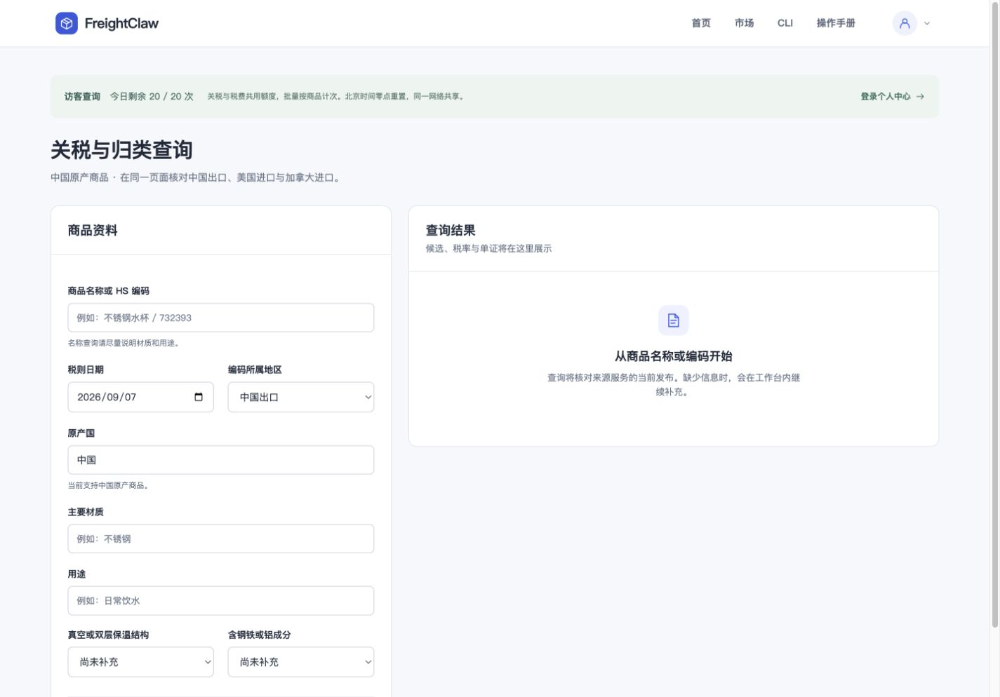
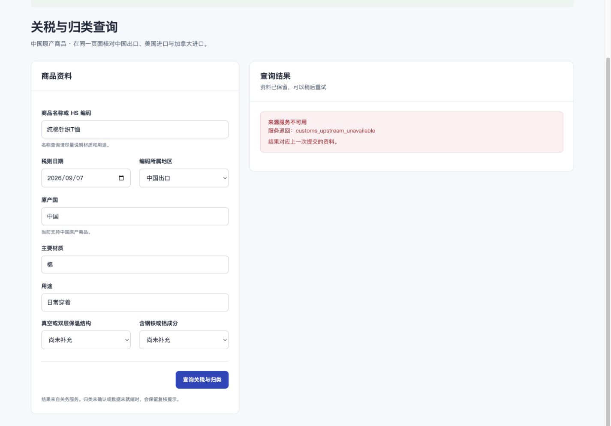
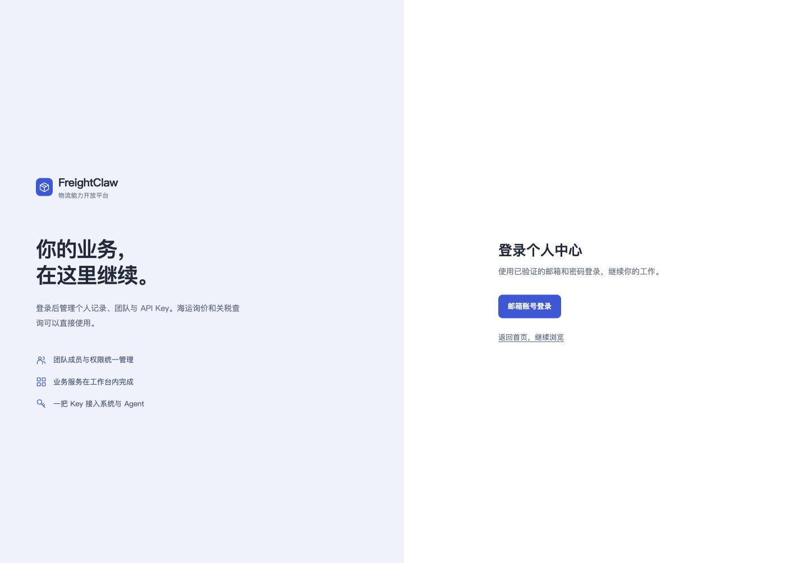
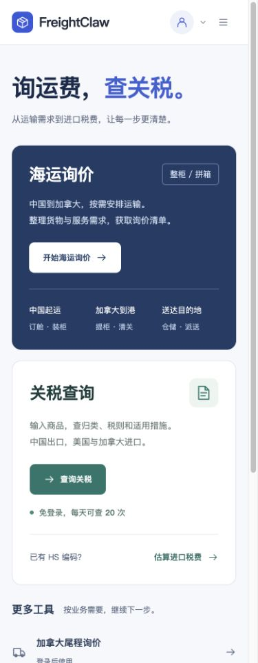
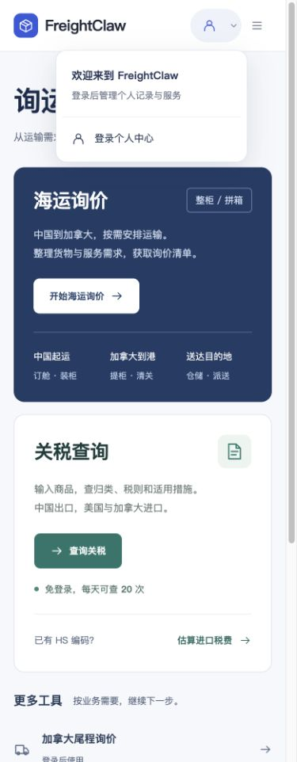
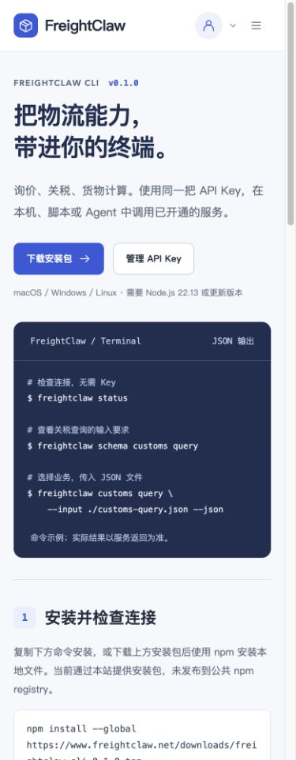
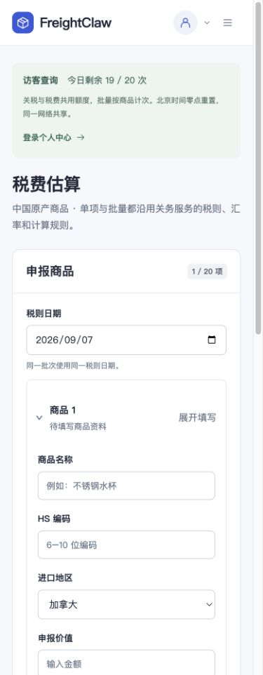

# 公开服务首页与访客关税查询

这次调整面向货主和商家：首页先选择海运询价或关税查询，个人中心收进右上角账号图标。官网根路径与 `/console/#home` 共用同一份页面，保留原整柜、拼箱询价和完整费用目录。

2026-09-07 已部署并从公网读回。访客入口与额度已生效；关务来源的正式数据仍未就绪，实际查询返回 `unavailable`，不能据此出具正式税率。

## 访问方式

| 页面或操作 | 访问要求 |
| --- | --- |
| 首页、海运需求整理、市场、CLI、操作手册 | 无需登录 |
| 关税查询、进口税费估算 | 支持访客查询，共用每天 20 次额度 |
| 加拿大尾程查询 | 继续要求登录及企业权限 |
| 个人中心、关务历史、报价历史、API Key、成员与服务授权 | 登录后按原有角色和企业权限访问 |
| 保存、审核、文档及其他写操作 | 保留原登录、权限、确认和读回要求 |

点击右上角账号图标进入个人中心。未登录显示登录入口；登录后根据角色显示工作区、相关历史与退出。市场、CLI、手册可以直接阅读，CLI 的实际业务调用继续使用已开通服务的应用 Key。

## 实际页面与操作

以下九张图片直接采集自线上页面，未修改图片内容，未使用真实客户资料。桌面视口设为 1440 × 1040，手机视口为 390 × 1000；浏览器截图的实际位图尺寸与视口可能因滚动条和工具裁剪有所不同。逐张时间、路径、尺寸及 SHA-256 见 [截图清单](assets/public-portal/screenshots.json)。

### 1. 先选服务，再整理需求

打开 [官网](https://www.freightclaw.net/) 或 [控制台首页](https://www.freightclaw.net/console/#home)。海运与关税是两个主要入口，CLI 和接入手册放在下方。海运按钮继续进入现有 [三步询价](https://www.freightclaw.net/inquiry/)。

### 2. 个人中心放在账号图标里

右上角账号图标始终可见。未登录时显示“登录个人中心”；登录后的个人工作区、历史及退出仍按身份提供。

### 3. 不登录也能打开关税表单

进入关税页面即显示今日剩余额度，可以填写商品名称或 HS 编码、材质和用途。此次浏览器实测从 20 次扣到 19 次，随后税费页面也显示剩余 19 次。

下图为合成商品“纯棉针织T恤”的真实线上返回。来源发布状态是 `ready=false`、`testData=true`、无有效发布快照，Portal 保持 `unavailable` 并保留输入。图片只证明交互和来源失败状态，不是商品归类或税率依据。

### 4. 尾程保持登录限制

首页尾程入口标明“登录后使用”。匿名点击后进入登录提示，直接调用尾程与个人历史接口也仍返回 401。

### 5. 手机端同样保留主入口和账号菜单

手机将两个主服务顺序排列，账号图标留在顶栏；账号菜单支持 Escape 关闭并将焦点返回图标。CLI 和操作手册从导航直接进入。

| 手机首页 | 账号菜单 |
| --- | --- |
|  |  |

| CLI 公开页面 | 税费页面共享剩余额度 |
| --- | --- |
|  |  |

## 每天 20 次如何计算

- 关税查询与税费估算共用额度；批量估算按商品条数计次。
- 按北京时间每天零点恢复。同一网络共享，IPv4 按地址、IPv6 按 `/64` 网络计量。
- 页面显示服务端剩余次数；清 Cookie、换浏览器或重启服务不会恢复额度。
- 输入未通过校验不计次。发往来源服务的查询尝试计次，来源未就绪或返回不确定结果也不退回。
- 剩余次数不足以处理整批时，整批拒绝且不扣减，不会偷偷只算部分商品。
- 用完后保留输入并显示恢复时间。没有企业会话的已登录用户仍使用访客额度；已有有效企业会话的业务用户沿用企业接口。

这是一项按网络计量的匿名额度，不能精确代表自然人。多人共用公司网络会共享 20 次，切换出口网络也可能得到另一组额度。

## 发布与回滚

来源配置文件新增可选 `publicAccess`：显式绑定既有发布应用、企业、租户、客户端，只允许 `customs.query` 和 `customs.tax.estimate`。缺省关闭。每次调用核对应用、负责人、企业及网关租户、客户端仍有效；来源使用既有服务身份，访客不继承该企业的人员历史或写权限。

新接口位于 `/console/api/v1/public/customs/`，仅包含额度读取、关税查询、单项和批量税费估算。POST 仍检查匿名会话、CSRF、Origin、输入 Schema 和实际来源状态。原人员接口与 API Key 接口保持原权限。

额度存储为 `PORTAL_STATE_ROOT/public-quota.sqlite`，启动时创建独立表，不修改原业务数据表。仅保存带密钥的每日网络摘要及次数，不保存原始 IP 或商品内容。备份脚本包括该库及调用记录库。当前支持单实例 SQLite；多实例 PostgreSQL 模式启用公开配置会失败关闭，迁移前须实现共享额度存储。

发布顺序：

1. 记录当前镜像、根页面校验值；备份并恢复校验现有 Portal 数据库、配置与根 HTML。
2. 从已验证的代码生成候选包，核对归档校验值并构建镜像。
3. 写入明确的公开来源绑定，保留其他连接和配置；切换 Portal 镜像并检查实际 build ID 与就绪结果。
4. 原子更新根 HTML 为同一构建的 `dist/console/index.html`。既有 `/console/` 代理已覆盖窄公开路径。
5. 从公网检查匿名页面、配额和一次只读查询，确认尾程及历史仍被保护；采集桌面和手机截图。

生产继续沿用 Cloudflare 隧道与回环 HTTPS 入口、可信代理传递的单一访客地址。不要将该 HTTPS 端口直接公开后继续信任调用方提供的转发头。

回滚时恢复备份的业务配置、Portal 环境与镜像及根 HTML，再核对就绪状态。保留新配额库，不用旧数据库备份覆盖运行状态。只需关闭访客调用时，移除 `publicAccess` 后重启 Portal 即可；人员和机器接口保持原合同。

## 验证记录

本机执行 `npm test -- --run`：179 个测试文件通过，1729 项通过；两个 PostgreSQL 测试文件中的 7 项因未提供独立测试数据库而跳过。类型检查、Lint、构建、Schema、Agent 标准校验和标准包构建均通过；数据库备份脚本通过 Python 语法检查。

新增测试覆盖 20/21 次、并发、双连接与重启、北京时间跨日、IPv6 等价地址、批量原子计次、CSRF/Origin、身份注入、私有路由隔离及发布方停用。隔离浏览器验证了访客表单和额度、失效匿名会话自动恢复、尾程登录跳转、登录后角色入口、退出清理、账号菜单键盘与 320/390/1440/1920 px 布局。

独立视觉审查采用通用代理代替当前环境不可用的专用角色，先发现并修复小字对比度、标题字距和窄屏横向溢出，再给出本轮修复范围内的 `ship`。Impeccable 检测器降级为正则扫描，无命中；它不代表完整视觉或可访问性验证。设计系统记录见 `apps/console/DESIGN.md` 与其 sidecar。

GitHub 的 [功能提交验证](https://github.com/zqj372-ops/cross-border-logistics-mcp/actions/runs/34083407769)提供了独立 PostgreSQL 环境，181 个测试文件、1736 项全部通过，包含本机跳过的 7 项；镜像构建与发布门禁也通过。

## 2026-09-07 生产读回

| 项目 | 实际结果 |
| --- | --- |
| 运行时代码提交 | `e4ff39d6af8e06b9e71c51aa197babc92a8fcffb`；后续提交补充设计文档、图片和读回记录 |
| Portal 镜像 | `freightclaw-portal:db4ac278e9dd` |
| build ID | `db4ac278e9dd8b6400240230100b51d1724f3d724499c512ae29d8b1b340bf27` |
| 上一镜像 | `freightclaw-portal:9dd46df9052f` |
| 静态资源 | JS `8cd374c35000ca1e`、CSS `1e63464511140056`；公网文件与本机构建逐字节一致 |
| 就绪检查 | 六项均为 true，返回新 build ID |
| 访客额度 | 初始 20，单次查询后 19；税费共享；新持久库完整性 `ok`、文件模式 `0600` |
| 私有边界 | 尾程、人员关务、历史、应用、状态接口匿名请求返回 401；不存在公开尾程和公开历史路由（404） |
| 来源正式数据 | M2M 状态 HTTP 503 / `data_not_ready`，`ready=false`、`testData=true`、`releaseIds=[]`；Portal 查询为 `unavailable` |
| 原服务文件 | 32 份海运询价、费用、业务资源和下载文件校验值保持一致；仅替换官网根 HTML |
| 其他业务配置 | 与发布前备份逐项相同，仅新增明确的公开来源绑定 |

状态及根 HTML 备份位于 `/data/logistics-mcp/portal/backups/public-portal-db4ac278e9dd`。四个既有数据库备份均通过恢复完整性校验；新额度库随首次启动创建并保留。镜像环境回滚备份位于 `/data/logistics-mcp/portal/backups/portal-promotion-20260907T043510Z`。这些私有备份不进入 Git。

脱敏 HTTP、来源状态、额度和发布证据见 [生产读回](assets/public-portal/production-readback.json)，页面宽度记录见 [视口检查](assets/public-portal/viewport-checks.json)。生产检查仅使用匿名会话与合成商品进行只读调用，没有提交真实报价、保存客户记录、发送邮件或生成正式业务文档。
