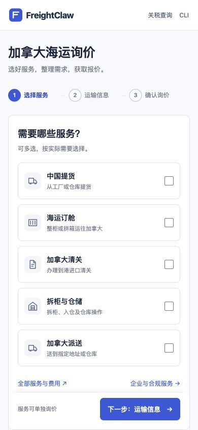
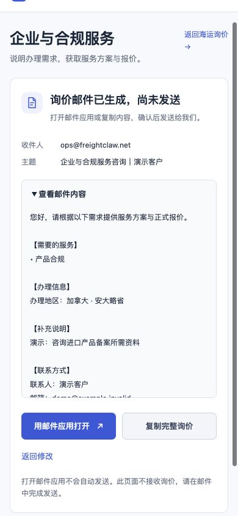

# 加拿大海运询价：三步整理需求

这次调整面向货主和商家：先选择服务，再填写相关资料，最后生成询价邮件。入口仍为 [加拿大海运询价](https://www.freightclaw.net/inquiry/)，官网与控制台首页原有按钮可直接进入。

## 1. 选择需要的服务

中国提货、海运订舱、加拿大清关、拆柜与仓储、加拿大派送均可单独选择。页面不预选收费项目，也不把未选环节默认算入套餐。


桌面和中等窗口采用两列服务选项；手机采用单列，下一步按钮保持可见。长费用说明不再占据首屏。



## 2. 填写运输信息

| 选择 | 对应填写内容 |
| --- | --- |
| 整柜 | 柜型、柜数；不知道时明确选择待确认 |
| 拼箱 | 总体积（m³）、总毛重（kg）；可分别标记待确认 |
| 还不确定 | 先说明起运地、目的地及货物，后续确认运输方式 |
| 仅加拿大清关、仓储或派送 | 不要求中国起运地；日期改为预计服务日期 |
| 拆柜与仓储 | 可展开补充托盘数量和 SKU 数量 |
| 加拿大派送 | 可展开补充收货场所和卸货安排 |

出货/服务日期、补充说明均可留空。页面不接受负数、零或科学计数法作为体积、重量或柜数；未掌握数量时使用「待确认」。返回上一步、切换整柜与拼箱时保留本页草稿；导出仅包含当前模式与当前服务相关的字段。

## 3. 确认并生成邮件

核对服务与运输摘要，填写联系人和电子邮箱。公司、电话选填。点击「生成询价邮件」后显示完整预览和 **「询价邮件已生成，尚未发送」**。

- 「用邮件应用打开」调用设备的邮件应用，需客户自行确认发送。
- 「复制完整询价」包含收件人、主题及完整正文。复制权限受限时显示可手动复制的文本。
- 内容过长时提供完整复制，不截短客户需求。
- 「返回修改」保留资料，修改后需要重新勾选核对。

收件人沿用原应用的 `ops@freightclaw.net`。网站不接收、保存或代发本表单，生成预览不代表已经提交、收到或报价成功。草稿只在当前页面内存中保留，刷新或关闭页面会清空。

## 企业与合规服务

从 [企业与合规服务](https://www.freightclaw.net/inquiry/#business) 选择公司与进口资质、Bond 与财税、产品合规。该流程只整理办理地区、需求和联系方式，不要求填写运输资料。



## 完整费用目录仍可使用

[全部服务与费用](https://www.freightclaw.net/inquiry/details/) 在新标签页打开保留的完整询价应用，避免离开正在填写的简明表单。原 84 项服务、14 个分组、目录版本 `OCEAN-FLOW-2026-07-V4` 及原计算逻辑保持原样。

新流程的摘要显示「待报价」，不读取或改写价格。原费用表里的 CAD/USD 小计仅代表原逻辑已计算部分，不能理解成尚未报价的整柜运费为零。

## 构建与验证

```sh
npm run build:inquiry
npx vitest run tests/e2e/shipper-inquiry.test.ts
npm run typecheck
npm run lint
npm run validate:schemas
npm run validate:agent-standards
npm run build:agent-pack
npm run build
git diff --check
```

`apps/inquiry` 是独立静态页面。构建输出 `dist/inquiry/index.html`、带内容摘要文件名的 JS/CSS、`details/index.html` 和原导航样式。标准整体构建、Docker 构建与 Portal 候选源码包均包含这些输入。

本轮自动测试覆盖服务选择、条件字段、未知数量、严格数量与联系方式校验、当前服务范围、HTML 转义、邮件参数编码及长邮件完整保留。浏览器使用合成资料验证整柜、拼箱、错误定位、返回草稿、企业咨询、邮件生成和复制；没有发送邮件。

本轮截图来自本地候选页面，视口为 1280 × 720、390 × 844 和当前窗口 729 × 686。上线读回和最终截图记录将在发布验证后写入本节。

## 发布与回滚

1. 核对现网询价 HTML、首页 HTML、Nginx 主配置及服务入口 include；核对原 JS/CSS、费用目录和导航样式的 SHA-256。备份存放在 Web 根目录之外。
2. 从通过验证的构建发布 `dist/inquiry/assets/` 和 `details/index.html`。详情页沿用原 `/assets/`、`/pricing/` 路径。原价格目录与业务资源不覆盖。
3. 原子替换 `/inquiry/index.html`，更新服务入口 include，使 `/inquiry/`、`/inquiry/details/` 及其 `index.html` 均重新校验 HTML 缓存。运行 `nginx -t` 后 reload。
4. 公网读回新 HTML、全部新资源、详情页及旧资源；比较完整文件校验值。Cloudflare 可能追加已知统计脚本，HTML 比较仅剔除该脚本，其他内容必须相同。
5. 用浏览器确认五项服务、三步询价、完整费用入口以及官网/关税/CLI 导航；不发送真实业务邮件。

这次只发布静态询价页面及其 HTML 缓存配置，不需要数据库迁移或 Portal 镜像切换。回滚时恢复此次备份的询价 HTML、导航样式及 include，经配置检查后 reload；已有版本化资源可保留，不用旧备份覆盖数据库或其他业务应用。
