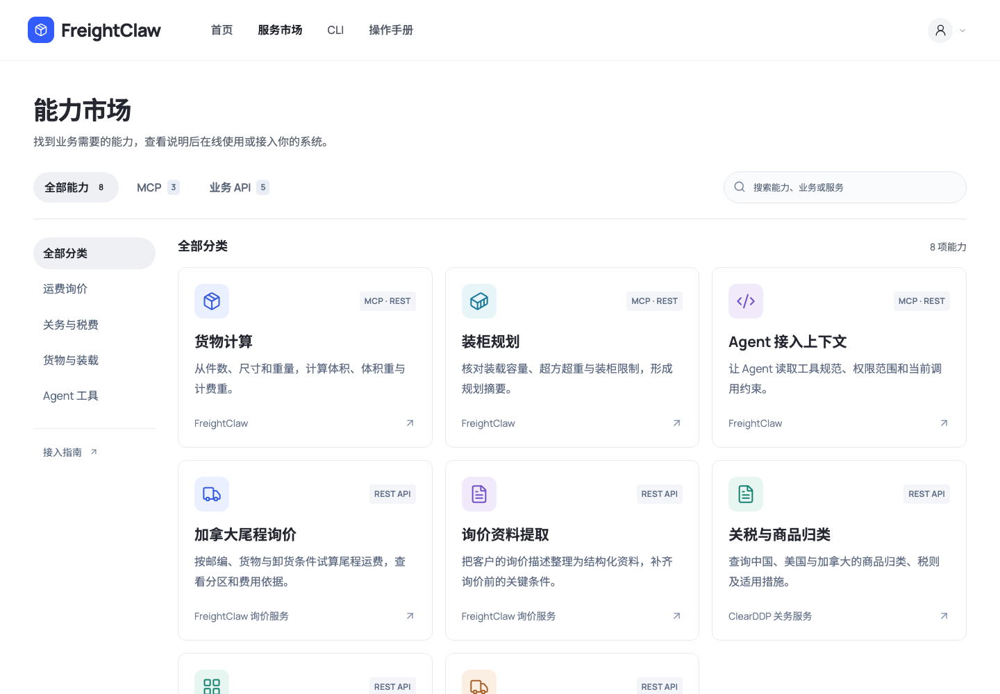
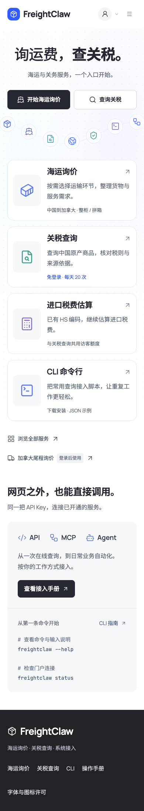
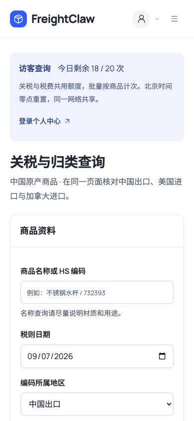
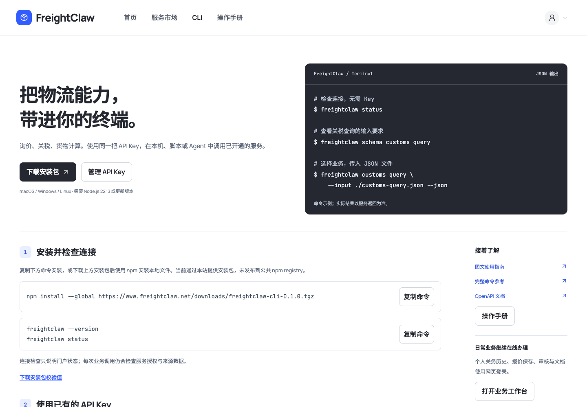

# FreightClaw 布局、字体与图标审计

2026-09-07 在已确认的 [JoyAgent 参考风格](https://joyagent.jd.com/pl/) 上进行可读性调整。目标用户仍是希望快速整理海运需求、查询关税的货主与商家。延续白底、近黑主按钮、淡蓝点阵与弧线构图，主要改变内容比例、文字层级与图标语言。

## 审计发现与调整

“显得小”有可核对的尺寸原因：旧首页在 1920 px 屏幕上只有 1280 px 内容区，服务正文 13 px，手机正文 12 px、附注 10 px。标题与服务入口之间还存在较长装饰区。改版扩大信息本身，同时缩短这段间隔。

| 项目 | 调整前 | 调整后 |
| --- | --- | --- |
| 1920 px 首页内容宽度 | 1280 px，占视口 66.7% | 1536 px，占视口 80% |
| 首页标题上限 | 58 px | 72 px，常规与粗体形成层级 |
| 服务标题 | 桌面 20 px / 手机 18 px | 桌面 24 px / 手机 20–21 px |
| 服务正文 | 桌面 13 px / 手机 12 px | 桌面与手机均为 16 px |
| 服务附注 | 桌面 11 px / 手机 10 px | 桌面 14 px / 手机 13 px |
| 首页主要按钮 | 高 48 px / 字号 14 px | 桌面高 56 px / 字号 16 px，手机独立适配 |
| 物流弧线区域 | 桌面高 172 px | 桌面高 126 px，减少入口之前的空档 |
| 字体 | 依赖设备安装的字体 | 本站加载三种开源字体 |
| 图标 | 自有简化路径、多个服务共用文档图标 | 25 个精选 Lucide 图标，统一线宽与语义 |

桌面主内容并非整页等比缩放：普通任务页保持最大 1440 px，首页为 1536 px；中屏服务列表改为两列，手机用大图标加正文的横排结构，装饰性小标签不再挤占正文空间。

独立复核关闭了两个具体问题：320 px 下账号下拉菜单左侧原本溢出 6 px，修正后左边界为 22 px；旧市场焦点描边对白底对比度为 1.59:1，现统一采用品牌蓝，实际对比度为 5.10:1。该审计针对本次修改，不等同于整个产品的无障碍认证。

## 字体与图标

| 用途 | 字体或图标 | 许可与交付方式 |
| --- | --- | --- |
| 中文标题、正文、表单 | Noto Sans SC | SIL OFL 1.1，本地 WOFF2 可变字重 |
| 英文品牌、拉丁文字与数字 | Manrope | SIL OFL 1.1，本地 WOFF2 可变字重 |
| CLI、代码与命令 | JetBrains Mono | SIL OFL 1.1，本地 WOFF2 可变字重 |
| 导航、物流服务、账号与操作 | Lucide | ISC；保留 Feather 衍生图标的 MIT 许可 |

字体从固定版本的官方 Google Fonts 仓库取得；图标从固定版本的 Lucide 仓库选取。完整许可、原始版权信息与来源地址见 [本站许可说明](../../apps/console/asset-licenses.md)；字体文件哈希与来源版本见 [字体清单](../../apps/console/fonts/manifest.json)。字体没有运行时外部 CDN 依赖。

中文优先加载界面字符，其余字符按 `unicode-range` 分片加载，覆盖原字体的 30,890 个 Unicode 映射。全部 43 个字体文件在构建中约 9.6 MB；首页涉及的三个文件合计 324,936 字节，浏览器不会一次下载全部中文字符。使用 `font-display: swap`，字体暂时不可用时仍显示系统回退字体。构建会把字体复制为带内容指纹的静态资源，并将本地 CSS 引用改为 `/console/fonts/` 地址。

## 新版实景

首页文字与服务预览扩大，账号入口仍位于右上角。个人中心、关务历史与 Key 管理按登录状态和角色显示。

市场、表单和 CLI 共用新的正文、按钮与图标尺度。生产环境仍为 3 项 MCP 能力和 5 项 REST 业务服务，视觉调整没有扩大接入权限。

| 手机首页 | 手机关税页 |
| --- | --- |
|  |  |

[320 px 账号菜单](assets/ui-refinement/11-account-narrow.png)、[匿名尾程登录页](assets/ui-refinement/07-tail-login.png)、[手机税费页面](assets/ui-refinement/10-tax-mobile.png)。以上文件为发布后的浏览器截图；采集时间、视口、URL 和图像哈希见 [截图清单](assets/ui-refinement/screenshots.json)。

## 验证结果

- 本地浏览器覆盖 1920、1440、1280、1024、768、540、390、320 px：首页、服务市场、关税、税费、CLI、操作手册与受保护入口共 24 项检查通过，没有整页横向溢出、脚本错误或字体请求失败。
- 实际渲染字体通过浏览器字体信息确认；另行阻断字体请求后，正文和主要按钮仍可阅读与使用。
- 10 项交互检查通过：账号菜单、Escape 焦点恢复、手机导航、市场搜索和分类、CLI 复制与命令选择、业务成员和开发者菜单，以及访客扣次和刷新保持。涉及业务查询的检查只在隔离 fixture 执行。
- 独立审查额外检查 320 / 1024 px 的 9 个路由，菜单、焦点修复后给出 `SHIP`，没有未解决的 P0 / P1 / P2 回归。
- 字体打包回归测试先在未接入字体时失败，接入后通过。本机全量测试为 179 个测试文件通过、1730 项通过；7 项需要独立 PostgreSQL 的测试本机跳过。[GitHub 功能提交验证](https://github.com/zqj372-ops/cross-border-logistics-mcp/actions/runs/34092392866) 中 181 个测试文件、1737 项全部通过，镜像与发布门禁也通过。
- `npm run build`、`npm run typecheck`、`npm run lint`、`npm run validate:schemas`、`npm run validate:agent-standards`、`npm run build:agent-pack` 与 `git diff --check` 均通过。

本轮不重新发起公网关税业务查询；[上轮来源不可用记录](joyagent-style.md#当前查询结果)仍是已知业务限制。访客关税与税费共用每天 20 次额度、北京时间零点重置、同一网络共享；尾程、个人中心、历史记录及私有操作保持登录要求。

## 发布记录

发布前备份 Portal 状态并进行恢复校验，保留原镜像和根页面；发布仅更新门户构建与根 HTML，继续使用当前数据库、额度与权限配置。生产读回、构建身份与截图核验记录在 [发布证据](assets/ui-refinement/production-readback.json)。回滚需同时恢复旧 Portal 镜像及备份根 HTML，并保留当前状态库，避免覆盖发布之后的数据。

| 发布项目 | 核对结果 |
| --- | --- |
| 构建身份 | `056300a14ec73e4cc39691b435ef8084cc56b58c29f9d3700fde0ad89343ce47` |
| 源提交 | `10e269dba4007839de132a53ca83adc650b5f495`，458 个构建输入逐一匹配 |
| Portal 镜像 | `freightclaw-portal:056300a14ec7` |
| 回滚镜像 | `freightclaw-portal:e0b3d1b86db1` |
| 状态与根页面备份 | `/data/logistics-mcp/portal/backups/ui-refinement-056300a14ec7` |
| 发布环境备份 | `/data/logistics-mcp/portal/backups/portal-promotion-20260907T065611Z` |
| 线上检查 | 根页面与控制台、JS/CSS、3 个实际字体资源、许可文件匹配构建；6 项门户依赖通过 |
| 原有服务文件 | 除根 HTML 外 32 个文件保持不变；MCP Runtime 镜像保持原版本 |
| 图文说明 | 11 张真实公网截图，3 种字体经浏览器实际渲染信息确认 |

字体请求均返回 `font/woff2`。HTML 在独立排除已确认的 Cloudflare 统计脚本后与构建一致，JS、CSS、字体及许可文件直接逐字节匹配。匿名私有接口返回 401，未提供的公共尾程与历史接口返回 404；这些状态不消耗访客关税额度。最终合并与检查见 [PR #23](https://github.com/zqj372-ops/cross-border-logistics-mcp/pull/23)。
