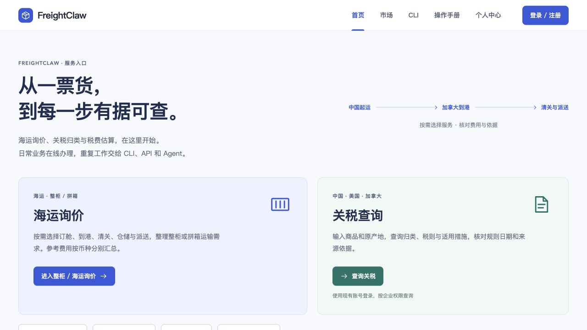
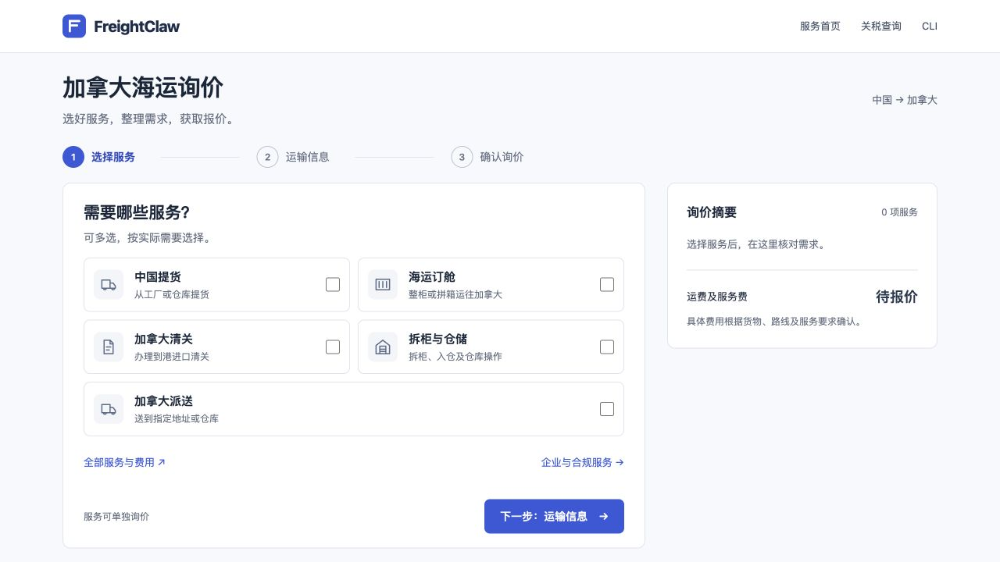
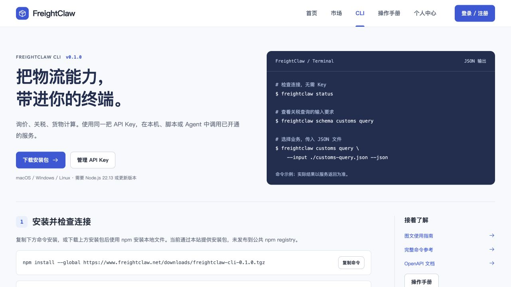
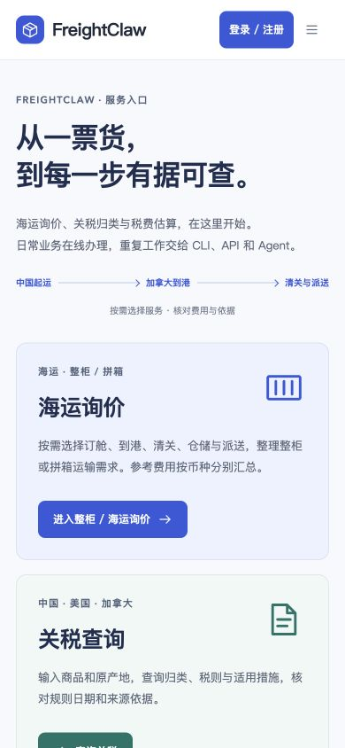
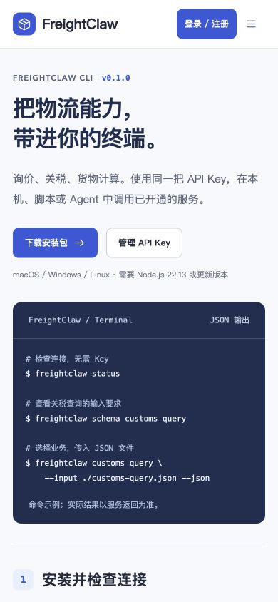

# 官网、询价与 CLI 统一入口

本文保留统一入口首次发布的截图与验收记录。2026-09-07 后续调整已将个人中心收进账号菜单、公开关税与税费访客查询并设置每天 20 次额度，尾程仍需登录；最新行为和截图以 [公开首页与访客关税说明](public-portal.md) 为准。

本次入口调整复用同一份 `apps/console` 前端。官网根路径和 `/console/` 使用同一构建的 HTML、带内容版本的 JS/CSS 和既有人员 API；业务请求继续由 Portal 检查身份、企业、权限和来源。入口变更没有新增关税或运价权威，也没有新增机器写权限。

## 页面与路径

| 路径 | 作用 |
| --- | --- |
| `/` | 公共服务首页，直接进入海运询价、关税查询、税费估算、尾程询价或系统接入 |
| `/inquiry/` | 面向货主/商家的三步询价：服务、运输信息、确认邮件 |
| `/inquiry/details/` | 保留原完整费用选择、计价脚本和邮件生成逻辑 |
| `/inquiry/#business` | 单独的企业与合规服务咨询 |
| `/#customs`、`/console/#customs` | 同一关税工作台，访客每天 20 次；企业用户沿用企业权限 |
| `/console/#home` | 同一服务首页；个人及平台工作区从账号菜单进入 |
| `/console/#cli` | 公开 CLI 安装页、九条命令、可下载的 JSON 示例和业务退出码说明 |
| `/downloads/freightclaw-cli-0.1.0.tgz` | 已验证的独立 CLI 安装包；不是公共 npm registry 发布 |

来源未就绪时继续显示真实 `unavailable`，不能把首页入口或 CLI 安装成功写成正式关税数据已可用。下文首次发布时的登录流程与旧首页截图仅作为历史记录。

## 首次发布截图与操作

以下图片于 2026-09-07（UTC+8）直接从公开网站采集，未修改图片内容。桌面视口为 1280 × 720，手机视口为 390 × 844。路径、尺寸和校验值见 [截图记录](assets/unified-service-entry/screenshots.json)。

### 1. 从官网首页选择服务

打开 [官网](https://www.freightclaw.net/) 或 [控制台首页](https://www.freightclaw.net/console/#home)，选择「海运询价」或「关税查询」。关税查询沿用现有登录和企业授权；页面下方还提供税费估算、尾程询价、关务历史，以及 CLI 和 API/MCP 入口。



### 2. 三步整理海运询价

点击首页「进入整柜 / 海运询价」，打开 [加拿大海运询价](https://www.freightclaw.net/inquiry/)。依次选择需要的服务、填写运输信息、核对需求并生成邮件。整柜、拼箱显示对应资料；未知数量明确标记待确认。



新流程显示「待报价」。点击「全部服务与费用」可继续使用 [原完整询价表单](https://www.freightclaw.net/inquiry/details/)，原 84 项费用目录、脚本和分币种计算保持原样。企业资质、Bond 和产品合规从独立入口进入。

「生成询价邮件」只生成可核对的内容；由客户打开邮件应用并自行发送。完整操作、截图来源及本轮验收见 [简明询价图文说明](shipper-inquiry.md)。下方统一入口历史验收与旧截图保留为该次发布记录；当前询价路径以新说明为准。

### 3. 从控制台安装 CLI

点击导航中的「CLI」进入 [CLI 页面](https://www.freightclaw.net/console/#cli)。页面提供安装命令、安装包、校验值、同一 API Key 的使用方式、九条业务命令及合成 JSON 示例。切换「要处理的业务」会同时更新执行命令、Schema 命令和示例下载地址。



本次从公开 HTTPS 下载地址安装后，`freightclaw --version` 实际输出 `0.1.0`，`freightclaw status --json` 实际返回 `success`、`ready=true` 及当前 Portal build ID。业务权限和来源就绪状态仍在每次实际调用时检查。

### 4. 手机端入口

手机端服务卡片按顺序排列；右上角导航展开后可选择 CLI，选择后自动收起。本次 390 px 视口的页面宽度也为 390 px，首页及 CLI 均无横向溢出。





## 首次发布验收结果

| 检查 | 实际结果 |
| --- | --- |
| GitHub CI（功能提交 `9c73103`） | 178 个测试文件、1,717 项测试通过 |
| 公网页面及文件读回 | 19 个地址返回 200；剔除已知 Cloudflare 统计脚本后的 HTML、原询价资源、安装包和示例校验值一致 |
| 首页与控制台首页 | 显示同一服务入口；关税按钮进入现有登录流程 |
| 原海运询价 | 费用目录仍为 `OCEAN-FLOW-2026-07-V4`；FCL 勾选及分币种汇总正常 |
| CLI | 官网安装成功，版本及 Portal 状态读回成功；命令与示例切换正常 |
| 浏览器 | 桌面、手机页面内容正常；上述流程未发现相关控制台 warning/error 或错误覆盖层 |
| 登录后回到关税页 | 本地合成账号验证通过；生产验收未提交真实关税业务 |

## 构建和验证

```sh
npm run build
npx vitest run tests/access-gateway tests/e2e/freightclaw-cli.test.ts tests/e2e/freightclaw-cli-package.test.ts
npm run typecheck
npm run lint
npm run validate:schemas
npm run validate:agent-standards
npm run build:agent-pack
git diff --check
```

浏览器验证包括公共首页、原询价服务、登录前后的关税入口、CLI 复制/命令选择/下载、控制台市场与移动导航。生产业务提交不用于 UI smoke test；原询价仅测试本页选项、分币种汇总和复制，不发送邮件。

## 发布顺序与回滚

以下为统一首页首次发布的历史步骤。后续询价页升级使用 [独立静态发布与回滚步骤](shipper-inquiry.md#发布与回滚)，无需重复切换 Portal。

1. 核对当前根页面、其引用的海运应用资源和费用目录并保存校验值。备份放在 Web 根目录之外。
2. 将旧根页面保留到 `/inquiry/index.html`，只更新 canonical/分享地址并增加返回首页导航；原 `/assets/`、`/pricing/` 和其他业务文件保持原路径。`inquiry-navigation.css` 仅作用于新增导航。
3. 发布并读回 CLI 安装包、SHA-256 文件和包内九份合成 JSON 示例。安装包使用已验证制品，已存在的同版本文件不得静默覆盖成不同内容。
4. 按既有 Portal 发布流程切换候选镜像，核对 build ID、就绪状态及权限边界。读取候选 `dist/console/index.html`，确认带版本的静态资源可访问。
5. 原子替换根 `index.html` 为同一构建的 `dist/console/index.html`。在既有 HTTPS server 中包含 `deploy/portal/service-entry-locations.nginx`，使首页和询价 HTML 每次访问重新校验，避免浏览器按旧文件日期长期缓存；原脚本、样式和下载文件保持既有缓存策略。先运行 `nginx -t`，通过后 reload，并读回 HTML 的 `Cache-Control: no-cache` 及原安全响应头。不增加新的 API 代理或改变鉴权配置。
6. 从公网浏览器读回 `/`、`/inquiry/` 和 `/console/#cli`，验证入口、旧询价选项、资源与安装包校验值。数据库不需要迁移。

公网 HTML 会被 Cloudflare 追加统计脚本。比较构建内容时仅剔除该已知脚本，然后核对完整 HTML 和其引用的版本化 JS/CSS；安装包、JSON、业务脚本和样式必须逐字节相同。已经缓存旧首页的浏览器首次需要刷新；新响应会要求每次重新校验。

回滚时先恢复备份的旧根 `index.html`，再按 Portal 既有流程恢复上一镜像及配置并核对就绪状态。需要撤回 HTML 缓存设置时恢复 Nginx 配置备份，经 `nginx -t` 后 reload。原海运脚本和费用目录保持原样，新增下载文件与 `/inquiry/` 可保留；不得用旧备份覆盖运行数据库。
