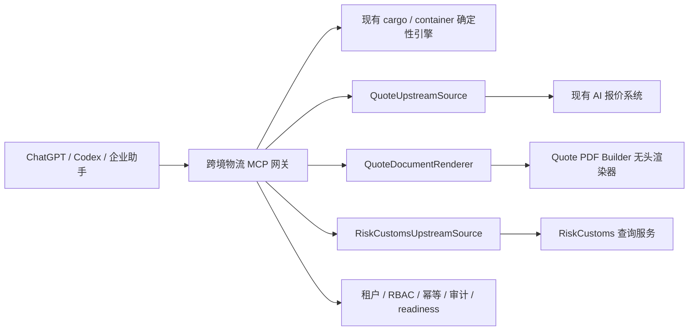

# 本地三模块插件化接入实施计划

> 执行模型：Luna MAX。每个工作包使用独立任务、独立分支和独立提交；主任务负责合并顺序与独立复验。

**目标：** 不另起业务系统，在现有跨境物流 MCP 中接入本地 AI 报价、Quote PDF Builder 和 RiskCustoms，先形成可重复的本地/隔离环境闭环，再决定是否进入公司 staging。

**推荐结构：** 继续使用一个远程 MCP 网关。报价、PDF、关务各自只提供一个窄适配边界；金额、体积重、分泡、装柜与税率处理由确定性代码完成，AI 只负责补字段和解释。所有真实上游默认关闭，配置、契约或版本证据缺一项即 fail-closed。

**基线：** `codex/admin-architecture-view`，计划编写时 HEAD 为 `59226a605da3fb11356159722738afda717212d7`。执行前必须重新核对实际分支和文件；不得把本计划中的快照当作生产证据。

---

## 1. 最终结构



不建设三套 MCP Server，也不复制价格库、税则库或客户报价数据库。三个模块仍拥有各自的权威数据和业务规则，MCP 只做校验、调用、映射和审计。

## 2. 当前证据与发布边界

| 模块 | 已核验入口/能力 | 当前缺口 | 第一轮允许上线的能力 |
| --- | --- | --- | --- |
| AI 报价 | FastAPI；当前 README 指向 `POST /quotes/zone-calculate`；现有 MCP 已有 `QuoteUpstreamSource` 和 `ExistingQuoteAdapter` | 主目录部分文件是 iCloud dataless；实际路由、无写副作用、字段和版本仍需从当前源码/测试重新证明；无已核验独立保存草稿入口 | 仅加拿大尾程只读试算；`sendable=false` |
| PDF | React/Electron；`buildQuotePdfHtml` → IPC → `BrowserWindow.printToPDF`；有 `{version:1, kind, data}` 导入包络和 normalize | 没有 HTTP/CLI/无头服务；金额使用 `number`，与 MCP decimal string 不一致；localStorage 不适合多人 | 先提取纯函数无头渲染；只做 quote，不做 invoice，不发送 |
| RiskCustoms | `GET /api/status`、`POST /api/query`；Node `createNodeServer({worker,env,handleRequest})` | 没有已核验独立税额估算接口；Turnstile challenge 不是服务间认证；必须验证 release/hash/test_data | 先状态与候选查询；正式税额估算保持 unavailable |

任何“已在另一 worktree 看到”的代码都只是候选证据。只有当前源目录、当前提交、当前测试和隔离 HTTP 合同同时一致，才能把对应适配器从 disabled 改为 enabled。

## 3. 工具启用矩阵

| MCP 工具 | 本轮状态 | 启用条件 |
| --- | --- | --- |
| `cargo.calculate` | 保持 fixture 可测 | 现有测试通过 |
| `container.plan_summary` | 保持 fixture 可测 | 现有测试通过 |
| `quote.canada_final_mile.calculate` | 本轮接入目标 | 报价只读合同、版本字段、租户映射和无副作用证据齐全 |
| `quote.save_draft` | 关闭 | 独立 preview、commit、readback 三段真实接口全部核验后另开任务 |
| `quote.document.create` | RFC 提议，暂不注册 | PDF RFC 通过、无头渲染和对象存储读回合同完成后 |
| `customs.ca.search` | 本轮接入目标 | status→query 门禁、release/hash 和服务认证合同完成 |
| `customs.ca.estimate` | 关闭 | RiskCustoms 提供可验证的税额估算合同；不得由 MCP 拼成正式税额 |
| `knowledge.search_curated` | 保持现状 | 现有测试通过 |
| `review.create_task` | 保持 fixture 可测 | 真实人工任务边界未核验前不接生产 |

---

## 4. 工作包与依赖

```text
10A 报价只读源 ─────────┐
10B PDF 无头渲染器 ─────┼─> 10D MCP 组合与隔离联调 ─> 10E 独立审查/修复 ─> staging 决策
10C 关务状态/查询源 ─────┘
```

10A、10B、10C 可以并行。10D 必须基于三者的已验证提交；10E 不得由 10D 的执行任务自审自结。

### 工作包 10A：AI 报价只读适配源

**仓库：** `/Users/autumn/Documents/ChatGPT/物流产品MCP`

**允许修改：**

- 新建 `src/logistics_mcp/adapters/quote/http-quote-source.ts`
- 新建 `tests/adapters/quote-http-source.test.ts`
- 必要时新增不含真实客户/价格的 `tests/adapters/fixtures/quote-http-*.json`
- 不改 `ports.ts`、工具目录、生产组合、外部报价仓库

**执行步骤：**

1. 重新核对当前 AI 报价主目录/可读 worktree 的实际提交、`apps.api.main:app`、健康端点和 `POST /quotes/zone-calculate`。记录请求、响应、认证、版本字段和数据库副作用证据；若无法从当前源码证明无写副作用，任务只提交测试/阻断说明，不启用真实源。
2. 先写 RED 测试，使用注入的 `fetchImpl` 和假域名，不访问网络。
3. 复用 `createFetchJsonClient`，实现现有 `QuoteUpstreamSource`；不要新增通用 SDK、工厂或 HTTP 依赖。
4. 映射必须保留 quote/rule/data version、有效期、命中来源和 `SourceRef`。金额转换为 decimal string；缺版本、缺价、冲突或未知地址类型返回可识别错误，由现有 adapter 映射为 `needs_input`/`manual_review`/`unavailable`。
5. 明确禁止调用 `/quotes/ai-auto-quote`，因为已知候选实现会写销售记录/QuoteVersion；不得实现 draft write。
6. 运行最小测试和回归：

```bash
npm test -- --run tests/adapters/quote-http-source.test.ts tests/adapters/quote-adapter.test.ts tests/adapters/security-http-client.test.ts
npm run typecheck
git diff --check
```

**必须覆盖：** 成功映射、缺版本、无价格、地址类型不明、上游 4xx/5xx、超时、重定向、非 allowlist 主机、凭证不出现在错误、请求只发生一次。

**完成定义：** 一个原子提交；测试全绿；默认 `enabled !== true` 时零网络调用；无生产配置和真实凭证。

### 工作包 10B：Quote PDF Builder 无头渲染边界

**仓库：** `/Users/autumn/Documents/Codex/quote-pdf-builder`

**允许修改：** 只改完成最小无头渲染所需的现有 builder/main/test 文件；不加入 Web 服务器、数据库、队列、对象存储或新 UI。

**执行步骤：**

1. 在当前源码重新追踪 `buildQuotePdfHtml`、normalize、IPC、`printToPDF` 和可编辑 JSON 附件的实际调用链。
2. 先写一个 RED 测试，定义最小入口：

```ts
renderQuotePdfBytes(input) -> { bytes, sha256, rendererVersion, templateVersion }
```

3. 复用现有 HTML builder、Electron hidden `BrowserWindow.printToPDF` 和附件逻辑。只把“弹保存对话框/写用户路径”从生成流程中拆开；不要重写模板。
4. 入口只接受已 normalize 的 quote document 或现有 `{version:1, kind:"quote", data}`；拒绝 invoice、任意 HTML、文件路径、远程 logo/font URL。
5. 数字边界做一次显式转换：MCP decimal string 在 adapter 层转换为 PDF builder 现有合法数值；非有限值、精度越界或 currency 缺失必须报错，不静默舍入。
6. 返回 bytes 和 SHA-256，不写 localStorage、不打开保存对话框、不泄露临时路径。
7. 运行项目已有最小测试、类型检查和打包检查；若 Electron 测试环境不能稳定生成 PDF，保留一个对纯 normalize/HTML builder 的可运行测试，并把 Electron smoke 作为明确未通过门禁，不能伪报完成。

**必须覆盖：** 同一规范化输入生成稳定 metadata/hash 证据、quote-only、远程资源拒绝、非法金额拒绝、生成路径不弹窗、现有桌面导出不回归。

**完成定义：** 一个原子提交；桌面端原流程仍可用；新增入口无网络、无保存副作用；不新增架构层。

### 工作包 10C：RiskCustoms 状态与查询源

**仓库：** `/Users/autumn/Documents/ChatGPT/物流产品MCP`

**允许修改：**

- 新建 `src/logistics_mcp/adapters/customs/http-riskcustoms-source.ts`
- 新建 `tests/adapters/riskcustoms-http-source.test.ts`
- 必要时新增假响应 fixture
- 不改 `ports.ts`、工具目录、estimate 领域实现、生产组合、RiskCustoms 外部仓库

**执行步骤：**

1. 从当前 RiskCustoms 源码重新确认 `GET /api/status`、`POST /api/query`、请求/响应 schema、ready/test_data/release/hash 和 challenge/429 语义。
2. 先写 RED 测试，所有 HTTP 使用注入 fetch 和假域名。
3. 复用 `createFetchJsonClient` 实现现有 `RiskCustomsUpstreamSource` 的 `getStatus` 与 `search`。
4. `search` 每次必须先由现有 `RiskCustomsAdapter` 读取 status；`ready=false`、`test_data=true`、release 缺失或 hash 不一致时，断言 query 调用次数为零。
5. `estimate` 明确返回“上游能力未核验”错误，不调用 `/api/query` 拼装税额。
6. challenge/Turnstile 返回必须映射为 unavailable/manual review；不得把浏览器 challenge token 当长期服务凭证。服务间认证只接受显式注入的 secret reference/header provider，日志始终脱敏。
7. 运行：

```bash
npm test -- --run tests/adapters/riskcustoms-http-source.test.ts tests/adapters/riskcustoms-adapter.test.ts tests/adapters/security-http-client.test.ts
npm run typecheck
git diff --check
```

**必须覆盖：** ready 成功、ready false、test data、release/hash 冲突、候选映射、challenge、429、超时、无正式估算、凭证脱敏。

**完成定义：** 一个原子提交；状态门禁可证明 query 零调用；estimate 保持关闭；无真实数据和凭证。

### 工作包 10D：MCP 组合与隔离联调

**前置：** 10A、10B、10C 的提交已由主任务复验。PDF RFC 已决定接受或继续 proposed。

**允许修改：** 优先只改 `src/logistics_mcp/server/composition.ts`、必要的窄 PDF adapter/tool/schema、对应测试和 `deploy/env.example`；不得改三个外部系统的业务规则。

**执行步骤：**

1. 以 cherry-pick 后的统一分支开始，先运行全量现有测试作为基线。
2. 构造一个最小 `ProductionAdapterSource`，组合现有 quote/customs adapters 与真实 HTTP source；knowledge/review 没有真实源时必须继续 disabled，不得用 fixture 补位。
3. 配置只接受 secret reference/运行时注入；tenant → upstream identity 映射必须在服务端，客户端不得传上游账户或密钥。
4. readiness 分模块给出 reason codes：quote、PDF、customs 任一依赖缺失只阻断依赖它的工具；网关认证、审计、幂等或 session store 缺失仍阻断整个生产入口。
5. 若 RFC 尚未接受，不注册 PDF 工具，只完成 renderer adapter 的隔离合同测试。若 RFC 接受，严格按 RFC 增加一个窄工具，不改现有九工具语义。
6. 增加隔离 e2e：报价成功→形成不可发送的 quote snapshot→PDF preview/commit/readback（如启用）；关务 ready→候选查询；关务不 ready→零 query；跨租户请求零上游调用。
7. 所有测试仍只使用 fake HTTP server/fetch；不连生产。

**验证命令：**

```bash
npm test -- --run tests/adapters tests/domains tests/e2e
npm run typecheck
npm run lint
npm run validate:schemas
npm run build
git diff --check
```

**完成定义：** 全量门禁通过；生产默认仍 fail-closed；无 fixture fallback；状态页能区分“配置缺失”和“上游未就绪”。

### 工作包 10E：独立审查与最小修复

由新的 Luna MAX 任务执行，不复用 10D 的上下文结论。

1. 对照本计划、PDF RFC、tool catalog 和 authority matrix 做代码审查。
2. 重点核验：写副作用、租户隔离、SSRF/redirect、凭证和客户数据脱敏、金额精度、PDF 路径泄露、关务 ready/hash、estimate 是否仍关闭。
3. 运行全量门禁，并用本地服务实际读取 `/healthz`、`/readyz` 和一条 fixture MCP 调用；不得只看测试报告。
4. 只修复已复现的问题，保持最小 diff；每个非平凡修复必须有一个会失败的回归测试。
5. 输出 findings（按 P0–P3）、修复提交、剩余阻断和可否进入 staging 的明确结论。

---

## 5. 合并顺序与冲突规则

1. 先提交本计划与 PDF RFC。
2. 并行完成 10A、10B、10C。
3. 主任务逐个读取 commit、diff 和测试；顺序合并 10A → 10C。10B 留在 PDF 仓库，不把其源码复制进 MCP。
4. 10D 通过已发布的 package/CLI/本地受控入口调用 10B；在形式未确定前，只允许接口注入测试，不加新依赖。
5. 10E 只在统一集成提交后开始。

若任务需要修改未授权文件，必须先停止并报告；不得为了“测试通过”修改共享契约或放宽 fail-closed。

## 6. 本地验收场景

| 场景 | 期望 |
| --- | --- |
| 报价信息完整且版本齐全 | `success`，decimal string，总价有来源，`sendable=false` |
| 报价缺地址类型/价格/版本 | `needs_input` 或 `manual_review`，无可发送总价 |
| PDF 输入引用有效 quote snapshot | preview 不写；commit 后返回 handle、sha256、byte size 并读回一致 |
| PDF 输入任意 HTML/远程资源/非法金额 | `blocked` 或 `needs_input`，零渲染/零写入 |
| RiskCustoms ready 且 release/hash 一致 | 返回候选和 next questions，仍非正式归类 |
| RiskCustoms not ready/test data/hash 冲突 | `unavailable`，query 调用次数为零 |
| 请求关务正式估算 | `unavailable`/`manual_review`，不拼造税额 |
| 缺 JWT verifier、durable stores 或 adapter source | `/readyz` 503，生产 MCP 不接受业务调用 |
| 跨租户或重复写 | 前者 blocked 且零上游调用；后者由幂等/readback 返回同一结果 |

## 7. 进入 staging 前的硬门槛

- 三个源目录都能读取当前提交，不再依赖未物化的 iCloud 文件。
- 当前源码证明实际 API 合同；fixture 与实际 schema 一致且有版本/hash。
- 服务间认证、tenant mapping、secret store、durable audit/idempotency/session store 均有负责人和测试环境。
- 全量测试、schema、lint、typecheck、build 通过；无真实客户数据、价格、PDF、地址或凭证进入仓库/日志。
- staging 有明确 URL、回滚镜像/配置、验收人；生产仍需另一次显式批准。

## 8. 本轮明确不做

- 不做另一个万能 MCP、通用插件市场或可配置工作流引擎。
- 不接 `/quotes/ai-auto-quote`，不自动保存/发送/发布报价。
- 不做 invoice、支付、邮件/企微发送、对象存储管理后台。
- 不把 HS 候选包装成正式归类，不自行计算正式完税金额。
- 不连接生产数据库、真实 API、服务器或客户数据。
