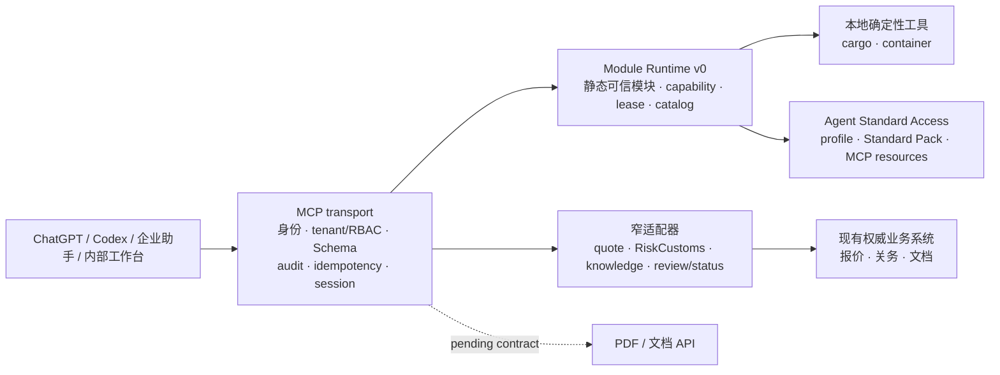
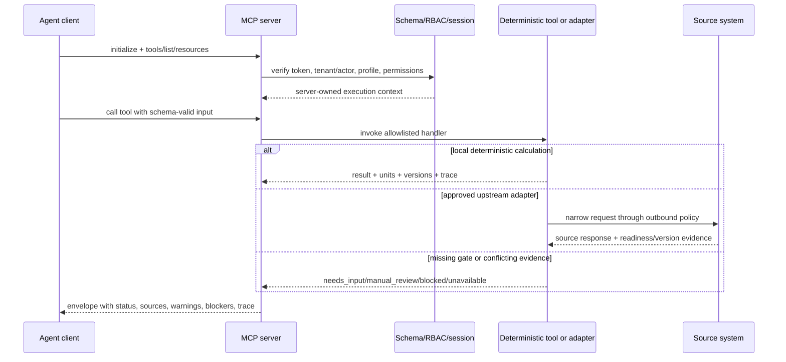

# Repository README Visual Guide Implementation Plan

> **For agentic workers:** REQUIRED SUB-SKILL: Use superpowers:subagent-driven-development (recommended) or superpowers:executing-plans to implement this plan task-by-task. Steps use checkbox (`- [ ]`) syntax for tracking.

**Goal:** Rewrite `README.md` from the `main` baseline so a new reader can understand the logistics MCP architecture, current capability states, Agent client access rules, and local verification path from one visual, truthful entry point.

**Architecture:** Keep the README as a single documentation entry point. Put an architecture-first narrative at the top, then add state tables and two Mermaid diagrams for request flow and Agent access; link detailed contracts, standards, runbooks, and client templates instead of duplicating their full rules. Use only facts present on `main` at `c9873b1`.

**Tech Stack:** GitHub-flavored Markdown, Mermaid, shell command blocks, existing TypeScript/Node package scripts, Draft 2020-12 contract documentation, and JSON Agent registry/profile files.

---

### Task 1: Reconfirm the `main` documentation facts before editing

**Files:**
- Read: `README.md`
- Read: `package.json`
- Read: `docs/contracts/tool-catalog.md`
- Read: `docs/contracts/envelope.md`
- Read: `docs/contracts/authority-matrix.md`
- Read: `docs/agent/index.json`
- Read: `docs/standards/agent-access-v0.md`
- Read: `docs/standards/release-agent-adapters.md`
- Read: `deploy/clients/chatgpt.example.json`
- Read: `deploy/clients/codex.example.toml`
- Read: `deploy/clients/enterprise-assistant.example.json`

- [ ] **Step 1: Verify the branch and source snapshot**

Run:

```bash
git branch --show-current
git log -3 --oneline
git status --short --branch
```

Expected: branch `codex/repository-readme-visual`, history containing the `main` base `c9873b1cbafd6239acbf98f84f737b10fdf934f4` followed by the design/plan commits, and no user worktree files in the isolated worktree.

- [ ] **Step 2: Cross-check every command and count used by the README**

Run:

```bash
node -e "const p=require('./package.json'); console.log(JSON.stringify(p.scripts, null, 2))"
node -e "const x=require('./docs/agent/index.json'); console.log({standards:x.standards.length, profiles:x.profiles.length, modules:x.modules.length, resources:x.resources.length})"
rg -n '^### `|^## |^\\| `|tool_names|profile|resources' docs/contracts/tool-catalog.md docs/agent/index.json deploy/clients
```

Expected: all commands in the README exist in `package.json`; the registry and client templates expose the documented profile/resource relationships; Phase 1 has nine business tools and `system.agent_context.get` is an additional Agent context tool.

- [ ] **Step 3: Record the known test-discovery limitation without changing it**

Run:

```bash
npm test
```

Expected on the clean `main` baseline: Vitest fails while loading `docs/contracts/quote-v2-contract.test.mjs` with `No test suite found`; its own Node assertion output says `quote v2 contract checks passed`. Do not edit test configuration as part of this README task.

### Task 2: Replace the README opening with the architecture-first story

**Files:**
- Modify: `README.md`

- [ ] **Step 1: Write the hero and fact-boundary sections**

Start the README with:

```markdown
# 跨境物流 MCP

> A thin, fail-closed control plane for logistics tools used by ChatGPT, Codex, enterprise assistants, and internal workbenches.
```

Immediately state that the repository is an independent MCP service/control plane; it owns transport, tenant/RBAC, Schema, audit, idempotency, sessions, status, and narrow adapters, while existing quote/customs/document systems remain authoritative. State that AI interprets intent, collects missing input, selects tools, and explains results; it does not set prices, taxes, zones, weights, capacity, or readiness.

- [ ] **Step 2: Add the main architecture diagram**

Use this Mermaid structure, adapting labels only to match the final prose:



Below the diagram, explain that a source outage closes only dependent tools; missing platform dependencies can block the production entry; MCP stores only required versions, snapshot IDs, opaque handles, audit references, and readback evidence rather than business master tables.

- [ ] **Step 3: Add a compact three-rule boundary callout**

Use plain text and code identifiers, not an unverified CI badge:

1. `success` requires the required source, version, and evidence gates.
2. `ready=false`, missing contracts, conflicts, timeouts, and failed readback remain `needs_input`, `manual_review`, `blocked`, or `unavailable`.
3. Fixture/fake HTTP/local tests prove behavior only; they do not prove production connectivity or readiness.

### Task 3: Add truthful capability state cards and request-flow visuals

**Files:**
- Modify: `README.md`

- [ ] **Step 1: Add the current capability state table**

Create a table with columns `能力`, `当前状态`, `可调用边界`, and `下一门禁/证据`. Include these exact facts from `main`:

| 能力 | 当前状态 | 可调用边界 | 下一门禁/证据 |
| --- | --- | --- | --- |
| `cargo.calculate` / `container.plan_summary` | 本地确定性计算；返回单位、规则/数据版本、假设、warnings、blockers 和 trace | 可在 fixture/local composition 验证；container 是理论/可解释摘要，不是 3D 装柜承诺 | 继续保持契约、单位和重量证据约束 |
| `quote.canada_final_mile.calculate` | adapter 已实现并通过 fake HTTP/local 组合验证，但生产合同未获资格 | 生产路径保持 `unavailable`/fail-closed；不返回可发送报价 | 完成生产 API 合同、发布快照、staging 和 readback 验收 |
| `customs.ca.search` | 已有 status→query 和失败闭合；`main` 尚未注入生产组合 | 缺 M2M 认证合同、ready gate 或非测试 release 时不可用 | 服务 JWT、tenant mapping、M2M 限流/审计、非测试 staging 证据 |
| `customs.ca.estimate` | 尚无已核验生产 API 合同 | 固定 `unavailable` | 独立 estimate API、认证、版本和失败映射合同 |
| `quote.save_draft` / `review.create_task` | 生产写源未获资格 | 必须 preview → approval → commit → readback；当前不可生产写入 | 同一幂等键、审批、写后读回和目标系统合同 |
| PDF/文档 | 未注册 | 不调用、不写入 | OpenAPI、认证、输入/输出、副作用和读回合同 |
| `system.agent_context.get` | Agent Standard Access v0 的只读上下文工具 | 仅返回注册表 allowlist 内 profile/module/resource 上下文 | Standard Pack、profile、资源和 adapter 校验 |

Add a note immediately below: “代码存在、fixture 通过或计划已写入，不等于生产资格通过。”

- [ ] **Step 2: Add the request lifecycle diagram**

Use a sequence diagram that shows server-side context injection and fail-closed exits:



Explain that `ready=false` is preserved and never upgraded by AI or fixture fallback; write tools additionally require preview/approval/commit/readback.

### Task 4: Document Agent client adaptation, contracts, Quick Start, and repository map

**Files:**
- Modify: `README.md`

- [ ] **Step 1: Add the Agent access matrix**

Document the three checked-in client templates under `deploy/clients/`:

| Client surface | Template | Transport/auth boundary | Important limitation |
| --- | --- | --- | --- |
| ChatGPT Work | `deploy/clients/chatgpt.example.json` | Admin-installed remote MCP plugin; enterprise short-lived identity token | Template is an admin checklist and not directly importable |
| Codex | `deploy/clients/codex.example.toml` | Streamable HTTP URL; `LOGISTICS_MCP_BEARER_TOKEN` supplied by enterprise identity platform | Replace example URL; approval mode is `writes` |
| Enterprise assistant | `deploy/clients/enterprise-assistant.example.json` | Streamable HTTP + Bearer token from enterprise identity platform | Template is an integration checklist and not directly importable |

State that all clients use the `runtime-caller` profile, fixed resource URIs, allowlisted tools, and approval for writes; clients cannot provide tenant/actor identity, upstream tokens, arbitrary URLs, or secrets.

- [ ] **Step 2: Add contract and status semantics**

Link to `docs/contracts/envelope.md`, `docs/contracts/tool-catalog.md`, `docs/contracts/authority-matrix.md`, `docs/contracts/schemas/`, `docs/contracts/examples/`, `MODULE_DEVELOPMENT_STANDARD.md`, `docs/agent/index.json`, and the Agent/Module standards. Summarize these non-negotiables:

- Draft 2020-12 Schema with explicit `additionalProperties: false` by default.
- Money is decimal string + ISO 4217; measurements carry units.
- Results preserve rules/data versions, source refs, assumptions, warnings, blockers, and trace.
- Production writes require server-injected tenant/actor, idempotency, approval, and readback.
- Logs use opaque references and redacted summaries rather than customer addresses, quote details, tax materials, raw chats, or credentials.

- [ ] **Step 3: Put Quick Start before the deep reference list**

Include:

```bash
npm ci
npm run start:fixture
```

Then list the local endpoints (`http://127.0.0.1:8080/admin/`, `http://127.0.0.1:8080/mcp`, `http://127.0.0.1:8080/readyz`) and explicitly label the fixture token and fixture `503` readiness as local demonstration behavior. Add a second terminal block:

```bash
npm run verify:runtime
npm run typecheck
npm run lint
npm run validate:schemas
npm run validate:agent-standards
npm run validate:agent-adapters
npm run build
```

Do not claim the full `npm test` command is green; include the known Vitest discovery limitation in a verification note or link to the task handoff.

- [ ] **Step 4: Add the directory map and deeper reading links**

Map these directories without inventing new responsibilities: `src/logistics_mcp/platform/`, `server/`, `module-runtime/`, `modules/`, `agent-context/`, `domains/`, `adapters/`, `apps/admin/`, `deploy/`, and `tests/`. Link the product implementation, admin console, client onboarding, release, rollback, security gates, integration handoff, and the Module Runtime + Agent Access RFC/plan.

### Task 5: Validate the rendered README and commit the documentation change

**Files:**
- Modify: `README.md`
- Preserve: `docs/superpowers/specs/2026-08-21-repository-readme-design.md`
- Preserve: `docs/superpowers/plans/2026-08-21-repository-readme-visual-plan.md`

- [ ] **Step 1: Check Markdown links and referenced paths**

Run:

```bash
rg -o '\]\([^)]*\)' README.md | sed 's/^](//; s/)$//' | while read -r path; do case "$path" in http://*|https://*|#*) continue ;; esac; test -e "$path" || { echo "missing README path: $path"; exit 1; }; done
```

Expected: no `missing README path` output and exit code 0. Mermaid blocks are checked by visual inspection in GitHub-compatible Markdown; no external renderer is added.

- [ ] **Step 2: Run documentation-relevant validation**

Run:

```bash
git diff --check
npm run typecheck
npm run lint
npm run validate:schemas
npm run validate:agent-standards
npm run validate:agent-adapters
npm run build
npm run verify:runtime
npx vitest run --exclude docs/contracts/quote-v2-contract.test.mjs
```

Expected: all listed commands pass. The excluded Vitest run reports the TypeScript/JSON test suites as passing; the full `npm test` baseline limitation remains separately reported and is not changed by this documentation task.

- [ ] **Step 3: Review the final diff for truthfulness and scope**

Run:

```bash
git diff --stat
git diff -- README.md
git status --short --branch
```

Expected: only `README.md` is modified after the already committed design and plan documents; no current RiskCustoms/Freightcom branch-only file, secret, production endpoint, customer data, or false readiness claim appears.

- [ ] **Step 4: Commit the README**

Run:

```bash
git add README.md
git commit -m "docs: refresh repository README"
```

Expected: one documentation commit containing only the README rewrite; report the commit hash and every validation command/output in the final handoff.

## Self-review against the approved design

- Architecture-first hero and main Mermaid diagram: Task 2.
- B-style capability state cards: Task 3.
- C-style Quick Start: Task 4, Step 3.
- Agent client adaptation rules: Task 4, Step 1.
- Contract/status/security boundary: Task 4, Step 2.
- Directory map and deeper documentation: Task 4, Step 4.
- No unmerged branch claims and no production overstatement: Tasks 1, 3, and 5.
- Existing Vitest discovery limitation documented without unrelated test edits: Tasks 1 and 5.
