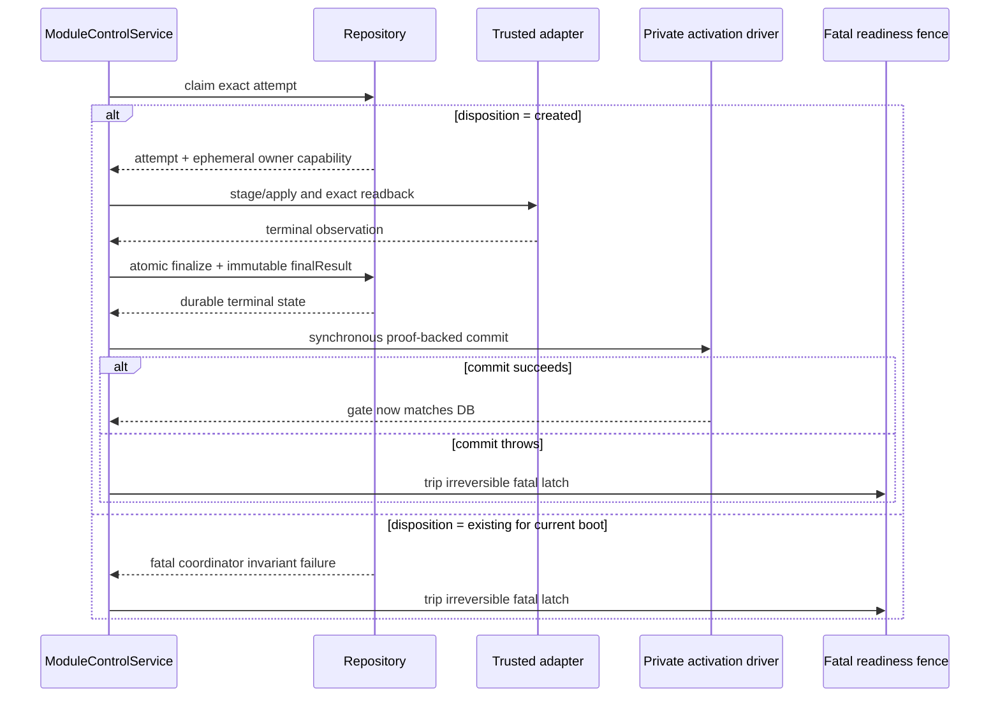

# Writable MCP Module Control Plane Implementation Plan

> **For agentic workers:** REQUIRED SUB-SKILL: Use superpowers:subagent-driven-development (recommended) or superpowers:executing-plans to implement this plan task-by-task. Steps use checkbox (`- [ ]`) syntax for tracking.

**Goal:** Build a real, durable, fail-closed local/fixture module control plane that registers only modules bundled in the current deployment inventory, previews changes, enforces two-person approval, publishes an activation policy with exact runtime readback, reconciles unknown results, and rolls back through the same audited flow while production Admin writes remain blocked in v1.

**Architecture:** Keep the existing Node/TypeScript MCP gateway and static Module Runtime v0. Add a narrow control-plane package, a separate strict single-process SQLite control store derived only from an explicit application root, an external immutable identity marker bound to `instance_id` and `management_tenant_id`, an immutable activation registry that gates already-mounted module handlers, fixture-authenticated loopback Admin APIs, and an AdminLTE 4 module-center UI. FastAdmin informs information architecture only; no PHP runtime, arbitrary package loader, verified-release claim, business-data store, production Admin write, or code hot-plug is introduced.

**Tech Stack:** Node.js 22, TypeScript 5.9, Zod 4, Ajv Draft 2020-12, `node:sqlite`, Vitest, native HTML/CSS/ES modules, AdminLTE 4.3.1, Bootstrap 5.3.8.

---

## Execution rules

- Work only in `/Users/autumn/.config/superpowers/worktrees/物流产品MCP/writable-mcp-control-plane` on branch `codex/writable-mcp-control-plane`.
- Before each task, read `AGENTS.md`, the task text below, and the directly affected current files. Do not read a different checkout.
- Other workers may have committed earlier tasks. Do not revert or rewrite their changes; start from current HEAD.
- Follow test-driven development: add the smallest failing test, run it and record the failure, implement the minimum behavior, rerun the focused test, then run the task regression set.
- Use `apply_patch` for edits. Do not connect production, add secrets, add customer/business fixtures, or modify `docs/contracts/**`.
- Every task ends with `git diff --check`, a focused test command, self-review, and one conventional commit.
- A successful local/fixture publish must expose `evidence_level=local_build` and `production_eligible=false`; v1 rejects `verified_release` and every production Admin POST.
- `MCP_ADMIN_CONTROL_ENABLED` is never a bypass. The managed entrypoint may listen only after an
  explicit initializer has installed the fixed state directory, marker, and DB; missing state,
  identity, schema, tenant, root derivation, or a non-literal-`true` value fails before listen.
  There is no uninitialized compatibility start or implicit activation fallback.
- A plan-text correction does not itself change an accepted contract or production readiness. Do not
  modify a task's `src/`, `schemas/`, or `tests/` files while another worker owns or reviews that same
  write set; wait for the review result, then issue a narrowly scoped implementation assignment.

## Locked design references

- Design: `docs/superpowers/specs/2026-08-22-writable-mcp-control-plane-design.md`
- RFC: `docs/rfcs/2026-08-22-writable-module-control-plane-v1.md`
- Visual reference: `/Users/autumn/.codex/generated_images/01a023ab-99c0-70c1-a4de-f0f75e5d9970/exec-cb608496-a874-401f-be3e-188aba22b047.png`
- Existing Module Runtime contract: `docs/rfcs/2026-08-21-module-runtime-agent-standard-access-v0.md`
- Security/release/rollback: `docs/runbooks/security-gates.md`, `docs/runbooks/release.md`, `docs/runbooks/rollback.md`

## Task 1: Define closed Admin contracts, deployment inventory, and activation snapshot

**Files:**

- Create: `src/logistics_mcp/control-plane/types.ts`
- Create: `src/logistics_mcp/control-plane/contracts.ts`
- Create: `src/logistics_mcp/control-plane/inventory.ts`
- Create: `src/logistics_mcp/control-plane/activation-registry.ts`
- Create: `src/logistics_mcp/control-plane/index.ts`
- Create: `schemas/admin-control/register-package-request.schema.json`
- Create: `schemas/admin-control/deployment-preview-request.schema.json`
- Create: `schemas/admin-control/approval-request.schema.json`
- Create: `schemas/admin-control/publish-request.schema.json`
- Create: `schemas/admin-control/reconcile-request.schema.json`
- Create: `schemas/admin-control/control-envelope.schema.json`
- Create: `tests/control-plane/contracts.test.ts`
- Create: `tests/control-plane/inventory.test.ts`
- Create: `tests/control-plane/activation-registry.test.ts`

### Required design

Use these public type shapes; names may not be replaced with generic config/value records:

```ts
export interface ModuleInventoryEntry {
  readonly moduleId: string;
  readonly version: string;
  readonly riskLevel: ModuleRiskLevel;
  readonly toolNames: readonly string[];
  readonly standardRefs: readonly string[];
  readonly descriptorDigest: `sha256:${string}`;
  readonly evidenceLevel: "local_build";
  readonly productionEligible: false;
  readonly evidenceRefs: Readonly<{
    sourceShaRef: string | null;
    artifactDigestRef: string | null;
    signatureRef: string | null;
    sbomRef: string | null;
    attestationRef: string | null;
  }>;
}

export interface ActiveModuleRef {
  readonly moduleId: string;
  readonly version: string;
  readonly descriptorDigest: `sha256:${string}`;
}

export interface ModuleActivationSnapshot {
  readonly releaseId: string | null;
  readonly revision: number;
  readonly activeModules: readonly ActiveModuleRef[];
}
```

`createModuleInventory` receives explicit mounted module/catalog data and explicit local build evidence. The canonical descriptor covers module ID/version/risk/lifecycle/required and optional capabilities/module standards plus each tool's owner/name/permission/kind/risk/input schema ID/output schema ID/standard refs. It canonicalizes object keys, sorts set-like arrays by stable keys, sorts tools by name, then computes the descriptor digest as `sha256:<64 lowercase hex>`. It must not read cwd, files, environment variables, URLs, or Markdown. Reject duplicate module IDs, duplicate global tool names, unknown tool owners, malformed digests, any `verified_release`/`productionEligible=true` input, and incomplete tool contracts. One module may own multiple distinct tools; each tool must still match the fixed RBAC permission/kind and the owner module's risk/standard contract. Any visible contract change must change the digest. The request/preview control hashes are separate: RFC 8785/JCS UTF-8 + SHA-256 over `MCP-CONTROL-HASH\0v1\0<request|preview>\0<schema_version>\0<JCS bytes>`, formatted as `mcp-control-hash/v1/<domain>/sha256:<64 lowercase hex>`; set-like arrays are stably sorted, order-semantic arrays retain order, and schema/domain changes must change the hash.

inventory is an allowlist only, not an activation policy. `ModuleActivationRegistry` starts with the exact
empty snapshot `{releaseId:null, revision:0, activeModules:[]}`; it must not derive active entries from
inventory. Without an `active_verified` release, module handlers are not routable and return
`unavailable` with reason `module_policy_not_released`, while `tools/list` remains visible and non-module
tools are unaffected. The first activation must complete registration→preview→different-actor approval→
publish→runtime exact readback before any module is routable. The service-private mutation driver validates
candidate exact inventory refs, duplicate refs, nonnegative safe revision, and monotonic revision before it
issues a one-use proof. The routing registry/gate exposes only
the frozen `snapshot()` and `isActive(ref)` facade. `ModuleControlService` is the sole constructor/owner of the
real routed instance and captures its mutation driver once during assembly; the driver is held in a JavaScript
private field and is never returned through the registry, package index, HTTP API, dependency options or test
fixture. The service asks that private driver to stage a candidate, applies the candidate through the injected
trusted runtime adapter, obtains an exact observed readback, and commits only with the instance-issued proof
(or aborts the stage). Constructing a separate gate cannot affect the routed instance. Until proof-backed
commit, the prior snapshot remains the routing authority. `snapshot()` never exposes mutable arrays.
`isActive(ref)` checks the full module ID/version/descriptor-digest tuple. Startup restore accepts only a
repository identity-verified active release plus its exact verified readback and current-inventory match;
arbitrary caller objects or observed pairs are not restore authority.

Admin request schemas use Zod `.strict()` at runtime and checked-in Draft 2020-12 JSON Schemas with `ADMIN_CONTROL_SCHEMA_VERSION="2026-08-22.v1"`. Exact request shapes are register `(schema_version,module_id,version,descriptor_digest)`, preview change `(schema_version,intent,desired_modules)`, preview rollback `(schema_version,intent,target_release_id)`, approval `(schema_version,preview_ref,decision,reason_code)`, publish `(schema_version,preview_ref,approval_id)`, and reconcile `(schema_version,release_id)`. Prohibit identity, URL/path/source/secret fields by construction.

The independent Admin envelope root is closed and contains `schema_version`, server `request_id`, `trace_id`, `audit_id`, existing five status strings, `reason_codes`, a closed readback object, and `data`. `trace_id` never replaces `audit_id`. `readback` is `{status:"not_applicable"|"pending"|"verified"|"mismatch"|"unknown",release_id:string|null,revision:integer|null}`; `verified` here means runtime activation exact readback only, never artifact signature or production qualification. A successful publish must keep the three state fields distinct and simultaneous: Only `module_control_idempotency.status` becomes `completed`; `module_releases.status` becomes `active_verified`; Admin `readback.status` becomes `verified`. `domain_committed`, `published_pending_readback`, `pending`, and `manual_review` are intermediate/unresolved states and cannot be substituted. `data` is null or a closed discriminated union with `kind=control_state|registration|preview|approval|release|reconciliation`; generic `z.record`/unknown data is forbidden.

### TDD steps

- [ ] Add contract tests proving every JSON Schema declares Draft 2020-12, root `additionalProperties:false`, rejects identity/URL/path/secret extras, and accepts only the documented request union.
- [ ] Run `npx vitest run tests/control-plane/contracts.test.ts`; expect failure because contracts and schema files do not exist.
- [ ] Implement the strict Zod contracts and static JSON Schemas; rerun until the contract test passes.
- [ ] Add inventory tests for deterministic digest under input reordering, digest changes for every module/tool contract field, duplicate module/tool rejection, local-only evidence truthfulness, and no filesystem/environment inputs.
- [ ] Keep Task 1's existing descriptor/inventory implementation scope unchanged in this revision; record the follow-up contract tests for request/preview canonical hashes: cross-restart stability, object-key order, semantic collection input order, preserved order-semantic arrays, schema-version separation, domain separation, and explicit distinction from `descriptorDigest`. If the shared helper is not owned by Task 1, implement it in Task 2/3 before those tests are marked complete.
- [ ] Run `npx vitest run tests/control-plane/inventory.test.ts`; expect missing-module failure.
- [ ] Implement canonical inventory construction and immutable returned entries; rerun until green.
- [ ] Add activation-gate tests for the exact initial empty snapshot (`releaseId:null`, `revision:0`, `activeModules:[]`), inventory-only allowlist semantics, unavailable `module_policy_not_released` routing before any `active_verified` release, full-ref matching and mutation resistance. Assert that the exported registry/index surface has no restore, stage, verify, commit, abort or generic replacement method. Task 3 owns the service-private driver and complete first activation through distinct-actor four-eyes publish/readback.
- [ ] Run `npx vitest run tests/control-plane/activation-registry.test.ts`; expect missing-module failure.
- [ ] Implement the activation registry; rerun until green.
- [ ] Run `npx vitest run tests/control-plane --pool=forks --no-file-parallelism --maxWorkers=1`.
- [ ] Run `npm run typecheck`, `npm run lint`, and `git diff --check`.
- [ ] Commit with `feat: define module control plane contracts`.

## Task 2: Implement the strict SQLite module control store

Attempt-ledger implementation starts only after
`docs/rfcs/2026-08-23-readback-attempt-finalization-v1.md` is independently accepted for implementation.
That design acceptance is based on reviewed interface, exact DDL, red-test matrix and migration/rollback plan;
it does not require Task 2 or Task 3 implementation to already exist. Implementation acceptance remains a
later gate with fresh repository/Fake/SQLite and Service/activation evidence.

**Files:**

- Authority: `docs/rfcs/2026-08-23-readback-attempt-finalization-v1.schema.sql`
- Create: `src/logistics_mcp/control-plane/repository.ts`
- Create: `src/logistics_mcp/control-plane/sqlite-control-store.ts`
- Update: `src/logistics_mcp/control-plane/index.ts`
- Create: `tests/control-plane/sqlite-control-store.test.ts`

### Required design

The runtime embeds static schema statements byte-for-byte equivalent to the authority artifact after the
artifact's documented normalization; it never reads SQL from `docs/`, cwd, environment, CLI or a caller path.
Development tests parse the artifact, compare every compiled CREATE TABLE/INDEX statement and fingerprint
input in exact order, then execute both against empty SQLite databases. Any artifact/runtime drift fails before
Service work and is not repaired at runtime.

The store is a separate file-backed database with `durability="durable"`. The trusted server assembly
is the only caller that may inject an absolute regular `application_root`; the managed entrypoint derives
exactly `<application-root>/.runtime/mcp-instance-state` and then exactly `<state_dir>/control.sqlite`
and `<state_dir>/control-identity.json`. Store/initializer options, CLI arguments, diagnostic objects and
configuration objects must reject explicit `stateDir`, `controlDbPath`, or `markerPath` values. The
runtime never reads cwd and rejects any environment-variable path override for the root, state directory,
DB, or marker. A changed root therefore derives a different absolute path and fails closed rather than
selecting another instance.
New-file creation is exposed only through an explicit initializer; normal runtime open requires an
existing v1 database and never silently recreates, repairs, replaces, or ignores a missing managed
store. The initializer atomically installs a new state directory containing both files. The marker is
one UTF-8/JCS JSON object plus LF with exactly `marker_format:"mcp-control-identity/v1"`,
`instance_id`, `management_tenant_id`, absolute `control_db_path`, random
`control_db_id=db_<32-lower-hex>`, and `schema_version:1`; the DB singleton `control_identity` row
must match every marker field, including `management_tenant_id`. The directory is `0700`, marker
`0400`, DB `0600`; the target, every intermediate path component, and both files must be regular
non-symlinks. `:memory:` is forbidden.

The initializer creates a sibling staging directory on the same parent filesystem using
`fs.mkdtemp` or an equivalent exclusive `mkdir` (never `O_CREAT` as a directory primitive), with
mode `0700`. Inside staging it runs one transaction to create the strict v1 schema, the singleton
`control_identity` row, and `user_version=1`, then executes `PRAGMA wal_checkpoint(TRUNCATE)` and
closes every SQLite handle. If clean close leaves `control.sqlite-wal` or `control.sqlite-shm`, it
fails and removes staging; otherwise it fsyncs the main DB. It writes the marker as a regular file
with `O_CREAT|O_EXCL`, fsyncs the marker, fsyncs the staging directory, renames staging exactly once
to a not-yet-existing final state directory, and fsyncs the parent directory. Any existing target,
symlink, intermediate symlink, non-atomic/cross-filesystem rename, permission mismatch, or cleanup
failure is a hard initialization failure. Normal runtime never creates, repairs, or replaces either
file. Crash-injection tests at transaction commit, WAL checkpoint/close, marker fsync, staging-dir
fsync, rename, and parent-dir fsync must prove that a restart sees either no installable final state
or a complete identity-consistent state, with abandoned staging cleaned or safely ignored.

Runtime open requires a regular non-symlink DB and marker, exact `MCP_INSTANCE_ID`, exact
`management_tenant_id` from the server-managed identity, exact derived paths, matching
`control_identity`, v1 schema, and `MCP_ADMIN_CONTROL_ENABLED=true`. After initialization, false or
missing enabled is a startup error even with zero releases. A marker/DB mismatch, missing state
directory, missing marker or DB, new empty DB, corrupt identity, tenant change, schema drift, path
change, any symlink, permission/lock conflict, or failed quick check fails closed before listen.
Deleting identity/enabled inputs cannot hide the fixed marker; it must instead fail closed. Tests use
temporary regular application roots and prove initialization, reopen, and tenant-change failure.

Task 2 owns one shared `canonicalControlHash` helper for both Task 2 and Task 3; Task 3 imports it
instead of implementing another serializer. The helper must frame bytes exactly as
`ASCII MCP-CONTROL-HASH`, one byte `0x00`, ASCII `v1`, one byte `0x00`, ASCII `request|preview`,
one byte `0x00`, ASCII `schema_version`, one byte `0x00`, then RFC 8785/JCS canonical JSON UTF-8
bytes, and hash the complete frame with SHA-256. The escaped `\x00` notation in docs is not literal
text. Set-like arrays use UTF-8 byte lexicographic sorting; `desired_modules` and `inventory_refs`
use the tuple `module_id NUL version NUL descriptor_digest`, while order-semantic arrays retain input
order. The exact design/RFC golden vectors are request
`mcp-control-hash/v1/request/sha256:1dc6b77eedfc0639d6fb264c4e0557bdeb39a46bbabb968db13a6be7ee8c86da`
and preview
`mcp-control-hash/v1/preview/sha256:13348c6594c3d24cc30aeb62f839e6b6fd1fe133830a2fdad11b8d4b59b6e503`;
the same request JCS payload under the preview domain must also produce
`mcp-control-hash/v1/preview/sha256:7f756bdf267eb3ef54b6ee5a3211a947255f491072f72f92dc7f844e6024c04b`.
The preview payload is a closed union: `intent="change"` omits and rejects `target_release_id`, while
`intent="rollback"` requires it. Vector 2 is the change branch; tests must cover both branches and reject
`target_release_id:null` or any cross-branch field leakage.
Tests must assert the NUL bytes, JCS object-key normalization, UTF-8 tuple and set ordering,
object-key/set input reorder invariance, order-array preservation, descriptor/request/preview
separation, domain/schema-version separation, and equal hashes after close/reopen.

Schema version 1 contains only strict narrow tables:

```text
module_registrations
module_previews
module_approvals
module_releases
module_readbacks
module_readback_attempts
module_control_idempotency
module_control_events
control_identity
```

`control_identity` is a fixed singleton metadata table, not a generic key-value or business table. Store
JSON columns have `json_valid` checks. IDs and status fields have CHECK constraints. Every domain and
idempotency key includes explicit `management_tenant_id`, even though v1 allows one configured
management tenant. Release revision is unique and strictly increasing inside that tenant. Approval is
append-only/final, uniquely bound to preview canonical hash/base revision/inventory digest set/expiry,
and publish atomically consumes preview plus approval. Foreign keys connect preview→approval→release→
readback and bind every readback-attempt claim to its exact idempotency record and release. Unknown
`user_version`, unexpected columns/tables/index drift, corruption, failed quick
check, or lock conflict closes the DB and fails closed.

The exact attempt lineage follows the accepted readback-attempt RFC and its sole executable schema artifact,
`docs/rfcs/2026-08-23-readback-attempt-finalization-v1.schema.sql`; prose is not a substitute for that file.
Idempotency has a candidate key over
`management_tenant_id/action/idempotency_key/request_hash/domain_record_ref`; attempt has a composite FK from
that exact tuple with `release_id=domain_record_ref`, plus the release/revision FK. Terminal-only
`module_readbacks` carries non-null `attempt_id` and a composite FK to the same attempt/release/revision/
readback-ref tuple. A partial unique index permits at most one `phase='claimed'` row per tenant/release/
revision. Release has no reverse FK to readback. Every table, candidate key, CHECK, FK and partial index is
part of the strict schema fingerprint defined by that artifact. Current readback selects the finalized attempt tied to the latest
terminal reconciliation event sequence, with deterministic attempt-ID tie-breaking.

Expose use-case-oriented repository methods, not raw SQL or `put(key,value)`. Required operations:

```ts
health(): Promise<{ readonly ready: boolean }>;
close(): Promise<void>;
registerModule(request: RegisterModuleRecordRequest): Promise<RegistrationWriteResult>;
createPreview(request: CreatePreviewRecordRequest): Promise<PreviewWriteResult>;
decideApproval(request: DecideApprovalRecordRequest): Promise<ApprovalWriteResult>;
publishRelease(request: PublishReleaseRecordRequest): Promise<ReleaseWriteResult>;
claimReadbackAttempt(request: ClaimReadbackAttemptRequest): Promise<ReadbackAttemptClaimResult>;
finalizeReadbackAndComplete(request: FinalizeReadbackAndCompleteRequest): Promise<ReadbackFinalizationResult>;
getUnfinishedReadbackAttempt(query: GetUnfinishedReadbackAttemptQuery): Promise<ReadbackAttemptRecord | null>;
listUnfinishedReadbackAttempts(): Promise<readonly ReadbackAttemptRecord[]>;
getReadbackAttemptHistory(query: GetReadbackAttemptHistoryQuery): Promise<readonly ReadbackAttemptRecord[]>;
getControlState(): Promise<ModuleControlState>;
getActiveRelease(): Promise<ModuleReleaseRecord | null>;
getPendingRelease(): Promise<ModuleReleaseRecord | null>;
getNewestUnresolvedRelease(): Promise<ModuleReleaseRecord | null>;
getPreview(query: { managementTenantId: string; previewRef: string }): Promise<ModulePreviewRecord | null>;
getApproval(query: { managementTenantId: string; approvalId: string }): Promise<ModuleApprovalRecord | null>;
getRelease(query: { managementTenantId: string; releaseId: string }): Promise<ModuleReleaseRecord | null>;
getReadback(query: { managementTenantId: string; releaseId: string }): Promise<ModuleReadbackRecord | null>;
getIdempotency(query: { managementTenantId: string; action: ModuleControlAction; idempotencyKey: string }): Promise<ModuleControlIdempotencyRecord | null>;
```

The five domain/idempotency exact-reference lookups plus exact unfinished-attempt lookup, complete unfinished
attempt enumeration and per-release attempt history are required for rollback targets, approval/publish
binding, persisted idempotency replay, startup recovery and immutable reconciliation evidence. They remain
tenant-scoped, typed use cases; they do not authorize a generic `get`, table selector, SQL surface or
caller-selected key space. The old separable `recordReadback` and `completeIdempotency` primitives are not
part of the service-facing repository interface and must be removed or kept private to a migration-only
implementation; `ModuleControlService` cannot receive a type that exposes them.

Every mutation takes server-created actor/context metadata, canonical request hash, action, idempotency key, and redacted event payload. Same action/key/hash replays; same action/key/different hash is a typed conflict. Register, preview, and approval store the complete response and event in their domain transaction. For a new publish key, the service checks the unresolved gate before reserving idempotency; it then atomically writes the release/event and advances the idempotency record to `domain_committed` with the immutable release ID. Automatic exact readback from `domain_committed` is permitted only while that fixed release is `published_pending_readback`; it may never create a second release.

Before calling the runtime adapter, the service atomically claims one durable readback attempt for the exact
management tenant/action/idempotency key/request hash/release/revision/desired-module tuple.
`module_readback_attempts` is a private control ledger, not a new Admin status. It stores a server-generated
attempt/readback ref, original actor and correlation refs, boot-scoped owner, claim/finalization timestamps,
and the complete terminal observation once finalized. Only `disposition="created"` returns an ephemeral,
repository-instance-branded owner capability; it is uncloneable, never serialized or logged, and is required
for owner finalization. `disposition="existing"` never carries adapter authority. A distinct instance-private
recovery driver can finalize only pre-listen abandoned claims and is never exposed to HTTP/service callers.
If a process exits after the durable
claim but before terminal finalization, every claimed row from that prior boot is abandoned. Startup enumerates
all unfinished attempts and finalizes each as `unknown/manual_review` through a recovery capability without
calling the adapter again. This is the at-most-once boundary: an unclaimed fixed publish may begin exactly one
attempt, while an existing claim may never resume adapter side effects. `owner_boot_id` is a new random opaque
value for each process boot and is never derived from PID, time, actor or client input. All five mutation
actions enter the same assembly-owned exclusive coordinator before idempotency lookup. Register/preview/
approval hold it through their atomic domain/idempotency transaction; publish/reconcile hold it through
terminal finalization plus gate commit. A concurrent same-key request waits outside that critical section and
then replays the first immutable result. Seeing an `existing` claim owned by the current boot from inside the
exclusive section is therefore a fatal coordinator invariant failure: zero recovery, zero adapter and no
ordinary five-status response. Only pre-listen startup recovery handles prior-boot claims.

Claim does not insert or overwrite the public current-readback projection. `module_readbacks` remains one
current projection per release and gains the exact `attempt_id`; only terminal finalization replaces it. The
attempt ledger preserves every reconcile attempt and its original observed pair, module refs, reasons and
readback ref. Thus a later reconcile can update the current projection without erasing prior evidence.

For publish and reconcile, terminal readback persistence uses `finalizeReadbackAndComplete`, never a separable
readback write followed by idempotency completion. One SQLite transaction validates the one-shot owner or
recovery capability, writes or updates the terminal current-readback projection, updates release status,
appends the terminal reconciliation and completion events, stores the complete immutable attempt observation,
and writes the immutable completed idempotency `finalResult`. Therefore a `manual_review` replay always has an
authoritative final envelope and performs zero activation/readback. After the first publish attempt, operator
`reconcile` is the only new retry entry point for an unresolved release, using a new idempotency key and a new
attempt/readback ref but the same release/revision/desired refs. v1 does not prune completed idempotency,
attempt, readback or event lineage; retention or archival requires a later RFC.

The transaction order is fixed for immediate event foreign keys: after validation it samples/canonicalizes
the finalization instant once, allocates two contiguous event sequences inside `BEGIN IMMEDIATE`, inserts both
terminal events first, then writes current readback/release, finalizes the attempt with those sequence values,
completes idempotency, re-reads the full graph and commits. Transaction-internal intermediate rows are never
observable. SQL rollback rolls sequence allocation back without a gap; a business rollback release still
emits normal publish/reconciliation/completion events.

The terminal event time is the finalization instant, not the original idempotency creation instant. Full graph
validation enforces `idempotency.createdAt <= attempt.claimedAt <= attempt.finalizedAt`, and requires both
terminal events to use `attempt.finalizedAt`. Finalization samples the injected clock exactly once,
canonicalizes it once and writes byte-identical timestamp text to the attempt and both events. Bounded Admin
events remain a projection only; full health scans
the complete durable event/attempt graph. Normal owner finalization keeps the original actor; startup recovery
uses the fixed server actor `system_startup_recovery` for `finalizedByActorRef` and both terminal events while
preserving the original idempotency/attempt actor. Graph validation binds terminal event actor to the finalizer,
not unconditionally to the original business actor.
Publish processing is ordered: first inspect the existing same-tenant/action/key idempotency record and
request hash; same-key conflict is returned immediately, same-key replay returns the persisted result,
`manual_review` replay performs zero activation/readback, and unclaimed `domain_committed` may claim only the
fixed `published_pending_readback` attempt. A same-boot concurrent caller waits for the owner and then replays;
an in-section current-boot `existing` claim is fatal. Only pre-listen startup recovery finalizes a prior-boot
claim as interrupted unknown without adapter resume. Only a new key checks newest unresolved releases; after that gate
passes, reserve idempotency and atomically create the release. Only
`module_control_idempotency.status` becomes `completed`; `module_releases.status` becomes
`active_verified`; Admin `readback.status` becomes `verified`.

Publish uses compare-and-set on expected base release/revision and writes release status
`published_pending_readback`. For a new idempotency key only, it rejects any newest unresolved release
(`published_pending_readback` or `manual_review`) before creating a new release. Terminal finalization can move
it to `active_verified` only for exact release/revision/module refs; any non-null observed revision must be a
positive safe integer, because revision `0` is reserved for the inactive snapshot. `active_verified` means runtime exact
readback only, not artifact signature or production qualification. Mismatch/unknown records
`manual_review` without deleting the release. Startup performs one automatic exact readback for the
newest `published_pending_readback`; it does not retry an existing `manual_review`. After that one-shot
pending attempt, operator `reconcile` is the only retry entry point for an unresolved release, and it
never creates a release or changes desired refs.

### TDD steps

- [ ] Add tests for explicit secure initialization, same-parent sibling staging with `mkdtemp`/exclusive
  mkdir, strict marker format/permissions, DB/marker atomic install, WAL checkpoint/truncate and
  closed handles, lingering-sidecar failure and staging cleanup, DB/marker/dir/parent fsync ordering,
  regular non-symlink checks, non-overwrite and atomic-rename rejection, crash interruption at each
  install boundary, runtime missing-state rejection,
  `control_identity` schema/tables/indexes, `management_tenant_id` in marker and identity row, `0600`,
  WAL/exclusive lock, second-store denial, reopen persistence, health, idempotent close, explicit
  management-tenant keys, tenant-change failure, and no business columns.
- [ ] Add an artifact parity test that lexes
  `docs/rfcs/2026-08-23-readback-attempt-finalization-v1.schema.sql` using its quoted-string/comment rules,
  compares all 18 normalized CREATE TABLE/INDEX statements and fingerprint bytes to compiled runtime schema,
  executes both in empty SQLite, and proves nine STRICT tables, exact named indexes and zero FK violations.
  Include a canonicalization collision regression proving `a/*comment*/TEXT` and `aTEXT` produce different
  normalized fingerprint inputs, with CR, LF and CRLF line-comment boundaries covered.
- [ ] Add path-boundary tests that pass `stateDir`, `controlDbPath`, and `markerPath` as explicit
  constructor/initializer parameters, CLI flags, diagnostic values, and config values; each must be
  rejected before filesystem open/listen. Also test cwd and every environment-variable path override;
  the trusted assembly may inject only `applicationRoot`, and all three derived paths must remain fixed.
- [ ] Run `npx vitest run tests/control-plane/sqlite-control-store.test.ts`; expect missing-store failure.
- [ ] Implement secure initialization and schema verification; rerun the focused cases.
- [ ] Add tests for exact register/preview/approval/publish/readback persistence and chronological redacted events.
- [ ] Add tests for idempotent replay, management-tenant-scoped conflict, self-consistent transaction
  rollback, base revision CAS, immutable reject/approve terminal decision, approval hash/expiry/consume
  binding, unknown references, readback mismatch, and restart state recovery. Use the shared
  `canonicalControlHash` helper and the two locked design/RFC golden vectors above; assert literal NUL
  framing bytes, RFC 8785/JCS, UTF-8 tuple sorting, object-key and set-order invariance,
  order-semantic-array preservation, descriptor/request/preview separation, schema-version/domain
  separation, and request/preview equality after repository restart.
- [ ] Add reconciliation/idempotency tests proving startup automatically exact-reads
  an unclaimed `published_pending_readback` once, does not auto-retry `manual_review`, newest unresolved
  blocks a new-key publish, same-key/hash replay/conflict is evaluated before that unresolved gate, and an
  unclaimed `domain_committed` retry may claim only its fixed pending release. Prove a durable claim is unique,
  survives reopen, and an abandoned claim becomes interrupted `unknown/manual_review` with zero second
  adapter/readback call. Prove terminal readback/release/events/attempt/idempotency final result are one
  transaction, a manual-review publish replay returns that persisted result with zero activation/readback,
  only operator `reconcile` creates a new claim for an unresolved release, reconcile reuses the same
  release/revision, and reconcile never creates a second release.
- [ ] Add tests that tamper `user_version`, table layout, JSON, status, and symlink path; each must fail closed with a stable typed error and no leaked SQL/value.
- [ ] Implement the narrow repository methods and transactions; do not introduce a generic write API.
- [ ] Run `npx vitest run tests/control-plane/sqlite-control-store.test.ts --pool=forks --no-file-parallelism --maxWorkers=1`.
- [ ] Run `npx vitest run tests/platform/sqlite-production-store.test.ts tests/control-plane/sqlite-control-store.test.ts --pool=forks --no-file-parallelism --maxWorkers=1`.
- [ ] Run `npm run typecheck`, `npm run lint`, and `git diff --check`.
- [ ] Commit with `feat: add durable module control store`.

## Task 3: Implement the module control service and four-eyes state machine

### Task 3 prerequisite: Admin control-state DTO contract gate

Task 3 service/readback mapping must not start until the Admin `control_state` response contract is
closed and reviewed. The prerequisite keeps `schema_version=2026-08-22.v1`, the five envelope statuses
and request/preview canonical hash framing unchanged, while deliberately tightening the unpublished v1
response language. Legacy operation fields stay optional only in the generic envelope; reason-code,
preview desired-module and release active-module bounds/uniqueness plus positive release/readback
revisions require fixture migration. Action producers and `getState` also pass stricter semantic gates and
must return the gates' parsed deep-frozen snapshots. It does not authorize service, SQLite, HTTP, UI or
production work.

- [ ] Review `docs/rfcs/2026-08-22-admin-control-state-dto-v1.md` and accept the complete snake_case,
  redacted, bounded `control_state` DTO before Task 3 mapping.
- [ ] Keep `control_state` root/data closed with a single inactive/active activation union and required
  inventory inspector fields, registration summary, preview change/rollback diff and validation,
  decision-closed approval, observed-pair readback, intent-closed release history and exact event tuple
  union; reject target leakage, revision 0 outside inactive activation, duplicate refs and state conflicts.
- [ ] Confirm Zod and checked-in Draft 2020-12 Schema parity, including nested unknown/sensitive-field
  rejection, identifier/hash/timestamp boundaries, uniqueItems and all collection/reason-code maxima.
- [ ] Before `getState` mapping, extend the repository state authority to return bounded newest-first
  release history and an authoritative `eventsTruncated` field. The current repository state contract does
  not provide either field; service must not infer history from events or truncation from array length.
- [ ] Require `getState` to return the parsed deep-frozen value from
  `assertControlStateProducerSemantics`, not the mutable mapper input. Cover authoritative projection
  logical-key/digest identity while preserving mismatch/unknown observed digest drift as non-exact evidence;
  preview diff/base/time/validation and approval binding/atomic consumption; history identity/order/linkage,
  active/unresolved cardinality and rollback target; readback/history/activation correspondence; and exact,
  continuous event windows. Current inventory constrains activation, unconsumed preview, active release and
  newest unresolved/reconcile target, but must not reject a superseded historical module merely because the
  current build no longer inventories it.
- [ ] Keep pending release history `readback_ref=null`. The DTO parser may continue to accept a legacy or
  pre-service pending fixture for migration diagnostics, but the v1 repository and service are terminal-only:
  claim writes no `module_readbacks` row and produces no pending projection. During a claim,
  `latest_readback` is null, the prior active release's terminal readback, or the same unresolved release's
  previous finalized attempt projection. Verified/mismatch/unknown exact-match the terminal release/readback/
  attempt lineage; service-produced pending readback is a test failure.
- [ ] Require every register/preview/approval/publish/reconcile service output to return the parsed
  deep-frozen value from `assertControlProducerEnvelope`. Enforce the complete RFC action/status matrix:
  register and approval allow success plus blocked/unavailable; preview also allows needs_input; publish and
  reconcile also allow manual_review only for durable readback uncertainty. All other status/action pairs,
  wrong data kind, verified blocked/unavailable, incomplete success and generic legacy success shells fail.
- [ ] Before any prototype/property-descriptor reflection, reject every Proxy with `node:util`
  `types.isProxy`, including transparent and nested proxies, without invoking traps or target getters.
  Accept ordinary input objects only with exact `Object.prototype` (reject null/custom prototypes), emit a
  stable redacted contract error, and return only Zod-parsed detached standard objects/arrays.
- [ ] Run `npx vitest run tests/control-plane/contracts.test.ts`, `npm run validate:schemas`,
  `npm run typecheck`, targeted ESLint and `git diff --check` before implementing `ModuleControlService`.
- [ ] Map repository records to this DTO only through explicit service fields; do not expose evidence
  refs, URLs, paths, source data, email, token, secret, detail or raw event payloads.

**Files:**

- Create: `src/logistics_mcp/control-plane/service.ts`
- Create: `src/logistics_mcp/control-plane/errors.ts`
- Update: `src/logistics_mcp/control-plane/index.ts`
- Create: `tests/control-plane/fake-control-repository.ts`
- Create: `tests/control-plane/service.test.ts`

### Required design

`ModuleControlService` is the only domain entry used by HTTP. Inject inventory, repository, clock, ID generator,
preview TTL and a trusted runtime apply/readback adapter through a non-exported runtime-assembly constructor.
That same assembly creates the activation gate, coordinator and Service in one closure, gives only the private
driver to the Service and only the frozen read/controlled-dispatch facade to the tool router. No public Service
constructor accepts a caller-created mutation/recovery driver; no diagnostics or fixture can expose one, and
neither assembly nor Service reads process environment.

Task 3 must import Task 2's shared `canonicalControlHash` helper and use the same strict request and
preview payloads, JCS bytes, UTF-8 tuple sorting, and NUL framing. Service tests must assert the exact
design/RFC request vector
`mcp-control-hash/v1/request/sha256:1dc6b77eedfc0639d6fb264c4e0557bdeb39a46bbabb968db13a6be7ee8c86da`
and preview vector
`mcp-control-hash/v1/preview/sha256:13348c6594c3d24cc30aeb62f839e6b6fd1fe133830a2fdad11b8d4b59b6e503`,
plus the domain-separated Vector 1 preview result
`mcp-control-hash/v1/preview/sha256:7f756bdf267eb3ef54b6ee5a3211a947255f491072f72f92dc7f844e6024c04b`.
They must cover object-key/set reorder, order-semantic arrays, schema-version separation, descriptor
digest non-equivalence, literal `0x00` framing, and equality after service/repository restart; no
second serializer or JSON.stringify-only substitute is allowed.

Public methods:

```ts
getState(context: ExecutionContext): Promise<ControlEnvelope>;
registerPackage(context: ExecutionContext, request: RegisterPackageRequest, meta: WriteMeta): Promise<ControlEnvelope>;
createDeploymentPreview(context: ExecutionContext, request: DeploymentPreviewRequest, meta: WriteMeta): Promise<ControlEnvelope>;
decideApproval(context: ExecutionContext, request: ApprovalRequest, meta: WriteMeta): Promise<ControlEnvelope>;
publish(context: ExecutionContext, request: PublishRequest, meta: WriteMeta): Promise<ControlEnvelope>;
reconcile(context: ExecutionContext, request: ReconcileRequest, meta: WriteMeta): Promise<ControlEnvelope>;
```

`getState` consumes repository-owned bounded release history and `eventsTruncated`, maps the closed DTO,
then calls `assertControlStateProducerSemantics`; it never reconstructs either authority from event
summaries. All five write methods call `assertControlProducerEnvelope` on every final envelope before the
HTTP layer can return it. A producer assertion failure is fail closed and must not be hidden by stripping
fields or returning a generic success shell.

`WriteMeta` contains only server-created `idempotencyKey`, `requestHash`, `requestId`, `traceId`, and `auditId`. Authorization is rechecked in the service before repository, clock, ID generator or adapter calls: `context.role === "admin"`, `context.roles` contains admin, `context.scopes` contains `platform:admin`, and `context.tenantId` equals the single injected admin tenant. The actor reference comes only from the parsed server context; request bodies never supply context or write metadata.

Registration exact-matches inventory ID/version/digest and writes the inventory-owned local-build evidence. Preview `change` requires the full desired active set. Preview `rollback` resolves a target whose current runtime activation snapshot has an exact readback server-side and copies its active set; `active_verified` means runtime exact readback only, not artifact signature or production qualification. Both pin current base release/revision and inventory descriptors, create a redacted diff, enforce at least one active module, and prohibit duplicate/unknown/unregistered refs.

Approval requires a different actor from preview creator and atomically writes one terminal decision bound to management tenant, preview canonical hash, base release/revision, inventory digest set and expiry. Reject cannot be overwritten. Publish first enters the shared exclusive mutation coordinator, then looks up the same-tenant/action/idempotency-key record and compares the request hash: conflict blocks immediately; a completed same-key replay returns the persisted immutable final result; a `manual_review` replay performs zero activation and zero readback. A concurrent same-boot caller waits for the current owner before entering and then replays. Only a `domain_committed` record whose fixed release is still `published_pending_readback` and has no claim may create a readback attempt. If an `existing` attempt owned by the current boot is nevertheless observed inside the exclusive section, the process trips fatal readiness with zero adapter and no ordinary response. Prior-boot unfinished claims are handled only by pre-listen startup recovery as interrupted `unknown/manual_review`. Only a new key then checks newest unresolved (`published_pending_readback|manual_review`); after that gate it revalidates nonexpired/unconsumed preview, approved decision, exact approval ID/hash, base CAS, and current inventory, and atomically consumes preview+approval while creating the release.

All service instances and all module handlers for one runtime share one assembly-owned asynchronous mutation
coordinator; the SQLite single-handle lock alone is not an in-process mutex. Its private contract is exactly:

```ts
interface RuntimeMutationCoordinator {
  withMutation<T>(operation: () => Promise<T>): Promise<T>;
  withControlledDispatch<T>(operation: () => Promise<T>): Promise<T>;
  tripFatal(error: unknown): never;
  isFatal(): boolean;
}
```

Every mutation obtains the exclusive writer before idempotency lookup and holds it from stage through claim,
adapter call, atomic DB finalization and synchronous gate commit or fatal latch. Every module handler obtains
the shared reader through `withControlledDispatch`, checks fatal, reads the activation snapshot, performs the
active decision and holds the reader until the original handler completes. No handler may call
`registry.isActive()` outside this dispatch barrier. The coordinator therefore blocks controlled tool
dispatch across the DB-finalize/gate-commit boundary. Under that barrier, the service asks its
instance-private activation
driver to stage an exact candidate without changing routing, durably claims the readback attempt, and calls
the injected trusted adapter only when claim disposition is `created`. The adapter may stage/apply and observe
the candidate but cannot mutate the served activation gate. Exact observation lets the driver issue an
instance-bound one-use commit proof. The repository then atomically finalizes verified readback, release,
events, attempt and immutable success result before the driver performs its synchronous proof-backed snapshot
commit.

The coordinator is fail-fast non-reentrant. Execution-context ownership rejects recursive writer,
reader→writer and writer→reader acquisition before waiting, so a programming error cannot deadlock the
runtime. The trusted apply/readback adapter uses only its private stage/readback interface and never calls a
controlled handler through the public router; module handlers cannot invoke ModuleControlService mutation.

This is deliberately DB-first with a fail-closed readiness fence, not an atomic DB+memory commit and not a
claim that the old route is always more restrictive. Rollback or module removal can make an old route more
permissive. No controlled request may pass the mutation barrier after DB finalization until gate commit
succeeds. The proof-backed commit is deterministic and performs no I/O. If it unexpectedly fails, the process
does not roll back DB or return success: it trips an irreversible fatal readiness latch, rejects/stops all
controlled serving, and requires restart. Startup validates exact persisted active release/readback/inventory
evidence and restores that gate before listen; restoration failure keeps the process unready.



For mismatch/unknown, an adapter exception, timeout, incomplete result or illegal pending result after durable
claim, the driver never commits. `finalizeReadbackAndComplete` atomically persists terminal
`unknown|mismatch`, `manual_review` and its immutable action-specific final envelope. The recovery coordinator,
not SQLite or the adapter, builds an abandoned-attempt `manual_review` envelope from the persisted attempt and
release, validates it with `assertControlProducerEnvelope`, and finalizes the same attempt/readback lineage
using `readback.interrupted`; it never generates a replacement attempt. Original request/trace/audit refs are
persisted at claim and reused in that first immutable final result.

If terminal finalization itself fails after an adapter call, the service cannot truthfully return ordinary
`unavailable` or manufacture a non-durable `manual_review`. It trips the fatal readiness latch and stops
controlled serving. On restart, every unfinished claim is finalized interrupted unknown with zero adapter
calls before listen. Startup auto-processes only a newest *unclaimed* `published_pending_readback` once, never
auto-retries `manual_review`, and restores routing only from repository identity-verified active
release/readback evidence. A legacy state containing terminal readback/release but `domain_committed` with
`finalResult=null` fails initialization and requires an explicit repair/migration; it is never promoted to
success. After the first attempt, operator `reconcile` is the only new retry entry point for an unresolved
release, and it accepts only the newest fixed pending/manual-review release without creating another release
or changing desired refs. Return:

- `success` only when store, activation, and exact readback agree;
- `manual_review` when durable publish exists but activation/readback is unknown or mismatched;
- `blocked` for auth, self-approval, stale/consumed preview, inventory drift, idempotency conflict, or base conflict;
- `needs_input` for schema-valid but semantically incomplete desired changes;
- `unavailable` for unavailable store/inventory/readback dependency before a domain write.

The service must not return a normal envelope after the fatal latch trips; HTTP and MCP assembly convert that
condition into readiness failure/connection shutdown, not a five-status business response.

`module_disabled_by_release` is only ordinary operational unavailable: the tool remains in `tools/list`
and the call returns `unavailable`. Security quarantine, retirement, and administrator security disable
are not v1 semantics; requests for them return `blocked` and cannot reuse the operational disable reason.

Do not catch a post-commit unknown result and report `unavailable`; that would hide a possible write.

### TDD steps

- [ ] Build a narrow fake repository that records method calls and can inject failures; it must implement the same interface and not duplicate service rules.
- [ ] Add failing repository/service tests for bounded newest-first release history, authoritative
  `eventsTruncated=true|false`, and zero code paths that infer either value from returned events. Include the
  terminal-only repository shape: a claimed pending release has `readbackRef=null` and creates no pending
  `module_readbacks` row. The DTO parser may retain a legacy pending fixture branch, but service/repository
  production of that branch must fail.
- [ ] Add failing `getState` producer tests for logical-key/digest conflicts; ghost active/unresolved/preview
  refs while allowing absent-current-inventory superseded refs; duplicate/out-of-order/broken release chains;
  two active or unresolved releases; consumed preview + null approval, approval/preview ref or consumed
  mismatch while retaining unconsumed preview + null approval; newest active/manual null bypass; pending
  persisted-readback target/revision mismatch; mismatch observed digest drift accepted unchanged versus
  verified drift rejected; and malformed event sequence/time/window.
  Assert the service returns the detached deep-frozen result of `assertControlStateProducerSemantics`.
- [ ] Add failing tests for non-admin active role even when roles includes admin, missing role/scope/admin-tenant denial before repository calls, and exact inventory registration/readback.
- [ ] Run `npx vitest run tests/control-plane/service.test.ts`; expect missing-service failure.
- [ ] Implement authorization, stable errors, server ID/time injection, and registration; rerun focused tests.
- [ ] Add failing tests for change preview, rollback preview from a runtime-readback-verified release, duplicate/unknown/unregistered refs, redacted diff, TTL, and base pinning.
- [ ] Add failing tests for the shared request/preview canonical hashes using the exact design/RFC
  golden vectors: literal NUL framing, RFC 8785/JCS object-key normalization, UTF-8 tuple and set
  sorting, semantic collection sorting vs order-semantic array preservation, schema-version/domain
  separation, descriptor-digest non-equivalence, and equality after service/repository restart.
- [ ] Implement preview behavior; rerun.
- [ ] Add failing tests for self-approval, second/overwritten decision, reject terminal state, preview-hash/base/inventory mismatch, expired/consumed preview or approval, approval actor persistence, and idempotent replay/conflict.
- [ ] Implement approval behavior; rerun.
- [ ] Add failing repository tests proving readback-attempt claim uniqueness, same-key/hash replay,
  cross-key/hash conflict, and atomic terminal finalization of readback + release + both events + attempt +
  completed idempotency result. Inject failure after every sub-write and prove rollback leaves either an
  unclaimed `domain_committed` release or one unfinished claim, never terminal readback without final result.
  On reopen, enumerate every unfinished claim and finalize it to interrupted `unknown/manual_review` without
  an adapter call. Prove only `disposition=created` receives an unforgeable one-shot owner capability;
  `existing`, clones, proxies and capabilities borrowed from another repository instance never do.
- [ ] Add concurrent two-service same-key tests: both enter the same assembly coordinator, exactly one adapter
  call occurs, the second waits and replays byte-for-byte immutable `finalResult`. Inject a repository return
  of `existing` with `owner_boot_id` equal to the current boot from inside the exclusive section and prove
  immediate fatal/unready, zero recovery and zero adapter. Reopen with a different boot ID and prove only
  pre-listen recovery finalizes the prior-boot claim with zero adapter calls.
- [ ] Add failing history tests with two or more reconcile attempts for the same fixed release/revision. Each
  uses a new idempotency key, attempt ID and readback ref; prior attempt observations remain immutable while
  the current `module_readbacks` projection points to the newest terminal attempt. Claim alone must not create
  or overwrite that current projection.
- [ ] Add failing full-health tests for the nine strict tables, attempt/idempotency/release foreign-key tuple,
  attempt/readback composite FK, current-readback terminal-only CHECK, one-live-claim partial unique index,
  claimed/finalized CHECK matrix, unique readback refs, full event continuity, deterministic latest-terminal
  event projection, global cross-column disjoint reconciliation/completion event sequences, finalized-at
  event time, and `createdAt <= claimedAt <= finalizedAt`. v1 rejects unknown
  eight-table/legacy partial states and does not prune completed idempotency or attempt lineage.
- [ ] Add failing tests for publish success, active snapshot exactness, readback mismatch, unexpected
  proof-backed commit failure causing fatal unhealthy shutdown, base race, inventory drift, newest unresolved
  publish block, unclaimed `domain_committed` pending-only automatic readback, prior-boot claimed-attempt zero-adapter
  recovery, manual-review publish replay with zero activation/readback, startup one-shot pending readback, no
  startup retry for `manual_review`, operator-only reconcile reusing the same release, reconcile rejection for
  unknown/verified/superseded release, and rollback creating a new revision without mutating the target.
- [ ] Add failpoint tests after attempt insert, current-readback write, release transition, attempt finalization,
  idempotency completion, reconciliation event, completion event and before commit. Every failure rolls back
  the whole terminal transaction; a post-adapter finalization failure trips fatal readiness and recovery
  finalizes the same claim without a second adapter call.
- [ ] Inject a clock that returns a different value on every call and prove finalization samples it exactly
  once, canonicalizes once, and persists byte-identical `attempt.finalizedAt` plus both terminal event
  `occurredAt` values.
- [ ] Add a two-service-instance test proving the assembly-owned mutation coordinator serializes all mutations
  and blocks controlled tool dispatch during DB-finalize/gate-commit. The reader lock is held from fatal and
  snapshot checks through original handler completion. Prove an old route is never served in that gap,
  including rollback and module-removal releases where the old route could be more permissive; prove no
  handler or public API can bypass the barrier or obtain the private activation/recovery driver.
- [ ] Add non-reentrancy tests proving recursive writer, reader→writer, writer→reader and adapter→public-router
  paths fail before waiting, trip the fatal invariant fence where serving has begun, and never hang a test.
- [ ] Add failing action-producer tests for every status of all five actions: register/approval reject
  needs_input/manual_review; preview success and needs_input obey complete validation/diff/time/reason rules
  and rejects manual_review; publish/reconcile success are exact verified while manual_review is only exact
  durable mismatch/unknown; blocked/unavailable always use null data, non-empty reasons and not_applicable.
  Ensure wrong kind/status/readback combinations and `{kind:"release"}` or any other shell success remain
  legacy-parser-only. Assert service methods return the detached deep-frozen producer result and do not leak
  getter/Proxy exceptions or later input mutation. Add transparent root/nested/state Proxy and trapped Proxy
  regressions proving stable `ControlContractError` with trap/target-getter count zero, plus null/custom
  prototype rejection and ordinary detached output prototypes.
- [ ] Add failing tests proving operational disable remains visible/unavailable while security quarantine, retirement, and administrator security-disable requests are `blocked` and never remove the catalog entry in v1.
- [ ] Implement publish/readback behavior and ensure unknown post-commit results are `manual_review`.
- [ ] Run `npx vitest run tests/control-plane --pool=forks --no-file-parallelism --maxWorkers=1`.
- [ ] Run `npm run typecheck`, `npm run lint`, and `git diff --check`.
- [ ] Commit with `feat: implement controlled module releases`.

## Task 4: Add authenticated loopback Admin Control API

**Files:**

- Create: `src/logistics_mcp/server/admin-control-api.ts`
- Update: `src/logistics_mcp/server/admin-static.ts`
- Update: `src/logistics_mcp/server/index.ts`
- Create: `tests/platform/admin-control-api.test.ts`
- Update: `tests/platform/admin-static.test.ts`

### Required design

`createAdminControlApiHandler` receives data mode, the service, fixture-only token authenticator, allowed admin tenant, exact allowed origins/hosts, `allowLoopbackHttp`, max body bytes, and clock. It does not read global env. In production mode every POST is rejected with `blocked/admin_control_production_disabled_v1` before authenticator or service calls. Its router recognizes only:

```text
GET  /admin/api/v1/control/state
POST /admin/api/v1/control/packages/register
POST /admin/api/v1/control/deployments/preview
POST /admin/api/v1/control/approvals
POST /admin/api/v1/control/deployments/publish
POST /admin/api/v1/control/deployments/reconcile
```

`admin-static.ts` delegates recognized control routes before its static 404. Static assets and redacted snapshot behavior stay compatible.

Security order for POST: loopback/Host/Origin → method/path → production-mode fixed block → Content-Type → declared and streamed body size → Bearer extraction → fixture authenticator → `parseExecutionContext` → active admin role/roles/scope/admin tenant → `Idempotency-Key` → strict JSON schema → service. GET state still requires Bearer and auth but no idempotency key. The Admin handler examines Node `IncomingMessage.rawHeaders` before any header conversion; it must not reuse the MCP `toRequest` path that merges duplicate header arrays or injects a missing fixture Origin. Duplicate Authorization headers, query tokens, cookies as auth, missing exact Origin for writes, non-JSON, invalid length, malformed JSON, or unknown fields fail before service invocation. Do not reuse the current signature-only production verifier for Admin writes; production support is a future RFC requiring full issuer/audience/iat/exp/max-lifetime claim policy.

HTTP mapping:

```text
success       200 (or 201 for first registration/release creation)
needs_input   400
blocked       403; authentication failure 401 with WWW-Authenticate: Bearer
manual_review 409
unavailable   503
body too large 413
wrong method  405 with exact Allow
unknown route 404
```

Every response uses the exact independent Admin envelope, existing Admin security headers and `Cache-Control:no-store`. Never echo auth input, raw parser error, stack, SQL, request body, or authenticator message.

### TDD steps

- [ ] Add a fake service spy and failing happy-path tests for all six routes, including server-bound request/trace/audit/context and idempotency metadata.
- [ ] Run `npx vitest run tests/platform/admin-control-api.test.ts`; expect missing-handler failure.
- [ ] Implement path/method dispatch and success/status mapping; rerun focused tests.
- [ ] Add a table-driven security test for remote address, Host, Origin, production-mode fixed block (zero authenticator calls), Content-Type, body size, malformed JSON, missing/duplicate Bearer, expired fixture claims, non-admin active role with admin in roles, scope, tenant, idempotency key, unknown fields, identity fields, URL/path/secret fields, and unknown routes. Assert zero service calls on every rejection.
- [ ] Implement ordered fail-closed checks and redacted errors; rerun.
- [ ] Update static handler tests to serve any newly allowlisted local asset and delegate control routes without weakening the original four-asset assertions until Task 6 changes the build list.
- [ ] Run `npx vitest run tests/platform/admin-static.test.ts tests/platform/admin-control-api.test.ts --pool=forks --no-file-parallelism --maxWorkers=1`.
- [ ] Run `npx vitest run tests/e2e/security-gates.test.ts tests/platform/http-security.test.ts`.
- [ ] Run `npm run typecheck`, `npm run lint`, and `git diff --check`.
- [ ] Commit with `feat: expose authenticated admin control api`.

## Task 5: Wire inventory, startup recovery, activation gating, and fixture identities

**Files:**

- Update: `src/logistics_mcp/server/composition.ts`
- Update: `src/logistics_mcp/server/tool-registry.ts`
- Update: `src/logistics_mcp/server/start.ts`
- Update: `src/logistics_mcp/module-runtime/types.ts` only if a typed inventory projection is required; do not change `lifecycle:"static"`
- Update: `src/logistics_mcp/modules/index.ts` if an explicit trusted module list export is required
- Update: `package.json`
- Update: `.gitignore`
- Create: `deploy/scripts/init-control-fixture.mjs`
- Create: `tests/control-plane/runtime-activation.test.ts`
- Update: `tests/e2e/composition-mode.test.ts`
- Update: `tests/e2e/runtime-smoke.test.ts`
- Update: `tests/platform/tool-registry.test.ts`

### Required design

Composition accepts only the assembly-created activation read facade plus the controlled-dispatch facade; it
never receives the private mutation/commit driver. Assembly creates the gate as:

```ts
const { readFacade, privateDriver } = createActivationGate(trustedInventory);
```

`privateDriver` remains in a closure/private service field and is absent from public repository types, HTTP,
diagnostics, fixture data and registry exports. After ModuleHost mounts and module definitions are built, wrap
only definitions carrying `moduleId/moduleVersion`. Each wrapper executes fatal check, immutable activation
snapshot read, active decision and the original handler inside one `withControlledDispatch` reader section;
it must hold that reader until the handler settles and must not directly call `registry.isActive()` outside
the coordinator. Disabled module handlers return a valid domain outcome:

```ts
{
  status: "unavailable",
  data: null,
  blockers: [{
    code: "module_disabled_by_release",
    message: "The module is disabled by the active release.",
    severity: "error"
  }]
}
```

The definition remains in tools/list with unchanged name, contract, RBAC, version, risk and standards. Non-module definitions are unchanged. Before any `active_verified` release exists, module definitions return `unavailable` with `module_policy_not_released`; the first activation must complete the full distinct-actor preview→approval→publish→exact-readback flow. Re-enable restores the original handler without rebuilding the composition.

Refactor startup into a narrow runtime assembly that receives only an explicit absolute regular
`application_root` from the trusted server assembly and creates, in this order:

1. token verifier(s);
2. composition and its mounted static module inventory plus an unapplied activation registry, without listening;
3. validates that the explicit application root is a regular non-symlink directory, derives exactly
   `<application-root>/.runtime/mcp-instance-state/control.sqlite` and
   `<application-root>/.runtime/mcp-instance-state/control-identity.json`, and rejects cwd,
   state-directory environment variables, CLI, or any other path override;
4. requires the explicit initializer to have completed before runtime open, then validates the
   whole fixed state directory, marker, DB, `control_identity`, strict v1 schema, exact
   `instance_id`, exact `management_tenant_id`, derived paths, permissions, and
   `MCP_ADMIN_CONTROL_ENABLED=true`; runtime never creates, repairs, replaces, or selects another
   state directory, and any missing/changed root, deleted state directory, missing file, fresh DB,
   corruption, schema drift, symlink, tenant/identity mismatch, or lock conflict aborts before listen;
5. creates only the assembly-private pre-listen recovery coordinator, enumerates **all** prior-boot
   `phase=claimed` attempts, finalizes each as interrupted `unknown/manual_review` with zero adapter calls,
   and re-enumerates to prove no unfinished attempt remains; any current-boot owner or failed finalization
   aborts startup before public Service/API construction;
6. only after step 5, exact-reads one newest **unclaimed** `published_pending_readback` release once against
   that exact inventory, then
   restores only the resulting `active_verified` runtime snapshot into the registry; an existing
   `manual_review` is not retried at startup, and if no `active_verified` release exists the registry
   remains at `releaseId:null`, `revision:0`, `activeModules:[]` so module calls return
   `unavailable/module_policy_not_released`;
7. constructs the normal control service and Admin API using the same inventory/registry/store, then
   permanently disables the pre-listen recovery capability;
8. HTTP server, which starts listening only after validation, complete prior-boot recovery and the one-shot
   unclaimed pending readback;
9. one close path that closes HTTP, composition and the separate control store exactly once.

`MCP_ADMIN_CONTROL_ENABLED` is never a bypass or initializer. There is no uninitialized start branch,
no implicit activation fallback, and no path environment anchor. An initialized run must provide the
server-managed `instance_id` and `management_tenant_id` that match marker/DB, exact inventory, and
literal `MCP_ADMIN_CONTROL_ENABLED=true`; a missing/non-true value fails closed even with zero releases.
V1 permits this managed mode only with fixture/local data mode. Production Admin POST remains blocked
regardless of configuration. Enabling Admin UI does not make MCP readiness green.

Fixture mode adds a separate `MCP_FIXTURE_APPROVER_TOKEN` only to the loopback Admin authenticator. It maps to actor `local_approver`, admin role, `platform:admin`, same fixture tenant, distinct session/client IDs. The existing `MCP_FIXTURE_TOKEN` remains applicant `local_operator`; production verifier never accepts either as a special case.

Add `npm run init:control-fixture` as the explicit local initializer. The fixture assembly supplies an
explicit application root; the initializer derives a new ignored `.runtime/mcp-instance-state/`
directory with `0700`, atomically installs `.runtime/mcp-instance-state/control.sqlite` (`0600`) and
sibling `.runtime/mcp-instance-state/control-identity.json` (`0400`), and never overwrites an existing
target. The marker binds `MCP_INSTANCE_ID`, the fixture `management_tenant_id`, the absolute DB path,
random `control_db_id`, and `schema_version=1`; the DB singleton must match. `npm run start:fixture`
passes the same explicit application root through assembly, sets `MCP_ADMIN_CONTROL_ENABLED=true`,
and supplies the fixture management tenant and both fixture tokens; it does not read cwd or accept a
state-path environment override. `.runtime/` is added to `.gitignore`; no database or marker is
committed. Starting without explicit initialization, after deleting the entire derived state
directory, with a fresh replacement DB, with the marker missing, after changing the application root,
after changing/deleting identity or enabled inputs, or with a second process on the same DB fails
closed.

`deploy/scripts/init-control-fixture.mjs` derives the application root only from its own checked-in file
location, then calls the built initializer with that explicit absolute root. It accepts no root/state/DB/marker
path from cwd, environment variables, positional arguments or CLI flags; any such path-like argument is a
stable fail-closed error. The package script builds first and invokes this fixed wrapper. The built server
entrypoint likewise derives the deployed application root from its own code location and passes it explicitly
into assembly; tests call the assembly factory with an explicit temporary root rather than mutating cwd.

### TDD steps

- [ ] Add failing tests proving the initial empty snapshot and no-`active_verified` module calls return
  `unavailable/module_policy_not_released` while tools/list metadata remains, non-module tools are
  unaffected, and re-enable restores behavior only after the complete four-eyes publish/readback flow.
- [ ] Add failing dispatch-barrier tests proving every module handler enters `withControlledDispatch`, holds
  the shared reader through original handler completion, and cannot observe the DB-finalized/gate-uncommitted
  gap. Include disable, rollback and module-removal counterexamples where the previous route is broader, and
  prove the private activation/recovery drivers are absent from public composition, registry, diagnostics and
  fixture objects.
- [ ] Add failing tests proving `module_disabled_by_release` is ordinary operational unavailable only; security quarantine, retirement, and administrator security-disable requests are `blocked` and never remove the tool from `tools/list` in v1.
- [ ] Run `npx vitest run tests/control-plane/runtime-activation.test.ts`; expect missing integration failure.
- [ ] Implement the definition wrapper and composition injection; rerun.
- [ ] Add failing startup tests proving explicit initializer is required; no-marker, missing-whole-state-directory,
  fresh replacement DB, changed application root/derived path, any symlink, marker/DB `control_db_id`,
  absolute path, `instance_id`, `management_tenant_id`, and schema mismatch; missing/corrupt/locked
  store; and non-literal-`true`/missing `MCP_ADMIN_CONTROL_ENABLED` all abort before listen. Assert
  zero implicit DB/marker creation, zero cwd/path-env discovery, and production POST fixed block.
- [ ] Add failing startup/reconciliation/idempotency tests proving an unclaimed
  `published_pending_readback` gets one automatic exact readback before serving, `manual_review` gets no
  automatic retry, unclaimed `domain_committed` may claim only its fixed pending release, and an abandoned
  prior-boot claim finalizes interrupted unknown with zero adapter call **before** any unclaimed pending
  exact-read. Re-enumeration must prove no unfinished claims before the first adapter call. Prove
  manual-review publish replay performs
  zero activation/readback, newest unresolved blocks publish, and only operator reconcile creates a new
  attempt for the same release/revision without creating another release.
- [ ] Implement runtime assembly and restoration before listen; rerun.
- [ ] Add failing fixture identity tests proving applicant cannot self-approve, approver token is distinct, both remain loopback-only, and production verifier path has no fixture branch.
- [ ] Implement fixture Admin authenticator and update `start:fixture`/`.gitignore`.
- [ ] Extend runtime smoke to complete API register→preview with applicant→approve with approver→publish/readback→forced pending→reconcile→rollback preview; assert `evidence_level=local_build`, `production_eligible=false`, `active_verified` means runtime exact readback only, production POST zero authenticator/service calls, security-disable requests are `blocked`, and persistence after process restart.
- [ ] Run `npx vitest run tests/control-plane/runtime-activation.test.ts tests/e2e/composition-mode.test.ts tests/e2e/runtime-smoke.test.ts tests/platform/tool-registry.test.ts --pool=forks --no-file-parallelism --maxWorkers=1 --testTimeout=15000`.
- [ ] Run `npm run typecheck`, `npm run lint`, and `git diff --check`.
- [ ] Commit with `feat: activate bundled modules through releases`.

## Task 6: Build the AdminLTE module-center UI against the real API

**Files:**

- Update: `package.json`
- Update: `package-lock.json`
- Update: `deploy/scripts/build.mjs`
- Update: `apps/admin/index.html`
- Update: `apps/admin/app.js`
- Create: `apps/admin/control-plane.js`
- Update: `apps/admin/styles.css`
- Update: `apps/admin/fixture-data.js` only for non-authoritative display compatibility; do not add fake control writes
- Update: `apps/admin/self-check.mjs`
- Update: `apps/admin/README.md`
- Update: `tests/platform/admin-static.test.ts`
- Create: `tests/platform/admin-control-ui.test.ts`

### Required design

Pin `admin-lte@4.3.1` and `bootstrap@5.3.8`, the current official releases verified on 2026-08-23 before dependency installation. Copy only self-hosted required AdminLTE assets into `dist/admin/vendor`; no CDN or external fonts. Extend the static allowlist explicitly for `control-plane.js` and the vendor files. Keep CSP `script-src 'self'; style-src 'self'` and no inline style/script.

Implement the visual reference as a native ES-module screen, preserving existing read-only views. Main navigation becomes:

```text
总览 / 模块中心 / Agent 接入 / 适配器状态 / 审批与发布 / 审计日志
```

The module-center screen must include:

- fixed warning: `报价、关务与客户数据仍由外部权威系统管理`;
- release rail: 登记制品→生成预览→双人审批→发布读回;
- status cards: 已登记、待审批、当前激活;
- table: module name, version, risk, abbreviated descriptor digest, registration state, runtime state, desired enable switch;
- selected-module inspector using only `local_build` descriptor/evidence display, never a verified-signature claim, URLs, email, raw refs, source path, token, or secret;
- preview diff, validation results, creator/approver distinction, release trail and rollback target;
- actions: 保存草稿 (browser memory only), 生成预览, 提交审批, 发布并读回, 对待确认 release 重新读回, 回滚到上一已读回版本（本地受控环境）.

The bearer exists only in a module-scoped JS variable. Never write it to storage, DOM text, URL, error report, or console. A visible identity dialog uses password input. `?fixture=1` may offer two clearly labeled local demo identity buttons with hardcoded non-secret fixture tokens; those buttons must never appear on the live/production query path.

Switches edit a desired draft only. Runtime badges update only after API publish returns runtime exact readback. `active_verified`/`verified` is never rendered as artifact signature or production qualification. On `manual_review`, preserve the server state, show the reason, and force refresh; never optimistically mark active. Adapter cards keep `待适配验证`/`未获生产资格`; security quarantine, retirement, and administrator security-disable controls are not offered as operational toggles in v1.

Use the concept's true-white/light-gray palette, navy sidebar, blue accent, table-driven open layout, compact typography and restrained semantic colors. Do not add gradients, glass, fake charts, email/Git/registry URLs, production success, shipment counts, prices, or marketing copy. Maintain keyboard focus, skip link, `aria-live`, text status, reduced motion and mobile horizontal table access.

### TDD and visual steps

- [ ] Add pure-function tests for `validateControlState`, digest/reference redaction, release-stage derivation, desired-draft diff, action enablement, fixture identity visibility, and no token persistence API usage.
- [ ] Run `npx vitest run tests/platform/admin-control-ui.test.ts`; expect missing-module failure.
- [ ] Implement `control-plane.js` model/API client without DOM rendering; rerun.
- [ ] Update HTML/nav/imports and self-check assertions; run `node apps/admin/self-check.mjs` and expect failures before the new render wiring.
- [ ] Implement the module-center render and interactions in focused functions; keep `app.js` as composition glue and do not duplicate escaping/display helpers.
- [ ] Add AdminLTE/Bootstrap dependencies and explicit build/static asset copying. Assert build fails if any allowlisted asset is missing and no unexpected node_modules file is served.
- [ ] Run `node --check apps/admin/app.js`, `node --check apps/admin/control-plane.js`, `node --check apps/admin/fixture-data.js`, and `node apps/admin/self-check.mjs`.
- [ ] Run `npx vitest run tests/platform/admin-control-ui.test.ts tests/platform/admin-static.test.ts tests/e2e/release-gates.test.ts`.
- [ ] Run `npm run build` and inspect `dist/admin` for only expected application/vendor files.
- [ ] Start fixture runtime and use the in-app Browser first. Verify 1440×900: bind applicant, register, edit desired set, preview; switch approver, approve; switch applicant/admin, publish/readback; generate rollback preview and repeat approval/publish.
- [ ] Verify mobile viewport has no clipped primary controls and the table remains keyboard-scrollable.
- [ ] Capture the rendered 1440×900 screenshot. Use `view_image` on both the visual reference and rendered screenshot. Record at least five comparisons: shell/layout, typography, palette, table/inspector density, release workflow/status semantics. Fix every material mismatch.
- [ ] Run the above-the-fold copy diff; no unapproved production claim, email, URL, price, shipment metric, decorative badge, gradient, or secret may remain.
- [ ] Run `npm run typecheck`, `npm run lint`, and `git diff --check`.
- [ ] Commit with `feat: add writable module center console`.

## Task 7: Close security, release, rollback, and full-repository evidence

**Files:**

- Update: `docs/product/admin-console.md`
- Update: `docs/runbooks/security-gates.md`
- Update: `docs/runbooks/release.md`
- Update: `docs/runbooks/rollback.md`
- Update: `docs/runbooks/integration-handoff.md` only where the Admin control-plane handoff changed
- Update: `README.md`
- Update: `deploy/env.example`
- Update: `deploy/compose.yml` if and only if the control DB mount/config is required for the documented local/production assembly
- Update: `tests/e2e/security-gates.test.ts`
- Update: `tests/e2e/release-gates.test.ts`
- Create: `tests/e2e/module-control-plane.test.ts`

### Required design

Documentation must replace the old “write APIs not connected” statement with exact v1 truth:

- module control writes are implemented and have local/fixture runtime exact-readback evidence; `active_verified`/`verified` is not artifact signature or production qualification; v1 production Admin POST is fixed blocked;
- only current deployment inventory can be registered;
- activation is a handler policy for already-mounted static modules, not arbitrary code hot-plug;
- business adapters and production qualifications remain unchanged;
- an explicit initializer and the explicit application root are mandatory; missing or incomplete
  derived state, root changes, identity/tenant drift, or `MCP_ADMIN_CONTROL_ENABLED=false`/missing
  fails closed before listen, with no uninitialized compatibility branch or implicit activation fallback;
- ordinary `module_disabled_by_release` keeps tools/list visibility and returns `unavailable`; security quarantine, retirement, and administrator security-disable requests are `blocked` and require a future catalog-removal contract;
- production Admin cannot be enabled by environment alone and requires a future accepted RFC for complete JWT claim policy, admin tenant, durable control DB plus external marker identity, exact Origin/Host, Deployment Evidence trust chain and multi-instance fencing;
- full production deployment is not performed by this work.

This is the only task that may update the release, security, rollback, and integration-handoff runbooks; this current specification revision must not edit them. Until Task 7 updates and accepts those documents, the existing release/security/rollback runbooks are historical application/integration references, not authority for the new control plane. That gate blocks declaring Task 5 complete and blocks final acceptance, but does not block Task 2's store implementation. The final release runbook must record control DB/marker backup and identity tuple, active release/revision, inventory digest set, Admin auth/approval evidence, runtime exact readback, and rollback target. The final rollback runbook must reject every pre-control-plane image that could ignore active policy, isolate or remove the old static entry from managed rollback targets, enforce a control DB/schema/activation-policy compatibility gate, preserve DB, release, and event history, and roll a module profile back only through preview→two-person approval→new release→exact readback using the UI phrase “回滚到上一已读回版本（本地受控环境）”. Security gates must cover token memory handling, fixture identity exclusion from production, production POST fixed block before authenticator/service, no arbitrary artifact fields, self-approval rejection, terminal approval binding, one-shot pending vs manual-review reconciliation, domain-committed pending-only readback, manual-review replay with zero activation/readback, operator-only reconcile, unresolved publish block, redacted events, application-root/marker/DB/management-tenant continuity, and single-process SQLite lock. Final handoff acceptance must explicitly prove production Admin POST=`blocked`, fixture identities absent from production, the initializer/root gate, the single-process lock, and all red tests below.

The e2e test must use a temporary SQLite file and real HTTP server to prove:

1. unauthenticated writes are zero-effect;
2. package registration is exact inventory-only and durable;
3. creator cannot approve;
4. distinct approver can approve;
5. publish changes a bundled module from callable to unavailable while retaining tools/list visibility;
6. readback records exact release/revision/module refs;
7. same idempotency key replays and conflicting hash blocks; only unclaimed `domain_committed` may begin
   its fixed pending readback, an abandoned durable claim becomes interrupted unknown with zero second
   adapter call, manual-review publish replay returns the atomically persisted result with zero activation
   and zero readback, and only operator reconcile can create a new attempt for an unresolved release;
8. the shared canonical hash helper matches the two exact design/RFC golden vectors, uses literal NUL
   framing, RFC 8785/JCS, UTF-8 tuple and set ordering, preserves order-semantic arrays, and proves
   object-key/set input reorder, schema-version/domain separation, descriptor/request/preview
   separation, and cross-restart stability;
9. rollback preview/approval/publish restores behavior as a new revision;
10. an explicit initializer is required; restart restores/reconciles active release and event history,
    while missing/corrupt/locked derived state, missing/corrupt marker, `control_db_id`/absolute path/
    `instance_id`/`management_tenant_id`/schema mismatch, deleted whole state directory, changed
    application root, any symlink, fresh replacement DB, and non-literal-`true`/missing enabled or
    identity inputs after initialization or after a release prevent listen and never create implicit
    state;
11. ordinary operational disable keeps tools/list and returns unavailable, while security quarantine/retirement/administrator security-disable requests are blocked;
12. production POST is blocked before authenticator/service and responses/events contain no token, URL, path, email, business data, price, address or raw secret.

### Verification steps

- [ ] Add/extend e2e tests first and run `npx vitest run tests/e2e/module-control-plane.test.ts tests/e2e/security-gates.test.ts tests/e2e/release-gates.test.ts`; confirm the intended doc/config gaps fail.
- [ ] Update docs/config with exact current behavior and complete the tests without adding production calls.
- [ ] Run `npm test`; expected final result is all test files and tests passing with no skipped new control-plane cases.
- [ ] Run `npm run typecheck`.
- [ ] Run `npm run lint`.
- [ ] Run `npm run validate:schemas`.
- [ ] Run `npm run validate:agent-standards`.
- [ ] Run `npm run build:agent-pack`.
- [ ] Run `npm run validate:agent-adapters`.
- [ ] Run `npm run build`.
- [ ] Run `npm run verify:runtime`.
- [ ] Run `bash deploy/scripts/check-release.sh --fixture-only`.
- [ ] Run `git diff --check`.
- [ ] Run secret/PII scan over changed files and fixtures using targeted `rg`; review every match rather than treating pattern absence as sole proof.
- [ ] Inspect `git status --short`, `git diff --stat 81b5ca83aeca65e3b44ffc06c50e368d948e4f09..HEAD`, and the complete diff for unrelated files.
- [ ] Commit with `docs: document writable module control plane`.

## Task 8: Independent final review and branch handoff

**Files:** none unless review findings require a focused fix commit.

- [ ] Dispatch a fresh gpt-5.6-luna Max spec reviewer with the full design, RFC, this plan, base SHA, current HEAD, and actual implementer reports. Require file/line evidence and do not trust reports.
- [ ] If the spec reviewer finds an issue, dispatch the responsible implementer with only that finding, add a regression test, commit the fix, and repeat spec review.
- [ ] After spec approval, dispatch a fresh gpt-5.6-luna Max code-quality/security reviewer over the complete base..HEAD range.
- [ ] Fix every Critical/Important issue with TDD and repeat quality review until `Ready to merge: Yes`.
- [ ] Rerun the entire Task 7 verification suite after the last fix; earlier green output is not final evidence.
- [ ] Confirm the original main checkout still has its pre-existing uncommitted files untouched.
- [ ] Report branch, HEAD, commits, actual command outputs, visual concept/render paths, verified local behavior, and explicit production/unverified boundaries.
- [ ] Do not merge to `main`, push, deploy, delete branches, or remove worktrees unless the user separately requests that action.
