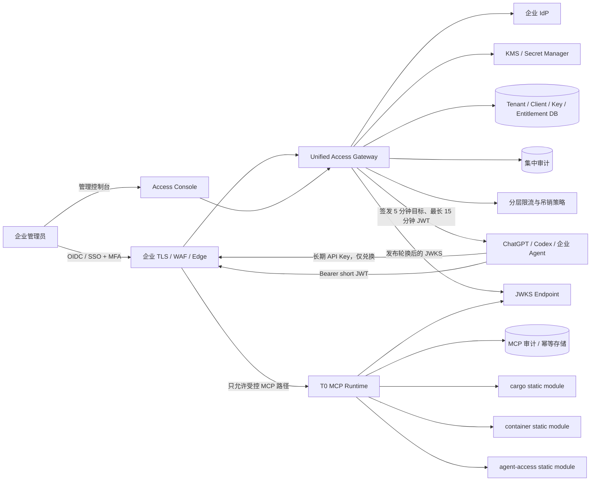
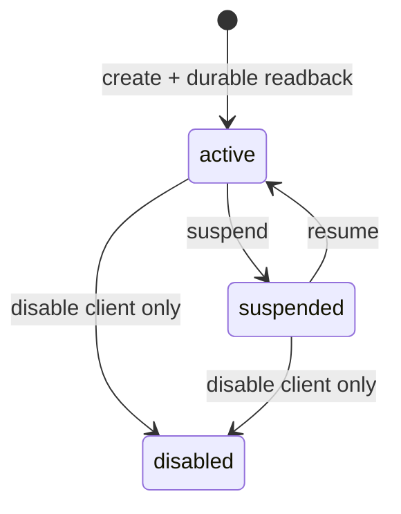
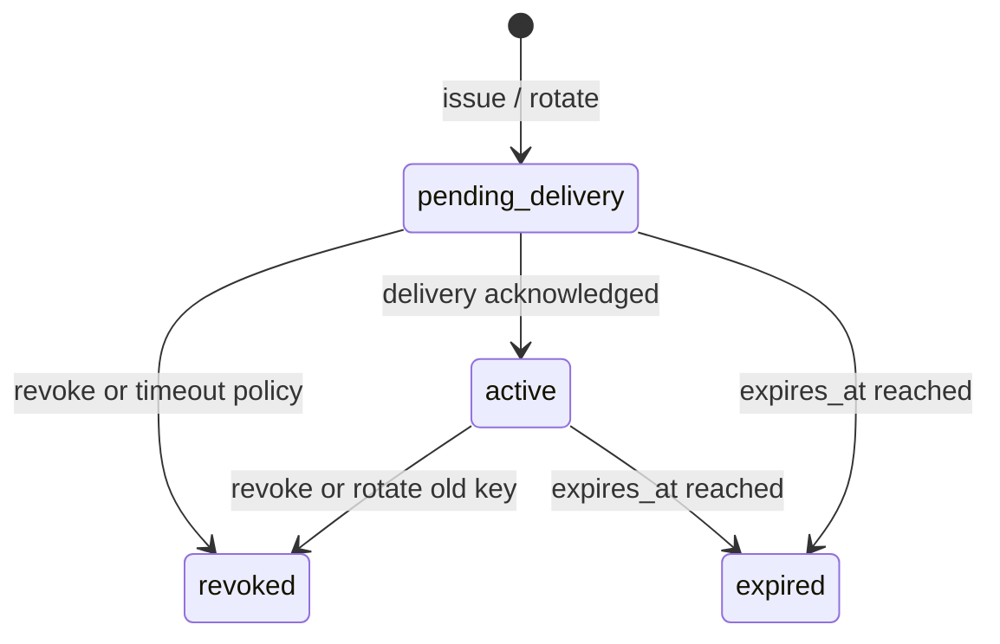
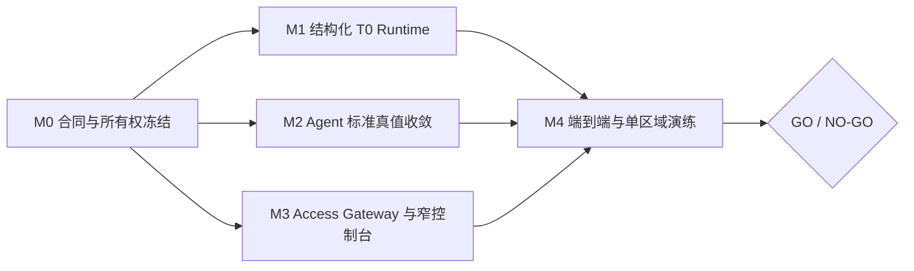

# T0 租户接入生产服务总规划

> 文档状态：服务级实施规划，尚未获得生产发布资格。
> 规划基线：`e99268463921efc52d802c0b9dd8b83f8aa61476`。
> 适用范围：首个单区域 T0 生产版本，以及与其配套的租户、客户端、API Key 和工具权限管理。
> 明确排除：正式报价、关务、Freightcom、订舱、文档生成和任何业务写操作。

## 0. 文档层级

本文是本阶段的**服务级总规划**，负责固定服务边界、权威归属、依赖关系、上线门槛和
执行顺序。下列文档是本文的从属输入，不得反向扩大本文的生产范围：

1. `2026-08-27-t0-production-mvp-agent-standard-access-plan.md`：T0 MCP Runtime
   的实现切片；
2. `2026-08-27-tenant-client-credential-control-v1.md`：当前 Tenant Access
   本地 fixture 合同及生产边界；
3. `2026-08-27-tenant-client-tool-entitlements-v1.md`：租户客户端的精确工具权限合同；
4. `2026-08-21-module-runtime-agent-standard-access-v0.md`：静态 Module Runtime 与
   Agent Standard Access 基线；
5. `2026-08-22-writable-module-control-plane-v1.md`：后续窄模块发布控制面，不属于
   T0 生产控制台。

如本文与旧规划在生产范围上冲突，以本文的 T0 边界为准；涉及现有合同字段变化时，
仍必须先走 RFC，不得仅凭规划文档直接改合同。

## 1. 结论先行

当前仓库已经具备三个 T0 工具的主要实现、静态模块机制、短期 JWT 校验基础和本地
Tenant Access fixture，但**尚未形成符合本规划的生产服务**。核心差距不是再补一个页面，
而是现有生产组合、凭证入口、Agent 目录和部署证据还没有收敛到同一个 T0 权威边界。

首个生产版本只保留两个可部署的应用服务：

1. **Unified Access Gateway**：统一处理企业管理员登录、租户和客户端、长期 API Key、
   精确工具权限、短期 JWT 兑换、限流、审计、吊销和 JWKS；
2. **T0 MCP Runtime**：只接受短期 JWT，只注册三个 T0 工具和五个固定 Agent 资源，
   不加载报价、关务、Freightcom 或业务写适配器。

企业 IdP、TLS/WAF、KMS/Secret Manager、托管数据库、日志告警和备份平台是这两个应用
服务依赖的企业基础设施，不在仓库内伪造替代品。

Gateway 内部可以按领域拆分管理 Control Plane 与 machine token exchange，但首版不需要
再制造第三个可部署应用；两者共用同一租户/客户端/entitlement 权威和审计事务边界。

现有 `apps/admin` 是组合式本地工程控制台，包含模块中心、适配器、审批和审计等页面。
它可以继续用于 loopback fixture/lab，但不能直接作为首版生产租户控制台。生产控制台
必须是 Access Gateway 的窄前端，只呈现租户、客户端、Key、三个内置工具权限和操作读回。

## 2. 六条不可变生产边界

1. 运行时只加载镜像内静态、构建时审核过的模块；禁止远程安装、任意路径加载、热插拔
   代码和运行时生成工具。
2. 生产页面只管理租户、客户端/API Key 和已内置 T0 工具权限；不得暴露模块发布、
   适配器配置或通用写入能力。
3. 不开放正式报价、关务、Freightcom 和任何业务写操作；禁用不能只靠 UI 隐藏或
   RBAC 拒绝，必须做到生产组合中不注册、不初始化、不产生出站连接。
4. 长期 API Key 只能访问 Unified Access Gateway；Gateway 校验后签发短期 JWT，
   Agent 再使用该 JWT 调用现有生产 MCP JWT 入口。生产 MCP 不直接接受长期 Key。
5. 管理员使用企业 IdP；所有入口经过 TLS 网关，并使用 KMS/Secret Manager、分层限流、
   持久审计和集中吊销。
6. 单区域上线前必须完成并留存备份恢复、负载、告警和回滚演练证据；测试全绿、页面可见
   或 `/healthz` 返回 200 均不能替代这些证据。

## 3. 已确认事实与差距

| 维度 | 当前代码事实 | T0 生产目标 | 差距与优先级 |
| --- | --- | --- | --- |
| T0 计算 | `cargo.calculate`、`container.plan_summary` 已有确定性实现和合同 | 保持现有权威，不引入 AI 计算 | 主要是组合收敛，P0 |
| Agent 读取 | `system.agent_context.get` 和五个固定资源已存在 | 只暴露受审核、与实际 T0 目录一致的 pack | runtime profile、客户端示例和目录仍偏宽，P0 |
| 生产组合 | 当前 production composition 仍构建宽工具集，并注册 Freightcom 等非 T0 工具 | 监听前得到精确的 3 工具/5 资源目录 | 不能仅靠 scope 收窄，P0 |
| RBAC | exact `tool:` scope 可收窄新 Tenant Key，但传统 broad scope/`platform:admin` 仍对应宽工具集 | T0 Runtime 先做结构性目录限制，Gateway 只签精确 T0 scope | 宽 JWT 不能成为绕过路径，P0 |
| Module Runtime | 模块在启动时静态 mount，无远程代码加载 | 只构造 cargo、container、agent-access 三个模块 | 静态机制可复用，生产 allowlist 需结构化，P0 |
| JWT 验证 | 已有 RS256/JWKS、issuer/audience、tenant/actor、时效和 session 校验 | 复用为 MCP 唯一生产凭证入口 | 需要与 Gateway 的签发合同做互操作测试，P0 |
| API Key | 本地 managed fixture 已有哈希、一次展示、轮换、吊销和精确权限 | 长期 Key 仅在 Gateway 使用，密钥材料受 KMS/Secret Manager 保护 | 生产 Gateway 尚不存在，P0 |
| Admin UI | 现有页面同时包含模块、适配器、审批、Tenant Access 等功能，且静态页默认 loopback | 单独的窄 Access Console | 不能把当前组合式页面直接上线，P0 |
| 状态读回 | 当前 SQLite fixture 的聚合状态依赖最近 256 条 access events，认证路径另有直接查询 | 生命周期状态由权威记录/完整投影确定，事件仅作审计 | 长期运行后可能出现页面与认证状态漂移，P1 |
| 控制面审计 | Tenant Access 主要写自己的 `access_events`，MCP 调用使用平台审计 | 管理操作和调用审计均可集中关联、告警和留存 | 尚未形成统一生产审计链，P1 |
| 适配器 | production 代码仍会构造 RiskCustoms/报价/状态等组合依赖 | T0 镜像不构造、不探测、不连接 | 需要独立 production profile，P0 |
| 部署 | 当前镜像/compose 面向宽服务，健康检查主要使用 `/healthz` | T0 专用镜像、`/readyz` 摘流、不可变 digest | 需新增部署构件和门禁，P1 |
| 运维证据 | 仓库文档有目标，但没有本次发布的真实演练回执 | 当前 SHA/digest 对应的恢复、负载、告警、回滚证据 | 未完成前一律 NO-GO，P0 |

以上“当前事实”只说明代码中存在相应实现，不等于已在 staging 或生产验证。

## 4. 目标服务架构



网络规则必须保证：MCP 的生产监听地址只可被受控 Edge 调用，Gateway 不能把长期 Key
透传给 MCP，Agent 不能绕过 Edge 直连 MCP 实例。

## 5. 服务责任和非目标

### 5.1 Unified Access Gateway

负责：

- 通过企业 IdP 验证管理员身份，建立管理员角色和审计主体；
- 管理 tenant、client、长期 API Key 元数据和三个 T0 工具的精确 entitlement；
- 生成只展示一次的长期 Key，数据库只保存带版本的强哈希；pepper/签名私钥进入
  KMS/Secret Manager；
- 校验 tenant、client、Key、entitlement、限流和吊销状态后签发短期 JWT；
- 发布有缓存边界和轮换策略的 JWKS；
- 持久记录签发、失败、轮换、吊销、暂停、权限变化和管理员操作；
- 为所有管理写操作提供 `operation_id`、幂等和写后读回。

不负责：

- 执行 cargo/container 计算；
- 保存报价、关税、运价、客户地址或业务单据；
- 动态安装模块、配置适配器或发布业务工具；
- 把 API Key 变成对每个 MCP 实例的长期会话凭证。

### 5.2 Access Console

首版只允许以下导航和动作：

1. 租户：创建、查看、暂停、恢复；
2. 客户端：创建、查看、停用；
3. API Key：签发、一次性交付确认、轮换、吊销；
4. 工具权限：只在三个内置工具中勾选；
5. 操作状态：按 `operation_id` 读取状态和脱敏审计摘要。

页面不得出现模块中心、动态插件、适配器参数、正式报价、关务、Freightcom、审批发布、
万能 JSON 写入口或业务记录浏览器。未知字段、未知工具名和越权操作必须由服务端拒绝，
不能依靠前端校验。

### 5.3 T0 MCP Runtime

负责：

- 只注册 `cargo`、`container`、`agent-access` 三个镜像内静态模块；
- 只暴露三个工具和五个固定资源；
- 使用现有生产 JWT verifier、claim policy、tenant/actor 上下文、RBAC、session binding、
  Schema 校验、审计和五态包络；
- 在启动和 `/readyz` 中校验实际工具目录、资源目录和 reviewed Agent Standard Pack；
- 对任何目录漂移、pack 不可信、JWKS 不可用或持久审计不可用 fail closed。

不负责：

- 接受长期 API Key；
- 管理租户或签发凭证；
- 连接 Quote、RiskCustoms、Freightcom 或其他业务系统；
- 在运行时从 Markdown、任意路径、URL 或客户端参数加载标准或模块。

## 6. 固定 T0 目录

### 6.1 工具

```text
cargo.calculate
container.plan_summary
system.agent_context.get
```

生产启动时必须对实际 `tools/list` 做集合相等校验，不是“至少包含”校验。以下能力必须
同时满足未注册、不可见、不可调用、无 adapter 初始化：

```text
knowledge.search_curated
system.get_data_status
quote.canada_final_mile.calculate
quote.freightcom_ltl.preview
customs.ca.search
customs.ca.estimate
quote.save_draft
review.create_task
```

### 6.2 Agent 资源

```text
logistics://agent/bootstrap
logistics://standards/index
logistics://contracts/envelope/current
logistics://modules/catalog
logistics://agent/profiles
```

五个资源只能来自构建期生成并通过 reviewed descriptor 校验的
`dist/standards/agent-standard-pack.json`。`modules/catalog` 必须按实际 production profile
过滤，不能返回未装载的 Freightcom 或其他模块。

## 7. 身份和凭证合同

### 7.1 长期 API Key

- 长期 Key 仅用于 Gateway 的 token exchange；
- Key 只在签发或轮换成功时展示一次；交付确认后不可再次读取；
- 存储内容限定为 key id、版本化强哈希、salt、KMS 管理的 pepper 引用、状态、时间、
  tenant/client 关联和脱敏末尾提示；
- 禁止日志记录明文 Key、Bearer token、完整 JWT claims、客户输入或业务计算明细；
- 轮换时新 Key 进入 `pending_delivery`，旧 Key 按明确策略吊销，不允许隐式双活；
- suspend/revoke 必须阻断新的 token exchange。

### 7.2 短期 JWT

Gateway 签发的 claims 必须与现有 MCP verifier 和 ExecutionContext 合同一致，至少包含：

```text
iss, aud, sub, iat, exp, jti,
tenant_id, actor_id, actor_role, roles, scopes, client_id, session_id
```

工具权限使用精确 scope：

```text
tool:cargo.calculate
tool:container.plan_summary
tool:system.agent_context.get
```

T0 客户 JWT 不得包含 `platform:admin`、旧 broad scope 或任何非 T0 `tool:` scope。管理员
身份只用于 Gateway 管理 API，不能自动获得 MCP 业务调用权限；即使错误签发了宽 scope，
T0 Runtime 的结构性三工具目录仍必须使其无法访问额外工具。

JWT 目标寿命 5 分钟，硬上限 15 分钟；最终数值、clock skew、issuer、audience、签名算法、
JWKS 缓存和轮换窗口必须由 Credential Exchange RFC 锁定。生产只允许非对称签名算法，
未知 `kid`、过期 token、未来 `iat`、tenant/client 不匹配、未知角色或非 T0 scope 均拒绝。

### 7.3 集中吊销的真实边界

吊销长期 Key 可以立即阻止**新 token**，但当前离线验证的 JWT 不会因为数据库状态变化
自动失效。因此首版必须组合使用：

1. 5 分钟目标 TTL，控制正常吊销收敛时间；
2. Edge 紧急 denylist，至少支持 tenant、client 和 `jti`；
3. MCP 只允许经 Edge 访问，避免绕过 denylist；
4. 权限变化、Key 轮换和 tenant 状态变化后，客户端必须获取新 JWT 并建立新 MCP session。

若不能同时满足以上条件，不得宣称“集中即时吊销”。

## 8. 状态流转

### 8.1 租户与客户端



租户暂停时，其下所有客户端和 Key 的**有效状态**均为不可签发；不得通过修改单个 Key
绕过租户状态。

### 8.2 API Key



`tenant_suspended` 是由租户状态计算出的有效状态，不应覆盖原始 Key 生命周期记录。

### 8.3 Token exchange

```text
received
  -> API Key 结构与哈希验证
  -> tenant/client/key 状态验证
  -> 精确 entitlement 与请求 scope 求交
  -> tenant/client/IP 分层限流
  -> JWT 签名
  -> 审计持久化
  -> issued
```

任一步失败均不得返回 token。审计持久化失败时 fail closed。错误响应只返回稳定错误码、
request id 和可操作的脱敏提示，不泄露 Key 是否存在、哈希差异或内部策略。

### 8.4 MCP 请求

```text
TLS/Edge
  -> Bearer JWT 签名和 claims
  -> tenant/actor/client/server context
  -> session binding
  -> 精确 tool scope + Schema
  -> T0 handler
  -> 审计持久化
  -> success | needs_input | manual_review | blocked | unavailable
```

未知异常不能被包装为 `success`；审计、目录或依赖 readiness 失败时不得继续接收流量。

## 9. Agent 调用适配规范

### 9.1 统一 bootstrap 顺序

ChatGPT、Codex 和企业 Agent 首次连接后统一执行：

1. `resources/list`，确认资源集合精确等于五个固定 URI；
2. 读取 `logistics://agent/bootstrap`；
3. 读取 `logistics://standards/index` 和 `logistics://agent/profiles`；
4. 选择 `runtime-caller` profile；
5. 调用 `system.agent_context.get` 获取受审核上下文；
6. `tools/list`，确认工具集合精确等于三个 T0 工具；
7. 根据 Schema 构造调用，并按五态包络处理结果。

Agent 不得缓存长期 Key 到提示词、仓库文件或普通配置日志；客户端配置只引用环境变量或
企业 secret injection。短期 JWT 过期后重新兑换并重连 session。

### 9.2 Pack 与实际目录一致性

- `runtime-caller` profile 的模块只能是 `cargo`、`container`、`agent-access`；
- `modules/catalog` 只能报告当前 T0 Runtime 实际挂载的模块；
- 每个资源的 `context_scopes` 必须由服务端逐资源执行并有拒绝测试，不能仅校验调用者
  选择了 `runtime-caller`；
- 客户端示例只能列出三个工具，不能保留报价、关务、Freightcom 或写工具；
- pack hash、reviewed descriptor、实际工具目录、资源目录任一不一致，`/readyz` 失败；
- 静态模板校验只证明格式，不证明 ChatGPT、Codex 或企业 Agent 的真实兼容性。

### 9.3 客户端验收矩阵

| 客户端 | 必验项目 | 失败处理 |
| --- | --- | --- |
| ChatGPT | 资源读取、上下文获取、三个工具 schema、五态错误、token 续期 | 未完成真实 staging smoke 则标记“待适配验证” |
| Codex | 同上，并验证配置不落长期 Key、重连后 session 更新 | 不以示例文件存在替代运行回执 |
| 企业 Agent | OIDC/企业 secret injection、tenant/client 隔离、限流和审计关联 | 未验证具体宿主前不得宣称通用兼容 |

## 10. 数据权威与存储边界

| 数据 | 唯一权威 | MCP 是否复制 |
| --- | --- | --- |
| tenant/client 状态 | Access Gateway DB | 否，只接受 JWT 中的短期上下文 |
| API Key hash/状态 | Access Gateway DB + KMS 引用 | 否 |
| 精确工具 entitlement | Access Gateway DB | 否，MCP 使用签发时 scopes 并执行自身 T0 allowlist |
| JWT 签名密钥 | KMS/Secret Manager | 否，只读取 JWKS 公钥 |
| cargo/container 规则 | 现有确定性模块和版本化合同 | 不建立第二套业务权威 |
| Agent Standard Pack | 镜像内 reviewed pack | 只读构建产物 |
| 管理操作审计 | 集中审计存储 | MCP 不反向修改 |
| MCP 调用审计/幂等 | MCP 持久存储并集中汇聚 | 不记录敏感原文 |

生产 Gateway 不得直接沿用单机 SQLite 作为多实例权威。SQLite fixture 可继续服务本地
开发和确定性测试；生产使用支持备份、事务、约束、连接治理和恢复演练的托管数据库。
凭证的交付确认、轮换资格和有效状态必须来自权威字段或可完整重建的持久投影，不得通过
“最近 N 条审计事件”反推；事件分页也不能改变认证结果。

## 11. 环境与 profile

| Profile | 用途 | 凭证 | 工具目录 | Admin |
| --- | --- | --- | --- | --- |
| `fixture-lab` | 本地开发与现有页面演示 | fixture token / 本地 API Key | 可按测试组合存在，但必须显著标注非生产 | 现有组合式 `apps/admin`，仅 loopback |
| `t0-staging` | 与生产同构的预发布 | Gateway 短期 JWT | 精确 3 工具 / 5 资源 | 窄 Access Console |
| `t0-v1` | 单区域受控生产 | Gateway 短期 JWT | 精确 3 工具 / 5 资源 | 窄 Access Console |

未知 profile、空 profile、目录不一致或生产误启 fixture credential 时，进程必须在监听前
退出。`t0-v1` 镜像不得依赖 Quote/RiskCustoms/Freightcom 环境变量或出站 allowlist。

## 12. 实施里程碑



### M0：合同与所有权冻结

交付：

- 新增 T0 production profile RFC，锁定 3 工具、5 资源、启动/readiness 规则；
- 新增 Credential Exchange RFC，锁定 endpoint、claims、TTL、算法、错误、限流、吊销、
  审计和 JWKS 轮换；
- 在 `AGENTS.md` 明确 `services/access-gateway/**`、`apps/access-console/**`、相关 schema、
  测试和部署目录的任务所有权；
- 决定 Gateway 管理库、KMS、IdP 和集中审计的真实供应方与环境 owner。

门禁：RFC 未接受或所有权未明确前，不允许子代理自行创建生产 Gateway 合同或跨目录修改。

### M1：结构化 T0 MCP Runtime

交付：

- 新增显式 `t0-v1` production profile；
- production composition 只构造 cargo、container、agent-access；
- 移除该 profile 对 `registerPhaseOneTools`、Freightcom、RiskCustoms、Quote、Knowledge、
  Status 和 Review 的构造依赖；
- 启动时和 `/readyz` 对实际 3 工具/5 资源做集合相等校验；
- 构建 manifest 和 dispatch 同时校验受审核模块的 ID、版本与内容 digest，不能只凭
  ID/version 接受镜像内对象；
- Agent pack 不可信、JWKS 不健康、持久审计不可写或目录漂移时 fail closed；
- T0 镜像和 compose 不再要求非 T0 上游/出站环境变量。

门禁：不可变 profile、模块 digest、pack 和目录错误必须在监听前失败；运行中外部依赖
异常则使 `/readyz` 失败并由 Edge 摘流。测试必须证明非 T0 工具既不在 `tools/list`，也
不存在 handler/adapter 初始化和网络探测；把工具返回 `unavailable` 不算移除。

### M2：Agent 标准真值收敛

交付：

- `runtime-caller` profile 仅列 cargo、container、agent-access；
- `modules/catalog` 按实际 profile 过滤；
- ChatGPT、Codex、企业 Agent 配置示例收窄到 T0；
- 更新旧 onboarding/runbook 中“九个业务工具”等与 T0 冲突的说明，并保留历史 profile
  的明确非生产标签；
- 重新生成并审核 Agent Standard Pack/descriptor；
- 三类客户端完成真实 staging bootstrap、调用、五态错误和 token 续期 smoke。

门禁：只完成 `validate:agent-standards` 或模板解析不能标记兼容 PASS。

### M3：Unified Access Gateway 与 Access Console

交付：

- 企业 IdP 管理员登录和角色映射；
- tenant/client/Key/entitlement 的服务、托管存储、幂等和状态读回；
- 一次性 Key 交付、KMS/Secret Manager、轮换、吊销和暂停；
- token exchange、JWKS 发布/轮换、精确 scope、分层限流和持久审计；
- 只包含五类页面能力的 Access Console；
- 消除基于最近 256 条事件判断交付状态的实现；管理审计进入可集中查询和告警的链路；
- tenant/client/Key/entitlement 的状态写入、幂等记录和审计事件在同一事务中闭合；
- 幂等请求使用版本化 canonical JSON hash，不依赖对象插入顺序的普通 `JSON.stringify`；
- Gateway JWT 与现有 MCP verifier 的双向合同和安全测试。

门禁：长期 Key 直接调用 MCP、生产使用 fixture verifier、审计失败仍签 token 或页面可提交
非 T0 tool name，任一成立即失败。

### M4：端到端和单区域生产演练

交付：

- 使用不可变 Git SHA、镜像 digest 和配置版本部署 staging；
- 从真实 IdP 管理员创建 tenant/client，签发并确认 Key，兑换 JWT，调用三个工具；
- 验证 tenant 隔离、Key 轮换/吊销、短 JWT 过期、Edge denylist 和 session 重连；
- 完成备份恢复、目标负载、告警触发、`/readyz` 摘流和前一镜像回滚演练；
- 形成可复查的时间戳、执行人、环境、SHA/digest、命令、结果和证据链接。

门禁：任何演练只有脚本、没有目标环境真实回执，均记为未完成。

## 13. 子代理执行编排

所有子代理先按 `AGENTS.md` 强制顺序读取标准，使用独立分支/worktree，只修改明确所有权
目录，不回退其他人的改动。建议在 M0 接受后按以下互斥写集并行：

| 工作流 | 建议归属 | 主要写集 | 依赖 |
| --- | --- | --- | --- |
| A. T0 Runtime | 任务 02 平台 | `src/logistics_mcp/{server,module-runtime,platform,agent-context}/**`、对应测试 | M0 |
| B. Agent Pack/客户端 | 任务 01 + 06 | `docs/agent/**`、`deploy/clients/**`、Agent 标准测试 | M0，和 A 共享只读目录合同 |
| C. Access Gateway | M0 新增归属 | `services/access-gateway/**`、gateway schema/tests | M0 + 真实 IdP/KMS/DB 选择 |
| D. Access Console | 任务 06 或 M0 新增归属 | `apps/access-console/**`、UI tests | C 的 API 合同 |
| E. 部署与演练 | 任务 06 | T0/Gateway deploy、`tests/e2e/**`、runbooks | A+B+C+D |

并行规则：

- A 不修改 Agent profile 合同；发现需要变化时提 RFC/基线请求；
- B 不修改 Runtime handler；以已接受的 T0 目录为输入；
- C 不复用 MCP 的本地 fixture secret 作为生产存储；
- D 不在前端自造状态或权限；全部读回 Gateway；
- E 不重写领域算法，只做集成修复和证据采集；
- 每个小提交使用 `feat|fix|test|docs|chore: <scope>`，并报告精确 SHA 和实际验证输出。

## 14. 测试与验收矩阵

| 层级 | 必须覆盖 |
| --- | --- |
| 合同 | Draft 2020-12、`additionalProperties: false`、decimal string、五态包络、稳定错误码 |
| Runtime 单元 | 精确目录、未知 profile fail closed、模块 digest、pack/catalog mismatch、非 T0 adapter 零构造 |
| JWT 安全 | RS256/JWKS、`kid` 轮换、issuer/audience、iat/exp、TTL、tenant/client/session、未知 scope |
| Gateway 单元 | Key 哈希/一次展示、canonical 幂等 hash、状态/审计原子性、轮换、吊销、暂停、限流、审计失败闭合、并发状态转换、超过 256 条事件后状态仍一致 |
| Console | 只显示/提交允许字段，非 T0 tool name 服务端拒绝，operation readback 与写响应一致 |
| E2E | Key→JWT→MCP、三个工具、五个资源及逐资源 scope、三类 Agent、隔离、续期、吊销、既有 session 策略、Edge denylist |
| 部署 | 非 root、只读文件系统、secret injection、网络策略、`/readyz`、不可变 digest、回滚 |
| 运维 | 备份恢复 RPO/RTO、负载目标、告警送达、审计查询、密钥/JWKS 轮换 |

每个阶段至少运行精确测试、相关全量测试、Schema 校验、Agent standards 构建校验、
`git diff --check` 和敏感字段扫描。生产 GO 还必须有 staging/生产读回，不能用本地测试替代。

## 15. GO / NO-GO

只有以下条件全部成立才能 GO：

1. 生产 `tools/list` 精确等于 3，`resources/list` 精确等于 5；
2. 模块 ID/version/digest 与受审核 manifest 一致，镜像和进程没有构造、注册、探测或
   连接任何非 T0 adapter；
3. MCP 拒绝长期 `lmcpk_...` Key，只接受 Gateway 签发的受约束短期 JWT；
4. tenant/client/Key/entitlement 状态和操作状态均能从生产权威库确定性读回；
5. IdP、TLS、KMS/Secret Manager、限流、审计、集中吊销和 JWKS 轮换已在目标环境验证；
6. ChatGPT、Codex、企业 Agent 均有真实 staging smoke 回执；
7. 备份恢复、负载、告警和回滚演练绑定同一候选 SHA/digest 且通过；
8. 安全审查、发布审批、值班 owner 和回滚 owner 明确。

以下任一成立即 NO-GO：

- production composition 仍是宽工具集，即使 JWT scope 只给三个工具；
- Gateway 给 T0 客户签发 `platform:admin`、旧 broad scope 或非 T0 scope；
- `modules/catalog` 或客户端示例仍把 Freightcom/报价/关务描述为 T0 可用；
- 当前组合式 `apps/admin` 被当作生产 Access Console；
- 长期 Key 直接访问 MCP，或生产依赖 fixture token/SQLite fixture；
- 只有 `/healthz`，没有能摘流的 `/readyz`；
- 审计失败仍返回 token 或工具成功；
- 缺少任一真实演练或无法把证据绑定到候选镜像。

## 16. 计划工期与外部依赖

在企业 IdP、TLS/Edge、KMS、托管数据库、staging 环境和对应 owner 已经可用的前提下，
建议以 **4–6 周**作为首个 T0 单区域受控生产候选的工程计划值：

- 第 1 周：M0 合同/所有权、威胁建模和环境选型；
- 第 2 周：M1 Runtime 与 M2 Agent 标准并行；
- 第 2–4 周：M3 Gateway/Console；
- 第 4–5 周：端到端、安全和真实客户端适配；
- 第 5–6 周：负载、恢复、告警、回滚、审批和修复缓冲。

这不是承诺日期。IdP/KMS/数据库/环境 owner 未明确、RFC 未接受或真实客户端无法进入
staging 时，计划处于 blocked，不应通过本地 mock 压缩为“已完成”。

## 17. 下一实施切片

下一步不是继续扩展当前组合式 Admin 页面，而是按以下小提交启动 M0/M1：

1. `docs: define t0 production profile rfc`
2. `docs: define credential exchange and revocation rfc`
3. `chore: assign access gateway ownership`
4. `test: require exact t0 production catalog`
5. `feat: add structural t0 production composition`
6. `test: reject non-t0 construction and outbound setup`
7. `docs: narrow runtime caller and client templates`
8. `test: require trusted agent pack for readiness`

完成第 1–3 项并接受 RFC 后，才能把 Runtime、Agent Pack 和 Access Gateway 分配给不同
子代理并行实施。正式报价、关务、Freightcom 和业务写入继续保持独立后续发布轨道。
