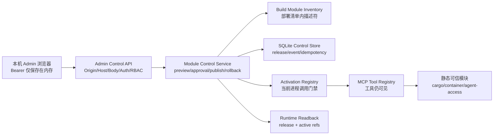

# 可写 MCP 模块控制面设计

- 日期：2026-08-22
- 状态：已获用户确认，进入实施
- 适用范围：本仓库 Node/TypeScript MCP 平台、Module Runtime v0、`apps/admin`
- 视觉基准：`/Users/autumn/.codex/generated_images/01a023ab-99c0-70c1-a4de-f0f75e5d9970/exec-cb608496-a874-401f-be3e-188aba22b047.png`

## 1. 事实、前提纠正与设计结论

### 已确认事实

- 当前 Module Runtime 只在启动时挂载随应用构建的静态可信模块，manifest 的
  `lifecycle` 仍固定为 `static`。
- 当前 Admin 是本机回环、默认关闭、只读脱敏快照；保存、审批、发布、读回和回滚 API
  尚未实现。
- 当前生产 SQLite 只承担审计、幂等和 session binding，不包含模块制品、发布或回滚状态。
- 当前报价、关务、客户记录和文档仍由外部业务系统拥有；本控制面没有权限把这些数据
  迁入 MCP。
- 用户要求的第一批真实写入是 MCP 自身的模块/插件配置和发布元数据，而不是业务数据。

### 必须纠正的前提

- “与 FastAdmin 结合”不等于把 PHP FastAdmin 变成 MCP 后端。现有宿主是 Node/TypeScript，
  引入第二套 PHP 权限、ORM、会话和插件运行时会形成双重权威。
- “插件已登记”不等于“代码已动态加载”或“已获生产资格”。首版只允许部署清单内、已随
  当前应用构建的模块参与启停；任意 URL、Git 仓库、本地路径、上传源码和运行时 `eval`
  均不进入实现。
- “发布成功”必须区分控制元数据已持久化、当前进程策略已切换、运行时读回一致和生产
  资格。任何一项缺失都不能合并成一个模糊的绿色状态。

### 设计结论

使用 FastAdmin 的模块中心、审批、发布、回滚信息架构，使用自托管 AdminLTE 4 样式作为
页面外壳；后端继续使用现有 Node/TypeScript 平台。首版形成一个真实、窄语义、可审计的
模块发布控制面：它能持久登记当前部署清单中的模块、生成差异预览、执行双人审批、发布
启停策略、完成运行时读回，并通过同一流程回滚到上一已验证 release。

首版不是完整的通用热插拔平台。它不下载或加载新代码；新模块版本必须先进入受信构建和
部署清单，再由本控制面登记和激活。对已经随当前进程挂载的模块，发布通过调用门禁原子切换
启用状态，工具继续出现在目录中但禁用模块调用返回 `unavailable`。这符合“暂时不可用仍
保留可见性”的现行标准，也避免伪装成代码级 hot-plug。

## 2. 目标与非目标

### 目标

1. 对 MCP 自身模块发布配置执行真实持久化写入。
2. 所有写操作使用服务端认证上下文，不接受请求体中的 tenant、actor、role 或 scope。
3. 所有 POST 要求幂等键；同键同请求重放，同键不同请求 `blocked`。
4. 发布必须经过 preview、另一 actor 审批、commit、运行时读回和审计。
5. 回滚复用同一 preview/approval/publish 流程，并创建新 release，不删除历史。
6. 只允许当前部署清单中的不可变模块描述符，拒绝客户端 URL、路径、源码和 secret。
7. 保持现有九个业务工具、Agent context 工具、统一五状态和业务权威边界兼容。
8. 提供中文、可访问、可在本机浏览器完整操作的 AdminLTE 风格模块中心。

### 非目标

- 不引入 PHP、ThinkPHP、FastAdmin ORM 或 FastAdmin 插件安装器。
- 不实现远程仓库搜索、任意上传、在线解压、运行时 npm install、`eval` 或 `vm` 执行。
- 不修改报价、Zone、税率、客户、订单、文档或关务主数据。
- 不实现 T1-T3 任意代码隔离运行时、N/N-1 代码代并存或无重启版本升级。
- 不把本地 fixture、descriptor digest、HTTP 200 或进程存活写成生产发布证明。
- 不提供共享管理员口令、header bypass 或客户端可伪造身份字段。

## 3. 信任边界与总体架构



### 浏览器边界

- 静态页面和 API 首版仍只允许回环地址访问。
- GET 脱敏快照可以保持匿名；模块控制状态和所有写 API 必须提供 Bearer。
- Bearer 只保存在页面内存，不进入 URL、localStorage、sessionStorage、日志或 fixture。
- 所有写请求必须带精确同源 `Origin`、JSON Content-Type 和 `Idempotency-Key`。
- fixture 模式允许两个明确的本地演示身份，用于证明申请人与审批人不同；该分支只在
  回环 fixture 组合中存在，生产 verifier 不认识演示 token。

### 服务端身份边界

- Bearer 经现有 verifier 验证后调用 `parseExecutionContext`。
- 生产写入要求 `admin` role、`platform:admin` scope，并命中服务端配置的
  `MCP_ADMIN_TENANT_ID`。
- 请求体 schema 明确拒绝 `tenant_id`、`actor_id`、`roles`、`scopes`、token、URL、路径和
  secret 字段。
- preview 创建者不能批准自己的 preview；publish 必须引用当前有效、未被消费的 approval。

### 制品边界

- 构建生成 `dist/control-plane/module-inventory.json`。每项只描述随当前应用构建的模块：
  `module_id`、`version`、`risk_level`、工具名、标准引用和 canonical descriptor digest。
- descriptor digest 只证明清单描述未漂移，不冒充容器镜像或签名制品 digest。
- 可选 release evidence 使用 opaque `source_sha_ref`、`artifact_digest_ref`、
  `signature_ref`、`sbom_ref`、`attestation_ref`；值来自服务端部署清单，不接受浏览器输入。
- 本地构建 inventory 标记 `evidence_level=local_build`、`production_eligible=false`。
  只有独立发布流程注入完整证明后才能标记 `verified_release`。

## 4. 组件职责

### `module-inventory`

- 从实际 Module Definition 和工具贡献生成 canonical descriptor。
- 对 canonical JSON 计算 SHA-256。
- 校验 module ID/version 唯一、tool owner 唯一、manifest 合法、标准引用完整。
- 运行时只读取构建产物，不从 cwd 搜索 manifest 或 Markdown。

### `SqliteModuleControlStore`

- 使用独立、显式的 `MCP_CONTROL_DB_PATH`；不把控制面记录混入业务主库。
- 数据库文件要求 regular file、`0600`、WAL、FULL synchronous、strict tables、schema version。
- 提供原子操作，不向上层暴露通用 SQL 或通用 JSON 写入口。
- 保存模块登记、preview、approval、release、readback、幂等结果和追加式事件。

### `ModuleControlService`

- 承担请求 schema、inventory match、状态机、四眼审批、幂等和读回协调。
- 返回统一五状态：`success`、`needs_input`、`manual_review`、`blocked`、`unavailable`。
- 不接受客户端构造的 audit ID、release ID、时间戳或 actor 引用。
- 所有 ID 由服务端生成，所有时间来自注入 clock，便于确定性测试。

### `ModuleActivationRegistry`

- 保存当前进程已应用的 `release_id`、revision 和 active module refs。
- 只有 inventory 内已挂载模块能被设为 active。
- 发布时一次性替换不可变 snapshot；请求开始时读取同一个 snapshot，避免半更新。
- 禁用模块的工具仍在 `tools/list` 中；实际调用在领域 handler 前返回
  `unavailable`，reason code 为 `module_disabled_by_release`。
- 默认没有 release 时保持现有全部静态模块启用，保证向后兼容。

### `AdminControlApi`

- 是窄路由集合，不提供通用 `/config` PATCH。
- 在解析业务 JSON 前完成 loopback、Host、Origin、body size、Content-Type、Bearer、tenant、
  role 和 scope 检查。
- 对错误只返回稳定 reason code 和脱敏消息，不回显 token、输入正文、SQL 或 stack。

## 5. 数据模型

控制数据库使用以下 strict tables。表名可在实现中保留此前缀，字段语义不可合并为通用
key-value 表。

| 表 | 主键/唯一约束 | 关键内容 |
| --- | --- | --- |
| `module_registrations` | `module_id, version, descriptor_digest` | inventory 引用、登记 actor/time、evidence level |
| `module_previews` | `preview_ref` | intent、base release、desired refs、diff、validation、creator、expiry、consumed |
| `module_approvals` | `approval_id`；每 preview 只允许一个当前决定 | approver、decision、reason code、time |
| `module_releases` | `release_id`；revision 唯一递增 | desired refs、previous release、preview、approval、publisher、状态 |
| `module_readbacks` | `release_id` | applied release/revision/module refs、verified、reason、time |
| `module_control_idempotency` | `action, idempotency_key` | request hash、`reserved|domain_committed|completed`、domain record ref、final result、created/expiry |
| `module_control_events` | 自增 sequence；event ID 唯一 | 脱敏动作、actor ref、对象 ref、status、reason、time |

不保存 Bearer、客户地址、报价、税务材料、原始聊天、任意 URL、源码、任意文件路径或 secret
正文。actor/tenant 只保存受控标识，UI 默认显示截断 reference。

## 6. 状态机

```text
inventory candidate
  -> registered
  -> previewed
  -> approved | rejected | expired
  -> published_pending_readback
  -> active_verified | manual_review
  -> superseded

rollback target
  -> rollback preview
  -> approved
  -> new release referencing target profile
  -> active_verified | manual_review
```

- `registered` 只说明部署清单匹配，不说明生产资格。
- preview 固定 base release、inventory descriptor refs、desired active set、creator 和 expiry。
- base release 或 inventory 变化后 publish 必须 `blocked`，不能静默重算。
- approval 必须来自不同 actor；reject 后 preview 不可 publish。
- publish 创建新 release，应用 activation snapshot，再读回 exact release/revision/module set。
- 读回不一致返回 `manual_review` 并保留事件；不得返回 success 或自动反复重试。
- rollback 创建新 revision，不删除、改写或重新激活旧记录本身。

## 7. HTTP API

所有请求/响应在 `schemas/admin-control/**` 使用 Draft 2020-12，
`additionalProperties: false`。所有 POST 都要求 `Idempotency-Key` 16–200 字符。

### `GET /admin/api/v1/control/state`

需要管理身份。返回当前 inventory、登记状态、active release、最近 preview/approval/readback、
可回滚 release 和脱敏事件。只返回当前控制范围，不返回业务数据。

### `POST /admin/api/v1/control/packages/register`

请求只包含 schema version、module ID、version、descriptor digest。服务端从 inventory 读取其余
字段并执行 exact match。未知或不匹配项 `blocked`；依赖不可用 `unavailable`；登记并读回一致
才 `success`。

### `POST /admin/api/v1/control/deployments/preview`

请求包含 `intent=change|rollback`。change 提供完整 desired module refs；rollback 提供明确
`target_release_id`。服务端验证：全部已登记、当前 build 存在、风险策略允许、无重复、至少
保留平台必需模块、base release 未漂移。成功返回 preview ref、脱敏 diff、验证项和 expiry。

### `POST /admin/api/v1/control/approvals`

请求包含 preview ref、`approve|reject` 和受限 reason code。actor 与 creator 相同返回
`blocked`。过期、已消费或 base 漂移返回 `blocked`。审批记录持久化并读回后才 `success`。

### `POST /admin/api/v1/control/deployments/publish`

请求包含 preview ref 和 approval ID。服务端重验 context、preview、approval、base、inventory
和 active set；创建 release；更新 activation registry；执行 exact readback。只有 readback
一致才 `success`。持久化成功但进程读回未知时返回 `manual_review`。

## 8. 幂等、并发与一致性

- action + idempotency key 构成唯一键；请求 canonical hash 固定。
- 同键同 hash 返回首次完整结果；同键不同 hash 返回 `blocked/idempotency_conflict`。
- register、preview 和 approval 可在同一事务内完成 domain write、event 和 final result。
- publish 先预留幂等记录，再在 release 事务中把它推进到 `domain_committed` 并固定
  `release_id`。activation/readback 完成后才写入 `completed` final result。
- 如果进程在 `domain_committed` 后退出，同键重试按固定 release 恢复 readback，绝不创建
  第二个 release；恢复仍未知时固定为 `manual_review`，后续由显式 reconciliation 处理。
- preview、approval 和 publish 都使用数据库事务和 compare-and-set base release。
- 每个 publish 生成递增 revision；两个并发 publish 只有一个能命中 base revision。
- activation snapshot 为不可变对象，一次替换；handler 在请求开始时固定读取。
- 数据库 commit 后 activation/readback 失败属于未知生效结果，返回 `manual_review`。启动时
  必须先 reconciliation 最新 `published_pending_readback` release；不能回滚数据库假装没写过。

## 9. UI 设计系统与交互

视觉基准采用 AdminLTE 4 的深色侧栏、白色主画布和表格主导布局；不照搬示例业务数据。

### 9.1 视觉实现清单

概念图原生画布为 1536×1024；浏览器主验收使用 1440×900，并额外验证 390×844。页面没有
需要切出的位图资产，全部可见文本、表格、按钮、状态和图标都必须保持 code-native。

| Token | 值 | 用途 |
| --- | --- | --- |
| `--control-bg` | `#f4f6f9` | 主画布浅灰背景 |
| `--control-surface` | `#ffffff` | 表格、详情、预览表面；保持真白 |
| `--control-sidebar` | `#0b1f3a` | 左侧固定导航 |
| `--control-text` | `#172033` | 标题和主要正文 |
| `--control-muted` | `#667085` | 次要说明和未选中状态 |
| `--control-border` | `#d8dee8` | 表格、分区和控件边界 |
| `--control-accent` | `#0d6efd` | 选中导航、主按钮、当前阶段 |
| `--control-success` | `#198754` | 已登记、已验证读回 |
| `--control-warning` | `#b26a00` | 待审批、待适配验证 |
| `--control-danger` | `#b42318` | blocked、reject、readback mismatch |

- 字体：`-apple-system, BlinkMacSystemFont, "Segoe UI", "PingFang SC", "Microsoft YaHei", sans-serif`。
- 页面标题 28/36、600；分区标题 18/26、600；正文与表格 14/22、400；控件文字
  13/20、500；说明 12/18、400。按钮和输入不能依赖浏览器默认字号。
- 间距只使用 4、8、12、16、20、24、32；左侧栏桌面 184–208 px，主区最小 0，详情栏
  约占内容区 34%。
- 表面圆角 4–6 px，输入/按钮 4 px；不使用大圆角、悬浮玻璃或嵌套卡片。
- 阴影只允许顶部栏和浮层使用一层低对比阴影；表格/详情/预览使用 1 px border 分区。
- 动效只用于 120–180 ms 的焦点、选中和折叠反馈；`prefers-reduced-motion` 下关闭位移。

### 9.2 容器与组件族

- App shell：固定深色 sidebar、白色 topbar、浅灰 main、无营销 hero。
- Release rail：四个等权阶段，以线和编号表达当前/完成/待处理，不使用装饰性 badge。
- Status summary：只保留三张横向状态卡，每张一个数字和一句范围说明，不引入趋势或假指标。
- Module table：桌面表格是主容器；移动端保持表格语义并提供可聚焦横向滚动，不改成卡片堆。
- Detail inspector：不可变 descriptor/evidence 字段的定义列表；复制动作只复制 opaque ref。
- Preview region：diff、validation、creator/approver、release trail 四个明确区域；按钮状态由服务端
  对象和本地 desired draft 共同派生。
- Identity dialog：password input、连接、清除身份、fixture 双身份按钮；关闭后 token 仍只在内存，
  刷新即消失。
- Icons：使用单一 20 px outline SVG 家族，`currentColor`、1.75–2 px stroke、round cap/join；
  导航、状态、复制和 disclosure 不得混用 emoji 或文本箭头。

### 9.3 首屏允许文案

首屏可以显示且只显示以下产品文案及由 API 返回的模块事实；实现不得自行增加生产声明：

```text
跨境物流 MCP 控制台
本地受控环境
管理员身份未绑定 / 管理员身份已绑定
报价、关务与客户数据仍由外部权威系统管理
模块中心
登记制品
生成预览
双人审批
发布读回
已登记
待审批
当前激活
受控模块清单
制品详情
仅允许部署清单内制品
发布预览与验证
保存草稿
生成预览
提交审批
发布并读回
回滚到上一已验证版本
待适配验证
未获生产资格
```

模块 ID/version/risk/digest、状态数字和 reason code 必须来自已校验 API。概念图中的 email、
Git/registry URL、日期和版本号均是视觉占位，不进入实现允许文案。

### 9.4 响应式规则

- ≥1200 px：模块表格与详情 inspector 两列，preview 主区与 release trail 两列。
- 768–1199 px：详情 inspector 移到表格下方，状态卡仍保持一行或 2+1，操作按钮允许换行。
- <768 px：sidebar 由明确按钮展开；状态卡单列；表格横向滚动；preview 区域单列；主要操作
  保持至少 44 px 触控高度，页面不得出现整体横向溢出。
- 焦点顺序为导航→身份→release rail 摘要→表格→详情→preview→动作→trail；切换视图后焦点
  回到主标题，API 结果通过 `aria-live` 宣告但不朗读 token 或完整 digest。

- 导航：总览、模块中心、Agent 接入、适配器状态、审批与发布、审计日志。
- 模块中心主屏：四阶段发布轨、三张状态卡、模块表格、右侧不可变制品详情、下方预览/
  验证/审批/发布轨迹。
- 顶部持续显示环境和管理身份状态；未绑定身份时所有写按钮禁用。
- adapter 状态继续使用“待适配验证”“未获生产资格”，不生成全绿概览。
- 页面警示固定为“报价、关务与客户数据仍由外部权威系统管理”。
- token 输入使用 password 控件，只保存在 JS 内存；切换身份会清空之前的控制状态。
- fixture 模式提供“申请人演示身份”和“审批人演示身份”两个明确按钮；生产不展示。
- 所有开关只是编辑 desired draft；只有完成 preview→approval→publish→readback 后才改变
  runtime state。
- 键盘、焦点、颜色对比、文本状态、`aria-live`、移动端横向表格和 reduced motion 必须保留。

与概念图的一个有意差异：实现不得展示 email、真实 Git URL、registry URL 或原始证明值；
这些位置显示 opaque reference 和 evidence level。

## 10. 失败闭合矩阵

| 条件 | API 状态 | 运行时行为 |
| --- | --- | --- |
| 缺字段或 schema 错误 | `needs_input` | 零写入 |
| 身份、scope、tenant、Origin、Host 不合法 | `blocked` | 零写入、零下游调用 |
| 客户端 URL/path/secret/未知模块 | `blocked` | 零登记 |
| inventory/store/verifier 不可用 | `unavailable` | 保留当前 active snapshot |
| 自批、过期 preview、base 漂移、幂等冲突 | `blocked` | 不发布 |
| 数据库已写但 activation/readback 未知或不一致 | `manual_review` | 不宣称成功，保留事件证据 |
| fixture 发布读回一致 | `success` + `production_eligible=false` | 只证明本地受控环境 |
| verified release 发布读回一致 | `success` | 仍需外部部署/稳定窗口证据才能宣称生产完成 |

## 11. 测试与验收

### 单元与合同

- inventory canonicalization、digest、重复 ID/tool、非法 manifest 和 cwd 读取拒绝。
- SQLite 新库、重开、权限、schema drift、corruption、并发 revision 和原子事件。
- register/preview/approve/publish/rollback 的正例、五状态和幂等 replay/conflict。
- 自批、跨 tenant、缺 scope、identity override 字段、URL/path/secret 字段拒绝。
- activation registry 原子替换、默认兼容、禁用调用 unavailable 和 exact readback。

### HTTP 与端到端

- loopback、Host、Origin、JSON、32 KiB、Bearer、管理 tenant/role/scope 门禁。
- 两个 fixture 身份完成 register→preview→approve→publish→readback→rollback。
- 重启后从 SQLite 恢复 active release；历史 release、事件和幂等重放仍可读。
- 现有 MCP tools/list 保留，禁用工具可见但调用 unavailable，重新启用后恢复。
- Admin UI 不把 draft toggle 当 runtime state，不持久化 token，不显示秘密或业务正文。

### 全量门禁

```bash
npm test
npm run typecheck
npm run lint
npm run validate:schemas
npm run validate:agent-standards
npm run validate:agent-adapters
npm run build
npm run verify:runtime
git diff --check
```

浏览器验收必须覆盖 1440×900 和移动视口，完整点击两身份审批、发布读回和回滚。最终截图与
本设计视觉基准逐项比较布局、文案、字体、颜色、表格密度、状态语义和核心交互。

## 12. 发布与回滚边界

- 首版只在隔离 fixture 和本地回环运行真实写流程，不连接生产业务系统。
- production 开启控制面前必须配置独立 control DB、真实 JWT verifier、管理 tenant、精确
  Origin/Host 和 verified release inventory。
- 代码构建/进程版本升级仍走现有 release runbook；控制面不能下载新版本代码。
- 紧急回滚仍需要明确目标 release、另一 actor approval、幂等和读回；不删除 SQLite 数据，
  不逆迁 migration。
- 若控制面不可用，MCP 当前 active snapshot 保持不变；不得自动回退到未验证配置。
