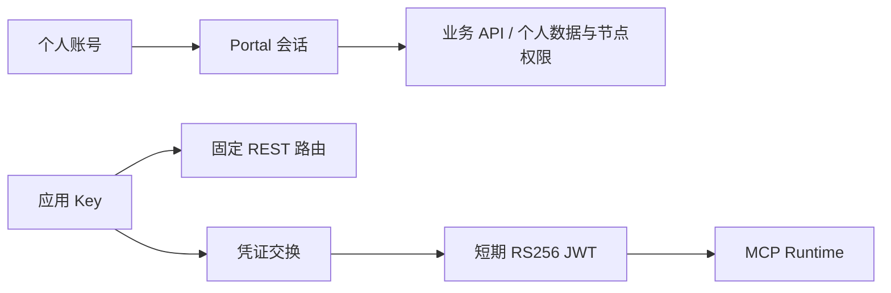

# Access Gateway 与 Portal 服务

[文档中心](../../docs/README.md) / 身份与服务入口

本目录包含机器凭证交换、接入管理，以及 `portal/` 下的客户、运营和业务 API。MCP Runtime 不接受长期 Key；人员会话和机器凭证是不同授权路径。

## 代码职责

| 部分 | 负责什么 |
| --- | --- |
| Gateway 内核 | Key 校验、精确 entitlement、换票、吊销、审计、限流 |
| `portal/` | 身份会话、业务授权、个人整柜、统一 Key 与 REST 编排 |
| 存储与 provider | SQLite / PostgreSQL 适配、签名、密钥、来源连接 |
| 管理 API | 受保护的接入配置、读回和脱敏概览 |

个人 FCL 不要求建企业；旧应用/租户授权仍按对应合同处理，不能将两者混为一个权限开关。

## 必须保留的边界

- 输入和错误采用闭合 Draft 2020-12 Schema；三个 T0 工具使用精确 entitlement。
- RS256 JWT 有效时长 60–900 秒，JWKS 支持当前和前一枚公钥。签名 provider 返回值重新校验 alg、kid 和精确 claims。
- 校验可信代理、Host、Origin、转发客户端 IP 和 JSON 大小。未知 Key 使用等时假验证；审计失败时拒绝继续。
- 管理入口验证 Cloudflare Access JWT 的签名、issuer、AUD 和时效，再匹配精确 email 及可选 sub。
- overview 只返回固定 24 小时统计、最多 20 条脱敏异常及接入清单，不回传凭证、JTI 或业务正文。
- PostgreSQL 模式不回退 SQLite。迁移须显式执行事务、全表计数、逻辑指纹读回及幂等重跑；旧库仅用于回滚。

## 启动不等于生产合格

`createProductionAccessGateway` 要求九个 `kind=production` provider，拒绝 synthetic 或结构缺失。它只验证组装，不能证明真实依赖健康。

`single-node-candidate` 使用文件签名密钥和 pepper，即使切换 PostgreSQL，仍报告 `production_eligible=false`。剩余门禁包括目标身份/MFA、非导出 KMS/HSM、Secret Manager、数据库资格、集中审计和告警、吊销、Edge denylist、负载演练与 Agent staging 读回。

这些限制属于对应候选装配，不代表整个 Portal 未实现或未部署。

[部署说明](../../deploy/README.md) · [开发指南](../../docs/guides/development.md) · [原分阶段计划](PRODUCT_ROADMAP.md)
